# BACKUP 365 

## CentOS

1. Cài đặt Agent trên server

- Thực hiện các bước sau:

```sh
yum -y update
cd /etc/yum.repos.d
vi r1soft.repo

# Paste đoạn sau vào
[r1soft]
name=R1Soft Repository Server
#baseurl=http://repo.r1soft.com/yum/stable/$basearch/
baseurl=http://repo.r1soft.com/release/6.6.2/57/yum/stable/x86_64/
enabled=1
gpgcheck=0
```

- Tiếp tục thực hiện các lệnh sau:

```sh
yum install serverbackup-enterprise-agent
# Mở port 8282 và 1167 trên firewall theo chiều out
r1soft-setup --get-key http://45.117.82.8:8282
```

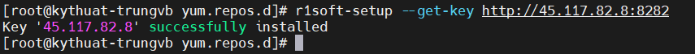

2. Backup

- Đăng nhập vào trang quản trị backup 365 và tạo Machine mới điền các thông tin cần thiết:


- Thêm disk cần backup:

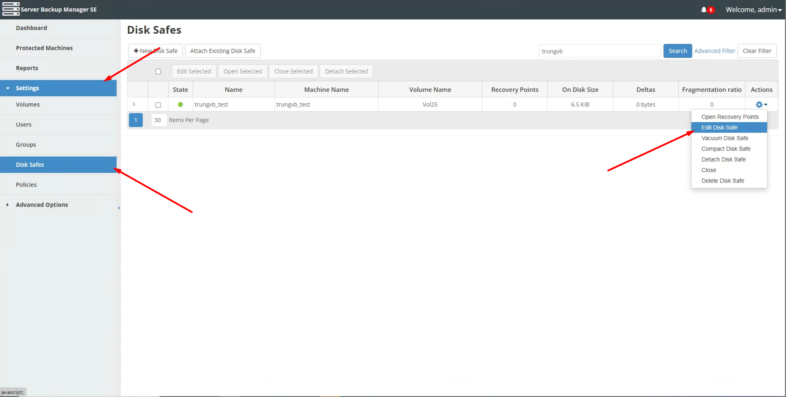

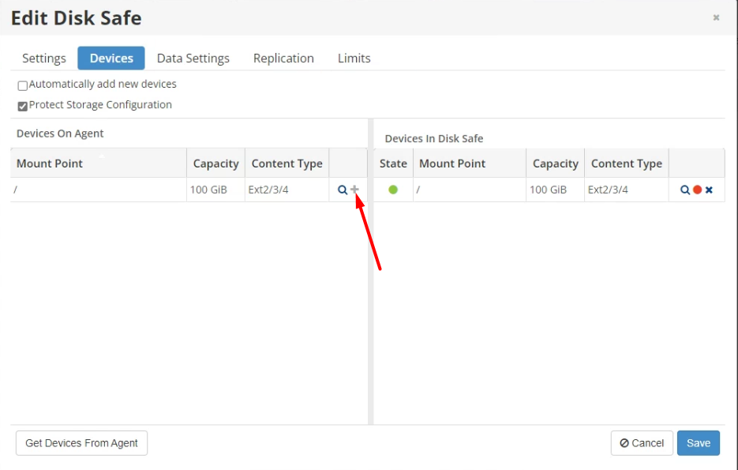

- Thiết lập policy:

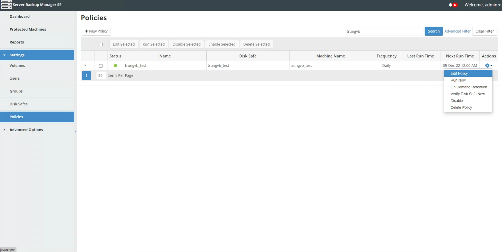

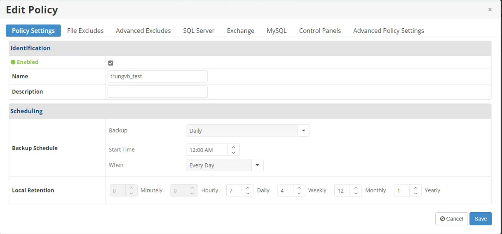

- Thiết lập bỏ qua directory nào:

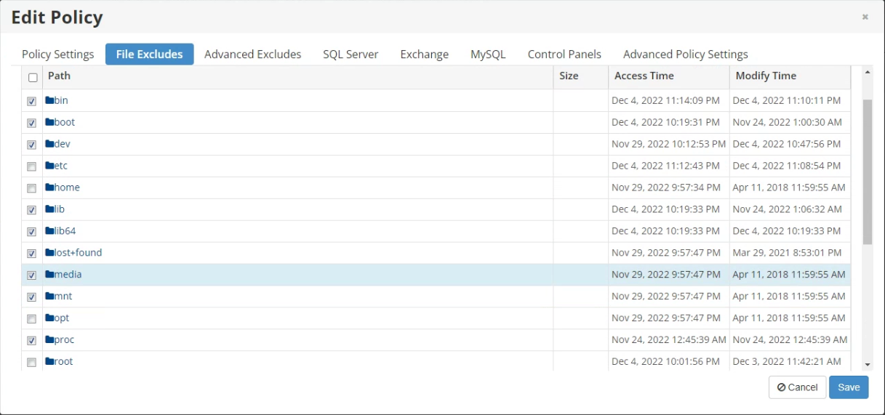

- Add MySQL Instance

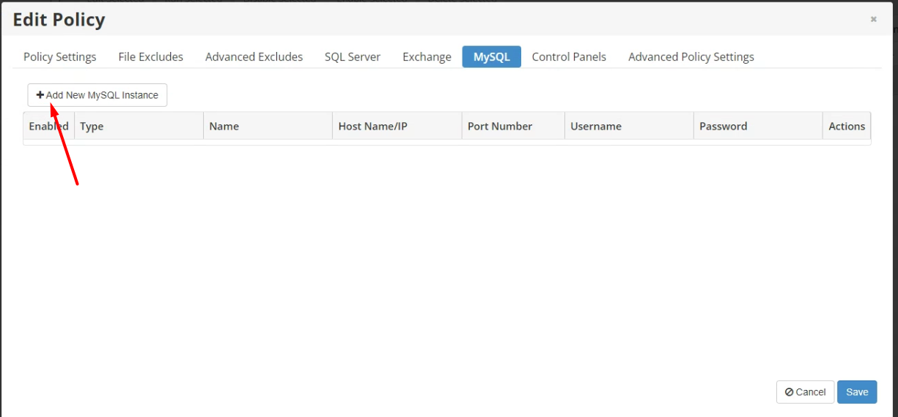

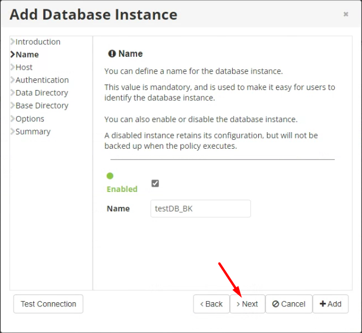

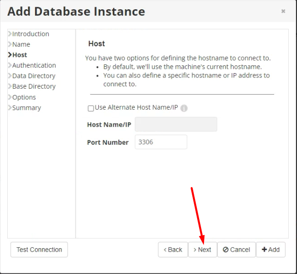

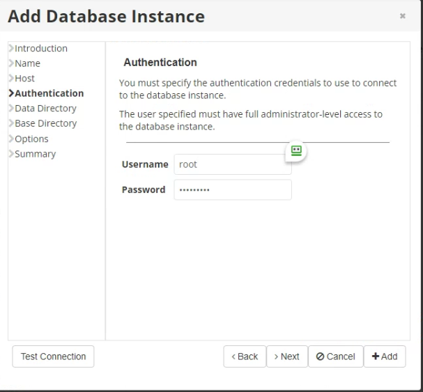

- Next -> Next -> ...


- Sau khi cấu hình xong policy thì ấn save để hoàn thành cấu hình backup cho máy chủ linux

- Tiến hành Backup

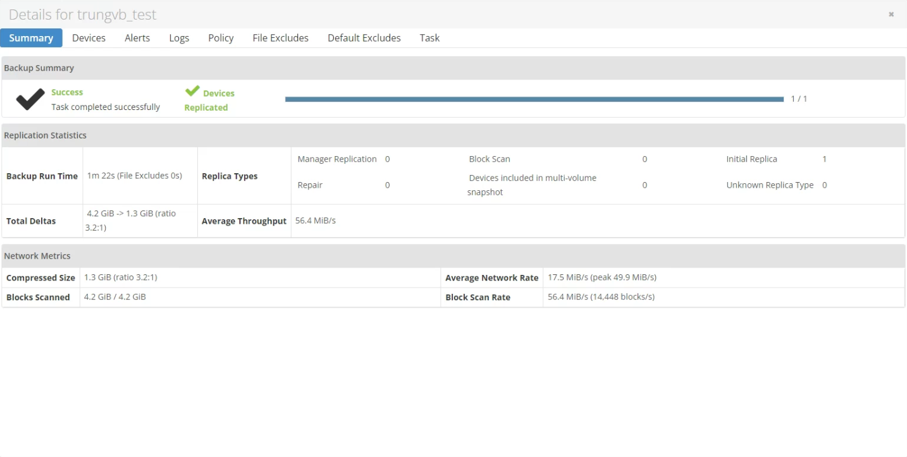

3. Restore

- Open Revovery Points

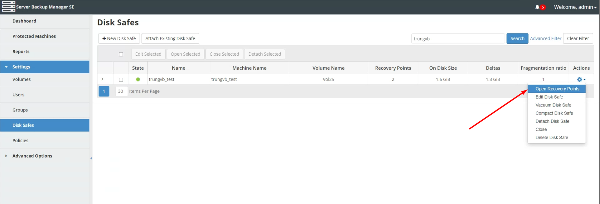

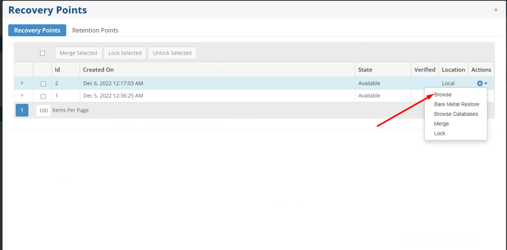

- Restore theo từng tệp hoặc restore hết cả directory

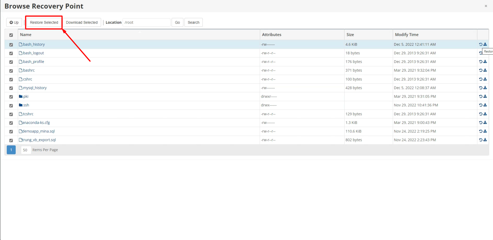

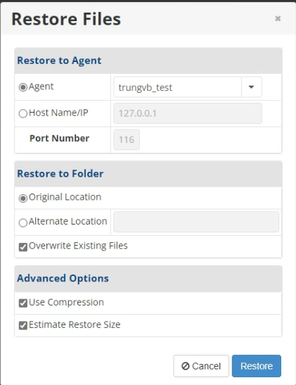

- OK

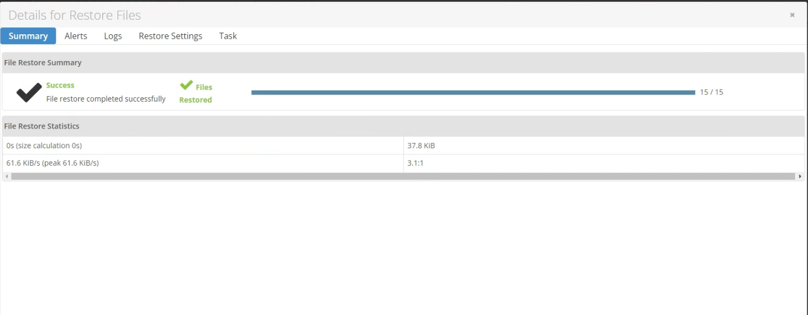

- Restore database

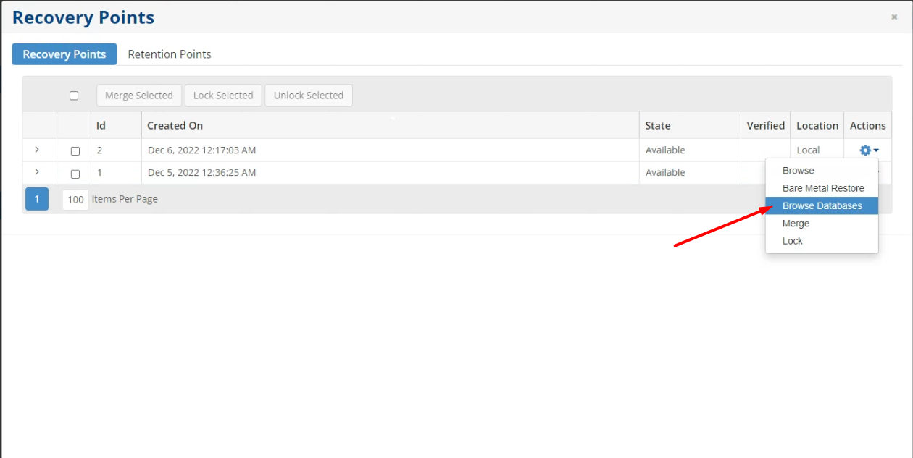

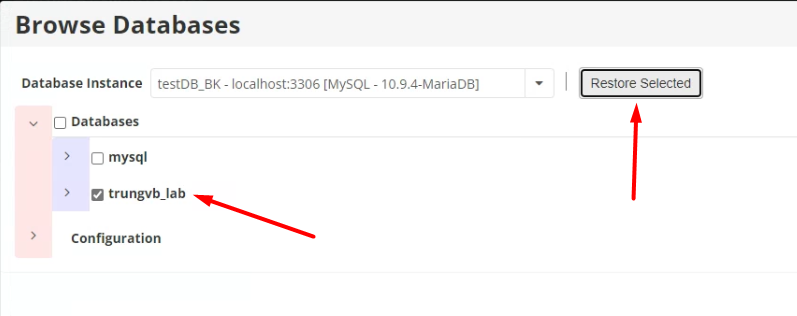

- Để default hết

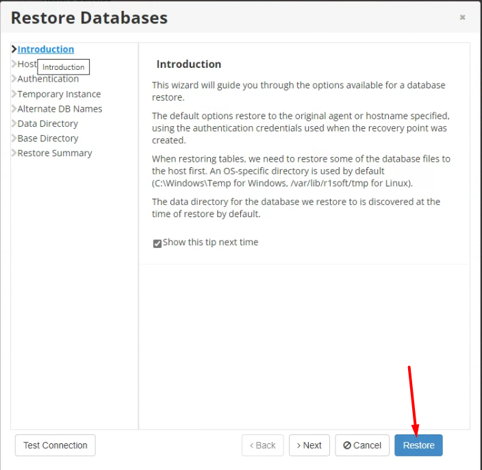