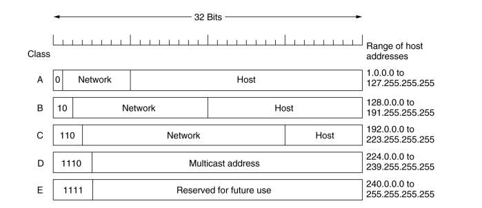
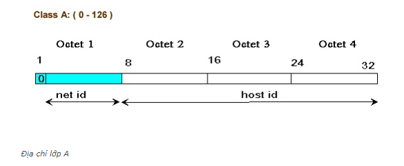
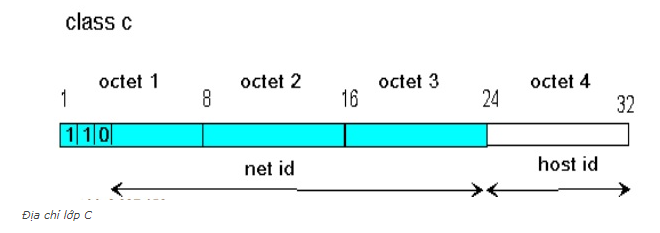
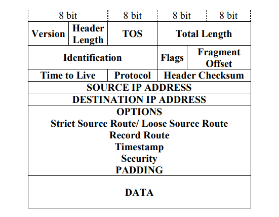

# Giao thức IP

IP (hay Internet Protocol) là 1 giao thức của chồng giao thức TCP/IP thuộc về lớp Internet, tương ứng với lớp thứ 3 của mô hình OSI (Network Layer). Ngày nay, IP được sử dụng rộng rãi trong mọi hệ thống mạng trên toàn thế giới

Đặc điểm:
- Kết nối các mạng với nhau
- Định dạng gói tin IP: datagram, IP packet
- Giao thức không kết nối, không tin cậy
- Sử dụng địa chỉ IP để định tuyến
- Chuyển giao dữ liệu giữa lớp Internet và lớp mạng truy nhập (trong mô hình TCP/IP)

# IPv4 - phiên bản thứ 4 của IP

## Cấu trúc địa chỉ IPv4

- Địa chỉ IP gồm 32 bit nhị phân, chia thành 4 cụm 8 bit (gọi là octet) ngăn cách nhau bởi dấu chấm.
- Có 2 phần chính của 1 địa chỉ IP: **phần mạng** (network) và **phần host**.

- Các bit phần mạng không được phép đồng thời bằng 0

*VD:* Địa chỉ 0.0.0.1 với phần mạng 0.0.0 và phần host bằng 1 là không hợp lệ

- Nếu các bit phần host đều bằng 0, ta có địa chỉ mạng

*VD:* Địa chỉ 192.168.1.1 là một địa chỉ có thể gán cho host, nhưng địa chỉ 192.168.1.0 là một địa chỉ mạng, không thể gán cho host được

- Nếu các bit phần host đều bằng 1, ta có địa chỉ broadcast

*VD:* 192.168.1.255 là địa chỉ broadcast cho mạng 192.168.1.0

## Các lớp địa chỉ của IPv4

**Lớp A:**

- Địa chỉ lớp A sử dụng một 1 octet đầu làm phần mạng, 3 octet sau làm phần host
- Bit đầu tiên của địa chỉ lớp A luôn là 0
- Dải địa chỉ lớp A: 1.0.0.0 -> 126.255.255.255
- Mạng 127.0.0.0 được sử dụng làm mạng loopback
- Phần host có 24 bit => mỗi mạng lớp A có (2^24 - 2) host

**Lớp B:**

- Địa chỉ lớp B sử dụng 2 octet đầu làm phần mạng, 2 octet sau làm phần host
- 2 bit đầu tiên của địa chỉ lớp B luôn là 10
- Dải địa chỉ lớp B: 128.0.0.0 -> 191.255.255.255
- Phần host dài 16 bit do đó lớp B có (2^16 - 2) host

**Lớp C:**

- Địa chỉ lớp C sử dụng 3 octet đầu làm phần mạng, 1 octet sau làm phần host
- 3 bit đầu tiên của địa chỉ lớp C luôn là 110
- Dải địa chỉ lớp C: 192.0.0.0 -> 223.255.255.255
- Phần host dài 8 bit do đó 1 mạng lớp C có (2^8 -2) host

**Lớp D:**

- Địa chỉ lớp D sử dụng 3 octet đầu và 4 bit đầu của octet cuối làm phần mạng, 4 bit sau cho phần host
- Dải địa chỉ lớp D: 224.0.0.0 -> 239.255.255.255
- Sử dụng làm địa chỉ multicast
- *VD:* 224.0.0.5 dùng cho OSPF, 224.0.0.9 dùng cho RIPv2

**Lớp E:**

- Từ 240.0.0.0 trở đi
- Dùng cho mục đích dự phòng

## Địa chỉ private và địa chỉ public 

- Địa chỉ Private: được sử dụng trong mạng nội bộ (mạng LAN), không được định tuyến trên môi trường Internet. Có thể được sử dụng lặp lại trong các mạng LAN khác nhau, giúp tiết kiệm không gian địa chỉ public, có thể chuyển đổi thành IP public thông qua NAT
- Địa chỉ Public: là địa chỉ được quản lý bởi IANA (Internet Assigned Numbers Authority), sử dụng cho các gói tin đi trên môi trường Internet, được định tuyến trên môi trường Internet. Địa chỉ public phải là duy nhất cho mỗi host tham gia vào Internet
- Dải địa chỉ private (được quy định trong RFC 1918):
   - Lớp A: 10.x.x.x
   - Lớp B: 172.16.x.x -> 172.31.x.x
   - Lớp C: 192.168.x.x
   
## Subnet mask và số prefix length

### Subnet mask

- Subnet mask là 1 dãy nhị phân dài 32 bit đi kèm với 1 địa chỉ IP để xác định network mà IP này thuộc về. Điều này được thực hiện bằng phép toán AND địa chỉ IP với subnet mask tương ứng

*VD:* Xét địa chỉ IP 192.168.1.1 với subnet mask 255.255.255.0. Kết quả của phép AND 2 địa chỉ này là 192.168.1.0 - đây là địa chỉ mạng của IP trên

- Các subnet mask chuẩn của các địa chỉ lớp A, B, C:
   - Lớp A: 255.0.0.0
   - Lớp B: 255.255.0.0
   - Lớp C: 255.255.255.0
   
### Prefix length

- Một cách khác để xác định địa chỉ IP là sử dụng số prefix length tương ứng với số bit 1 trong subnet mask, được viết ngay sau địa chỉ IP và ngăn cách bởi dấu "/"

*VD:* 192.168.1.1/24, 172.168.2.1/16

## Khuôn dạng gói dữ liệu IP

- Version (4 bit): phiên bản hiện hành của giao thức IP
- Header Length (4 bit): độ dài của phần header tính theo 32 bit
- TOS (Type of Service)(8 bit): cấp bậc dịch vụ của gói tin. Gồm 3 bit cho quyền ưu tiên gửi datagram, 1 bit cho độ trễ yêu cầu, 1 bit cho thông lượng yêu cầu, 1 bit cho độ tin cậy, 2 bit "để dành"
- Total Length (16 bit): độ dài của toàn bộ gói dữ liệu IP tính theo byte(header + data)
- Identification (16 bit): định danh duy nhất cho gói tin và các phân mảnh (fragment)
- Flags (3 bit): liên quan đến sự phân mảnh của gói tin
- Fragment Offset (13 bit): vị trí của phần data của các phân mảnh trong gói tin gốc theo khối 8 byte
- Time to live (8 bit): thời gian tồn tại của gói tin trên mạng
- Protocol (8 bit): giao thức lớp giao vận (TCP, UDP, ICMP,...)
- Header Checksum (16 bit): mã kiểm soát lỗi CRC
- Source IP address (32 bit): địa chỉ IP nơi gửi gói tin
- Destination IP Address (32 bit): địa chỉ IP nơi nhận gói tin
- Option (độ dài thay đổi): tùy chọn của gói tin (nếu có)
- Padding (độ dài thay đổi): phần chèn thêm đảm bảo gói tin kết thúc ở mốc 32 bit
- Data (độ dài thay đổi): dữ liệu cần gửi đi trong gói tin

## Những hạn chế của IPv4

- Vấn đề lớn nhất mà IPv4 gặp phải là vấn đề về bảo mật. Cấu trúc của IPv4 không có bất kỳ bảo mật nào và nó cũng không có công cụ nào để mã hóa dữ liệu. Do đó, khi liên lạc giữa các host sẽ không đảm bảo an toàn dữ liệu, nếu có cũng chỉ ở tầng ứng dụng. Sử dụng IPSec để bảo mật cũng chỉ bảo mật ở tầng 3 (Network layer).
- Một hạn chế nữa của IPv4 là số lượng địa chỉ bị hạn chế. Vì bị giới hạn trong 32 bit nên chỉ tạo ra đc hơn 4 tỉ địa chỉ IP. Tuy nhiên hiện nay số lượng IP này đã sắp cạn kiệt. Vì vậy mà IPv6 được ra đời và có đến 128 bit. Trong tương lai IPv6 có thể sẽ thay thế hoàn toàn IPv4

# IPv6 - phiên bản thứ 6 của IP

IPv6 là phiên bản thứ 6 của IP được ra đời nhằm khắc phục những thiếu sót của IPv4 về vấn đề bảo mật và không gian truy cập

## Cấu trúc của IPv6

Một IPv6 có cấu trúc gồm 128 bit và phân thành 8 nhóm. Mỗi nhóm gồm 16 bit, giữa các nhóm có sự phân chia bởi dấu ":"

Một địa chỉ IPv6 được biểu diễn theo cấu trúc như sau (dạng HEX):

> 2001:0DB8:0000:02AA:00FF:FE28:9C5A

Đơn giản hóa bằng cách loại bỏ số 0 đứng trước:

> 2001:DB8:0:2F3B:2AA:FF:FE28:9C5A

Một số địa chỉ IPv6 chứa khá nhiều giá trị 0. Một chuỗi liền kề các khối zero có thể né lại thành "::"

*VD:* FF80:0:0:0:2AA:FF:FE9A:4CA2 có thể nén xuống thành:

> FE80::2AA:FF:FE9A:4CA2

Một địa chỉ IPv6 được chia thành 3 phần: prefix, subnet ID và interface ID
- Site prefix: là số được gán đến wbsite bằng một ISP. Theo đó, tất cả máy tính trong cùng 1 vị trí sẽ được chia sẻ cùng 1 site prefix. Site prefix hướng tới dùng chung khi nó nhận ra mạng của bạn và cho phép mạng có khả năng truy cập từ internet
- Subnet ID: là thành phần ở bên trong trang web, được sử dụng với chức năng miêu tả cấu trúc trang của mạng. Một IPv6 subnet có cấu trúc tương đương với một nhánh mạng đơn như subnet của IPv4
- Interface ID: có cấu trúc tương tự ID trong IPv4. Số này nhận dạng duy nhất một host riêng trong mạng. Interface ID (thứ mà đôi khi được cho là như một thẻ) được cấu hình dựa vào địa chỉ MAC của mạng

## Cách chuyển IPv4 sang IPv6 và ngược lại

**IPv4 -> IPv6**

VD: Chuyển địa chỉ IPv4 192.168.25.234 thành địa chỉ IPv6
- Chia mỗi octet cho 16, ta được kết quả:
   - 192/16 = 12 dư 0
   - 168/16 = 10 dư 8
   - 25/16 = 1 dư 9
   - 234/16 = 14 dư 10
   
   -> Kết quả địa chỉ IPv6 sẽ là C0A8:19EA
   
   Địa chỉ IPv4 có 32 bit trong khi IPv6 là 128 bit. Vì vậy địa chỉ trên còn thiếu 96 bit, gồm toàn các số 0. Cách ghi chính xác sẽ là:
   - 0000:0000:0000:0000:000:000:C0A8:19EA
   - *Hoặc* ::C0A8:19EA
   
**IPv6 -> IPv4**

Để chuyển ngược lại, ta chỉ cần nhân với 16 và cộng với số dư
- C0 = 12*16 + 0 = 192
- A8 = 10*16 + 8 = 168
- 19 = 1*16 + 9 = 25
- EA = 14*16 + 10 = 234