# Cài đặt và sử dụng KVM

### Chuẩn bị 

- 1 máy chạy hệ điều hành CentOS 7 với cấu hình tối thiểu 2 CPU, 2 GB RAM và 10 GB disk
- 1 file ISO của 1 hđh khác để cài máy ảo 
- Lưu ý để cài được KVM thì cần phải được CPI hỗ trợ. Để kiểm tra xem CPU có hỗ trợ hay không sử dụng lệnh

```sh
lscpu | rep Virtualization
```

```sh
egrep -c "svm|vmx" /proc/cpuinfo  # Nếu kết quả trả về khác 0 thì CPU có hỗ trợ
```


### Cài đặt KVM

- Cài KVM và các gói phụ trợ liên quan

```sh
yum install -y qemu-kvm libvirt libvirt-python libguestfs-tools virt-install bridge-utils libvirt-clients libvirt-daemon-system virtinst virt-manager
```

- Trong đó:
    - qemu-kvm: phần phụ trợ cho KVM
    - libvirt-bin: cung cấp libvirt mà bạn cần quản lý qemu và KVM bằng libvirt
    - bridge-utils: chứa 1 tiện ích cần thiết để tạo và quản lý các thiết bị bridge
    - virt-manager: cung cấp giao diện đồ họa để quản lý máy ảo

- Kiểm tra để chắc chắn rằng KVM đã được cài đặt

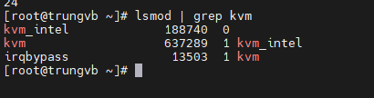

- Đối với hđh Host bản Minimal thì để dùng được công cụ đồ họa ```virt-manager```, người dùng sẽ phải cài đặt thêm gói x-window 

```sh
yum install "@X Window System" xorg-x11-xauth xorg-x11-fonts-* xorg-x11-utils -y
```

- Nếu sau đó vẫn không mở được virt-manager thì kiểm tra trong file ```/etc/ssh/sshd_config``` xem 3 dòng sau đã được config đúng hay chưa

```sh
X11Forwarding yes
X11DisplayOffset 10
X11UseLocalhost yes
```

- Sau đó restart lại dịch vụ sshd

```sh
systemctl restart sshd
```

- Start dịch vụ libvirt và cho nó khởi động cùng hệ thống

```sh
systemctl start libvirtd
systemctl enable libvirtd
```

### Tạo máy ảo bằng GUI (virt-manager)

- Có rất nhiều công cụ để tạo và quản lý máy ảo KVM. Ở đây ta sử dụng công cụ đồ họa ```virt-manager``` đã cài ở bên trên

- Để khởi động Virt-manager, ta chạy lệnh

```sh
virt-manager
```

- Tạo máy ảo: ```File``` -> ```New Virtual Machine```

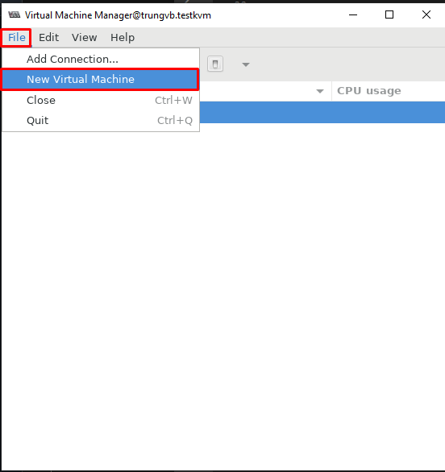

- Chọn kiểu cài đặt hệ điều hành -> ```Forward```

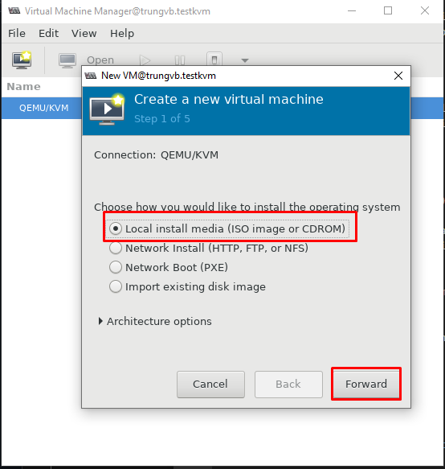

- Chọn đường dẫn file ISO cài đặt hđh

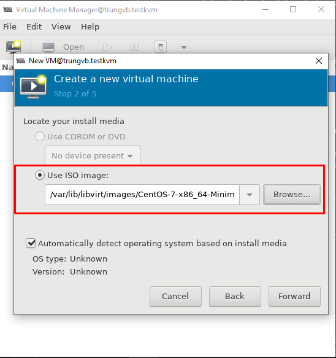

- Chỉ định thông số RAM và CPU cho máy ảo

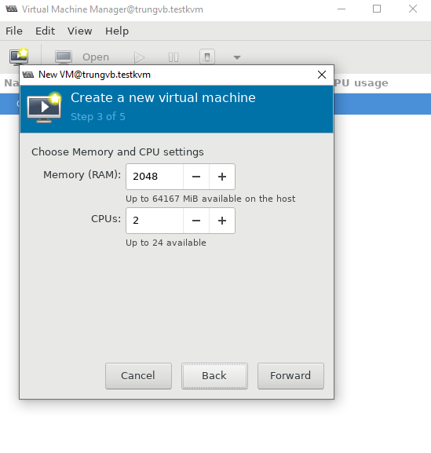

- Chỉ định số lượng đĩa và đường dẫn của máy ảo nếu ta đặt đường dẫn tùy chỉnh (mặc định đường dẫn là ```/var/lib/libvirt/images```)

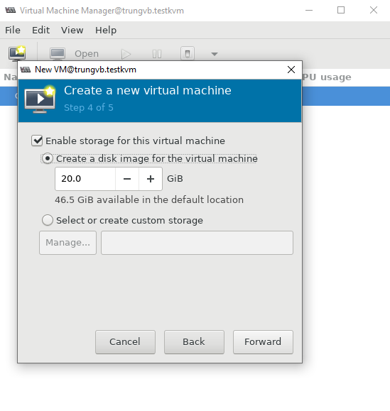

- Chỉ định thông tin máy, network

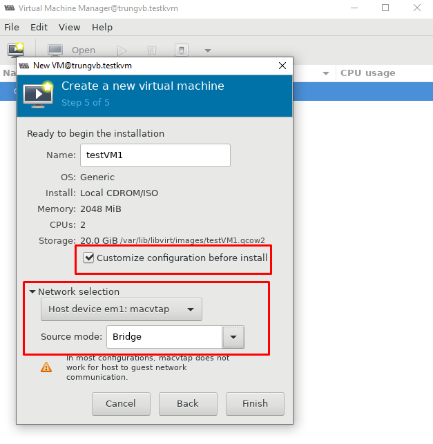

- Nhấn ```Finish``` sau đó chọn ```Begin Installation``` để hoàn tất quá trình cài đặt máy ảo

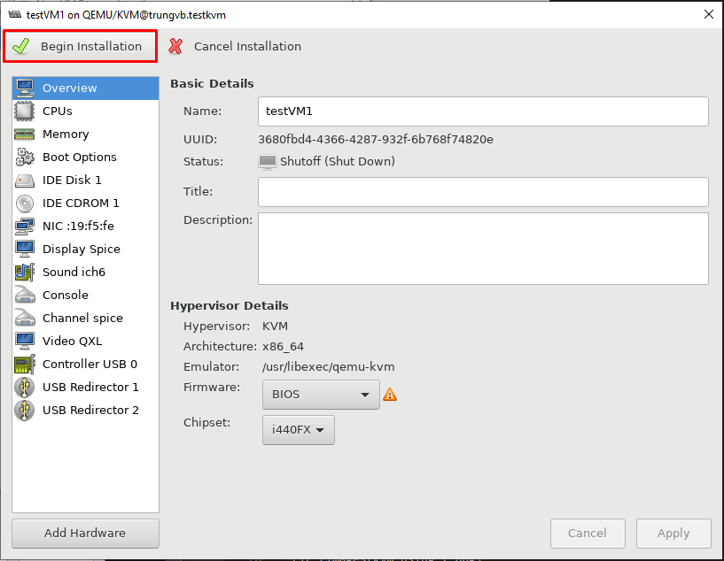

- Cài OS

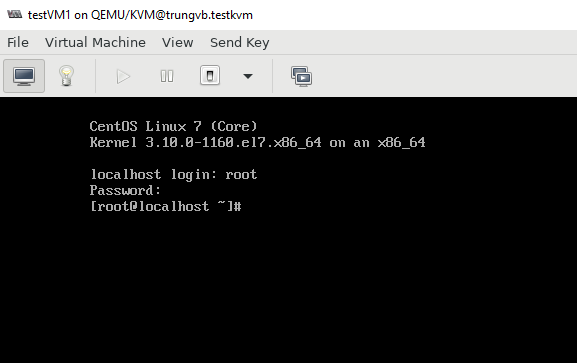

### Tạo máy ảo bằng CLI (virt-install)

#### 1. Tạo máy ảo từ file ISO

- Tạo thư mục chứa máy ảo

```mkdir -p /var/kvm/images```

- Sử dụng lệnh ```virt-install``` với các tham số, giá trị truyền vào để tạo máy ảo với thông tin cấu hình mong muốn. Hầu hết các options là không bắt buộc, virt-install chỉ yêu cầu 1 số thông tin tối thiểu sau

```sh
--name
--ram
--disk
--filesystem or --nodisks
```

- Các tham số đối với ```virt-install```:
    - ```--name```: đặt tên cho máy ảo
    - ```--ram```: set dung lượng RAM cho máy ảo (MB) 
    - ```--disk path = xx, size = xx```: đường vẫn lưu file .img máy ảo và dung lượng disk mount
    - ```--vspus```: set giá trị số vCPU
    - ```--os-type```: kiểu hệ điều hành (linux, windows)
    - ```--os-variant```: kiểu của GuestOS
    - ```--network```: dải network mà máy ảo tạo ra sẽ cắm vào
    - ```--graphics```: set chế độ đồ họa, đặt là none -> không sử dụng chế độ đồ họa
    - ```--console```: lựa chọn kiểu console
    - ```--location```: đường dẫn tới file cài đặt
    - ```--extra-args```: set tham số cho kernel

- Tiến hành tạo máy ảo với ```virt-install```

```sh
virt-install \
--name testVM2 \
--ram 2048 \
--vcpus 2 \
--disk path=/var/kvm/images/testVM2.img,size=30 \
--network bridge=br0 \
--graphics vnc,listen=0.0.0.0 \
--noautoconsole \
--os-type=linux \
--os-variant=rhel7 \
--location=/var/lib/libvirt/images/CentOS-7-x86_64-Minimal-2009.iso
```

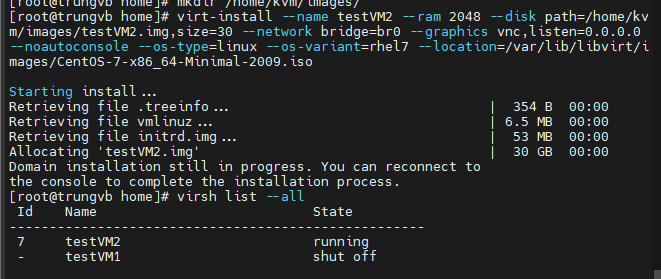

- Lại tiếp tục cài đặt OS...

#### 2. Tạo máy ảo từ file image có sẵn

```sh
virt-install \
--name testVM3 \
--ram 1024 \
--vcpus 1 \
--os-variant=rhel7 \
--disk path=/var/lib/libvirt/images/testVM3.img,size=20 \
--network bridge=br0 \
--hvm --virt-type kvm \
--vnc --noautoconsole \
--import
```

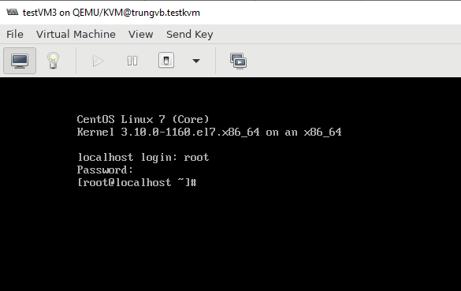