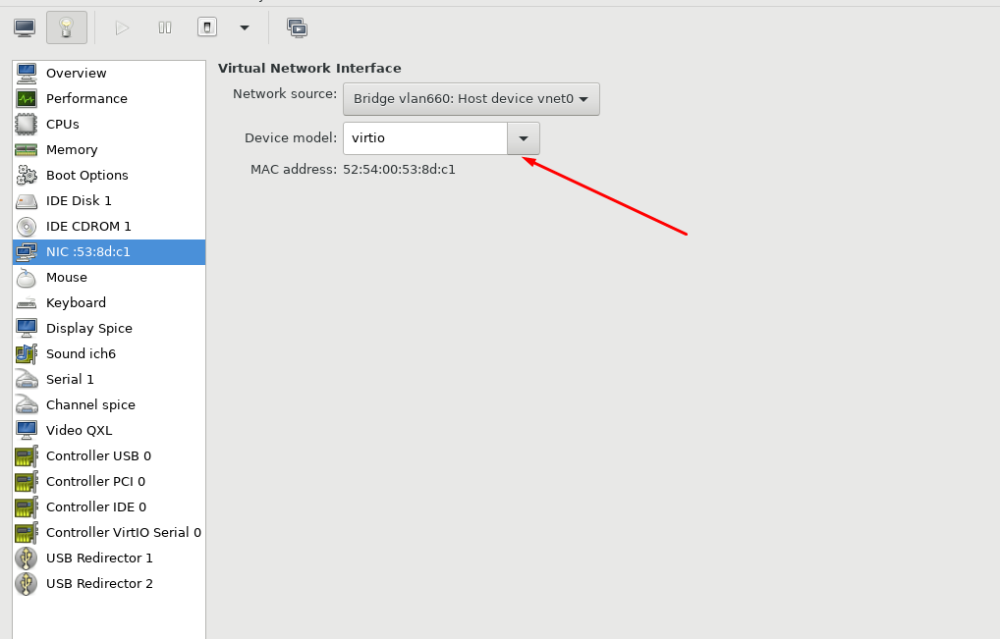

# Cấu hình Bridge VLAN trên KVM

### 1. Cấu hình card mạng bridge ở máy vật lý

- Đầu tiên là chỉnh sửa interface đang cắm với switch, ở đây là ```ifcfg-em3```

```sh
TYPE=Ethernet
BOOTPROTO=none
NAME=em3
DEVICE=em3
ONBOOT=yes
```

- Sau đó là sub-interface của em3, với mỗi vlan ta phải cấu hình 1 sub-interface, ví dụ vlan660 thì sub-interface sẽ là ```ifcfg-em3.660```

```sh
# cat ifcfg-em3.660
DEVICE=em3.660
BOOTPROTO=none
ONBOOT=yes
VLAN=yes
BRIDGE=vlan660
TYPE=Ethernet
NM_CONTROLLED=no
```

- Cuối cùng, cấu hình interface cho vlan, lưu ý trường IPADDR có thể đặt IP bất kỳ khác IP gateway, broadcast, và IP switch (thường là .254)

```sh
# cat ifcfg-vlan660
DEVICE=vlan660
TYPE=Bridge
BOOTPROTO=none
ONBOOT=yes
NM_CONTROLLED=no
IPADDR=192.168.60.130
NETMASK=255.255.255.0
```

- Nhớ restart network service

```sh
systemctl restart network
```

### 2. Cấu hình card mạng của máy ảo

- Cấu hình như sau, lưu ý là phần ```Device model``` phải để là ```VirtIO```



```sh
TYPE=Ethernet
BOOTPROTO=static
NAME=eth0
DEVICE=eth0
ONBOOT=yes
IPADDR=192.168.60.200
PREFIX=24
```

```sh
systemctl restart network
```

- Vậy là OK rồi, chú ý IPADDR dùng chính xác dải của vlan đó và bridge đúng interface