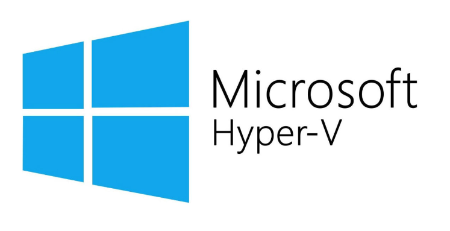
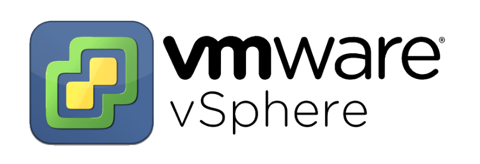

# So sánh KVM vs Hyper-V vs VMware vSphere vs Xen

4 phần mềm ảo hóa được xét đến trong bài viết này đều thuộc công nghệ ảo Hypervisor Type 1 (tức là chạy trực tiếp trên phần cứng vật lý chứ không phải qua Host OS). Hãy cùng đặt 4 phần mềm này lên bàn cân để đánh giá xem phần mềm nào là phù hợp nhất với bạn nhé!

## Sơ lược về từng phần mềm

### 1. Hyper-V

Ra mắt năm 2008, Hyper-V là công nghệ ảo hóa của Microsoft trên các phiên bản Windows Server. Hyper-V là lựa chọn ảo hóa tốt nhất dành cho các máy ảo chạy Windows. Tuy nhiên bạn vẫn có thể cài đặt nhiều hệ điều hành khác trên nền tảng ảo hóa này.

Hyper-V được tích hợp sẵn trong Windows 10. Bạn chỉ cần kích hoạt thêm tính năng Hyper-V Role để biến máy tính thành 1 máy chủ Hyper-V

Ngoài ra, Hyper-V được đi kèm miễn phí cùng Windows Hyper-V Server 2019. Hyper-V cũng là nền tảng ảo hóa cốt lõi của dịch vụ Azure Cloud của Microsoft

### 2. KVM

KVM (Kernel-based Virtual Machine) là 1 công nghệ ảo hóa mã nguồn mở được phát triển bởi Red Hat. Nó được tích hợp vào Linux kernel 2.6.20 từ năm 2007 và nhanh chóng phát triển thành nền tảng ảo hóa mã nguồn mở được sử dụng phổ biến nhất hiện nay

Do được tích hợp sẵn vào nhân Linux, bạn có thể sử dụng KVM trên mọi hệ điều hành Linux phổ biến như: Ubuntu, Debian, CentOS,... Tuy nhiên, để tiện việc thiết lập và quản lý máy ảo, đa số mọi người dùng sẽ sử dụng **Proxmox** - hđh thuộc nhánh Debian được tối ưu cho ảo hóa

KVM là sự lựa chọn của các công ty cung cấp dịch vụ Cloud VPS lớn như Google Compute Engine, Vultr, Linode, DigitalOcean, OVH,...

### 3. Xen

Xen là công nghệ ảo hóa Hypervisor Type-1 được phát triển từ năm 2003 bởi Computer Laboratory của đại học Cambridge - Hoa Kỳ. Từ 2013, Xen được phát triển bởi Linux Foundation với sự hỗ trợ từ Amazon, AMD, Bromium, CA Technologies, Calxeda, Cisco, Citrix, Google, Intel, Oracle, Samsung và Verizon

Hiện tại, Xen được chia thành 2 phân nhánh:
- **Citrix Hypervisor:** phát triển bởi Citrix - công ty đã mua Xen Source từ năm 2007, và ra mắt Xen Server. Tháng 12/2017, Citrix thay đổi chính sách bản quyền, loại bỏ các tính năng cao cấp ra khỏi bản miễn phí của Xen Server, đồng thời không mở mã nguồn cho các tính năng mới
- **XCP-ng:** (Xen Cloud Platform - New Generation) là dự án mã nguồn mở miễn phí được phát triển bởi Vates (1 startup đến từ Pháp) dựa trên mã nguồn của Xen Server 7.3. XCP-ng mang đến những tính năng mà Citrix đã loại bỏ khỏi bản miễn phí, mang đến giải pháp ảo hóa Xen mã nguồn mở không bị giới hạn bởi bản quyền và tính năng cho cộng đồng

Xen là công nghệ ảo hóa được AWS (Amazon Web Services) và Alibaba Cloud lựa chọn

### 4. VMware vSphere

vSphere là nền tảng ảo hóa của VMware - công ty lớn nhất và nổi tiếng nhất trong thế giới ảo hóa. vSphere là 1 bộ sản phẩm gồm nhiều tính năng giúp xây dựng và quản lý hạ tầng ảo hóa dành cho doanh nghiệp: ESXi hypervisor, vCompute, vCenter, vStorage, vNetwork,... Nó là nền tảng ảo hóa được sử dụng phổ biến nhất thế giới

Thành phần cốt lõi của vSphere là ESXi hypervisor - được cài đặt trực tiếp lên máy chủ vật lý để thiết lập máy ảo. ESXi có thể được dùng thử trong 60 ngày với đầy đủ tính năng. Sau thời gian này, bạn cần phải nhập key miễn phí để tiếp tục sử dụng, nhưng sẽ bị hạn chế tính năng

VMware vSphere là sự lựa chọn hàng đầu của các doanh nghiệp nhờ vào khả năng triển khai nhanh chóng, sự ổn định, tên tuổi của VMware và đội ngũ hỗ trợ chuyên nghiệp

## So sánh tính năng

|Criteria|Hyper-V|vSphere|Xen|KVM|
|:-|:-|:-|:-|:-|
|OS|WinServer, Wind10|ESXi|XCP-ng, XenServer|Proxmox, Debian, Ubuntu,...|
|Free License?|Yes|Yes (limited function)|Yes|Yes|
|Open-Source|No|No|Yes|Yes|
|RAM/Host|24 TB|12 TB|5 TB|12 TB|
|CPU/VM|240|120|32|240|
|VM Disk|64 TB|62 TB|2 TB|10 TB|
|VM Live Migration|Yes|Yes|Yes|Yes|
|VM Replication|Yes|Yes|Yes|Yes|
|Overcommit Resources|Yes|Yes|No|Yes|
|Disk I/O Throttling|Yes|Yes|Yes|Yes|
|Hot Plug of Virtual Resources|Yes|Yes|Yes|Yes|

## Lựa chọn công nghệ nào?

Trong môi trường doanh nghiệp, việc lựa chọn công nghệ ảo hóa cho hạ tầng IT phụ thuộc vào nhiều yếu tố: tính năng, chi phí, sự ổn định, tính tương thích,.... Các công ty cung cấp dịch vụ Cloud Computing thường chọn lựa KVM hoặc Xen nhờ ưu điểm mã nguồn mở. Trong khi đó các doanh nghiệp thường chọn giải pháp Hyper-V của Microsoft hoặc vSphere của VMware bởi sự ổn định và giải pháp hỗ trợ kỹ thuật

Trong môi trường homelab, cả 4 công nghệ ảo hóa trên đều phù hợp để cài đặt và thiết lập máy ảo. Ngoài ra, nhờ có công nghệ Nested Virtualization (ảo hóa lồng nhau) bạn có thể cài đặt Proxmox, XCP-ng hay ESXi lên máy ảo của Hyper-V (hoặc ngược lại) để nghiên cứu thêm mà không cần phải đầu tư thêm phần cứng mới