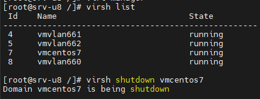
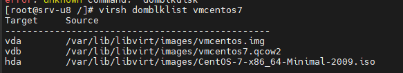
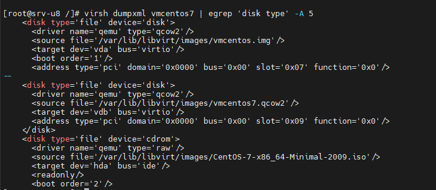
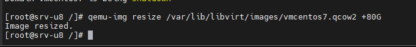
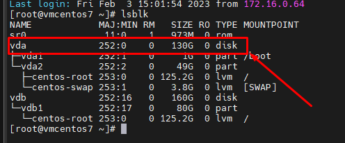
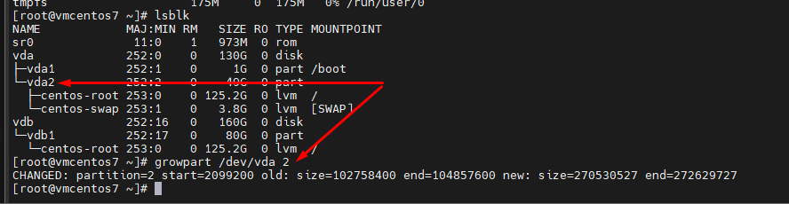
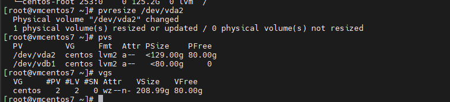
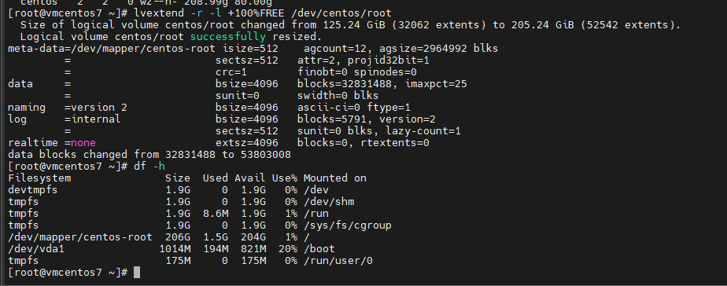

# Resize disk trong KVM

- Kiểm tra trạng thái và shutdown máy ảo

```sh
virsh list
virsh shutdown vmcentos7
```



- Tìm kiếm đường dẫn disk (file qcow2) của máy ảo

```sh
virsh domblklist vmcentos7
```



- Hoặc lệnh sau:

```sh
virsh dumpxml vmcentos7 | egrep 'disk type' -A 5
```



- Extend VM disk

```sh
qemu-img resize /var/lib/libvirt/images/vmcentos7.qcow2 +80G
```



- Lưu ý 1: qemu-img sẽ không thể reszie VM mà có snapshot, do đó trước khi resize ta phải xóa hết snapshot đi
 - Để check các bản snapshot của VM, ta dùng ```virsh snapshot-list vmcentos7```
 - Để xóa snapshot, ta dùng ```virsh snapshot-delete --domain vmcentos7 --snapshotname snapshot1```

- Lưu ý 2: với virsh, ta cũng có thể reszie disk VM nhưng sẽ cần máy ảo phải đang hoạt động
 - Lệnh resize: virsh blockresize vmcentos7 /var/lib/libvirt/images/vmcentos.img 100G

- Tiếp theo, SSH vào VM và kiểm tra disk



- Như vậy vda đã từ 50G lên 130G (+80G), giờ ta install 1 công cụ là growpart để resize dung lượng phân vùng

```sh
yum -y install cloud-utils-growpart
```

- Sử dụng growpart:

```sh
growpart /dev/vda 2
```



- Reszie physical volume



- Cuối cùng, resize lại logical volume

```sh
lvextend -r -l +100%FREE /dev/centos/root
# option -r sẽ giúp resize cả filesystem luôn
```



