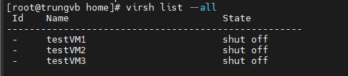
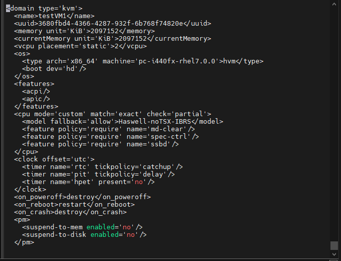
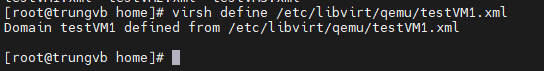
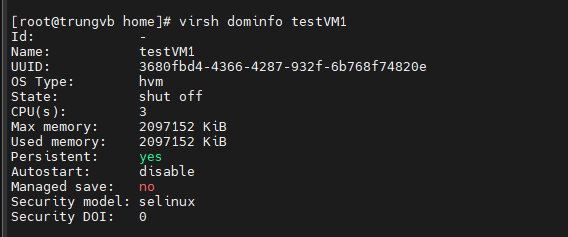
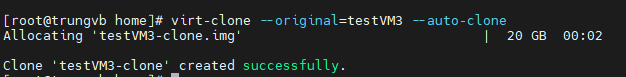
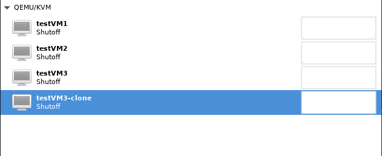
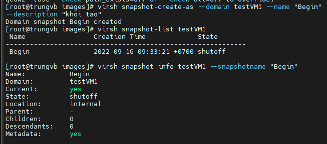

# Libvirt và virsh

```Libvirt```: là 1 bộ các phần mềm cung cấp các cách thuận tiện để tiện quản lý máy ảo và các chức năng của ảo hóa. Phần mềm này bao gồm 1 thư viện API daemon (libvirtd) và các gói tiện ích giao diện dòng lệnh (virsh)

```virsh```: là 1 tools kiểm soát và thực hiện hành động với các máy ảo

### Các lệnh cơ bản với virsh

- Show tất cả các máy ảo đã được cài đặt (bỏ option ```--all``` để hiển thị máy ảo đang hoạt động) 

```sh
virsh list --all
```



- Khởi động máy ảo

```sh
virsh start testVM1
```

- Tắt máy ảo

```sh
virsh shutdown testVM1
```

- Reboot máy ảo

```sh
virsh reboot testVM1
```

- Suspend máy ảo

```sh
virsh suspend testVM1
```

- Resume máy ảo

```sh
virsh resume testVM!
```

- Chỉnh sửa lại thông số máy ảo

```sh
virsh edit testVM1
```



- Sau khi chỉnh sửa thì cập nhật lại cấu hình

```sh
virsh define /etc/libvirt/qemu/testVM1.xml
```



- Xóa máy ảo

```sh
virsh destroy testVM4
virsh undefine /etc/libvirt/qemu/vm4.xml
```

### Các lệnh kiểm tra thông tin

- Xem file .xml của máy ảo

```sh
virsh dumpxml testVM1
```

- Xem thông tin máy ảo

```sh
virsh dominfo testVM1
```



### Các thao tác Clone

- Trước khi clone cần shutdown máy ảo trước
- Auto clone:

```sh
virt-clone --original=testVM3 --auto-clone
```





- Clone đổi tên

```sh
virt-clone --original=testVM3 --name=testCloneVM3 --auto-clone
```

- Clone custom disk image

```sh
virt-clone --original=testVM3 --name=VMcustom --file=/var/lib/libvirt/images/VMcustom.qcow2
```

### Các thao tác với Snapshot

- Tạo Snapshot

```sh
virsh snapshow-create-as --domain testVM1 --name "Begin" --description "khoi tao"
```

- Show các bản snapshot đã tạo

```sh
virsh snapshot-list testVM1
```

- Xem thông tin chi tiết bản snapshot đã tạo

```sh
virsh snapshot-info testVM1 --snapshotname = "Begin"
```



- Reverse lại 1 bản snapshot đã tạo

```sh
virsh snapshot-revert testVM1 --snapshotname "Begin"
```

- Xóa 1 bản snapshot đã tạo

```sh
virsh snapshot-delete testVM1 --snapshotname "Begin"
```

### Console máy ảo

- Khởi động dịch vụ trên các máy ảo để cho phép máy chủ KVM console không cần mật khẩu

```sh
systemctl start serial-getty@ttyS0.service
systemctl enable serial-getty@ttyS0.service
```

- Trên host KVM, thực hiện lệnh

```sh
virsh console testVM1
```

- Để thoát console thì nhấn ```CTRL + 5```