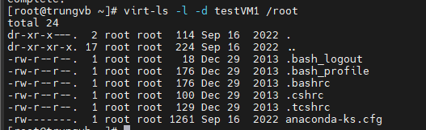

# Tìm hiểu 1 số lệnh cơ bản với virt-tools

- Cài đặt virt-tools

```sh
yum -y install libguestfs-tools virt-top
```

- Hiển thị cấu trúc 1 thư mục nào đó trong 1 VM

```sh
virt-ls -l -d <tên_máy_ảo> /root
```



- Xem nội dung file trong VM

```sh
virt-cat -d <tên_máy_ảo> /etc/passwd
```

- Edit file trong VM

```sh
virt-edit -d <tên_máy_ảo> /etc/fstab
```

- Hiển thị dung lượng disk VM

```sh
virt-df -d <tên_máy_ảo>
```

- Hiển thị trạng thái của các máy ảo

```sh
virt-top
```
