# Cài đặt Webvirtmgr để quản lý trên giao diện web

Webvirtmgr là 1 trong những công cụ quản lý máy ảo KVM. Nó có chức năng gần giống với virt-manager khi có thể kết nối đến nhiều host KVM để có thể quản lý tập trung các VM trên các máy đó. Nhưng nó có một ưu điểm đặc biệt hơn so với virt-manager đó là ta có thể làm việc với các VM ở bất kỳ đâu trên Internet

#### 1. Chuẩn bị

- 1 máy cài đặt hđh CentOS 7 có cấu hình tối thiểu là 1 CPU, 1 GB RAM và 1 card mạng
- Ít nhất 1 máy cài CentOS 7 đã cài đặt KVM để kiểm tra lại webvirtmgr đã hoạt động

#### 2. Mô hình


- Tắt firewall và selinux trên server cài Webvirtmgr

```sh
systemctl stop firewalld
setenforce 0
```

#### 3. Cài Webvirtmgr

- Cài đặt 1 số package cần thiết

```sh
yum -y install epel-release
yum -y install git python-pip libvirt-python libxml2-python-websockify supervisor nginx cyrus-sasl-md5
yum -y install gcc python-devel wget
wget https://bootstrap.pypa.io/pip/2.7/get-pip.py
python get-pip.py
pip install --upgrade setuptools
pip install numpy
```

- Clone Webvirtmgr từ GitHub và cài đặt

```sh
git clone https://github.com/retspen/webvirtmgr.git
cd webvirtmgr
pip install -r requirements.txt
```

- Sau đó ta chạy lệnh để thiết lập môi trường Django và tạo ra 1 tài khoản để đăng nhập Webvirtmgr

```sh
./manage.py syncdb
```

- Sau đó tiếp tục chạy lệnh

```sh
./manage.py collectstatic
```

- Move thư mục ```webvirtmgr``` vào trong thư mục ```/var/www```

```sh
mkdir /var/www
mv /root/webvirtmgr/ /var/www/
```

- Cài đặt Nginx

```sh
vi /etc/nginx/conf.d/webvirtmgr.conf
```

- Thêm vào những dòng sau

```sh
server {
    listen 80 default_server;
    server_name $hostname;
    access_log /var/log/nginx/webvirtmgr_access_log;

    location /static/ {
        root /var/www/webvirtmgr/webvirtmgr;
        expires max;
    }

    location / {
        proxy_pass http://127.0.0.1:8000;
        proxy_set_header X-Real-IP $remote_addr;
        proxy_set_header X-Forwarded-for $proxy_add_x_forwarded_for;
        proxy_set_header Host $host:$server_port;
        proxy_set_header X-Forwarded-Proto $scheme;
        proxy_connect_timeout 600;
        proxy_read_timeout 600;
        proxy_send_timeout 600;
        client_max_body_size 1024M; # chỉnh lên cao hơn tùy theo nhu cầu
    }
}
```

- Vào file /etc/nginx/nginx.conf

```sh
vi /etc/nginx/nginx.conf
```

- Comment những dòng sau lại

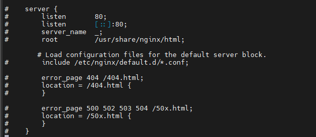

- Restart và enable nginx

```sh
systemctl restart nginx
systemctl enable nginx
```

- Cho phép Webvirtmgr khởi động cùng hệ thống

```sh
/usr/sbin/setsebool httpd_can_network_connect true
systemctl enable supervisord
```

- Setup Supervisor:

- Cấp quyền cho người dùng

```sh
chown -R nginx:nginx /var/www/webvirtmgr
```

- Mở file webvirtmgr.ini

```sh
vi /etc/supervisord.d/webvirtmgr.ini
```

- Thêm vào những dòng sau

```sh
[program:webvirtmgr]
command = /usr/bin/python /var/www/webvirtmgr/manage.py run_gunicorn -c /var/www/webvirtmgr/conf/gunicorn.conf
directory = /var/www/webvirtmgr
autostart = true
autorestart = true
logfile = /var/log/supervisor/webvirtmgr.log
log_stderr = true
user = nginx

[program:webvirtmgr-console]
command = /usr/bin/python /var/www/webvirtmgr/console/webvirtmgr-console
directory = /var/www/webvirtmgr
autostart = true
autorestart = true
stdout_logfile = /var/log/supervisor/webvirtmgr-console.log
redirect-stderr = true
user = nginx
```

- Restart supervisord

```sh
systemctl restart supervisord
```

- Truy cập vào địa chỉ của server bằng browser:


#### 4. Cài đặt trên host KVM

- Cài gói ```libvirt```

```sh
yum -y install libvirt
```

- Thực hiện các lệnh sau

```sh
sed -i 's/#listen_tls = 0/listen_tls = 0/g' /etc/libvirt/libvirtd.conf 
sed -i 's/#listen_tcp = 1/listen_tcp = 1/g' /etc/libvirt/libvirtd.conf
sed -i 's/#tcp_port = "16509"/tcp_port = "16509"/g' /etc/libvirt/libvirtd.conf
sed -i 's/#listen_addr = "192.168.0.1"/listen_addr = "0.0.0.0"/g' /etc/libvirt/libvirtd.conf
```

- Lưu ý nếu ta không muốn xác thực trong quá trình kết nối qemu + tcp thì dùng lệnh sau (chỉ nên dùng trong môi trường lab)

```sh
sed -i 's/#auth_tcp = "sasl"/auth_tcp = "none"/g' /etc/libvirt/libvirtd.conf
```

- Còn nếu bạn muốn xác thực để tiến hành kết qemu + tcp ta thực hiện câu lệnh sau

```sh
sed -i 's/#auth_tcp = "sasl"/auth_tcp = "sasl"/g' /etc/libvirt/libvirtd.conf
```

- Tiếp tục thực hiện các lệnh sau

```sh
sed -i 's/#user = "root"/user = "root"/g' /etc/libvirt/qemu.conf 
sed -i 's/#group = "root"/group = "root"/g' /etc/libvirt/qemu.conf
sed -i 's/#LIBVIRTD_ARGS="--listen"/LIBVIRTD_ARGS="--listen"/g' /etc/sysconfig/libvirtd
```

- Restart lại libvirtd

```sh
systemctl restart libvirtd
```

- Nếu bên trên lựa chọn xác thực để kết nối qemu + tcp thì cần thực hiện thêm 1 số lệnh

```sh
yum install -y cyrus-sasl-md5
sed -i 's/mech_list: gssapi/#mech_list: gssapi/g' /etc/sasl2/libvirt.conf
sed -i 's/#sasldb_path: /etc/libvirt/passwd.db/#sasldb_path: /etc/libvirt/passwd.db/g' /etc/sasl2/libvirt.conf
```

- Restart lại libvirtd

```sh
systemctl restart libvirtd
```

- Sau đó ta cần tạo user để xác thực cho kết nối qemu + tcp

```sh
saslpasswd2 -a libvirt username
```

- Show các user

```sh
sasldblistusers2 -f /etc/libvirt/passwd.db
```

- Để xóa user

```sh
saslpasswd2 -a libvirt -d username
```

#### 5. Sử dụng Webvirt

- Truy cập vào địa chỉ của server cài webvirt để vào trang quản trị

- Để kết nối đến máy KVM, click ```Add connection```

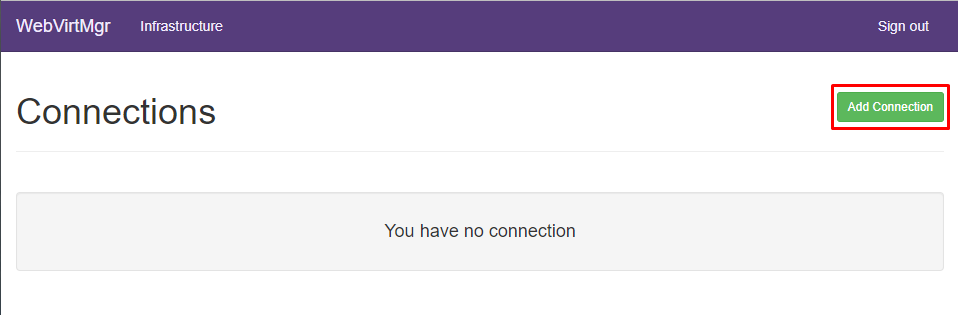

- Nhập thông tin và chọn ```Add```

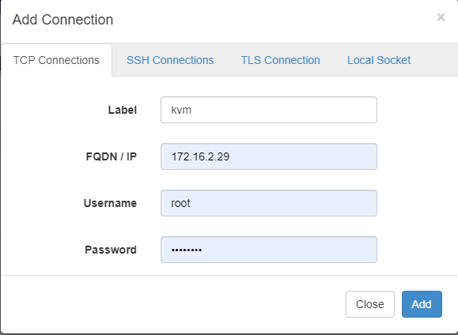

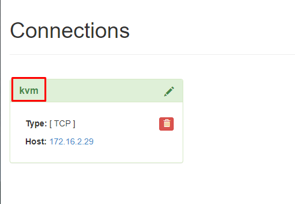

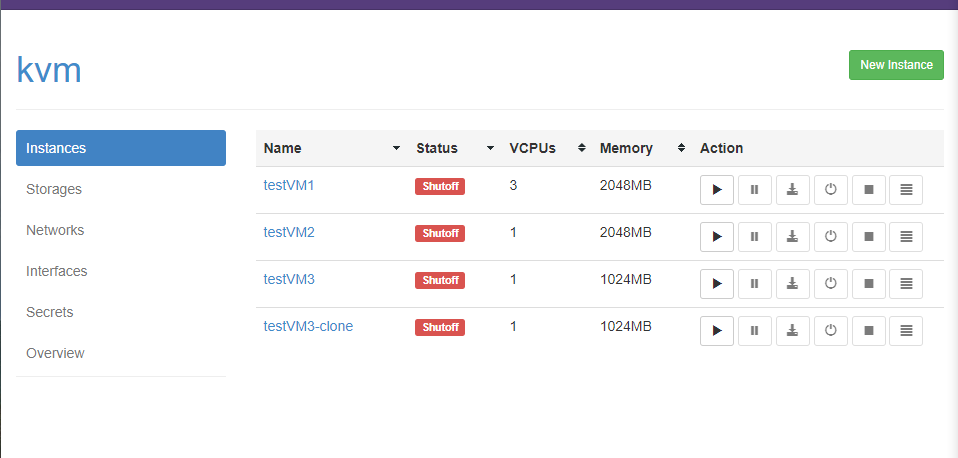

#### 6. Tạo máy ảo bằng giao diện Webvirt

- Tại tab ```Storage```, chọn ổ cứng muốn đặt VM


- Chọn ```Add image``` và tạo image cho VM

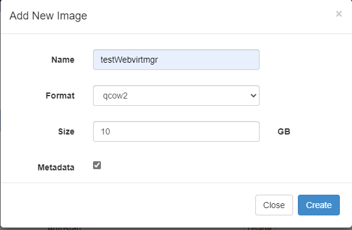

- Tạo instance (máy ảo) mới

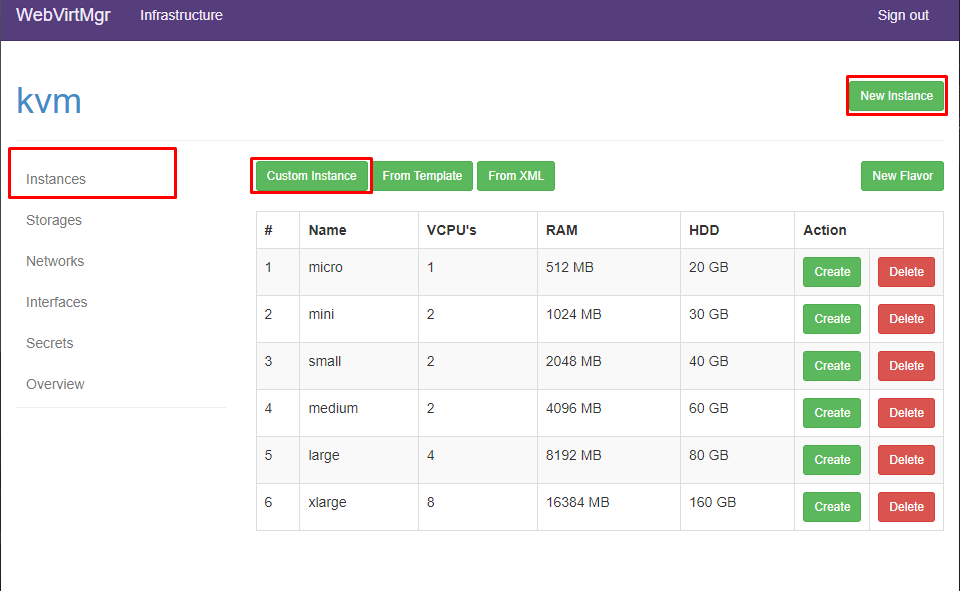

- Nhập thông số cho máy ảo

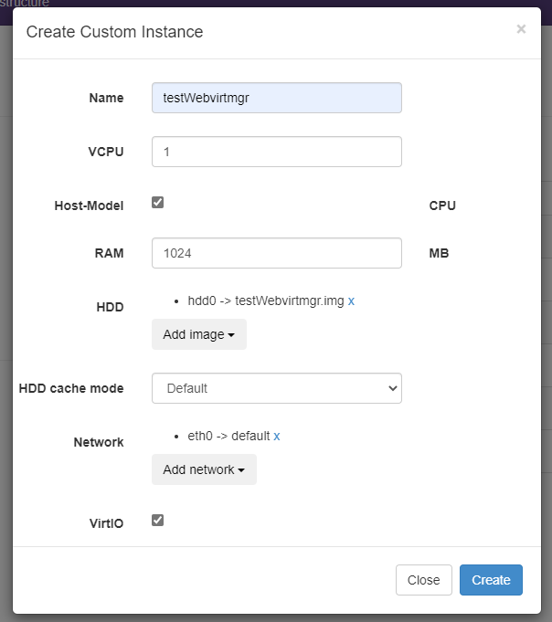

- Kết nối đĩa cài hđh với VM

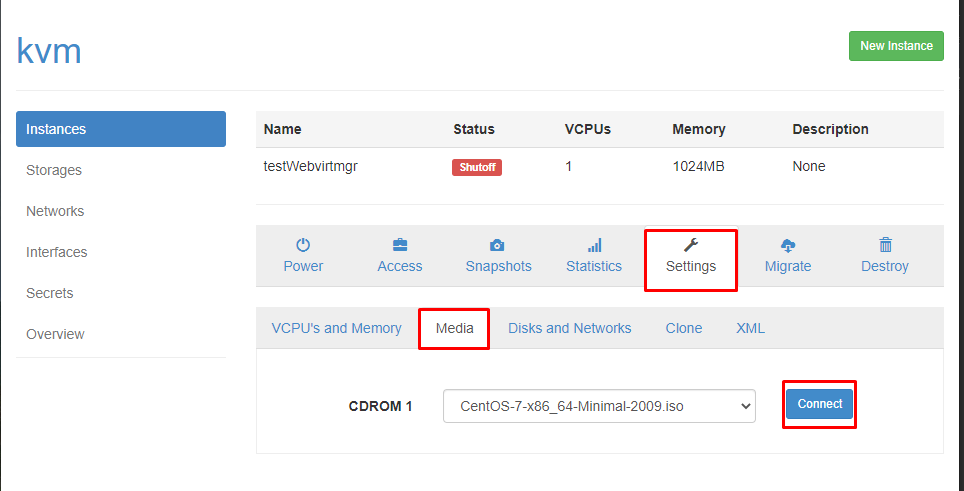

- Khởi động VM

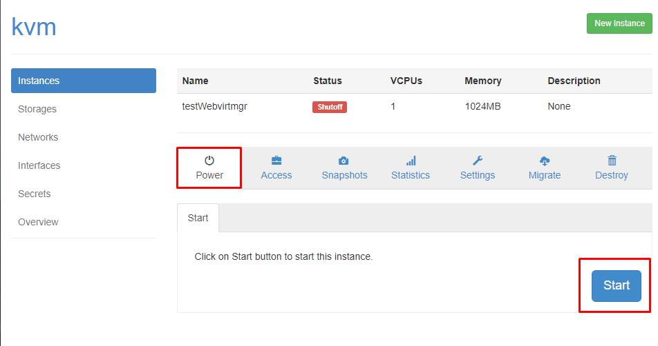

- Console vào VM để cài hđh

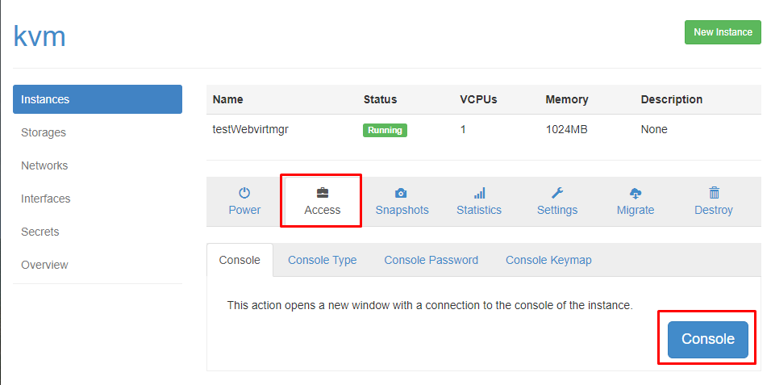
