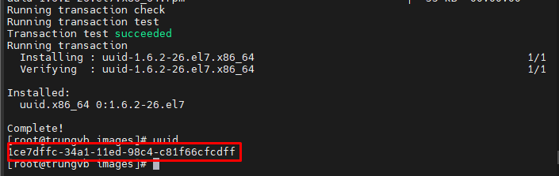
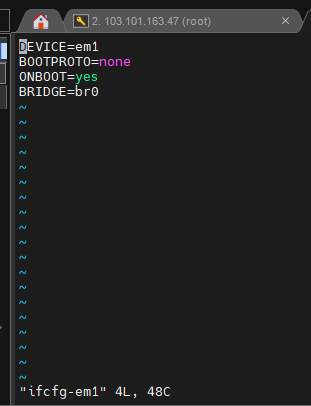
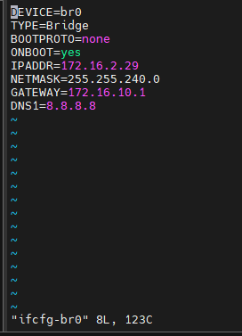
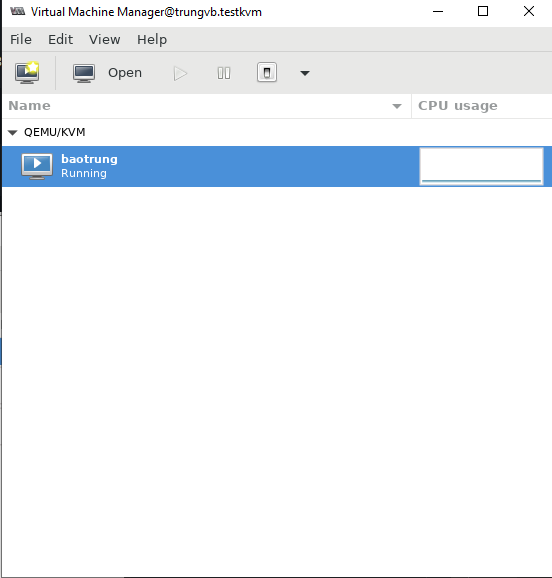
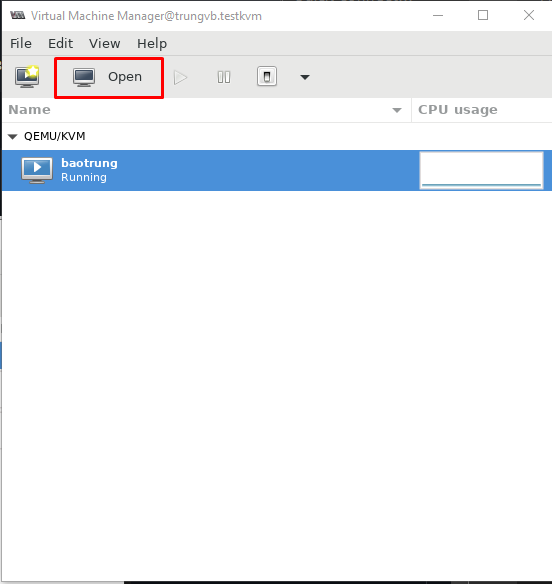
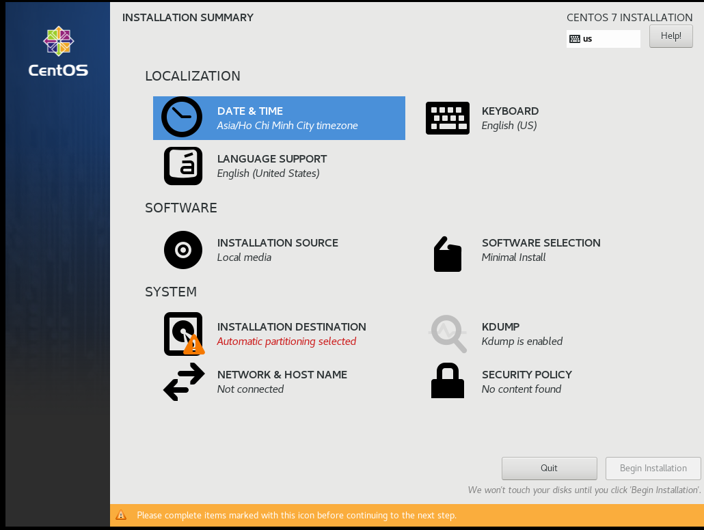
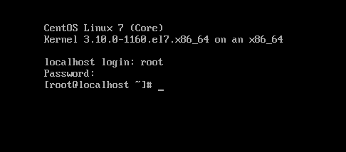

# Tổng quan về file XML

VM trong KVM có 2 thành phần chính là VM's definition được lưu dưới dạng file XML mặc định ở thư mục /etc/libvirt/qemu và VM's storage lưu dưới dạng file image

File doamin XML chứa những thông tin về thành phần của máy ảo (số CPU, RAM, các thiết lập I/O devices,...)

Libvirt dùng những thông tin này để tiến hành khởi chạy tiến trình QEMU-KVM tạo máy ảo

KVM cũng có các file XML khác để lưu các thông tin liên quan tới network, storage,...

Mục đích chính của XML là đơn giản hóa việc chia sẻ dữ liệu giữa các hệ thống khác nhau, đặc biệt là các hệ thống được kết nối với Internet

## Các thành phần của file XML

File XML tổ chức theo khối lệnh, có nhiều khối lệnh cùng trong 1 khối lệnh tổng quan, cú pháp giống HTML có thẻ đóng, thẻ mở 

- Thẻ quan trọng không thể thiếu trong file domain XML là ```<domain>```
    - Tham số ```type``` cho biết hypervisor nào đang được VM sử dụng
    - Các thẻ bên trong có ý nghĩa như sau:
        - ```<name>```: thông tin về tên của VM
        - ```<uuid>```: mã nhận dạng quốc tế duy nhất cho máy ảo. Format theo RFC 4122. Nếu thiếu trường ```uuid``` khi khởi tạo, mã này sẽ được tự động generate
    - Một số thẻ khác:
        - ```<title>```: tiêu đề của máy ảo
        - ```<description>```: đoạn mô tả của máy ảo
        - ```<metadata>```: chứa những thông tin về file XML
        - ```<memory>```: dung lượng RAM của máy ảo được cấp khi khởi tạo máy
        - ```<unit>```: đơn vị, mặc định là KiB
        - ```<currentMemory>```: dung lượng RAM đang được sử dụng tại thời điểm trích xuất file XML
        - ```<maxMemory>```: dung lượng RAM tối đa có thể sử dụng
        - ```<vcpu>```: tổng số vcpu máy ảo được cấp khi khởi tạo
    - Một vài tham số có thể có trong ```<vcpu>```:
        - ```cpuset```: danh sách các cpu vật lý mà máy ảo sử dụng
        - ```current```: chỉ định cho phép kích hoạt nhiều hơn số CPU đang sử dụng
        - ```placement```: vị trí của cpu, giá trị có thể là static hoặc dynamic
    - ```<Block OS>```: chứa các thông tin về hđh của máy ảo
        - ```arch```: hđh thuộc kiến trúc 32 hay 64 bit
        - ```machine```: thông tin về kernel của hđh
        - ```loader```: readonly có giá trị yes hoặc no cho biết image writable hay readonly, type có giá trị rom hoặc pflash chỉ ra nơi guest memory đc kết nối
        - ```kernel```: đường dẫn tới kernel image trên hđh máy chủ
        - ```initrd```: đường dẫn tới ramdisk image trên hđh máy chủ
        - ```cmdline```: xác định giao diện điều khiển thay thế
    - Hành động xảy ra đối với 1 số sự kiện của OS
        - ```<on_poweroff>```: hành động được thực hiện khi người dùng yêu cầu tắt máy
        - ```<on_reboot>```: hành động được thực hiện khi người dùng yêu cầu reset máy
        - ```<on_crash>```: hành động được thực hiện khi có sự cố
    - Những hành động được phép thực thi
        - ```destroy```: chấm dứt và giải phóng tài nguyên
        - ```restart```: chấm dứt rồi khởi động lại giữ nguyên cấu hình
        - ```preserve```: chấm dứt nhưng dữ liệu vẫn được lưu lại
        - ```rename-restart```: khởi động lại với tên mới
        - ```destroy``` và ```restart``` được hỗ trợ trong cả ```<on_poweroff>``` và ```<on_reboot>```, ```rename-restart``` dùng trong ```on_poweroff```
- ```<CPU>```: khuyến cáo đối với CPU model, các tính năng và cấu trúc liên kết của nó có thể được xác định bằng cách sử dụng tập hợp các phần tử sau

```sh
<cpu match='exact'>
   <model fallback='allow'>core2duo</model>
   <vendor>Intel</vendor>
   <topology sockets='1' cores='2' threads='1'/>
   <cache level='3' mode='emulate'/>
   <feature policy='disable' name='lahf_lm'/>
</cpu>
```

```sh
<cpu mode='host-model'>
   <model fallback='forbid'/>
   <topology sockets='1' cores='2' threads='1'/>
</cpu>
```

```sh
<cpu mode='host-passthrough'>
   <cache mode='passthrough'/>
   <feature policy='disable' name='lahf_lm'/>
</cpu>

- CPU chứa các mô tả yêu cầu của guest CPI, thuộc tính ```match``` của nó xác định mức độ liên kết của CPU ảo được cung cấp cho guest phù hợp với các yêu cầu này. 1 số giá trị mà ```match``` có thể có là: minimum, exact và strict

- ```<clock>```: thiết lập về thời gian

```sh
<clock offset='utc'>
    <timer name='rtc' tickpolicy='catchup'/>
    <timer name='pit' tickpolicy='delay'/>
    <timer name='hpet' present='no'/>
</clock>
```

- ```<offset>```: giá trị utc, localtime, timezone, variable

- ```<feature>```: là hypervisors cho phép thao tác 1 số tính năng như bật/tắt

```sh
<features>
   <pae/>
   <acpi/>
   <apic/>
   <hap/>
   <privnet/>
   <hyperv>
     <relaxed state='on'/>
     <vapic state='on'/>
     <spinlocks state='on' retries='4096'/>
     <vpindex state='on'/>
     <runtime state='on'/>
     <synic state='on'/>
     <reset state='on'/>
     <vendor_id state='on' value='KVM Hv'/>
     <frequencies state='on'/>
     <reenlightenment state='on'/>
     <tlbflush state='on'/>
   </hyperv>
   <kvm>
     <hidden state='on'/>
   </kvm>
   <pvspinlock state='on'/>
   <gic version='2'/>
   <ioapic driver='qemu'/>
   <hpt resizing='required'>
     <maxpagesize unit='MiB'>16</maxpagesize>
   </hpt>
   <vmcoreinfo state='on'/>
   <smm state='on'>
     <tseg unit='MiB'>48</tseg>
   </smm>
   <htm state='on'/>
</features>
```

- ```<block device>```: khai báo đường dẫn tới thư viện ảo hóa các device

- Block device: khai báo thông tin về thành phần của máy ảo như disk, network,...
    - ```emulator```: khai báo đường dẫn tới thư viện ảo hóa các device
    - ```device = 'disk'```: khai báo thông tin về disk của máy ảo
    - ```device='cdrom'```: thông tin về ổ đĩa CDROM

```sh
<disk type='file' device='disk'>
    <driver name='qemu' type='qcow2'/> #định dạng disk
    <source file='/var/lib/libvirt/images/centos6.9.img'/> #Đường dẫn chứa disk
    <target dev='vda' bus='virtio'/> #Tên ổ, kiểu ảo hóa
    <boot order='2'/> #Thứ tự ưu tiên boot của ổ.
    <address type='pci' domain='0x0000' bus='0x00' slot='0x07' function='0x0'/>
</disk>
```

```sh
<disk type='file' device='cdrom'>
    <driver name='qemu' type='raw'/>
    <target dev='hda' bus='ide'/>
    <readonly/>
    <boot order='1'/>
    <address type='drive' controller='0' bus='0' target='0' unit='0'/>
</disk>
```

- ```<Interface>```: khai báo thông tin về Network

## Tạo máy ảo từ file XML

- Ta phải có 1 file XML khai báo đầy đủ các thông số của máy ảo. Có thể thực hiện theo 2 cách:
    - Cách 1: khai báo file XML đúng cấu trúc
    - Cách 2: dump 1 máy ảo hiện có hoặc copy file XML máy ảo hiện có ra sử dụng cấu trúc máy ảo đó và thay thế tham số cần thiết
- Ở đây ta sử dụng cách copy file XML của 1 máy ảo hiện có và chỉnh sửa tham số cần thiết

**Bước 1:** Thay đổi những tham số cần thiết

- Những tham số cần thay đổi
- Thông tin về cấu hình

```sh
- Thông tin RAM, vCPU, disk

- Đường dẫn tới disk: /var/lib/libvirt/images/tubui.img

- Máy ảo được boot từ CDROM (/var/lib/libvirt/images/CentOS-7-x86_64-Minimal-2009.iso)

- Card mạng: sử dụng Linux Bridge br0
```

**Bước 2:** Install KVM

```sh
yum install -y qemu-kvm libvirt libvirt-python libguestfs-tools virt-install bridge-utils libvirt-clients libvirt-daemon-system virtinst virt-manager
systemctl enable libvirtd
systemctl start libvirtd
```

**Bước 3:** Tạo disk 

```sh
yum -y install qemu-img
qemu-img create -f raw /var/lib/libvirt/images/baotrung.img 15G
```

**Bước 4:** Tạo ```uuid```

- Tạo mã uuid, cài đặt gói uuid và gen đoạn mã uuid

```sh
yum install uuid -y
uuid
```



**Bước 5:** Tạo bridge và gắn interface em1 cho bridge đó

- Cấu hình lại em1 để em1 được gắn vào br0

```sh
DEVICE=em1
BOOTPROTO=none
ONBOOT=yes
BRIDGE=br0
```



- Đặt IP cho br0

```sh
DEVICE=br0
TYPE=Bridge
BOOTPROTO=none
ONBOOT=yes
IPADDR=172.16.2.29
NETMASK=255.255.240.0
GATEWAY=172.16.10.1
DNS1=8.8.8.8
```



- Restart lại network service

```sh
systemctl disable NetworkManager && systemctl stop NetworkManager
systemctl restart network.service
systemctl enable NetworkManager
```

**Bước 6:** Khởi tạo máy ảo copy file XML đã chỉnh sửa vào node KVM

```sh
<domain type='kvm'>
  <name>baotrung</name>
  <uuid>b7335e6e-34a2-11ed-975f-c81f66cfcdff</uuid>
  <memory unit='KiB'>4194304</memory>
  <currentMemory unit='KiB'>2097152</currentMemory>
  <vcpu placement='static'>4</vcpu>
  <os>
    <type arch='x86_64' machine='pc-i440fx-rhel7.0.0'>hvm</type>
    <boot dev='cdrom'/>
  </os>
  <features>
    <acpi/>
    <apic/>
  </features>
  <cpu mode='custom' match='exact' check='partial'>
    <model fallback='allow'>SandyBridge</model>
  </cpu>
  <clock offset='utc'>
    <timer name='rtc' tickpolicy='catchup'/>
    <timer name='pit' tickpolicy='delay'/>
    <timer name='hpet' present='no'/>
  </clock>
  <on_poweroff>destroy</on_poweroff>
  <on_reboot>restart</on_reboot>
  <on_crash>destroy</on_crash>
  <pm>
    <suspend-to-mem enabled='no'/>
    <suspend-to-disk enabled='no'/>
  </pm>
  <devices>
    <emulator>/usr/libexec/qemu-kvm</emulator>
    <disk type='file' device='disk'>
      <driver name='qemu' type='raw'/>
      <source file='/var/lib/libvirt/images/baotrung.img'/>
      <target dev='vda' bus='virtio'/>
      <address type='pci' domain='0x0000' bus='0x00' slot='0x07' function='0x0'/>
    </disk>
    <disk type='file' device='cdrom'>
      <driver name='qemu' type='raw'/>
	  <source file="/var/lib/libvirt/images/CentOS-7-x86_64-Minimal-2009.iso"/>
      <target dev='hda' bus='ide'/>
      <readonly/>
      <address type='drive' controller='0' bus='0' target='0' unit='0'/>
    </disk>
    <controller type='usb' index='0' model='ich9-ehci1'>
      <address type='pci' domain='0x0000' bus='0x00' slot='0x05' function='0x7'/>
    </controller>
    <controller type='usb' index='0' model='ich9-uhci1'>
      <master startport='0'/>
      <address type='pci' domain='0x0000' bus='0x00' slot='0x05' function='0x0' multifunction='on'/>
    </controller>
    <controller type='usb' index='0' model='ich9-uhci2'>
      <master startport='2'/>
      <address type='pci' domain='0x0000' bus='0x00' slot='0x05' function='0x1'/>
    </controller>
    <controller type='usb' index='0' model='ich9-uhci3'>
      <master startport='4'/>
      <address type='pci' domain='0x0000' bus='0x00' slot='0x05' function='0x2'/>
    </controller>
    <controller type='pci' index='0' model='pci-root'/>
    <controller type='ide' index='0'>
      <address type='pci' domain='0x0000' bus='0x00' slot='0x01' function='0x1'/>
    </controller>
    <controller type='virtio-serial' index='0'>
      <address type='pci' domain='0x0000' bus='0x00' slot='0x06' function='0x0'/>
    </controller>
    <interface type='bridge'>
      <mac address='c8:1f:66:cf:cd:ff'/>
      <source bridge='br0'/>
      <model type='virtio'/>
      <address type='pci' domain='0x0000' bus='0x00' slot='0x03' function='0x0'/>
    </interface>
    <serial type='pty'>
      <target type='isa-serial' port='0'>
        <model name='isa-serial'/>
      </target>
    </serial>
    <console type='pty'>
      <target type='serial' port='0'/>
    </console>
    <channel type='unix'>
      <target type='virtio' name='org.qemu.guest_agent.0'/>
      <address type='virtio-serial' controller='0' bus='0' port='1'/>
    </channel>
    <channel type='spicevmc'>
      <target type='virtio' name='com.redhat.spice.0'/>
      <address type='virtio-serial' controller='0' bus='0' port='2'/>
    </channel>
    <input type='tablet' bus='usb'>
      <address type='usb' bus='0' port='1'/>
    </input>
    <input type='mouse' bus='ps2'/>
    <input type='keyboard' bus='ps2'/>
    <graphics type='spice' autoport='yes'>
      <listen type='address'/>
      <image compression='off'/>
    </graphics>
    <sound model='ich6'>
      <address type='pci' domain='0x0000' bus='0x00' slot='0x04' function='0x0'/>
    </sound>
    <video>
      <model type='qxl' ram='65536' vram='65536' vgamem='16384' heads='1' primary='yes'/>
      <address type='pci' domain='0x0000' bus='0x00' slot='0x02' function='0x0'/>
    </video>
    <redirdev bus='usb' type='spicevmc'>
      <address type='usb' bus='0' port='2'/>
    </redirdev>
    <redirdev bus='usb' type='spicevmc'>
      <address type='usb' bus='0' port='3'/>
    </redirdev>
    <memballoon model='virtio'>
      <address type='pci' domain='0x0000' bus='0x00' slot='0x08' function='0x0'/>
    </memballoon>
  </devices>
</domain>
```

**Bước 7:** Tạo máy ảo

```sh
virsh define /var/lib/libvirt/baotrung.xml #define nhung ko start
virsh create /var/lib/libvirt/baotrung.xml #create va start
```

**Bước 8: Cài hđh cho máy ảo**

- Đối với host dùng bản Minimal, để dùng được công cụ đồ họa virt-manager thì người dùng phải cài x-window

```sh
yum install "@X Window System" xorg-x11-xauth xorg-x11-fonts-* xorg-x11-utils -y
```

- Truy cập Vir-manager 



- ```Open```



- Cài đặt OS như bình thường





*Lưu ý: để boot được vào OS thì ta phải thêm dòng ```<boot dev='hd'/>``` vào trong tag ```<os>```*

