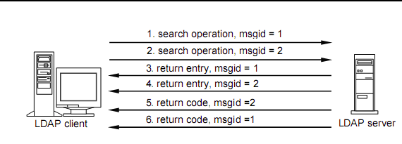
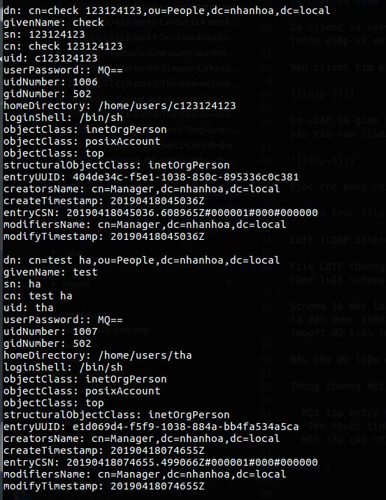
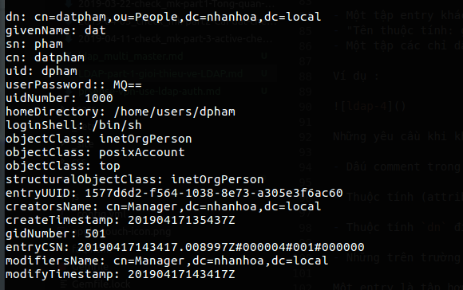
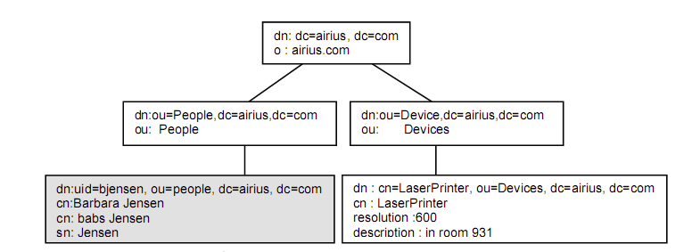
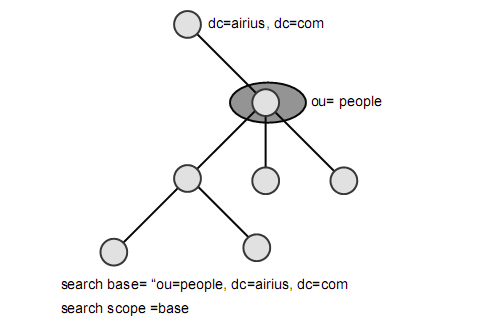
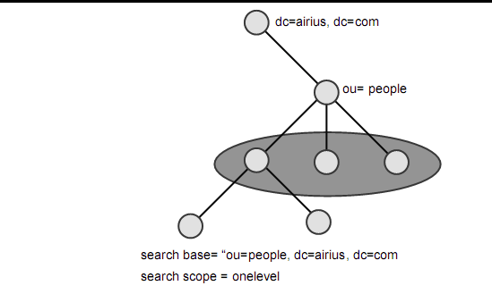
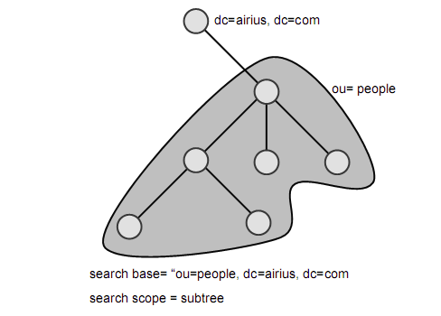

# LDAP - Lightweight Directory Access Protocol

## Lời mở đầu

Có lẽ đối với những người làm về công nghệ thì đa số ddeefud dã được nghe, tiếp xúc, hoặc được làm việc trực tiếp với hệ thống xác thực tập trung tuy nhiên các tài liệu liên quan lại quá cũ hoặc khó tìm kiếm. Trong bài viết này sẽ mô tả cái nhìn tổng quan về xác thực tập trung cho người mới bắt đầu.

## Xác thực tập trung là gì?

Xác thực tập trung có thể hiểu đơn giản là nhiều hệ thống cùng sử dụng 1 backend để xác thực, chỉ cần có account trên hệ thống xác thực thì người dùng có thể dùng account đó để đăng nhập trên tất cả hệ thống sử dụng backend xác thực này.

Vậy chúng ta sẽ dùng cái gì để tích hợp với tất cả các hệ thống, làm sao để gom tất cả account về 1 mối để quản lý? Câu trả lời đó là LDAP (Lightweight Directory Access Protocol) là 1 giao thức triển trên tiêu chuẩn X500. Đây là một chuẩn cho dịch vụ thư mục chạy trên nền tảng OSI.

## LDAP là gì?

LDAP - Lightweight Directory Access Protocol: là 1 giao thức phát triển trên chuẩn X500

Là một giao thức dạng client - server sử dụng để truy nhập một dịch vụ thư mục

Là một giao thức cho phép người dùng xác định cấu trúc và đặc điểm của thông tin trong thư mục

Các ứng dụng để triển khai LDAP: OpenLDAP, OpenDS, Active Directory,...

## Phương thức hoạt động

LDAP hoạt động theo mô hình client-server, client gửi yêu cầu đến LDAP server, server này nhận yêu cầu và thực hiện tìm kiếm cũng như trả lại kết quả cho client

Trình tự khi có kết nối LDAP:

1. Client mở 1 kết nối TCP đến LDAP server và thực hiện thao tác bind. Thao tác này gồm tên của directory entry và thông tin xác thực sẽ được sử dụng trong quá trình xác thực, thông tin xác thực thông thường sẽ là Password tuy nhiên cũng có thể là ID của người dùng

2. Sau đó LDAP server sẽ nhận thao tác bind này của client để xử lý và trả lại kết quả của thao tác bind

3. Nếu thao tác bind thành công client gửi một yêu cầu tìm kiếm đến LDAP server

4. Server thực hiện xử lý và trả về kết quả cho client

5. Client gửi yêu cầu unbind

6. Server đóng kết nối

## LDAP là giao thức hướng thông điệp

Do client và server giao tiếp thông qua các thông điệp. Client tạo 1 thông điệp LDAP message chứa yêu cầu và gửi nó đến cho server. Server nhận được thông điệp và xử lý yêu cầu của client sau đó gửi trả cho client cũng bằng 1 thông điệp LDAP.

Nếu client tìm kiếm thư mục và nhiều kết quả được tìm thấy thì các kết quả này được gửi đến client bằng nhiều thông điệp. Chi tiết như bên dưới



Do LDAP là giao thức hướng thông điệp cho nên client được phép phát ra nhiều thông điệp yêu cầu cùng 1 lúc. Trong LDAP message ID dùng để phân biệt các yêu cầu của client và kết quả trả về server.

Việc cho phép nhiều thông điệp cùng xử lý đồng thời làm cho LDAP linh động hơn các giao thức khác.

## Cấu trúc file LDIF

LDIF (LDAP Interchange Format) được định nghĩa trong RFC 2849, là một chuẩn định dạng file text lưu trữ thông tin cấu hình LDAP và nội dung thư mục.

File LDIF thường được sử dụng để import dữ liệu mới vào trong directory của chúng ta hoặc thay đổi dữ liệu đã có. Dữ liệu có trong file LDIF cần phải tuân theo luật schema của LDAP directory.

Schema là một dữ liệu đã được định nghĩa từ trước trong directory của chúng ta. Mọi thành phần được thêm vào hoặc thay đổi trong directory của chúng ta hoặc thay đổi dữ liệu đã có. Dữ liệu có trong file LDIF cần phải tuân theo luật schema của LDAP directory.

Schema là một loại dữ liệu đã được định nghĩa từ trước trong directory của chúng ta. Mọi thành phần được thêm vào hoặc thay đổi trong directory đều được kiểm tra lại trong schema để đảm bảo sự chính xác. Lỗi vi phạm schema sẽ xuất hiện nếu dữ liệu không đúng với quy luật đã có. Đây là giải pháp import dữ liệu lớn vào LDAP.

Nếu như dữ liệu được lưu trong excel khoảng vài chục nghìn mẩu tin chúng ta có thể viết tool chuyển lại định dạng rồi import vào LDAP.

Thông thường một file LDIF sẽ có khuôn dạng như sau:

- Một tập entry khác nhau được phân cách bởi 1 dòng trắng
- Format: <tên_thuộc_tính>:<giá_trị>
- Một tập các chỉ dẫn cú pháp để làm sao xử lý được thông tin

VD:



Những quy định khi báo nội dung file LDIF:

- Dấu comment trong file LDIF là "#"
- Thuộc tính (attribute) được đặt bên trái dấu ":" và giá trị của thuộc tính được biểu diễn ở bên phải
- Thuộc tính ```dn``` định nghĩa duy nhất một DN xác định trong DN đó
- Những tên trường mà đằng sau có dấu "::" thì giá trị của nó được mã hóa theo chuẩn BASE64

Một entry là tập hợp của các thuộc tính, từng thuộc tính sẽ mô tả một nét đặc trưng tiêu biểu của đối tượng. VD:



- ```dn```: Distringuished Name - là tên của entry thư mục, tất cả được viết trên 1 dòng
- ```givenName```: Tên của người sở hữu account
- ```sn```: Surname
- ```cn```: Common Name
- ```uid```: id người dùng
- ```userPassword```: Mật khẩu người dùng
- Và một số thuộc tính khác của người dùng

## Mô hình đặt tên LDAP (LDAP Naming Model)

Mô hình LDAP Naming định nghĩa cách để chúng ta có thể sắp xếp và tham chiếu đến dữ liệu của mình, hay có thể nói mô hình này mô tả cách sắp xếp các entry vào 1 cấu trúc có logic và chỉ ra cách để có thể tham chiếu đến bất kỳ một entry thư mục nào nằm trong cấu trúc đó.

Mô hình LDAP Naming cho phép đặt dữ liệu vào thư mục theo cách mà chúng ta có thể dễ dàng quản lý nhất



Giống như đường dẫn của hệ thống tập tin, tên của 1 entry LDAP được hình thành bằng cách nối tất cả các tên của từng entry cấp trên (cha) cho đến cấp cao nhất root

## Mô hình chức năng LDAP (LDAP Function model)

Đây là mô hình mô tả các thao tác cho phép chúng ta có thể thao tác trên thư mục

Mô hình LDAP Functional chứa một tập các thao tác chia thành 3 nhóm:

- Thao tác thẩm tra: cho phép chúng ta có thể search trên thư mục và nhận dữ liệu từ thư mục
- Thao tác cập nhật: thêm, xóa, đổi tên và thay đổi các entry thư mục
- Thao tác xác thực và điều khiển: cho phép client xác định mình đến chỗ thư mục và điều khiển các hoạt động của phiên kết nối

## Thao tác thẩm tra (Tìm kiếm)

Cho phép client có thể tìm và nhận lại thông tin từ thư mục

Thao tác tìm kiếm (LDAP search operation) yêu cầu 8 tham số:

- Tham số 1: là đối tượng cơ sở mà các thao tác tìm kiếm thực hiện trên đó, tham số này là DN chỉ đến đỉnh của cây mà chúng ta muốn tìm
- Tham số thứ 2: là phạm vi tìm kiếm, chúng ta có 3 phạm vi tìm kiếm là base, onelevel và subtree

VD:








- Tham số thứ 3: derefAliases, cho server biết rằng liệu bí danh aliases có bị bỏ qua hay không khi thực hiện tìm kiếm, có 4 giá trị mà derefAliases có thể nhận được: neverDerefAliases, derefInsearching, derefFindingBaseObject, derfAlways

- Tham số thứ 4: cho server biết có tối đa bao nhiêu entry kết quả được trả về

- Tham số thứ 5: quy định thời gian tối đa cho việc thực hiện tìm kiếm

- Tham số thứ 6: attrOnly - là tham số kiểu bool, nếu được thiết lập là true, thì server chỉ gửi các kiểu thuộc tính của entry cho client, nhưng server không gửi giá trị của các thuộc tính đi, điều này là cần thiết nếu như client chỉ quan tâm đến các kiểu thuộc tính chứa bên trong

- Tham số thứ 7: là bộ lọc tìm kiếm (search filter), đây là một biểu thức mô tả các loại entry sẽ được giữ lại

- Tham số thứ 8: danh sách các thuộc tính được giữ lại với mỗi entry

## Thao tác cập nhật

Chúng ta có 4 thao tác cập nhật là add, delete, rename (modify DN), và modify

Add: tạo ra một entry mới với tên DN và danh sách các thuộc tính truyền vào, khi thực hiện add một entry mới vào thư mục phải thỏa mãn các điều kiện sau:

- Entry là nút cha của entry mới phải tồn tại
- Chưa tồn tại một entry nào có cùng tên DN với entry mới trên thư mục

Delete: thao tác xóa chỉ cần truyền vào tên của entry cần xóa và thực hiện thao tác nếu:

- Entry tồn tại
- Entry bị xóa không có entry con bên trong

Rename: sử dụng để đổi tên hay di chuyển các entry trong thư mục

Update: cập nhật với tham số DN và tập hợp các thay đổi được áp dụng nếu:

- Entry với DN phải tồn tại
- Tất cả các thuộc tính thay đổi đều thành công
- Các thao tác cập nhật phải là các thao tác được phép

## Thao tác xác thực và điều khiển

Thao tác xác thực gồm: thao tác bind và unbind:

- Bind: cho phép client tự xác định được mình với thư mục, thao tác này cung cấp sự xác nhận và xác thực
- Unbind: cho phép client hủy bỏ phân đoạn làm việc hiện hành

Thao tác điều khiển:

- Abandon: cho phép client chi ra các thao tác mà kết quả client không còn quan tâm đến nữa

## Một số phương thức để xác thực người dùng trong LDAP

Xác thực người dùng chưa xác định:

- Xác thực người dùng chưa xác định là 1 xử lý ràng buộc đăng nhập vào thư mục với một tên đăng nhập và mật khẩu là rỗng. Cách đăng nhập này rất thông dụng và được thường xuyên sử dụng đối với ứng dụng client

Xác thực người dùng đơn giản:

- Đối với xác thực người dùng đơn giản, tên đăng nhập tỏng DN được gửi kèm cùng với một mật khẩu dưới dạng clear text tới máy chủ LDAP

Xác thực đơn giản thông qua SSL/TLS:

- Sẽ an toàn hơn phương pháp **Xác thực đơn giản** ở bên trên, lúc này tên đăng nhập trong DN và mật khẩu sẽ truyền thông trên 1 lớp truyền tải được mã hóa

