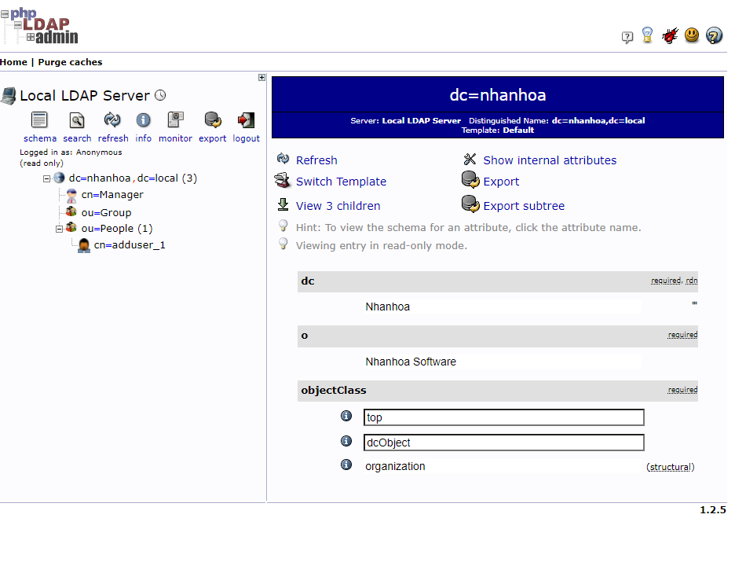

# Cài đặt phpLDAPadmin

Đối với hệ thống OpenLDAP thì việc quản lý, update tài khoản người dùng phải sử dụng lệnh nên khá bất tiện. Do đó bài này sẽ giới thiệu đến mọi người một công cụ giúp chúng ta có thể quản lý OpenLDAP dễ dàng hơn.

**phpLDAPadmin** là một công cụ được code bằng ngôn ngữ PHP và chạy trên nền web, rất phù hợp với mục đích quản trị OpenLDAP.

## Trường hợp 1: Cài đặt trực tiếp trên node cài OpenLDAP

1. Cài đặt httpd

```sh
yum -y install httpd
```

Mở file ```/etc/httpd/conf/httpd.conf``` và sửa đổi các thông tin sau:

```sh
# Tại dòng 151 sửa thành
AllowOverride All

# Tại dòng 164, sửa thành
DirectoryIndex index.html index.cgi index.php

# Thêm vào cuối file những cấu hình sau
ServerTokens Prod
KeepAlive On
```

Khởi động httpd

```sh
systemctl enable httpd --now
```

2. Cài đặt PHP

```sh
yum -y install php php-mbstring php-pear
```

Mở file ```/etc/php.ini``` và sửa lại timezone:

```sh
date.timezone = "Asia/Ho_Chi_Minh"
```

Tải và cài đặt epel 7:

```sh
yum install wget -y
wget http://dl.fedoraproject.org/pub/epel/epel-release-latest-7.noarch.rpm
rpm -ivh epel-release-latest-7.noarch.rpm
```

Cài đặt phpLDAPadmin

```sh
yum --enablerepo=epel -y install phpldapadmin
```

Mở file ```/etc/phpldapadmin/config.php``` và sửa lại thông tin như sau:

```sh
# Tại dòng 398
$servers->setValue('login','attr','dn');
// $servers->setValue('login','attr','uid')
```

Cho phép truy cập vào phpLDAPadmin

```sh
cat > /etc/httpd/conf.d/phpldapadmin.conf << EOF
Alias /phpldapadmin /usr/share/phpldapadmin/htdocs
Alias /ldapadmin /usr/share/phpldapadmin/htdocs

<Directory /usr/share/phpldapadmin/htdocs>
  <IfModule mod_authz_core.c>
    # Apache 2.4
    Require all granted
  </IfModule>
  <IfModule !mod_authz_core.c>
    # Apache 2.2
    Order Deny,Allow
    Deny from all
    Allow from 127.0.0.1
    Allow from ::1
  </IfModule>
</Directory>
EOF
```

Khởi động lại httpd:

```sh
systemctl restart httpd
```

Truy cập theo đường dẫn:

```sh
IP_PHP_LDAP_ADMIN/phpldapadmin
```

Kết quả như sau:



## Trường hợp 2: phpLDAPadmin nằm trên node không cài OpenLDAP

Các bước cài đặt tương tự như trên, chúng ta cần phải thêm đoạn cấu hình để bind đến OpenLDAP server thì mới có thể đăng nhập được. Để thực hiện chúng ta dùng trình soạn thảo ```vi``` mở file ```/usr/share/phpldapadmin/config/config.php```

```sh
vi /usr/share/phpldapadmin/config/config.php
```

Sau đó tại dòng ```584``` thêm đoạn sau

```sh
$servers->setValue('server','host','10.10.10.185');
```

Trong đó ```10.10.10.185``` là IP của máy chủ OpenLDAP

## Trường hợp 3: Dùng một máy chủ phpLDAPadmin quản lý nhiều backend OpenLDAP

Giả định rằng chúng ta có khoảng 3 máy chủ chạy OpenLDAP để xác thực cho các hệ thống khác nhau và 3 máy chủ này không hề liên quan gì đến nhau, trên lý thuyết chúng ta phải cài 3 máy chủ chạy OpenLDAP để quản lý 3 máy OpenLDAP kia, tuy nhiên chúng ta vẫn có thể cấu hình phpLDAPadmin bind đến nhiều máy chủ chỉ định khác nhau.

Chúng ta vẫn cài phpLDAPadmin như ở trường hợp 1, sau đó mở file ```/usr/share/phpldapadmin``` và thêm những cấu hình sau:

```sh
# OpenLDAP1
$servers->setValue('server','host','10.10.10.185');

# OpenLDAP2
$servers->newServer('ldap_pla');
$servers->setValue('server','name','LDAP Server 2');
$servers->setValue('server','host','10.10.10.184');
$servers->setValue('server','port',389);
$servers->setValue('server','base',array(''));
$servers->setValue('login','auth_type','cookie');
$servers->setValue('login','bind_id','');
$servers->setValue('login','bind_pass','');
$servers->setValue('server','tls',false);

# OpenLDAP3
$servers->newServer('ldap_pla');
$servers->setValue('server','name','LDAP Server 3');
$servers->setValue('server','host','10.10.10.183');
$servers->setValue('server','port',389);
$servers->setValue('server','base',array(''));
$servers->setValue('login','auth_type','cookie');
$servers->setValue('login','bind_id','');
$servers->setValue('login','bind_pass','');
$servers->setValue('server','tls',false);
```

Nếu có thêm những server khác thì thêm đoạn cấu hình giống ```OpenLDAP2``` xuống dưới sau đó lưu lại.

Kiểm tra trên giao diện web, bây giờ chúng ta có thể chọn máy chủ quản trị trước khi đăng nhập.