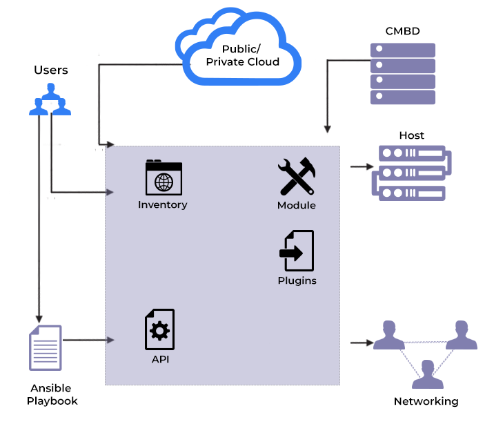

# Ansible in a nutshell

## Giới thiệu về Ansible

Ansible là 1 công cụ phần mềm cung cấp khả năng tự động hóa cực kỳ hữu dụng cho nhiều nền tảng hệ thống khác nhau. Nó được thiết kế cho những chuyên viên IT, những người sử dụng để deploy app, cập nhật hệ thống hay máy chủ, cung cấp giải pháp cloud, quản lý thiết lập, hay kể cả những dịch vụ nội bộ, hầu hết những gì 1 system admin làm hàng ngày, hàng tuần về cơ bản đều được hỗ trợ. Ansible cũng không phụ thuộc vào 1 phần mềm dạng agent nào nên sẽ không cần thêm 1 hệ thống bảo mật nào nữa, do đó việc cài đặt cũng dễ dàng hơn.

Vì Ansible là công cụ tự động hóa, nó cần chỉ dẫn để thực hiện từng công việc. Với tất cả mọi thứ đều được viết vào 1 form script đơn giản, nó giúp cho việc vận hành không gặp nhiều khó khăn. Ansible đóng góp 1 bước tiến mới vào công cuộc biến "hệ thống thành code" (infrastructure as code) trong IT: với ý tưởng chủ đạo là vận hành và duy trì hệ thống cũng chỉ như deploy phần mềm.

Với sự dẫn đầu về tự động hóa của Ansible, nó không chỉ hữu ích với system admin hay DevOps mà còn có thể sử dụng cho cả những người dùng bình thường. Ansible cho phép bạn thiết lập không chỉ với 1 máy tính mà là với toàn bộ mạng lưới máy tính cùng lúc, và sử dụng nó khi chẳng cần hiểu về ngôn ngữ lập trình. Chỉ dẫn được viết cho Ansible dưới dạng "human-readable", do đó bất kể bạn là người mới hay là 1 chuyên gia, tệp cấu hình của Ansible vẫn rất dễ hiểu.



## Cách thức hoạt động

Trong Ansible, có 2 loại hệ thống: **Node điều khiển** và **Node quản lý**. Node điều khiển là máy tính mà chạy Ansible, bắt buộc phải có ít nhất 1 node điều khiển, và cũng nên có 1 node điều khiển backup nữa. 1 node quản lý là bất kỳ thiết bị nào được quản lý bởi node điều khuyển.

Ansible hoạt động bằng cách kết nối đến các node (các client, server hay bất kể thứ gì ta đang thiết lập) trong 1 mạng, và gửi 1 chương trình được gọi là **Ansible module** đến node đó. Ansible thực thi module này thông qua SSH và loại bỏ nó sau khi hoàn tất. Do đó, node điều khiển của Ansible cần phải có quyền truy cập vào node quản lý. Thông thường, chúng ta sẽ sử dụng SSH key để giải quyết vấn đề này.

## Ansible làm những gì

Thuật ngữ *Ansible module* nghe có vẻ phức tạp, nhưng hầu hết đều được xử lý bởi Ansible chứ không phải người dùng. 1 Ansible module được viết để trở thành 1 mô hình về trạng thái của hệ thống mong muốn, có nghĩa là mỗi module sẽ chỉ định điều gì được gán **true** ở node quản lý. Ví dụ, nếu 1 system admin quyết định rằng tất cả hệ thống trong tổ chức nên có Libre Office phiên bản X.Z, sau đó tùy thuộc vào packaging module của Ansible nó sẽ xác định xem mỗi node đã được cài LibreOffice phiên bản X.Z hay chưa. Sau đó, Ansible sẽ xác định OS và chạy những lịch trình cần thiết để update những node chưa có LibreOffice bản X.Z lên đúng phiên bản này. Nhờ vậy mà quá trình cài đặt có thể diễn ra mọi thời điểm, kể cả ban ngày ban đêm mà không tốn quá nhiều công sức của người quản trị.

Bảo trì cơ sở hạ tầng cần phải làm nhiều thứ hơn là chỉ có kiểm tra phiên bản của phần mềm. Khi nói về Ansible, thực ra là ta đang nói về việc sử dụng những Ansible module, vì chúng là thành phần mà sẽ thực hiện công việc được chỉ định. Khi cần tự động hóa điều gì đó trên nhiều máy tính khác nhau, hãy tìm kiếm Ansible module có thể thực hiện công việc đó cho bạn, sau đó cài đặt Ansible để thiết lập và sử dụng module này. Nếu bạn là 1 lập trình viên, bạn cũng có thể viết module tùy chỉnh của mình để thực hiện các công việc đặc thù.

## Ansible playbooks

Trong khi module cung cấp cách thức thực thi 1 công việc, thì cách mà bạn sử dụng chúng lại thông qua 1 thứ gói là **Ansible playbook**. 1 playbook là 1 tệp cấu hình được viết bằng **YAML**, nó cung cấp chỉ dẫn những việc phải làm để đưa node quản lý đến đúng trạng thái ta mong muốn. Playbook đơn giản, dễ đọc, mang tính cá nhân hóa cao. Playbook cũng có thể chạy trên hệ thống ở bất kỳ thời điểm mà không gây ra tác hại tiêu cực nào. Tức là nếu 1 hệ thống đã ở trạng thái mong muốn khi playbook chạy thì hệ thống đó vẫn sẽ được thiết lập sau đó.

1 playbook có thể rất đơn giản, ví dụ như cái này sẽ cài đặt (với tư cách là privileged user) Apache webserver trên bất kỳ node nào trong nhóm IT webserver:

```sh
- name: Apache server installed
  hosts: webserver
  become: yes
```

Nhưng playbook cũng có thể phức tạp với những điều kiện hay biến/tham số. Mặc dù vậy, vì hầu hết công việc thực tế được hoàn thành bởi Ansible module, playbook nhờ đó ngắn gọn, dễ đọc, và minh bạch cho dù chúng có thể phải điều phối toàn bộ mạng lưới các node quản lý

## Sử dụng và vận hành Ansible

Bạn có thể tìm hiểu và sử dụng Ansible ở nhà hay trong công việc. Nếu chưa biết về YAML, đừng ngần ngại bỏ thời gian ra đọc về nó. Nếu bạn muốn bắt đầu, bạn có thể cài đặt với 1 vài máy tính trong mạng gia đình.

Điều quan trọng là, hãy thử nhiều module khác nhau để biết được nhu cầu của mình phù hợp với cái nào nhất. Chúng có thể là cánh cổng để khiến các node được thiết kế đúng với yêu cầu của cơ sở hạ tầng và Ansible là công cụ giúp chúng thực hiện.