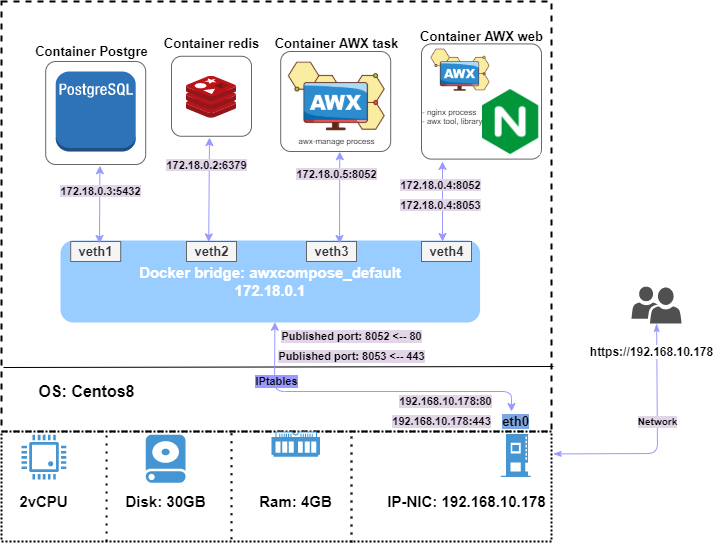
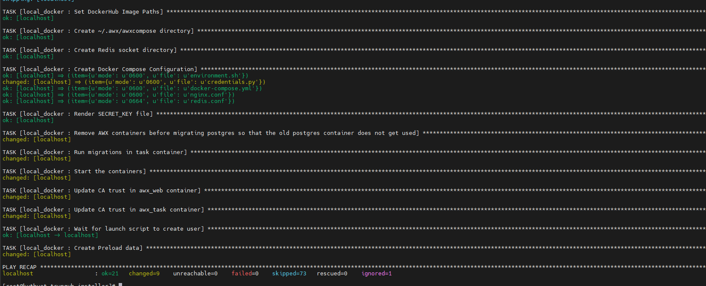
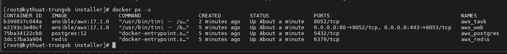
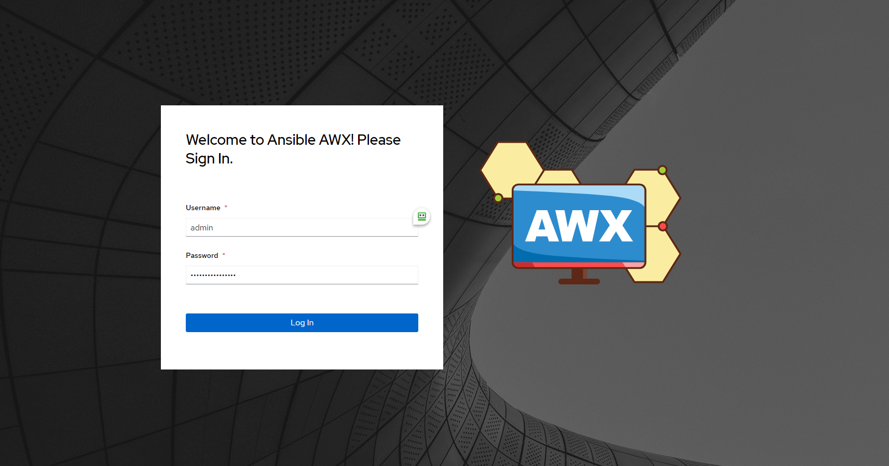
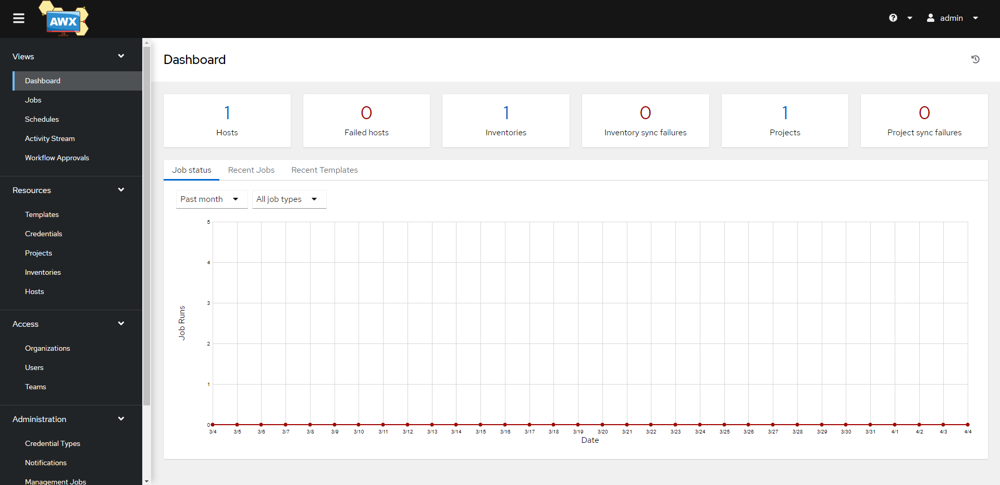

# AWX

Hiện tại Ansible đang là một công cụ quản lý cấu hình, triển khai tự động vô cùng phổ biến. Nhưng việc thao tác với Ansible hầu hết sử dụng trên CLI, việc này khiến cho người dùng phải biết cách sử dụng Linux, biết cách quản lý sắp xếp các playbook, roles trong các thư mục của người viết kịch bản Ansible-playbook trước đó.

Hoặc khi một công ty quyết định sẽ vận hành hệ thống bằng Ansible (chạy định kỳ backup, khởi tạo user tự động, cleanup hệ thống) thì làm sao để người quản tị vận hành hệ thống dễ dàng thao tác với Ansible mà không cần phải truy xuất vào máy chủ để chạy lệnh?

Do đó, AWX ra đời để giải quyết các vấn đề trên.

## I. Tổng quan về AWX

AWX là một phần mềm cung cấp giao diện web cho người dùng, REST API và các công cụ thực thi dựa trên Ansible. Đây là một upstream project cho phần mềm Ansible Tower của RedHat

**Lợi ích khi sử dụng AWX:**
- Giao diện dễ sử dụng
- Quản lý phân quyền
- Lưu lại log khi thực thi
- Lập lịch thực thi
- Quản lý Inventory

**Các thành phần trong AWX:**
- AWX Engine: vai trò Ansible engine thực thi các thành phần trong Ansible
- Nginx: vai trò webserver cung cấp giao diện web cho người dùng
- PostgreSQL: vai trò DB Server lưu trữ dữ liệu khởi tạo, dữ liệu log sinh ra trong quá trình Ansible thực thi
- Redis: vai trò cache server

## II. Cài đặt AWX

Hiện tại AWX đang được cộng đồng đóng góp rất nhiều nên có sự khác biệt về tính năng và giao diện giữa các phiên bản. Các phương thức triển khai AWX container cũng ngày càng được mở rộng phát triển, hiện có như Openshift, K8s, Docker-compose.

Nhưng ở 2 phiên bản 18.x.x và 19.x.x đang chỉ hỗ trợ triển khai bằng minikube.

Ở bài hướng dẫn này mình sẽ sử dụng AWX phiên bản 17.1.0 bằng Docker-compose để mọi người làm quen với AWX trước khi đi đến những bài toán sizing phức tạp hơn.

### 1. Mô hình hệ thống

Vì ta sẽ thực hiện cài đặt AWX dựa trên các Container được build sẵn, các file Docker compose có sẵn trên repository của AWX nên mình sẽ miêu tả hệ thống qua hình vẽ này:



Lưu ý trong bài lab này mình sẽ sử dụng OS là CentOS 7.

### 2. Hướng dẫn cài đặt

Cài đặt epel repo và update các package

```sh
yum -y install epel-release
yum -y update
```

Cài đặt các gói cần thiết

```sh
yum install git wget vim python3-pip
```

Cấu hình SELinux và tắt Firewall

```sh
sed -i 's/SELINUX=enforcing/SELINUX=disabled/g' /etc/sysconfig/selinux
sed -i 's/SELINUX=enforcing/SELINUX=disabled/g' /etc/selinux/config
systemctl disable --now firewalld
```

Thiết lập hostname cho máy chủ (optional)

```sh
hostnamectl set-hostname awx-server
```

Khởi động lại hệ thống

```sh
init 6
```

Cài đặt Ansible

```sh
yum -y install ansible
```

Cài đặt và cấu hình Docker. Cài các gói cần thiết

```sh
yum install -y yum-utils device-mapper-persistent-data lvm2
```

Cấu hình repo docker-ce

```sh
yum-config-manager --add-repo https://download.docker.com/linux/centos/docker-ce.repo
```

Cài đặt Docker

```sh
yum -y install docker-ce
```

Thêm người dùng hiện tại vào nhóm docker

```sh
usermod -aG docker $(whoami)
```

Khởi động và enable service Docker

```sh
systemctl daemon-reload
systemctl enable docker --now
```

Mở Iptables rule để có thể NAT các địa chỉ container

```sh
iptables -P FORWARD ACCEPT
```

Cài đặt Docker-compose. Cài đặt các gói cần thiết

```sh
yum -y install rust cargo python3-devel libevent-devel openssl-devel gcc 
pip3 install setuptools-rust 
pip3 install wheel
pip3 install docker
```

Cài đặt Docker-compose

```sh
pip3 install docker-compose
```

Kiểm tra hoạt động

```sh
docker-compose --version
```

Cài đặt AWX. Đầu tiên thiết lập cấu hình cert và key để sử dụng SSL/TLS

```sh
cat <<EOF >>/etc/ssl/certs/awx.cnf
[req]
prompt = no
distinguished_name = req_distinguished_name
#req_extensions = v3_req

[req_distinguished_name]
countryName                     = VN
stateOrProvinceName             = HaNoi
localityName                    = Hanoi
0.organizationName              = NhanHoa
organizationalUnitName          = Infrastructure
commonName                      = Self-signed
emailAddress                    = trungvb@nhanhoa.com.vn
EOF
```

Khởi tạo Cert và Key

```sh
openssl req -x509 -nodes -config /etc/ssl/certs/awx.cnf -days 3650 -newkey rsa:2048 -keyout /etc/ssl/certs/awx.key -out  /etc/ssl/certs/awx.crt
```

Khởi tạo một chuỗi key ngẫu nhiên để cấu hình secret key cho AWX, lưu lại output

```sh
openssl rand -base64 30
```

Clone repository của AWX từ Github

```sh
git clone https://github.com/ansible/awx.git
```

Chuyển đến thư mục awx vừa clone về 

```sh
cd awx/
```

Checkout tag

```sh
git checkout tags/17.1.0
```

Khởi tạo thư mục lưu trữ dữ liệu cho PostgreSQL, thư mục này sẽ được mount vào thư mục lưu dữ liệu trong container của PostgreSQL

```sh
mkdir -p /var/lib/awx/pgdocker
```

Đi vào thư mục installer

```sh
cd installer/
```

Cấu hình tệp inventory như dưới đây, bạn có thể chỉnh sửa các thông tin như port, admin_password,...

```sh
localhost ansible_connection=local ansible_python_interpreter="/usr/bin/env python3"
[all:vars]
dockerhub_base=ansible
awx_task_hostname=awx
awx_web_hostname=awxweb
postgres_data_dir="/var/lib/awx/pgdocker" # Khai báo thư mục lưu project
host_port=80 # Khai báo port Nginx muốn sử dụng
host_port_ssl=443
ssl_certificate="/etc/ssl/certs/awx.crt"
ssl_certificate_key="/etc/ssl/certs/awx.key"
docker_compose_dir="~/.awx/awxcompose"
pg_username=awx
pg_password=awxpass
pg_database=awx
pg_port=5432
admin_user=admin
admin_password=Ir0xwOQP # Khai báo password của bạn
create_preload_data=True
secret_key=5OdA6APAPll6DM2zdYtMR9ahrMstUKvddPNn4W4P #đã khởi tạo ở bước 3
project_data_dir=/var/lib/awx/projects # Khai báo thư mục lưu data tạo ở bước 7
```

Thực hiện chạy playbook cài đặt AWX

```sh
ansible-playbook -i inventory install.yml
```



Kiểm tra container được khởi tạo

```sh
docker ps -a
```



Truy cập địa chỉ ```https://ip-address``` và đăng nhập bằng tài khoản với username là ```admin``` và password đã nhập trước đó





*Lưu ý:* Nếu muốn thay đổi mật khẩu tài khoản admin, ta thực hiện:

```sh
docker exec -it awx_web bash
awx-manage changepassword admin
```

Done!