# Sử dụng AWX cơ bản

## I. Khởi tạo Inventory

**Bước 1:** Vào mục ```Inventory```, chọn ```Add```:

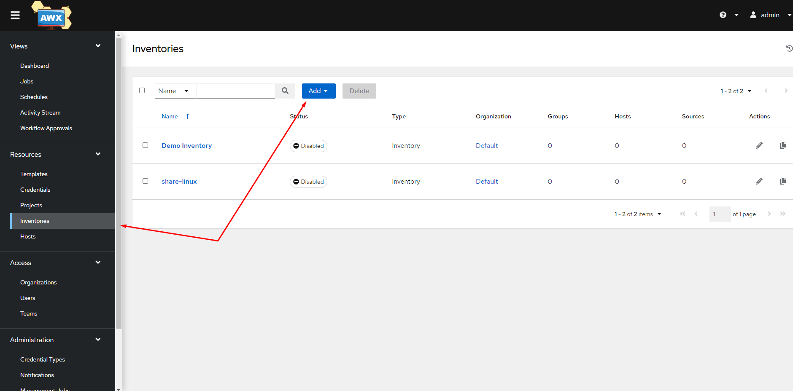

**Bước 2:** Điền các thông tin cần thiết. Về cơ bản thì ta chỉ cần điền ```Name``` là đủ:

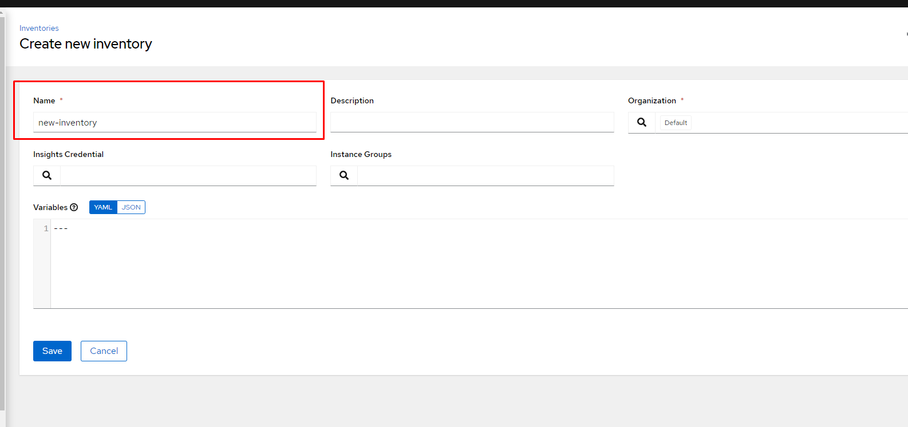

**Bước 3:** Tạo group mới, ta cũng chỉ cần nhập tên là đủ rồi:

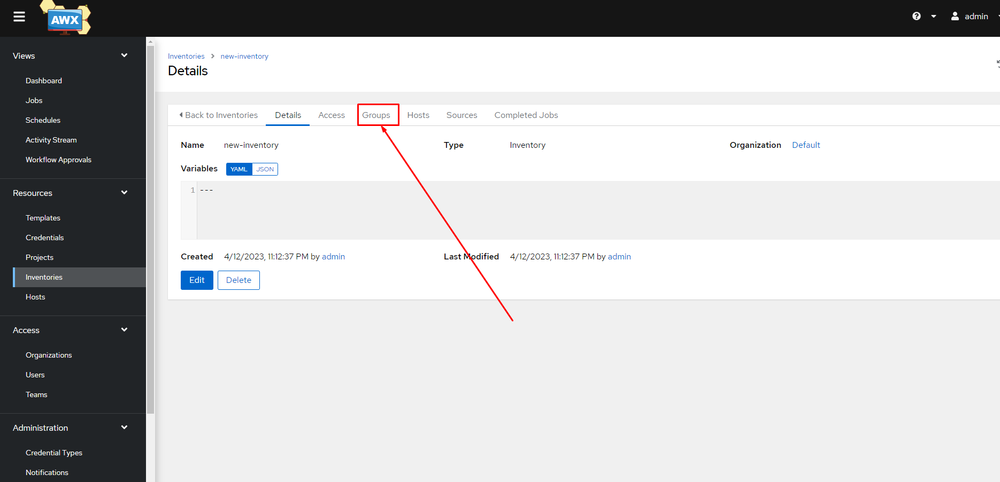

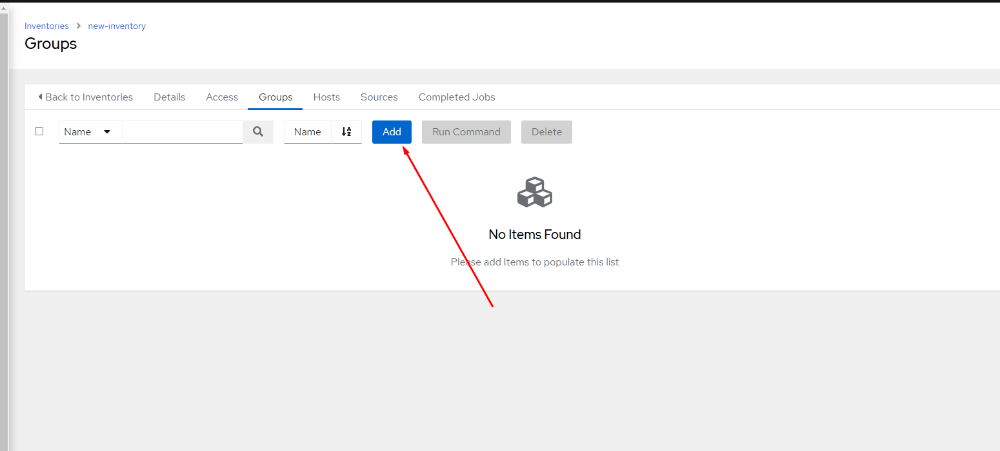

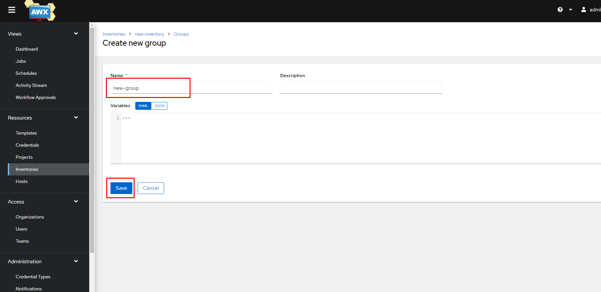

**Bước 4:** Tạo host. Ở đây, ngoài tên của host, ta cần khai báo thêm 2 biến là ```ansible_host``` và ```ansible_port``` lần lượt là IP và port SSH của host

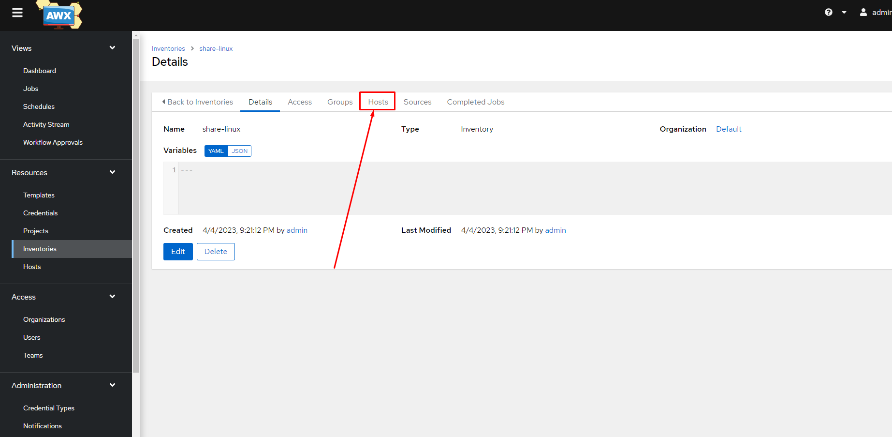

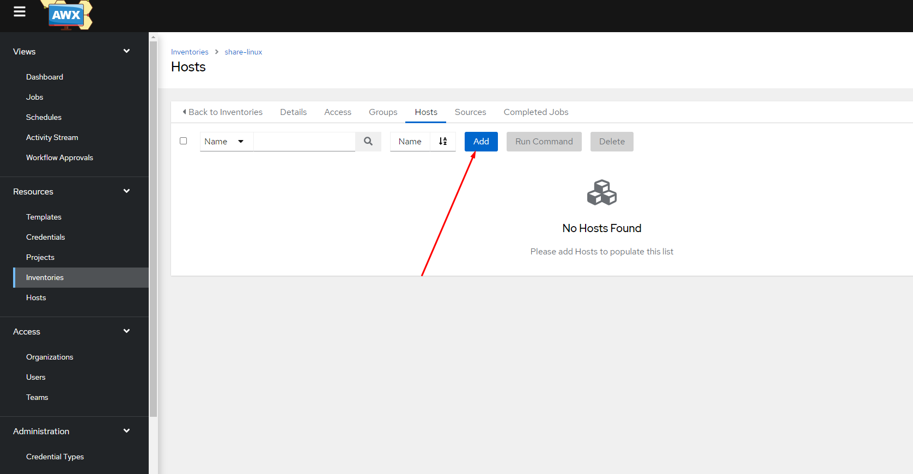


## II. Khởi tạo Credentials

Credentials là nơi lưu trữ các thông tin bảo mật của AWX. Cụ thể trong bài này ta tạo Credential là private key để SSH đến các host.

**Bước 1:** Tạo Credential mới

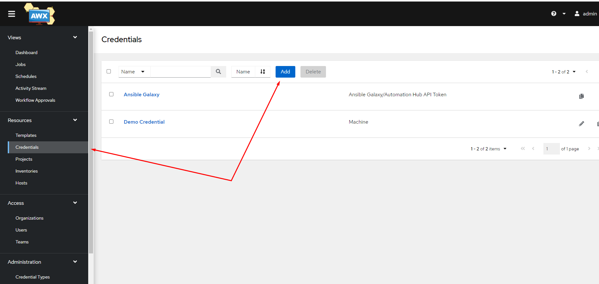

**Bước 2:** Khai báo tên cho Credential. Do chúng ta tạo Credential là private key để SSH đến host, nên chọn ```Type``` là ```Machine```, sau đó ta paste key (thường đặt tại ```/root/.ssh/id_rsa```) vào phần ```SSH Private Key```

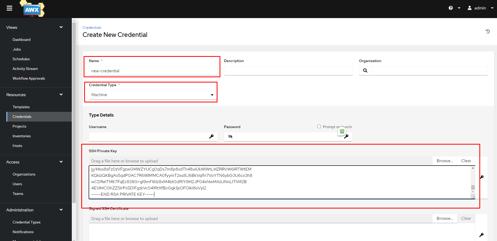

## III. Kiểm tra kết nối

Sau khi đã tạo inventory, host, credential, ta hãy thử kết nối tới host (hãy chắc chắn rằng public_key đã được đưa vào host client)

**Bước 1:** Truy cập vào danh sách các ```Groups``` rồi chọn ```Run Command```. Khi thao tác ```Run Command``` sẽ giống như việc ta sử dụng ```Adhoc Commands```

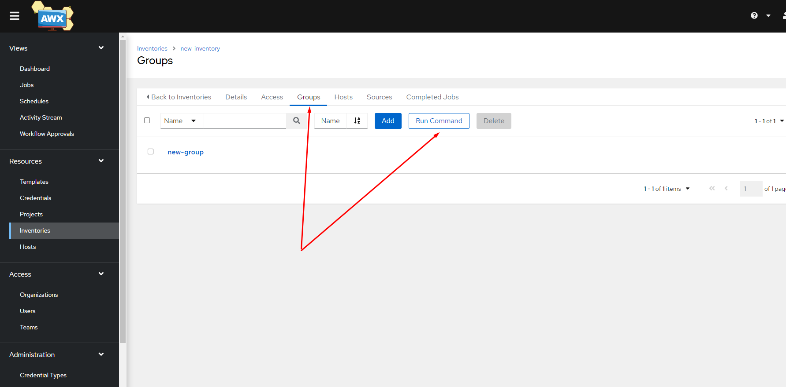

Chọn ```Module``` sẽ sử dụng rồi chọn ```Next```

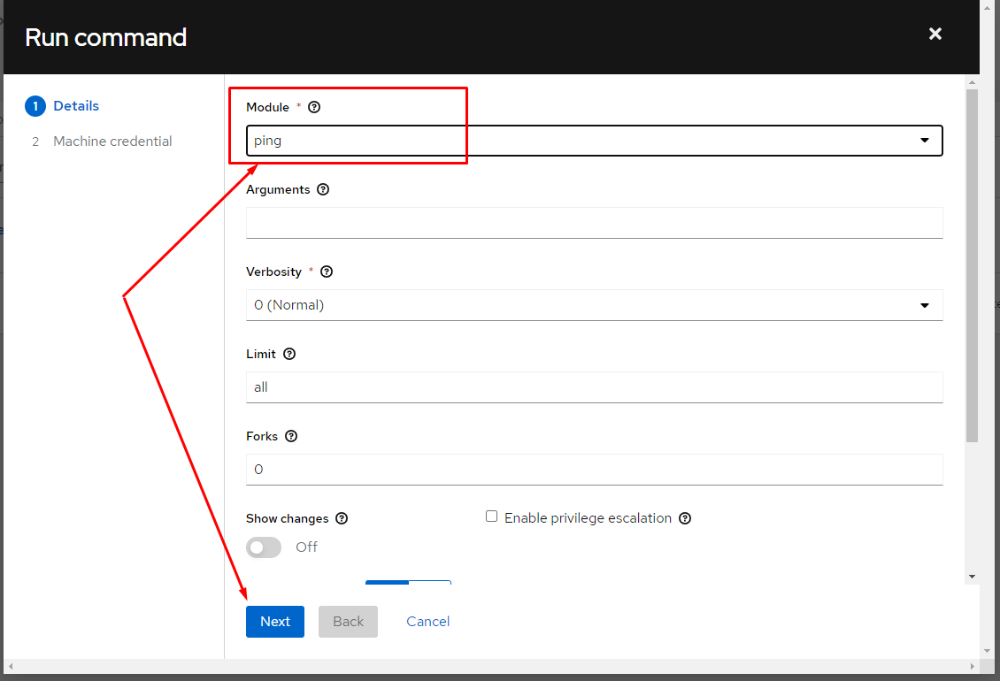

Chọn ```Credential``` rồi ```Lauch``` thôi

[](./images/ansible_AWX_17.png)

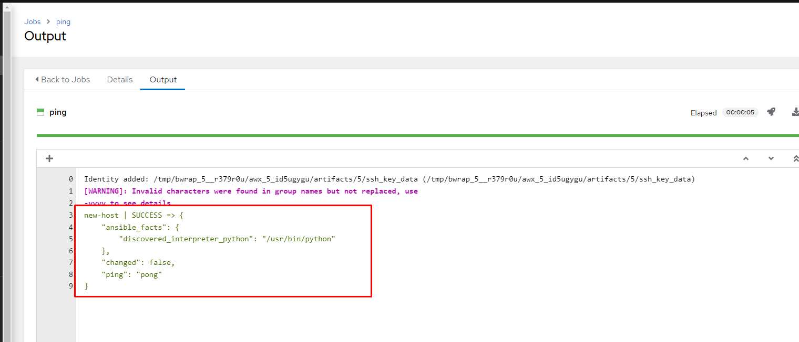

Như vậy là ta đã kết nối thành công với host client.

## IV. Khởi tạo Projects

Khái niệm Project trong AWX đơn giản là một nơi lưu trữ các tài nguyên của Ansible-playbook như các roles, playbooks. Một 1 project có thể lưu nhiều playbook sử dụng cho một mục đích hoặc đối tượng khác nhau.

**Bước 1:** Add project

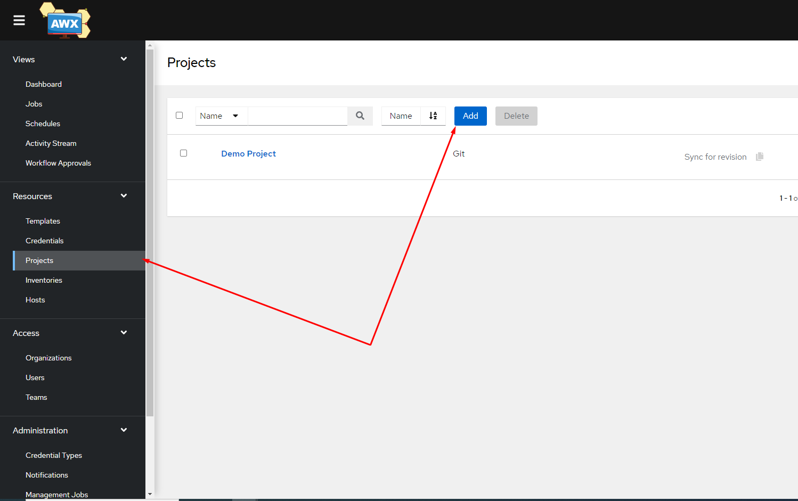

**Bước 2:** Điền các thông tin cần thiết. Ở đây ta cần lưu ý với ```type``` Manual thì ta sẽ phải copy thư mục chứa playbook vào đường dẫn ```/var/lib/awx/projects```, còn với ```type``` Git thì ta sẽ clone repository chứa playbook trên Github về, loại này có phần tiện lợi hơn nhờ các tính năng của Github.

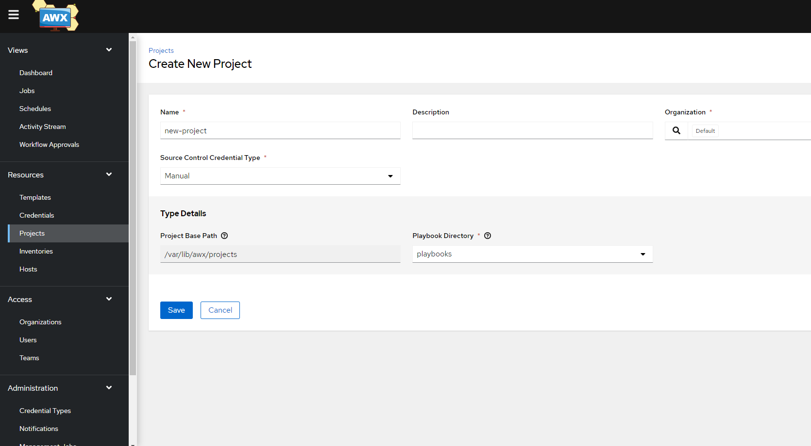

## V. Khởi tạo Template

**Bước 1:** Add Template

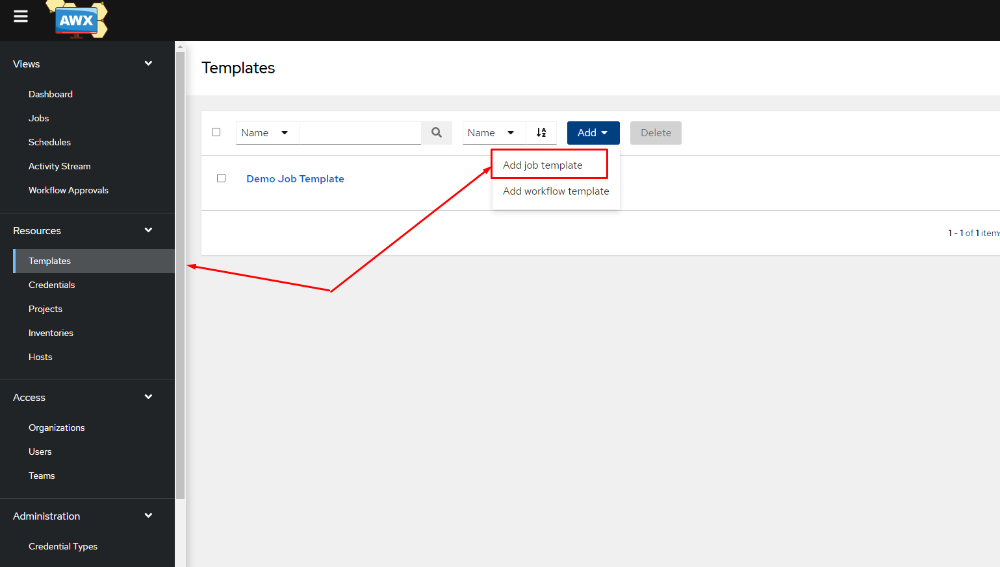

**Bước 2:** Điền các thông tin cần thiết. Các tham số ta cần chú ý là:
- ```Name```: Tên template
- ```Job Type```: có 2 giá trị là ```Run``` hoặc ```Check```. Nếu chọn ```Run``` thì template sẽ thực sự thực hiện playbook, tỏng khi ```Check``` sẽ chỉ phỏng đoán kết quả của playbook thôi.
- ```Inventory```: chọn inventory mong muốn
- ```Project```: chọn project lưu trữ playbook muốn thực hiện
- ```Playbook```: chọn playbook
- ```Credential```: credential sẽ sử dụng để kết nối đến các host client
- ```Variables```: các biến nâng cao
- ```Limit```: tùy chọn host sẽ thực hiện hoặc không thực hiện, nếu không điền gì thì mặc định là all

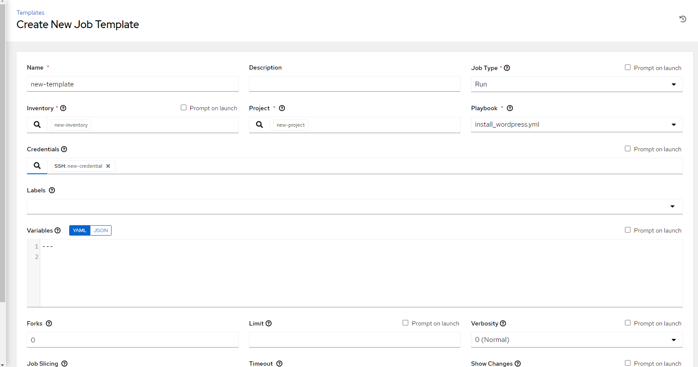

**Bước 3:** Chọn hình tên lửa để khởi chạy Template

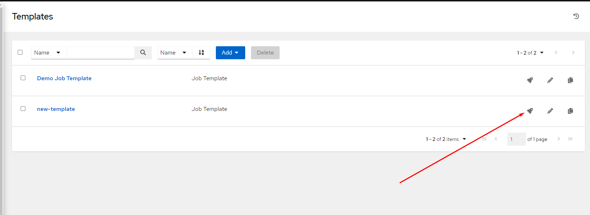

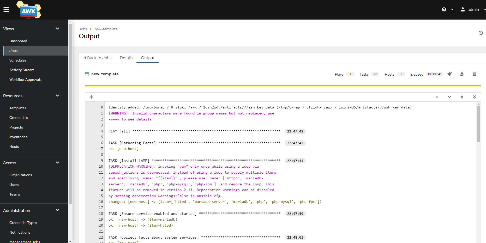

Như vậy là ta đã thực thi template thành công.

## VI. Import inventory lên AWX

Trên nhiều hệ thống lớn với hàng chục hàng trăm host client, sẽ tốn rất nhiều thời gian để ta import từng host 1 sử dụng giao diện. Hoặc một vài trường hợp khác, khi mà ta đã cài đặt xong hết thông qua CLI rồi mới cài đặt AWX, vậy thì để tiết kiệm thời gian, hãy import file inventory có sẵn thay vì tạo mới.

**Bước 1:** Tạo 1 inventory trắng trên AWX như đã giới thiệu bên trên

**Bước 2:** Tạo project ansible playbook thông qua CLI

```sh
mkdir /var/lob/awx/projects/new-project/
cd /var/lib/awx/project/new-project
```

Copy file inventory vào thư mục này

```sh
cp /etc/ansible/hosts ./
```

**Bước 3:** Truy cập vào container awx_task

```sh
docker exec -it <id_container_awx_task> /bin/bash
```

**Bước 4:** Di chuyển vào thư mục project đã tạo

```sh
cd /var/lib/awx/projects/new-project/
```

**Bước 5:** Thực thi lệnh awx-manage để import inventory

```sh
awx-manage inventory_import --source=hosts --inventory-name="new-inventory"
```

Trong đó:
- ```source```: file inventory muốn import
- ```--inventory-name```: tên inventory trắng được tạo sẵn trên AWX

Done!