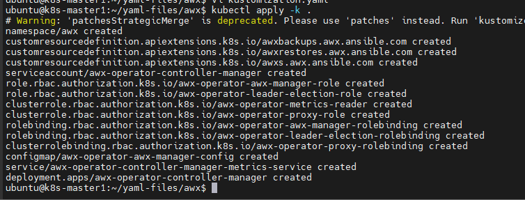
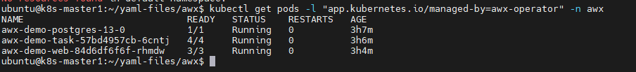
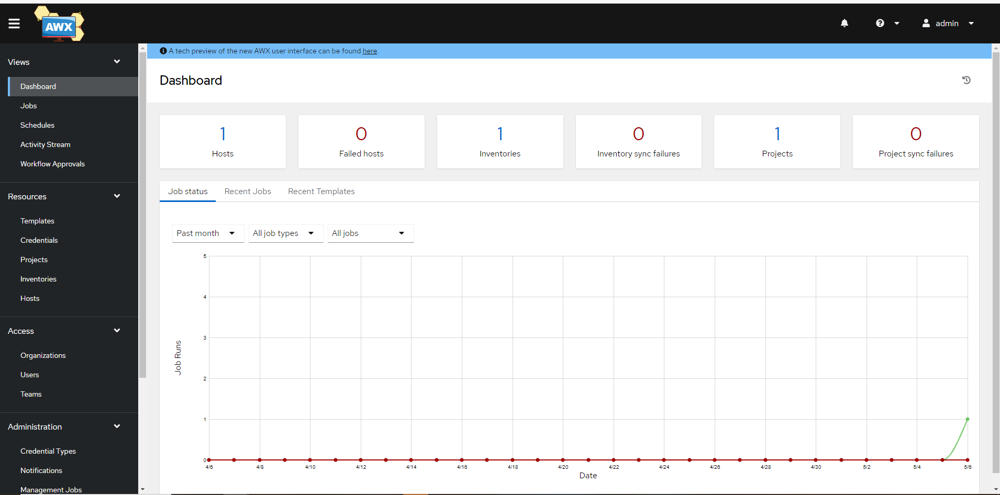

# AWX Operator

Bài này sẽ giới thiệu về Ansible AWX operator cho K8s với Operator SDK và Ansible

## Mục đích

Operator này giúp đem lại 1 cách thức triển khai AWX trên Kubernetes-native thông qua 1 AWX Custom Resource Definition (CRD)

## Cài đặt

### 1. Tạo 1 minikube cluster

Nếu bạn đang không có sẵn 1 K8s cluster thì ```awx-operator``` cũng có thể triển khai trên Minikube cluster cho mục đích thử nghiệm. Để biết cách thức triển khai K8s cluster thông qua Minikube, hãy xem tại [đây](https://github.com/shaidoka/thuctap-NhanHoa/blob/main/k8s/K8s_Install_Minikube.md)

### 2. Cài đặt cơ bản

Khi bạn đã có K8s cluster rồi, bạn có thể triển khai AWX Operator sử dụng **Kustomize**, từ phiên bản 1.14 của kubectl thì kustomize đã trở thành 1 tính năng built-in, do đó không cần cài đặt gì thêm.

Đầu tiên, tạo 1 file gọi là ```kustomization.yaml``` với nội dung như sau:

```sh
apiVersion: kustomize.config.k8s.io/v1
kind: Kustomization
resources:
  # Ta có thể tìm kiếm phiên bản mới nhất ở https://github.com/ansible/awx-operator/releases
  - github.com/ansible/awx-operator/config/default?ref=2.0.1
images:
  - name: quay.io/ansible/awx-operator
    newTag: 2.0.1
namespace: awx
```

Áp dụng kustomization

```sh
kubectl apply -k .
```



Tiếp đến, ta hãy tạo 1 tệp tên ```awx-demo.yaml``` trong cùng folder và có nội dung như sau

```sh
apiVersion: awx.ansible.com/v1beta1
kind: AWX
metadata:
  name: awx-demo
spec:
  service_type: nodeport
```

Thêm file vừa tạo vào anh sách ```resources``` trong tệp ```kustomization.yaml```

```sh
...
resources:
  - github.com/ansible/awx-operator/config/default?ref=<tag>
  # Thêm dòng dưới đây vào
  - awx-demo.yaml
...
```

Cuối cùng, áp dụng thay đổi để tạo 1 AWX instance mới trong cluster:

```sh
kubectl apply -k . -n awx
```

Sau vài phút, 1 AWX instance mới sẽ được triển khai. Ta có thể nhìn vào pod logs để biết quá trình cài đặt diễn ra đến đâu:

```sh
kubectl logs -f deployments/awx-operator-controller-manager -c awx-manager -n awx
```

Ta có thể kiểm tra trạng thái của pods và services do awx operator tạo ra, nếu là ```running``` tức là quá trình khởi tạo đã hoàn tất

```sh
kubectl get pods -l "app.kubernetes.io/managed-by=awx-operator" -n awx
kubectl get svc -l "app.kubernetes.io/managed-by=awx-operator" -n awx
```

Quá trình deploy instance có thể tốn nhiều thời gian, để kiểm tra tiến trình này đã hoàn thành hay chưa, hãy thực hiện lệnh

```sh
kubectl get pods -l "app.kubernetes.io/managed-by=awx-operator"
```



```sh
kubectl get svc -l "app.kubernetes.io/managed-by=awx-operator" -n awx
```


Bây giờ, hãy lấy thông tin đăng nhập bằng cách chạy lệnh sau

```sh
kubectl get secret awx-demo-admin-password -o jsonpath="{.data.password}" -n awx | base64 --decode ; echo
```

Như vậy thông tin để đăng nhập AWX UI sẽ là ```admin``` và kết quả trả về của lệnh trên. Còn đường dẫn sẽ là ```<Cluster_IP>:<NodePort>``` trong đó Cluster IP là bất kỳ IP nào thuộc cluster, còn NodePort là Port của ```awx-demo-service``` có được khi chúng ta sử dụng lệnh get svc



### 3. Cài đặt AWX với Helm

AWX Operator cũng có thể cài đặt sử dụng Helm trên 1 K8s cluster có sẵn. 

Việc cài đặt với helm rất đơn giản, hãy sử dụng các lệnh sau (yêu cầu helm đã được cài đặt trên cluster)

```sh
helm repo add awx-operator https://ansible.github.io/awx-operator/
helm repo update
helm search repo awx operator
helm install -n awx --create namespace my-awx-operator awx-operator/awx-operator
```

Vậy là ta đã đi qua 2 cách cài đặt cơ bản AWX Operator trên K8s cluster. Các phần tiếp theo sẽ đi vào những phần cấu hình nâng cao hơn.

## Thiết lập account admin

Có 3 tham số có thể tùy biến được cho admin user account bao gồm

|Tên|Mô tả|Giá trị mặc định|
|:-|:-|:-|
|admin_user|Tên của tài khoản admin|admin|
|admin_email|Email của admin|test@example.com|
|admin_password_secret|Secret chứa password tài khoản admin|Rỗng|

Nếu ```admin_password_secret``` không được cung cấp, operator sẽ tìm kiếm secret có tên ```<resourcename>-admin-password``` để làm admin password. Nếu nó chưa được tạo, operator sẽ khởi tạo 1 password và tạo Secret từ nó với ```<resourcename>-admin-password```

Định dạng Secret này sẽ như sau:

```sh
apiVersion: v1
kind: Secret
metadata:
  name: <resourcename>-admin-password
  namespace: <target namespace>
stringData:
  password: thehardestpasswordonearth
```

## Thiết lập Secret Key

Key này thường sử dụng để mã hóa thông tin nhạy cảm trong database

|Tên|Mô tả|Giá trị mặc định|
|:-|:-|:-|
|secret_key_secret|Secret mà chứa symmetric key cho mã hóa|Khởi tạo tự động|

Nếu ```secret_key_secret``` không được cung cấp, operator sẽ tìm kiếm 1 secret tên ```<resource>-secret-key``` để làm secret key. Nếu không có sẵn, operator sẽ khởi tạo 1 password và tạo 1 Secret từ nó với tên ```<resourcename>-secret-key```. Secret này không nên được xóa vì nó sẽ cần thiết cho việc nâng cấp hoặc khởi tạo lại pods khi nó down ở thời điểm nào đó.

Secret này nên có định dạng như sau:

```sh
apiVersion: v1
kind: Secret
metadata:
  name: custom-awx-secret-key
  namespace: <target namespace>
stringData:
  secret_key: supersecuresecretkey
```

Sau đó chỉ định tên secret ở AWX spec:

```sh
spec:
  ...
  secret_key_secret: custom-awx-secret-key
```

## Network và TLS Configuration

### Service Type

Nếu ```service_type``` không được chỉ định thì AWX Tower service sẽ sử dụng ```ClusterIP```

Các loại ```service_type``` được hỗ trợ bao gồm: ```ClusterIP```, ```LoadBalancer``` và ```NodePort```

Những biến sau đây có thể tùy biến được cho bất kỳ ```service_type``` nào:

|Name|Description|Default|
|:-|:-|:-|
|service_labels|Labels tùy chọn|Xâu rỗng|
|service_annotations|Service Annotations|Xâu rỗng|

```sh
spec:
...
  service_type: ClusterIP
  service_annotations: |
    environment: testing
  service_labels: |
    environment: testing
```

**Service Type LoadBalancer**

Những thông số sau có thể tùy biến khi cấu hình service type loadbalancer

|Name|Description|Default|
|:-|:-|:-|
|loadbalancer_protocol|Giao thức sử dụng cho loadbalancer ingress|http|
|loadbalancer_port|Port sử dụng cho loadbalancer ingress|80|
|loadbalancer_ip|Chỉ định loadbalancer IP|''|

```sh
spec:
  ...
  service_type: LoadBalancer
  loadbalancer_ip: '192.168.10.25'
  loadbalancer_protocol: https
  loadbalancer_port: 443
  service_annotations: |
    environment: testing
  service_labels: |
    environment: testing
```

Khi cài đặt 1 LoadBalancer cho HTTPS ta sẽ cần chú ý chỉ định đúng ```loadbalancer_port```.

HTTPS Loadbalancer cũng sử dụng SSL termination ở tầng Loadbalancer và sẽ loại bỏ traffic đến AWX thông qua HTTP.

**Service Type NodePort**

Các biến sau là tùy biến được chỉ khi ```service_type=NodePort```

|Name|Description|Default|
|:-|:-|:-|
|nodeport_port|Port sử dụng cho NodePort|30080|

```sh
spec:
  ...
  service_type: NodePort
  nodeport_port: 30080
```

**Ingress Type**

Theo mặc định, AWX operator sẽ không đặt 1 ```ingress_type``` nào, do đó khi ```ingress_type``` không được chỉ định, nó sẽ sử dụng ```none``` và không có ingress nào được tạo.

Các thông số hỗ trợ của ```ingress_type``` là: ```none```, ```ingress```, ```route```. Để thay đổi những thông số này, ta có thể thêm dòng sau vào AWX CRD:

```sh
spec:
  ...
  ingress_type: none
```

Những tham số sau đây là tùy biến được khi ```ingress_type=ingress```. Loại ```ingress``` tạo 1 Ingress resource mà có thể chia sẻ với nhiều Ingress Controller khác nhau.

|Name|Description|Default|
|:-|:-|:-|
|ingress_annotations|Ingress annotations|Xâu rỗng|
|ingress_tls_secret|Secret mà chứa thông tin TLS|Xâu rỗng|
|ingress_class_name|Ingress class name|Cluster default|
|hostname|Chỉ định FQDN|{{ meta.name }}.example.com|
|ingress_path|Chỉ định ingress path đến service|/|
|ingress_path_type|Chỉ định loại của path (cho LBs)|Prefix|
|ingress_api_version|Chỉ định Ingress resource apiVersion|'networking.k8s.io/v1'|

```sh
spec:
  ...
  ingress_type: ingress
  hostname: awx-demo.example.com
  ingress_annotations: |
    environment: testing
```

Thiết lập Ingress Controller đặc thù: Một vài Ingress Controller cần 1 thiết lập đặc biệt để hoàn toàn hỗ trợ AWX, thêm giá trị sau với biến ```ingress_controller```, ví dụ:

```
spec:
  ...
  ingress_type: ingress
  hostname:  awx-demo.example.com
  ingress_controller: contour
```

Những tham số sau đây là tùy biến được khi sử dụng ```ingress_type=route```

|Name|Description|Default|
|:-|:-|:-|
|route_host|Tên mà route sẽ trả lời|<instance-name>-<namespace>-<routerCanonicalHostname>|
|route_tls_termination_machanism|Phương thức TLS Termination (Edge, Passthrough)|Edge|
|route_tls_secret|Secret mà chứa thông tin TLS|Xâu rỗng|
|route_api_version|Chỉ định Route resource apiVersion|'route.openshift.io/v1'|

```sh
spec:
  ...
  ingress_type: route
  route_host: awx-demo.example.com
  route_tls_termination_mechanism: Passthrough
  route_tls_secret: custom-route-tls-secret-name
```

## Cấu hình nâng cao

### Triển khai 1 phiên bản AWX chỉ định

Có 1 vài biến mà ta có thể tùy chỉnh cho AWX image:

|Name|Description|Default|
|:-|:-|:-|
|image|Đường dẫn pull image awx|quay.io/ansible/awx|
|image_version|Image version muốn pull|DEFAULT_AWX_VERSION hoặc latest|
|image_pull_policy|Pull policy|IfNotPresent|
|image_pull_secrets|Pull secrets sử dụng|None|
|ee_images|Danh sách EEs cần đăng ký|quay.io/ansible/awx-ee:latest|
|redis_image|Đường dẫn pull image redis|docker.io/redis|
|redis_image_version|Redis image version muốn pull|latest|

Ví dụ:

```sh
spec:
  ...
  image: myorg/my-custom-awx
  image_version: latest
  image_pull_policy: Always
  image_pull_secrets:
    - pull_secret_name
  ee_images:
    - name: my-custom-awx-ee
      image: myorg/my-custom-awx-ee
```

### Yêu cầu tài nguyên của containers

Resource requirement cho cả awx_task và webui containers là có thể cấu hình được, bao gồm:

|Name|Description|Default|
|:-|:-|:-|
|web_resource_requirements|Yêu cầu tài nguyên của Web container|request: {cpu: 100m, memory: 128Mi}|
|task_resource_requirements|Yêu cầu tài nguyên của Task container|request: {cpu: 100m, memory: 128Mi}|
|ee_resource_requirements|Yêu cầu tài nguyên của EE control plane container|request: {cpu: 100m, memory: 128Mi}|

Ví dụ:

```sh
spec:
  ...
  web_resource_requirements:
    requests:
      cpu: 250m
      memory: 2Gi
    limits:
      cpu: 1000m
      memory: 4Gi
  task_resource_requirements:
    requests:
      cpu: 250m
      memory: 1Gi
    limits:
      cpu: 2000m
      memory: 2Gi
  ee_resource_requirements:
    requests:
      cpu: 250m
      memory: 100Mi
    limits:
      cpu: 500m
      memory: 2Gi
```

### Scaling Task và Web pods

Ta có thể scale replicas up hoặc down cho mỗi deployment bằng việc sử dụng ```web_replicas``` hoặc ```task_replicas``` tương ứng. Ta có thể scale tất cả pods cho cả 2 deployments bằng việc sử dụng ```replicas```. Nếu ta chỉ định cả 2 thông số là ```replicas``` và ```web_replicas``` hoặc ```task_replicas```

Những replica này có thể thêm 1 vài ràng buộc để quyết định chúng được schedule ở node nào bằng cách:

### Chỉ định AWX pods vào node cụ thể

Ta có thể ràng buộc AWX pods được tạo bởi operator sẽ được chạy ở node(s) nào. Ràng buộc```node_selector``` và ```postgres_selector``` giúp ta tùy biến được pods chỉ được chạy ở nodes mà khớp tất cả cặp key/value chỉ định. ```tolerations``` và ```posstgres_tolerations``` cho phép AWX pods được schedule trên node với taint khớp. ```topologySpreadConstraints``` được cấu hình thông qua ```topology_spread_constraints```, còn ```affinity``` thì thông qua tùy chọn ```affinity```.

Nếu ta cần ràng buộc pods web hay task độc lập. Ta có thể chỉ định tương tự với tên dạng như ```task_tolerations```.

|Name|Description|Default|
|:-|:-|:-|
|postgres_image|Đường dẫn pull image|postgres|
|postgres_image_version|Phiên bản image pull|13|
|node_selector|nodeSelector của AWX pods|''|
|web_node_selector|nodeSelector của web pods|''|
|task_node_selector|nodeSelector của AWX task|''|
|topology_spread_constraints|topologySpreadConstraints của AWX pods|''|
|web_topology_spread_constraints|topologySpreadConstraints của AWX web pods|''|
|task_topology_spread_constraints|topologySpreadConstraints của AWX task pods|''|
|affinity|AWX pods' affinity rules|''|
|web_affinity|AWX web pods' affinity rules|''|
|task_affinity|AWX task pods' affinity rules|''|
|tolerations|AWX pods' tolerations|''|
|web_tolerations|AWX web pods' tolerations|''|
|task_tolerations|AWX task pods' tolerations|''|
|annotations|AWX pods' annotations|''|
|postgres_selector|nodeSelector của pods Postgres|''|
|postgres_tolerations|tolerations của pods Postgres|''|

Ví dụ:

```sh
spec:
  ...
  node_selector: |
    disktype: ssd
    kubernetes.io/arch: amd64
    kubernetes.io/os: linux
  topology_spread_constraints:  |
    - maxSkew: 100
      topologyKey: "topology.kuberentes.io/zone"
      whenUnsatisfiable: "ScheduleAnyway"
      labelSelector:
        matchLabels:
          app.kubernetes.io/name: "awx-demo"
  tolerations:  |
    - key: "dedicated"
      operator: "Equal"
      value: "AWX"
      effect: "NoSchedule"
  task_tolerations: |
    - key: "dedicated"
      operator: "Equal"
      value: "AWX_task"
      effect: "NoSchedule"
  postgres_selector: |
    disktype: ssd
    kubernetes.io/arch: amd64
    kubernetes.io/os: linux
  postgres_toleration: |
    - key: "dedicated"
      operator:  "Equal"
      value: "AWX_task"
      effect: "NoSchedule"
  affinity:
    nodeAffinity:
      preferredDuringSchedulingIgnoredDuringExecution:
      - weight: 1
        preference:
          matchExpressions:
          - key: another-node-label-key
            operator: In
            values:
            - another-node-label-value
      podAntiAffinity:
        preferredDuringSchedulingIgnoredDuringExecution:
        - weight: 100
          podsAffinityTerm:
            labelSelector:
              matchExpressins:
              - key: security
                operator: In
                values:
                - S2
            topologyKey: topology.kubernetes.io/zone
```

## Persisting Projects Directory

Trong trường hợp mà ta muốn persist ```/var/lib/projects``` directory, có 1 vài tham số ta có thể tùy biến như sau

|Name|Description|Default|
|:-|:-|:-|
|projects_persistence|Chỉ định có dùng persistent volume cho /var/lib/projects không|false|
|projects_storage_class|Chỉ định PV storage class|''|
|projects_storage_size|Chỉ định PV size|8Gi|
|projects_storage_access_mode|Chỉ định PV access mode|ReadWriteMany|
|projects_existing_claim|Chỉ định PVC đã tồn tại để sử dụng|''|

Ví dụ 1 customization để ```awx-operator``` tự động xử lý PV:

```sh
spec:
  ...
  projects_persitence: true
  projects_storage_class: rook_ceph
  projects_storage_size: 20Gi
```

## Custom Volume and Volume Mount Options

Custom volumes và volume mounts có thể được sử dụng để ghi đè lên các file cấu hình mặc định

|Name|Description|Default|
|:-|:-|:-|
|extra_volumes|Chỉ định extra volumes để thêm và application pod|''|
|web_extra_volume_mounts|Chỉ định volume mounts để thêm vào Web container|''|
|task_extra_volume_mounts|Chỉ định volume mounts cần thêm vào Task container|''|
|ee_extra_volume_mounts|Chỉ định volume mounts để thêm vào Execution container|''|
|init_container_extra_volume_mounts|Chỉ định volume mounts để thêm vào Init container|''|
|init_container_extra_commands|Chỉ định commands cho Init container|''|

Ví dụ:

```sh
apiVersion: v1
kind: ConfigMap
metadata:
  name: awx-demo-ex
  namespace: <target namespace>
data:
  ansible.cfg: |
    [defaults]
    remote_tmp = /tmp
    [ssh_connection]
    ssh_args = -C -o ControlMaster=auto -o ControlPersist=60s
  custom.py: |
    INSIGHTS_URL_BASE = "example.org"
    AWX_CLEANUP_PATHS = True
```

```sh
spec:
  ...
  extra_volumes: |
    - name: ansible-cfg
      configMap:
        defaultMode: 420
        items:
          - key: ansible.cfg
            path: ansible.cfg
        name: awx-demo-extra-config
    - name: custom-py
      configMap:
        defaultMode: 420
        items:
          - key: custom.py
            path: custom.py
        name: awx-demo-extra-config
    - name: shared-volume
      persistentVolumeClaim:
        claimName: my-external-volume-claim
  
  init_container_extra_volume_mounts: |
    - name: shared-volume
      mountPath: /shared
  
  init_container_extra_commands: |
    # set proper permission (rwx) for the awx user
    chmod 755 /shared
    chgrp 1000 /shared
  
  ee_extra_volume_mounts: |
    - name: ansible-cfg
      mountPath: /etc/ansible/ansible.cfg
      subPath: ansible.cfg
  
  task_extra_volume_mounts: |
    - name: custom-py
      mountPath: /etc/tower/conf.d/custom.py
      subPath: custom.py
    - name: shared-volume
      mountPath: /shared
```

## Uninstall

Để gỡ cài đặt AWX và các thành phần khác, ta thực hiện các câu lệnh (hãy thay đổi tên của resource để phù hợp vs hệ thống)

```sh
kubectl delete awx awx-demo -n awx
kubectl delete ns awx
kubectl delete deployment awx-operator
kubectl delete serviceaccount awx-operator
kubectl delete clusterrolebinding awx-operator
kubectl delete clusterrole awx-operator
kubectl delete crd awxbackups.awx.ansible.com
kubectl delete crd awxrestores.awx.ansible.com
kubectl delete crd awxs.awx.ansible.com
```