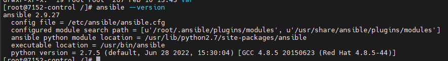
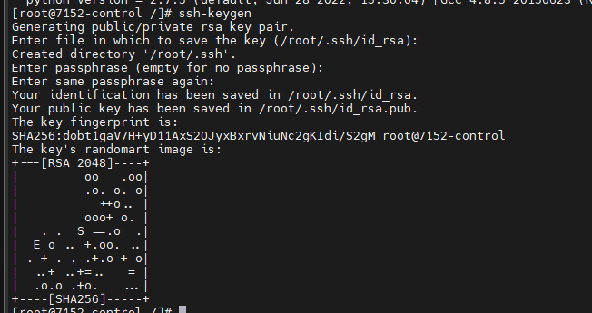
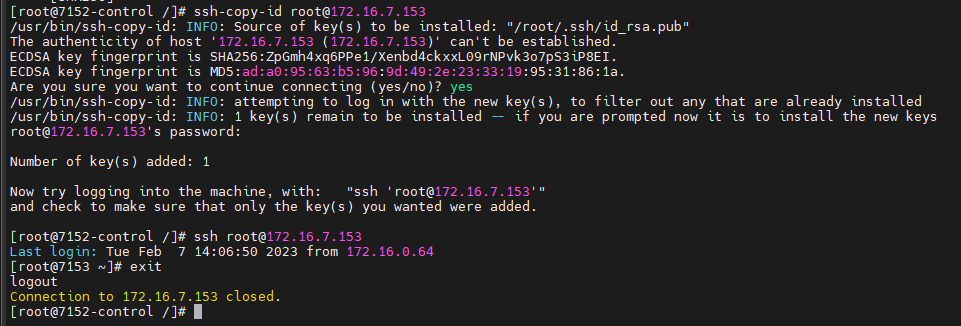
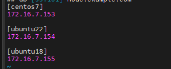
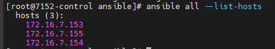
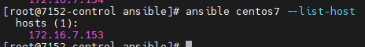
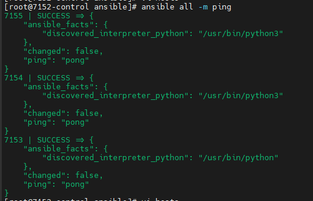
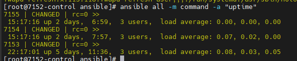
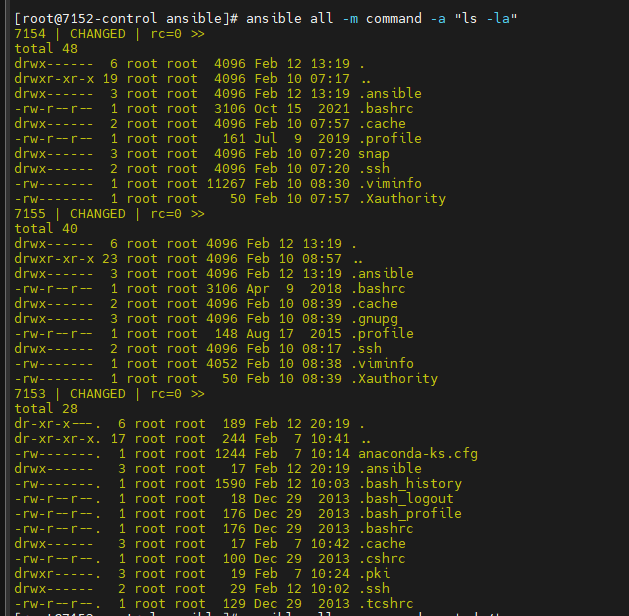
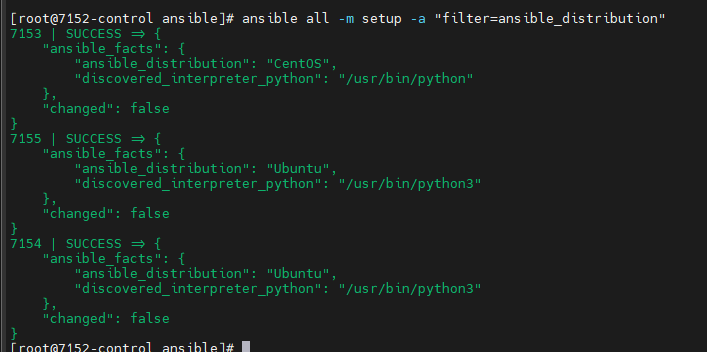

# Cài đặt Ansible

## 1. Mô hình

- 1 máy CentOS 7 đóng vai trò Node Control, IP 172.16.7.152
- 3 máy ảo đóng vai trò Node Manage bao gồm: 
   - 1 máy CentOS 7, IP 172.16.7.153
   - 1 máy Ubuntu 18, 172.16.7.154
   - 1 máy Ubuntu 22, 172.16.7.155

## 2. Cài đặt

### 2.1. Cài đặt Ansible trên Node Control

Việc cài đặt Ansible rất đơn giản, chỉ cần sử dụng **yum**:

```sh
yum install -y epel-release
yum update -y
yum install -y ansible
```

Kiểm tra phiên bản Ansible sau khi cài đặt:

```sh
ansible --version
```



### 2.2. Cấu hình SSH Key và khai báo file inventory

Ansible hoạt động theo cơ chế Agentless, có nghĩa là không cần cài agent vào các máy client để điều khiển, thay vào đó Ansible sẽ điều khiển chúng thông qua SSH.

Do đó, tới bước này ta có thể dùng 2 cách để ansible có thể điều khiển được các máy client:

- Cách 1: sử dụng username, port của SSH mà được khai báo trong inventory. Tuy nhiên cách này sẽ đặt vấn đề bảo mật ở trạng thái ngàn cân treo sợi tóc do phải khai báo password dạng clear text trong file. Nếu vẫn muốn sử dụng thì ta phải bảo mật bằng **Ansible Vault**
- Cách 2: sử dụng SSH keypair. Có nghĩa là ta sẽ tạo ra 1 cặp private/public key trên node server và copy chúng sang các Node Manage

#### 2.2.1. Tạo SSH keypair

Trên Node Control, sử dụng lệnh

```sh
ssh-keygen
```

Các thông số ta để mặc định, do đó hãy Enter đến khi key được gen



Sau đó, ta copy public key sang các node còn lại

```sh
ssh-copy-id root@172.16.7.153
```



Làm tương tự với các node còn lại.

Sau đó, đứng từ Node Control, thử SSH đến các Node Manage, nếu không bị hỏi mật khẩu thì SSH key đã được copy sang thành công (như ảnh trên)

Giờ ta sẽ khai báo các host cần thiết trong file inventory

#### 2.2.2. Khai báo file inventory

Mặc định danh sách các host mà Node Control điều khiển sẽ nằm ở file ```/etc/ansible/host```. File mặc định này sẽ chứa các khai báo mẫu, ta sẽ thực hiện sao lưu lại và khai báo file theo bài lab này:

```sh
cp /etc/ansible/hosts /etc/ansible/hosts.bk
```

Sau đó mở file /etc/ansible/hosts và thêm những Node Manage vào

```sh
[centos7]
172.16.7.153

[ubuntu22]
172.16.7.154

[ubuntu18]
172.16.7.155
```



Lưu lại và thoát ra. Chú ý rằng thẻ ```[ ]``` dùng để khai báo group. Nhờ đó giúp ta dễ dàng quản lý các Node Manage hơn để phù hợp với hệ thống. Ở trong bài viết này, chúng ta sẽ ví dụ quy hoạch theo OS.

Thực hiện kiểm tra danh sách host đã được khai báo trong file inventory bằng lệnh

```sh
ansible all --list-hosts
```

Trong đó ```all``` là tùy chọn của lệnh trên, mục tiêu là liệt kê tất cả các hosts nằm trong file inventory, bất kể các host đó nằm ở group nào



Nếu như muốn liệt kê các host trong group nào đó, sử dụng cú pháp như ví dụ sau

```sh
ansible centos7 --list-host
```



Đến đây, ta mới chỉ khai báo xong các host. Thực tế để hoạt động được thì Node Control cần thêm các thông tin về mật khẩu, port, hay user mà Ansible được phép điều khiển trên host nữa.

Chỉnh sửa file hosts như sau:

```sh
[centos7]
7153 ansible_host=172.16.7.153 ansible_port=22 ansible_user=root

[ubuntu22]
7154 ansible_host=172.16.7.154 ansible_port=22 ansible_user=root

[ubuntu18]
7155 ansible_host=172.16.7.155 ansible_port=22 ansible_user=root
```

**Lưu ý:** "7153", "7154", "7155" là hostname của các Node Manage

### 3. Kiểm tra kết nối đến các Node Manage

Để kiểm tra xem việc khai báo này đã đúng hay chưa, hãy sử dụng lệnh sau:

```sh
ansible all -m ping
```

Tùy chọn ```-m``` để khai báo module sẽ sử dụng, ở đây ta dùng module ```ping```



Kết quả cho thấy, tất cả các host đều đã có thể ping được từ Node Control.

### 4. Các module cơ bản của Ansible trong chế độ tương tác

Chế độ tương tác hay chế độ lệnh đơn, tức là sau khi thực hiện lệnh sẽ có output ngay để quan sát

Trong thực tế, chế độ này không có mấy ý nghĩa do khả năng "tự động hóa" mà chỉ cần sử dụng 1 câu lệnh thì không hợp lý lắm. Vì vậy, phần này chỉ để giới thiệu với những người mới tìm hiểu về Ansible, các kỹ năng nâng cao hơn như viết playbooks, tasks, vars,... sẽ được giới thiệu sau.

#### 4.1. Sử dụng module ```command```

Hãy xem ví dụ sau đây:

```sh
ansible all -m command -a "uptime"
```

Trong đó:
- ```-m```: chỉ định module sử dụng, ở đây ra dùng module **command**
- ```-a```: câu lệnh sẽ thực thi trên các Node Manage



Module **command** cho phép cho phép ta thực thi lệnh trên các máy Linux từ xa, tuy nhiên hầu hết đều là lệnh đơn, đây cũng là hạn chế lớn nhất của module này.

Hãy theo dõi câu lệnh sau



Lệnh ```ls``` giúp liệt kê các file/folder trong đường dẫn hiện tại, ta có thể thấy khi Node Control SSH vào các Node Manage bằng user root thì khi sử dụng ```ls``` sẽ chỉ liệt kê được trên đường dẫn ```/root```. Việc sử dụng kết hợp ```cd``` vào là không thể làm được.

#### 4.2. Module ```setup``` trong Ansible

Ta có thể sử dụng module ```setup``` để kiểm tra các thông tin tổng quát về hệ điều hành của các node, ví dụ như phiên bản, thông tin card mạng, tên host, thông số về phần cứng,...

Sử dụng lệnh sau để kiểm tra bản phân phối

```sh
ansible all -m setup -a "filter=ansible_distribution"
```



Trong đó option ```-a``` giúp ta lọc kết quả đầu ra do module setup trả về rất nhiều thông số khác nhau.

Tới đây, Nhân Hòa đã giới thiệu 1 cách tổng quan nhất về Ansible, tuy nhiên để thực sự biết cách sử dụng Ansible các bạn hãy tiếp tục theo dõi các bài viết tiếp theo về Ansible của Nhân Hòa.