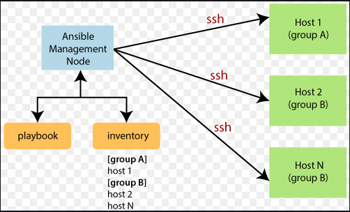
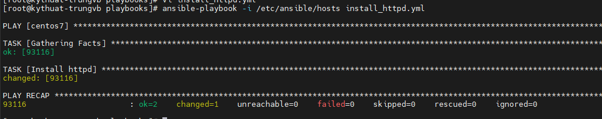
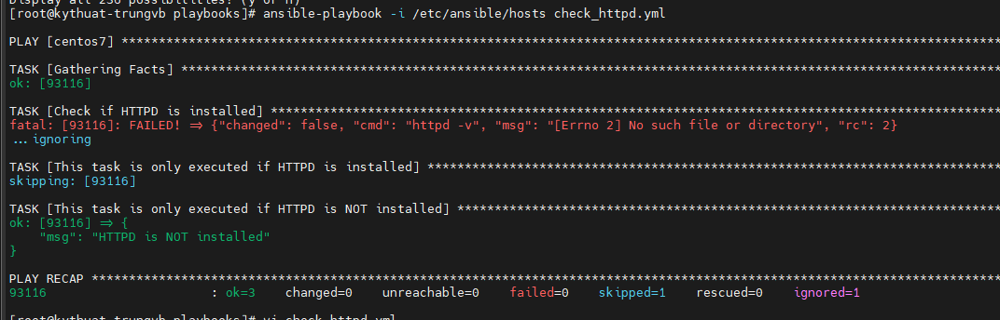
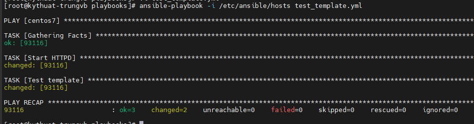
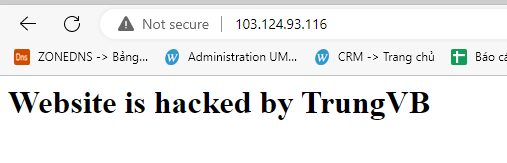
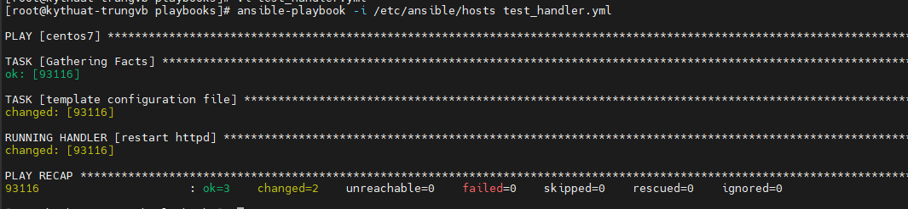
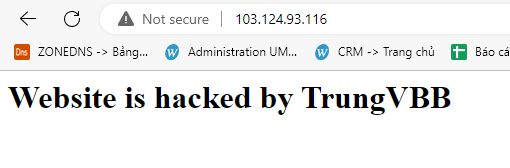
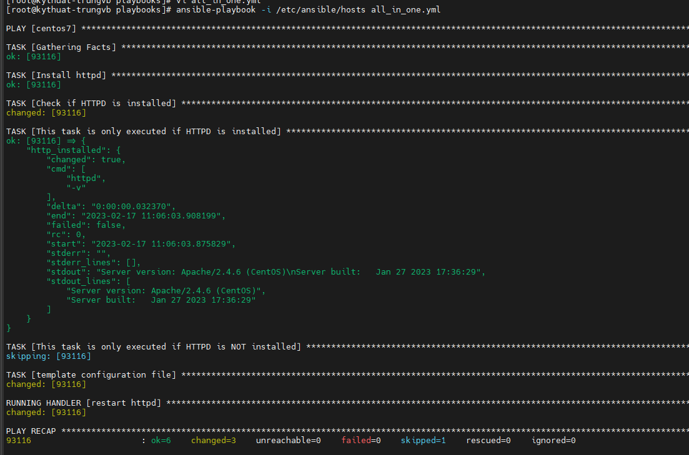

# Playbook trong Ansible

Playbook chính là thứ làm nên sức mạnh của Ansible, bằng việc viết 1 kịch bản vào trong 1 file, các Node Manage sẽ đóng vai trò là các diễn viên đóng lại chính xác kịch bản đó.

Trong bài viết này, hãy cùng Nhân Hòa tìm hiểu cách viết và sử dụng một Playbook cơ bản

## 1. Thuật ngữ

Cùng đi qua một vài thuật ngữ của Ansible:
- **Control Node/Management Control**: server cài đặt Ansible, chịu trách nhiệm cho việc "đưa các công việc bạn cung cấp đến các server từ xa mà bạn quản lý và chạy chúng". Nói 1 cách đơn giản thì đây là server mà bạn đứng trên đó và lệnh cho các server khác thực hiện các việc bạn muốn mà không cần trực tiếp đăng nhập vào chúng
- **Inventory**: một file .ini chứa các thông tin về các server từ xa mà bạn quản lý
- **Playbook**: một file YAML chứa một tập các công việc cần tự động hóa 
- **Task**: một task sẽ xác định một công việc đơn lẻ sẽ được thực hiện
- **Module**: một module sẽ trừu tượng hóa một tác vụ hệ thống. Ansible cũng cấp rất nhiều module tích hợp để ta sử dụng nhưng nếu muốn bạn cũng có thể tự tạo module. Nói cách khác, ta giao tiếp với Ansible thông qua các Module
- **Role**: một tập hợp các Playbook, các template và các file khác, được tổ chức theo cách được xác định trước để tạo điều kiện tái sử dụng và chia sẻ
- **Play**: một lần thực thi suôn sẻ từ đầu tới cuối được gọi là một **Play**
- **Facts**: các biến toàn cục chứa các thông tin về hệ thống, như các network interface hay operating system
- **Handlers**: sử dụng để kích hoạt thay đổi trạng thái các service, như việc ta restart hay reload một service

Mô hình hoạt động của Ansible:



## 2. Định dạng của Task

Một Task sẽ xác định một bước đơn lẻ. Nó thường liên quan đến việc ta sử dụng Module hay thực thi một lệnh

Nhiều Task gộp lại sẽ cho ta một công việc hoàn chỉnh

Ví dụ cú pháp của 1 task sẽ như sau:

```sh
- name: Install http package
    yum:
        name: httpd
        state: latest
```

Trong đó:
- **name**: là tên của Task. Nó sẽ hiển thị khi Task được thực thi, giúp bạn dễ quan sát và theo dõi. Với những người sử dụng lại Playbook này cũng sẽ dễ đọc và dễ hiểu hơn
- **yum**: là Module tích hợp sẵn của Ansible giúp Ansible hiểu được bạn muốn quản lý các package trên CentOS

Task này giúp ta cập nhật package httpd lên bản mới nhất. Nếu chưa có, nó sẽ được cài đặt

## 3. Định dạng của Playbook

Các Playbook là các file định dạng YAML chứa một loạt các mô tả chỉ thị nhằm mục đích tự động hóa chúng trên server từ xa

Ví dụ 1 playbook sẽ có cú pháp như sau:

```sh
- hosts: cento7
  become: True
  tasks:
  - name: Install httpd
    yum:
      name: httpd
      state: latest
  - name: Start httpd
    service:
      name: httpd
      state: started
      enabled: True
```

YAML dựa vào việc lùi đầu dòng để sắp xếp cấu trúc dữ liệu. Vì vậy hãy chú ý điều này khi viết Playbook cũng như khi sao chép nội dung của chúng.

## 4. Thử viết Playbook

Sau khi đi qua các khái niệm cơ bản, hãy cùng Nhân Hòa tìm hiểu thêm 1 chút nữa về cú pháp của Playbook nhé

### 4.1. Các biến trong Playbook

Cách đơn giản nhất để xác định các biến là sử dụng section có tên là **vars** của Playbook

Ví dụ dưới đây ta sử dụng biến mang tên ```package```

```sh
- hosts: centos7
  become: True
  vars:
    package: httpd
  tasks:
  - name: Install httpd
    yum:
      name: "{{package}}"
      state: latest
```

Biến ```package``` có phạm vi sử dụng trên toàn Playbook



### 4.2. Vòng lặp trong Playbook

Ta sử dụng vòng lặp khi phải lặp lại cùng 1 task nhiều lần, chỉ khác giá trị input.

Chẳng hạn như cài 20 package khác nhau. Ta có thể sử dụng vòng lặp trong task bằng việc thêm section ```with_items``` kèm theo 1 mảng các giá trị, sau đó truy xuất đến các giá trị này thông qua biến vòng lặp ```item```

```sh
- hosts: centos7
  become: True
  tasks:
  - name: Install packages
    yum:
      name: "{{item}}"
      state: latest
    with_items:
    - httpd
    - mariadb
    - php
    - php-mysql
    - php-fpm
```

Ta cũng có thể sử dụng biến mảng như sau

```sh
- hosts: centos7
  become: True
  tasks:
  - name: Install packages
    yum:
      name: ['httpd','mariadb-server','mariadb','php','php-mysql','php-fpm']
      state: latest
```

### 4.3. Sử dụng các điều kiện (Conditionals)

Các điều kiện được sử dụng để tự động quyết định xem liệu một task có được thực thi hay không dựa trên một biến hay một output nào đó

Ví dụ:

```sh
- name: Shutdown CentOS Based Systems
  command: /sbin/shutdown -t now
  when: ansible_facts['distribution'] == "CentOS"
```

Trong đó ```ansible_facts``` là một biến đặc biệt của Ansible giúp ta lấy được thông tin về hệ thống của Node Manage, ```ansible_facts['distribution'] nhằm kiểm tra OS hiện tại của Node Manage. Nếu Node này cài Centos thì Ansible sẽ thực hiện shutdown nó.

Ví dụ 2:

```sh
- hosts: centos7
  become: True
  tasks:
  - name: Check if HTTPD is installed
    register: http_installed
    command: httpd -v
    ignore_errors: true

  - name: This task is only executed if HTTPD is installed
    debug: var=http_installed
    when: http_installed is success

  - name: This task is only executed if HTTPD is NOT installed
    debug: msg='HTTPD is NOT installed'
    when: http_installed is failed
```

Trong đó:
- **Task 1**: chạy lệnh kiểm tra version của apache trên CentOS. Nếu đã cài apache thì lệnh sẽ chạy bình thường; output và các giá trị trả về sẽ lưu vào biến ```http_installed```
- **Task 2**: kiểm tra xem lệnh ở task 1 có được thực thi thành công không thông qua việc kiểm tra biến ```http_installed```. 
- **Task 3**: kiểm tra xem lệnh ở task 1 có được thực thi thành công không thông qua việc kiểm tra biến **http_installed**. Nếu không thành công thì hiển thị nội dung **HTTPD is NOT installed**



### 4.4. Làm việc với các Template

Các ```template``` thường được sử dụng để thiết lập cấu hình, cho phép sử dụng các biến và các tính năng khác nhằm làm cho các tệp trở nên linh hoạt hơn và thuận tiện cho việc sử dụng lại chúng

Ansible sử dụng template engine có tên là **Jinjia 2**

**Ví dụ**: 1 file index.html có nội dung như sau

```sh
<h1>Website is hacked by {{my_name}}</h1>
```

Hãy chú ý biến ```my_name```

Cùng với đó có một playbook ở cùng folder chứa file **index.html** kia

```sh
- hosts: centos7
  become: True
  vars:
    my_name: 'TrungVB'
  tasks:
  - name: Test template
    template:
      src: index.html
      dest: /var/www/html/index.html
```

Node Client đã cài đặt Apache. Sau khi chạy playbook ta thu được kết quả





Nhờ đó, ta luôn có thể thay đổi biến ```my_name``` này trên các Node Manage bằng cách thay đổi giá trị của nó ở Node Control

### 4.5. Khai báo và kích hoạt các handler

Các ```handler``` được sử dụng để kích hoạt một trạng thái nào đó của service như restart hay stop

Các ```handler``` trông khá giống các ```task``` nhưng chúng chỉ được thực thi khi được kích hoạt bởi một chỉ thị ```notify``` bên trong một ```task```

Chúng thường được khai báo như một mảng trong phần ```handlers``` của ```playbook``` nhưng cũng hoàn toàn có thể đặt trong các tệp riêng biệt

```sh
- hosts: centos7
  become: True
  vars:
    my_name: 'TrungVBB'
  tasks:
  - name: template configuration file
    template:
      src: index.html
      dest: /var/www/html/index.html
    notify:
      - restart httpd
  handlers:
    - name: restart httpd
      service:
        name: httpd
        state: restarted
```





## 5. Playbook mẫu

Sau khi đi qua ví dụ về các section sẽ có trong Playbook, hãy thử kết hợp chúng lại với nhau nào:

```sh
- hosts: centos7
  become: True
  vars:
    my_name: 'TrungVB'
    package: httpd
  tasks:
  - name: Install httpd
    yum:
      name: "{{package}}"
      state: latest

  - name: Check if HTTPD is installed
    register: http_installed
    command: httpd -v
    ignore_errors: true

  - name: This task is only executed if HTTPD is installed
    debug: var=http_installed
    when: http_installed is success

  - name: This task is only executed if HTTPD is NOT installed
    debug: msg='HTTPD is NOT installed'
    when: http_installed is failed

  - name: template configuration file
    template:
      src: index.html
      dest: /var/www/html/index.html
    notify:
      - restart httpd
  handlers:
      - name: restart httpd
        service:
          name: httpd
          state: restarted
```

Trong đó:
- ```host: centos7```: Playbook sẽ được áp dụng cho một máy chủ được đặt tên là centos7 hoặc tất cả các máy chủ nằm trong nhóm centos7
- ```become: True```: nói với Ansible rằng nó sẽ sử dụng leo thang đặc quyền (sudo) để chạy tất cả các Task trong Playbook
- ```vars```: nơi khai báo biến
- ```tasks```: nơi task được khai báo
- ```handlers```: nơi các service cùng trạng thái của nó được khai báo

## 6. Chạy một Playbook

Việc chạy một playbook cũng không có gì quá phức tạp

```sh
ansible-playbook -i <path_to_inventory_file> <path_to_playbook>
```

Trong đó option ```-i``` để chỉ định đường dẫn file inventory

