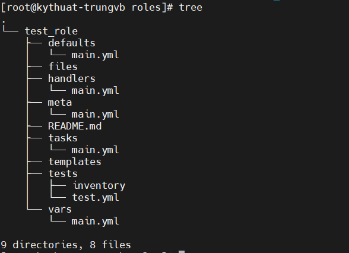

# Ansible roles

Bài viết này sẽ giới thiệu về ý tưởng của Ansible roles, cấu trúc của nó, và cách chúng ta có thể kết hợp chúng với playbooks của mình.

Chúng ta sẽ phân tích chức năng và tính ứng dụng của Ansible Roles trong quá trình tạo hay lấy roles từ Ansible Galaxy.

Hãy chắc chắn là bạn đã có kiến thức cơ bản về Ansible. Nếu không, hãy tham khảo series về Ansible của Nhân Hòa ngay tại trang wiki này nhé.

## I. Ansible Roles là gì?

Ansible Roles cung cấp 1 framework và cấu trúc để thiết lập các tasks, variables, handlers, metadata, templates, và các files khác. Chúng cho phép ta sử dụng lại và chia sẻ Ansible code 1 cách hiệu quả.

Bằng cách này, chúng ta có thể tham chiếu và gọi đến roles ở nhiều playbook với chỉ 1 vài dòng code trong khi chúng ta có thể sử dụng lại cùng roles trên nhiều projects mà không phải lặp đi lặp lại code.

## II. Tại sao Roles lại hiệu quả trong Ansible?

Khi bắt đầu với Ansible, chúng ta thường viết playbook để tự động hóa nhiều tasks một cách nhanh chóng. Trong quá trình đó, kỹ năng của chúng ta sẽ lên cao dần cho tới khi đạt đến 1 giới hạn. Và do đó, Ansible Roles là thứ để bứt phá giới hạn này.

Tổ chức Ansible content của chúng ta vào các roles cung cấp cho chúng ta 1 cấu trúc dễ dàng quản lý hơn nhiều so với sử dụng playbooks. Điều này có thể không quá rõ ràng trong những dự án nhỏ nhưng khi số lượng playbook tăng lên, độ phức tạp quả dự án cũng theo đó phát triển.

Cuối cùng, đặt Ansible code vào những roles cho phép ta tổ chức các dự án tự động hóa của mình thành các nhóm logic và tuân theo các mối bận tâm về nguyên tắc thiết kế phân tách. Sự phối hợp và tốc độ phát triển cũng được cải thiện nhiều khi những người dùng khác nhau có thể làm việc trên nhiều roles riêng biệt song song mà không phải sửa đổi chung 1 playbook.

## III. Cấu trúc Ansible Role

Hãy nhìn qua 1 cấu trúc thư mục role tiêu chuẩn. Với mỗi role, chúng ta định nghĩa 1 đường dẫn với cùng tên. Trong đó là các files được tập hợp thành các đường dẫn con phụ thuộc vào chức năng của chúng. 1 role phải có ít nhất 1 trong các đường dẫn tiêu chuẩn và có thể bỏ đi bất kỳ đường dẫn nào mà không cần thiết đến.

Để hỗ trợ chúng ta nhanh chóng tạo ra 1 bộ khung cấu trúc đường dẫn role, chúng ta có thể tận dụng lệnh ```ansible-galaxy init <role_name>```. Lệnh ```ansible-galaxy``` được hỗ trợ sẵn khi cài đặt Ansible, vì vậy không cần thiết phải cài đặt thêm gói nào cả.

Tạo 1 cấu trúc khung cho 1 role tên là ```test_role```:

```sh
ansible-galaxy init test_role
```



Ansible sẽ kiểm tra các file main.yaml, các biến trong vars, và nội dung liên quan trong mỗi đường dẫn con. Việc thêm vào những file YAML trong 1 vài đường dẫn là hoàn toàn có thể. Ví dụ, bạn có thể nhóm các tasks của bạn trong những file YAML riêng biệt tùy theo 1 vài đặc tính:

- **defaults**: Bao gồm các giá trị mặc định cho các biến của role. Ở đây chúng ta định nghĩa 1 vài biến mặc định, nhưng chúng có độ ưu tiên thấp nhất và cũng thường bị ghi đè bởi các phương thức khác để customzie role
- **files**: Chứa các file tĩnh và custom mà role sử dụng để thực hiện một vài tasks nhất định
- **handlers**: 1 tập hợp các handlers mà có thể kích hoạt bởi các tasks của role
- **meta**: Bao gồm thông tin metadata cho role, nó có thể là các dependencies (phụ thuộc), tác giả, license, nền tảng khả dụng,...
- **tasks**: 1 danh sách các tasks để thực hiện bởi role. Phần này có thể hiểu tương tự như task section trong 1 playbook
- **templates**: Bao gồm các file template Jinja2 sử dụng bởi các tasks của role
- **tests**: Bao gồm các file cấu hình liên quan đến kiểm thử role
- **vars**: Chứa các biến được định nghĩa cho role (các biến ở đây có độ ưu tiên cao hơn **defaults**)

Còn 1 đường dẫn khác không được khởi tạo tự động bởi lệnh ```ansible-galaxy init``` nhưng được đề cập trong Ansible docs, và bạn có thể thấy nó hữu dụng trong 1 vài trường hợp, đó là đường dẫn **library**. Bên trong nó, chúng ta định nghĩa bất kỳ custom modules và plugins nào mà chúng ta đã viết và sử dụng bởi role. Cuối cùng, chúng ta cũng có 1 file **README.md** mà có thể được điền để cung cấp cho người sử dụng thêm thông tin hữu ích về role.

## IV. Tạo Ansible Roles