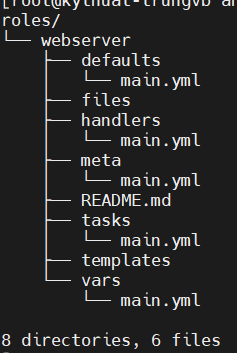
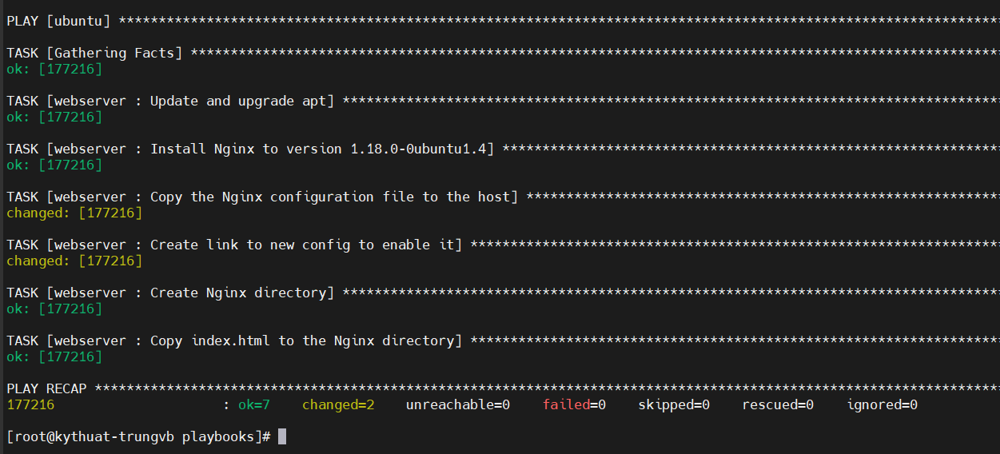
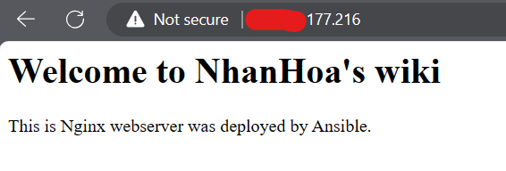

# Ansible roles

Bài viết này sẽ giới thiệu về ý tưởng của Ansible roles, cấu trúc của nó, và cách chúng ta có thể kết hợp chúng với playbooks.

Chúng ta sẽ phân tích chức năng và tính ứng dụng của Ansible Roles trong quá trình tạo hay lấy roles từ Ansible Galaxy.

Hãy chắc chắn là bạn đã có kiến thức cơ bản về Ansible. Nếu không, hãy tham khảo series về Ansible của Nhân Hòa ngay tại trang wiki này nhé.

## I. Ansible Roles là gì?

Ansible Roles cung cấp 1 framework và cấu trúc để thiết lập các tasks, variables, handlers, metadata, templates, và các files khác. Chúng cho phép ta sử dụng lại và chia sẻ Ansible code 1 cách hiệu quả.

Bằng cách này, chúng ta có thể tham chiếu và gọi đến roles ở nhiều playbook với chỉ 1 vài dòng code trong khi chúng ta có thể sử dụng lại cùng roles trên nhiều projects mà không phải lặp đi lặp lại code.

## II. Tại sao Roles lại hiệu quả trong Ansible?

Khi bắt đầu với Ansible, chúng ta thường viết playbook để tự động hóa nhiều tasks một cách nhanh chóng. Trong quá trình đó, kỹ năng của chúng ta sẽ lên cao dần cho tới khi đạt đến 1 giới hạn. Và do đó, Ansible Roles là thứ để bứt phá giới hạn này.

Tổ chức Ansible content của chúng ta vào các roles cung cấp cho chúng ta 1 cấu trúc dễ dàng quản lý hơn nhiều so với sử dụng playbooks. Điều này có thể không quá rõ ràng trong những dự án nhỏ nhưng khi số lượng playbook tăng lên, độ phức tạp quả dự án cũng theo đó phát triển.

Cuối cùng, đặt Ansible code vào những roles cho phép ta tổ chức các dự án tự động hóa của mình thành các nhóm logic và tuân theo các mối bận tâm về nguyên tắc thiết kế phân tách. Sự phối hợp và tốc độ phát triển cũng được cải thiện nhiều khi những người dùng khác nhau có thể làm việc trên nhiều roles riêng biệt song song mà không phải sửa đổi chung 1 playbook.

## III. Cấu trúc Ansible Role

Hãy nhìn qua 1 cấu trúc thư mục role tiêu chuẩn. Với mỗi role, chúng ta định nghĩa 1 đường dẫn với cùng tên. Trong đó là các files được tập hợp thành các đường dẫn con phụ thuộc vào chức năng của chúng. 1 role phải có ít nhất 1 trong các đường dẫn tiêu chuẩn và có thể bỏ đi bất kỳ đường dẫn nào mà không cần thiết đến.

Để hỗ trợ chúng ta nhanh chóng tạo ra 1 bộ khung cấu trúc đường dẫn role, chúng ta có thể tận dụng lệnh ```ansible-galaxy init <role_name>```. Lệnh ```ansible-galaxy``` được hỗ trợ sẵn khi cài đặt Ansible, vì vậy không cần thiết phải cài đặt thêm gói nào cả.

Tạo 1 cấu trúc khung cho 1 role tên là ```test_role```:

```sh
ansible-galaxy init test_role
```


Ansible sẽ kiểm tra các file main.yaml, các biến trong vars, và nội dung liên quan trong mỗi đường dẫn con. Việc thêm vào những file YAML trong 1 vài đường dẫn là hoàn toàn có thể. Ví dụ, bạn có thể nhóm các tasks của bạn trong những file YAML riêng biệt tùy theo 1 vài đặc tính:

- **defaults**: Bao gồm các giá trị mặc định cho các biến của role. Ở đây chúng ta định nghĩa 1 vài biến mặc định, nhưng chúng có độ ưu tiên thấp nhất và cũng thường bị ghi đè bởi các phương thức khác để customzie role
- **files**: Chứa các file tĩnh và custom mà role sử dụng để thực hiện một vài tasks nhất định
- **handlers**: 1 tập hợp các handlers mà có thể kích hoạt bởi các tasks của role
- **meta**: Bao gồm thông tin metadata cho role, nó có thể là các dependencies (phụ thuộc), tác giả, license, nền tảng khả dụng,...
- **tasks**: 1 danh sách các tasks để thực hiện bởi role. Phần này có thể hiểu tương tự như task section trong 1 playbook
- **templates**: Bao gồm các file template Jinja2 sử dụng bởi các tasks của role
- **tests**: Bao gồm các file cấu hình liên quan đến kiểm thử role
- **vars**: Chứa các biến được định nghĩa cho role (các biến ở đây có độ ưu tiên cao hơn **defaults**)

Còn 1 đường dẫn khác không được khởi tạo tự động bởi lệnh ```ansible-galaxy init``` nhưng được đề cập trong Ansible docs, và bạn có thể thấy nó hữu dụng trong 1 vài trường hợp, đó là đường dẫn **library**. Bên trong nó, chúng ta định nghĩa bất kỳ custom modules và plugins nào mà chúng ta đã viết và sử dụng bởi role. Cuối cùng, chúng ta cũng có 1 file **README.md** mà có thể được điền để cung cấp cho người sử dụng thêm thông tin hữu ích về role.

## IV. Tạo Ansible Roles

1 điều mà bạn có thể muốn làm là tái cấu trúc 1 Ansible playbook thành 1 role. Để đạt được điều đó, chúng ta phải phân tích từng thành phần của 1 playbook và kết nối chúng lại thành 1 role nhờ sử dụng các thư mục như đã đề cập bên trên.

Phần này sẽ ví dụ về cách tạo 1 role mới cho việc cài đặt và cấu hình 1 webserver Nginx cơ bản.

Ansible tìm kiếm role được tham chiếu trong các đường dẫn chung như thư mục của playbook điều phối, đường dẫn ```roles/```, hoặc đường dẫn được cấu hình trong ```roles_path```. Ta cũng có thể thiết lập 1 đường dẫn tùy chỉnh khi tham chiếu 1 role bằng cách:

```sh
- hosts: all
  roles:
    - role: "/custom_path/to/the/role"
```

Sử dụng lệnh ```ansible-galaxy init```, chúng ta khởi tạo cấu trúc thư mục khởi đầu cho 1 role tên là ```webserver``` bên trong 1 đường dẫn cha tên là ```roles```. Hãy xóa đường dẫn ```tests``` vì chúng ta sẽ không sử dụng đến nó. Chúng ta sẽ thấy cách sử dụng tất cả các đường dẫn khác ở bài viết này.



Đầu tiên, hãy định nghĩa thành phần chứng năng quan trọng nhất của role, các **tasks**. Đi vào đường dẫn ```tasks``` và chỉnh sửa tệp ```main.yml```

```sh
# tasks file for webserver
- name: Update and upgrade apt
  ansible.builtin.apt:
    update_cache: yes
    cache_valid_time: 3600
    upgrade: yes

- name: "Install Nginx to version {{ nginx_version }}"
  ansible.builtin.apt:
    name: "nginx={{ nginx_version }}"
    state: present

- name: Copy the Nginx configuration file to the host
  template:
    src: templates/nginx.conf.j2
    dest: /etc/nginx/sites-available/default

- name: Create link to new config to enable it
  file:
    dest: /etc/nginx/sites-enabled/default
    src: /etc/nginx/sites-available/default
    state: link

- name: Create Nginx directory
  file:
    path: "{{ nginx_custom_directory }}"
    state: directory

- name: Copy index.html to the Nginx directory
  copy:
    src: files/index.html
    dest: "{{ nginx_custom_directory }}/index.html"
  notify: Restart Nginx service
```

Trong playbook bên trên, chúng ta đã:

- Update OS
- Cài đặt nginx
- Thiết lập cấu hình tùy chỉnh căn bản cho mục đích demo

Tiếp theo, chúng ta sẽ di chuyển đến thư mục ```defaults```, nơi chúng ta sẽ thiết lập các giá trị mặc định cho các biến được sử dụng bên trong tasks. Nếu không được định nghĩa sau đó, những biến này sẽ lấy giá trị mặc định tại đây.

Chỉnh sửa file ```roles/webserver/defaults/main.yml```:

```sh
# defaults file for webserver
nginx_version: 1.18.0-0ubuntu1.4
nginx_custom_directory: /var/www/example_domain
```

Di chuyển đến đường dẫn ```vars```, ở đây, chúng ta định nghĩa các giá trị với độ ưu tiên cao hơn và chúng sẽ không bị ghi đề khi chạy role.

Ví dụ, chỉnh sửa file ```roles/webserver/vars/main.yml``` như sau:

```sh
# vars file for webserver
nginx_custom_directory: /home/ubuntu/nginx
```

Trong đường dẫn ```handlers```, chúng ta định nghĩa bất kỳ handler nào được kích hoạt bởi tasks của chúng ta. Một trong các tasks bên trên chúng ta có sử dụng từ khóa ```notify``` vì nó cần kích hoạt handler khởi động lại Nginx service.

Chỉnh sửa file ```roles/webserver/handlers/main.yml``` như sau:

```sh
# handlers file for webserver
- name: Restart Nginx service
  service:
    name: nginx
    state: restarted
```

Trong đường dẫn ```templates```, chúng ta sẽ sử dụng 1 file template Jinja2 cho cấu hình Nginx mà được sử dụng ở 1 trong những tasks bên trên:

Tạo file ```roles/webserver/templates/nginx.conf.j2``` như sau:

```sh
server {
    listen 80;
    listen [::]:80;
    root {{ nginx_custom_directory }};
    index index.html;
    location / {
        try_files $uri $uri/ =404;
    }
}
```

Trong đường dẫn ```files```, chúng ta định nghĩa 1 file tĩnh ```index.html``` mà sẽ sử dụng làm trang web demo

Tạo file ```roles/webserver/files/index.html```:

```sh
<html>
 <head>
  <title>Hello from Nginx</title>
 </head>
 <body>
  <h1>Welcome to NhanHoa's wiki</h1>
  <p>This is Nginx webserver was deployed by Ansible.</p>
 </body>
</html>
```

Chúng ta sử dụng đường dẫn ```meta``` để thêm metadata và thông tin về role. Bất kỳ role dependencies nào đều được đề cập ở đây.

Trong file ```roles/webserver/meta/main.yml```:

```sh
galaxy_info:
  author: Ioannis Mosutakis
  description: Installs Nginx and configures a minimal test webserver
  company: ACME Corp
  license: Apache-2.0
  role_name: websercer
 
  min_ansible_version: "2.1"
 
 # If this is a Container Enabled role, provide the minimum Ansible Container version.
 # min_ansible_container_version:
 
 #
 # Provide a list of supported platforms, and for each platform a list of versions.
 # If you don't wish to enumerate all versions for a particular platform, use 'all'.
 # To view available platforms and versions (or releases), visit:
 # https://galaxy.ansible.com/api/v1/platforms/
 #
  platforms:
  - name: Ubuntu
    versions:
      - bionic
      - focal
 
  galaxy_tags:
    - nginx
    - webserver
    - development
    - test
 
dependencies: []
 # List your role dependencies here, one per line. Be sure to remove the '[]' above,
 # if you add dependencies to this list.
```

Cuối cùng, chúng ta cũng nên cập nhật file ```README.md``` để người sử dụng có thể đọc và hiểu được công việc mà role sẽ thực hiện.

## V. Sử dụng Ansible Roles

Một khi chúng ta đã định nghĩa tất cả các thành phần cần thiết của role, vậy thì công việc còn lại bây giờ chỉ là sử dụng nó trong các *plays*. Cách truyền thống và rõ ràng nhất để tham chiếu 1 role ở tầng play là sử dụng tùy chọn ```roles```:

```sh
- hosts: all
  become: true
  roles:
    - webserver
```

Với tùy chọn này, mỗi role được định nghĩa trong playbook của chúng ta sẽ được thực thi trước bất kỳ tasks nào khác trong *play*.

Dưới đây là 1 ví dụ:



OK! Tất cả các tasks đã hoàn thành. Hãy kiểm tra xem thực sự play đã chạy thành công hay chưa:



Khi sử dụng tùy chọn ```roles```, chúng ta cũng có thể ghi đè bất kỳ biến mặc định nào của role bằng cú pháp như sau:

```sh
- hosts: all
 become: true
 roles:
   - role: webserver
     vars:
       nginx_version: 1.17.10-0ubuntu1
```

Ngoại trừ định nghĩa roles ở tầng play với tùy chọn ```roles```, chúng ta cũng có thể làm điều này ở tầng tasks với tùy chọn ```include_role```. Chúng rất hữu dụng khi ta muốn chạy role và tasks ở những thứ tự khác nhau:

Lấy ví dụ:

```sh
- hosts: all
  tasks:
    - name: Print a message
      ansible.builtin.debug:
        msg: "This task runs first and before the example role"
 
    - name: Include the example role and run its tasks
      include_role:
        name: example
 
    - name: Print a message
      ansible.builtin.debug:
        msg: "This task runs after the example role"
  
    - name: Include the example_2 role and run its tasks in the end
      include_role:
        name: example_2
```

Ngay cả khi nếu ta định nghĩa 1 role nhiều lần, Ansible sẽ thực thi nó 1 lần duy nhất. Trong trường hợp chúng ta muốn chạy 1 role với các tham số khác nhau, hãy truyền vào đó những tập tham số riêng, điều này sẽ giúp nó có thể chạy được nhiều lần.

Dưới đây là 1 ví dụ:

```sh
- hosts: all
  roles:
    - role: test
      message: "First time"
    - role: test
      message: "Second time"
    - role: test
      message: "Third time"
```

## VI. Tips & Tricks

Phần này sẽ tổng hợp 1 vài tips & tricks mình tìm được trên mạng mà có lẽ bạn nên để ý:

- Luôn luôn sử dụng những tên có ý nghĩa cho roles, tasks, và biến. Ghi lại ý định và mục đích của role của bạn thật kỹ lưỡng. Hãy chỉ ra bất kỳ biến nào mà người dùng cần phải thiết lập. Đặt các giá trị mặc định hợp lý và đơn giản hóa roles của bạn nhiều nhất có thể để người dùng có thể làm quen nhanh chóng
- Không bao giờ đặt secrets hay dữ liệu nhạy cảm trong các tệp YAML trong role. Các thông tin này cần phải được truyền cho role vào thời điểm thực thi play và cũng không được lưu chúng ở bất kỳ code repo nào.
- Ban đầu, việc tạo ra 1 role có thể đảm nhiệm nhiều vai trò có thể rất thú vị. Như ở bên trên, chúng ta đã tạo 1 role có thể cài đặt nhiều thành phần khác nhau. Tuy nhiên, hãy cố tách roles của bạn ra thành nhiều roles khác nhau dựa trên đặc điểm về tính năng hay thành phần kỹ thuật
- Cố gắng giữ roles của bạn linh hoạt nhất có thể và tránh thêm quá nhiều phụ thuộc
- Để kiểm soát thứ tự thự thi của roles và tasks, sử dụng ```include_role``` thay vì từ khóa ```roles``` truyền thống
- Khi bạn đã quen dần với nó, hãy gom nhóm các tasks của bạn ở nhiều task file để nâng cao tính rõ ràng và tính tổ chức

## VII. Tổng kết

Trong bài viết này, Nhân Hòa đã giới thiệu đến các bạn cách sử dụng Ansible Roles để tái cấu trúc playbook của mình thay vì luôn phải viết lại chúng từ đầu.

Hãy tiếp tục đón đọc các bài viết mới của Nhân Hòa tại [Wiki Nhân Hòa](wiki.nhanhoa.com)

Chúc các bạn luôn may mắn và thành công trong công việc!