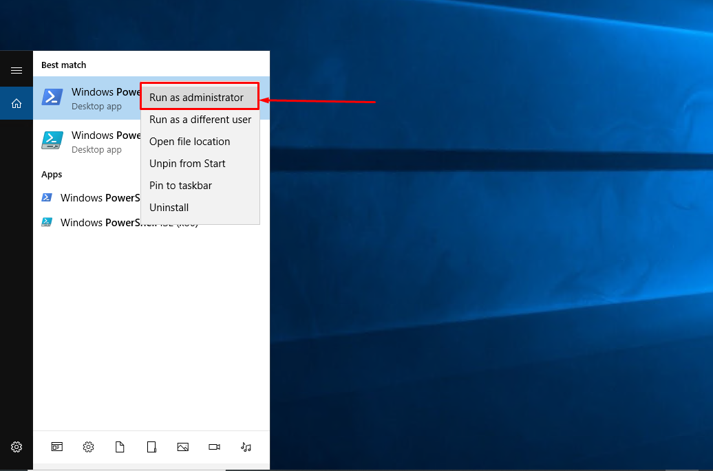
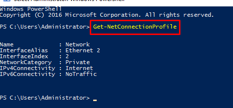
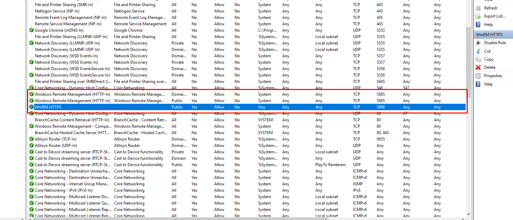
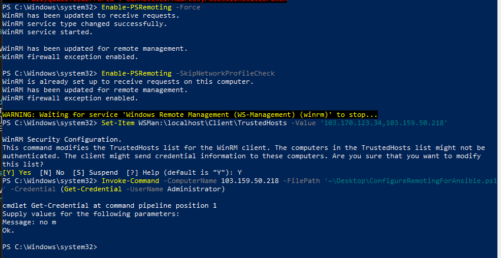
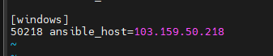
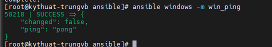

# Ansible trên Windows Server

Mặc dù Ansible được biết tới để quản lý và tự động hóa cho máy Linux thông qua SSH, nhưng bằng việc sử dụng Windows Remote Management (WinRM), Ansible nhờ đó cũng có thể quản lý tất cả các máy Windows.

## Prerequisites

Hãy chắc chắn các điều kiện sau được đảm bảo:
- 1 Ansible Control Node: Trong bài viết này sẽ sử dụng Ansible v2.9.27 và sử dụng bản phân phối CentOS 7 (lưu ý Windows chỉ hỗ trợ làm Node Manage, không thể làm Node Control)
- Node Control cần được cài đặt Python và Pip (Python v2 hay v3 đều ok)

```sh
yum -y install git python-pip libvirt-python libxml2-python-websockify cyrus-sasl-md5 python-devel
```

- 1 Windows Server 2012 R2 hoặc cao hơn để làm Node Manage: trong bài viết này sẽ sử dụng Windows Server 2016 với địa chỉ IP là 103.159.50.218
- Node Windows cần phải được kích hoạt PowerShell Remoting: 

Remote vào server và mở Powershell bằng quyền Administrator



Trong cửa sổ Powershell, nhập:

```sh
Get-NetConnectionProfile
```



Nếu trường ```NetworkCategory``` mà không phải là ```Private``` hoặc ```DomainAuthenticated``` thì ta set nó thành ```Private``` bằng lệnh:

```sh
Set-NetConnectionProfile -NetworkCategory Private
```

Giờ thì hãy kích hoạt động Powershell Remoting:

```sh
Enable-PSRemoting -Force
```

Khi chạy lệnh trên thì Windows sẽ thực hiện các tác vụ sau:
- Khởi động dịch vụ WinRM
- Đặt kiểu khởi động WinRM thành tự động
- Tạo trình lắng nghe để chấp nhận các yêu cầu trên bất kỳ địa chỉ IP nào
- Bật ngoại lệ tường lửa cho các giao tiếp WS-Management
- Đăng ký cấu hình phiên Microsoft PowerShell và Microsoft PowerShell Workflow nếu chúng chưa được đăng ký
- Đăng ký cấu hình phiên Microsoft PowerShell32 trên máy tính 64bit nếu nó chưa được đăng ký
- Cho phép tất cả các cấu hình phiên
- Thay đổi bộ mô tả bảo mật của tất cả các cấu hình phiên để cho phép truy cập từ xa
- Khởi động lại dịch vụ WinRM để thực hiện các thay đổi trước đó có hiệu lực

Chạy lệnh ```Enable-PSRemoting``` sẽ mở port 5985 trên firewall cho Domain và Private Network. Nếu ta muốn cho cả Public Network được allow thì phải thêm option ```-SkipNetworkProfileCheck```, mặc định option này sẽ cho phép Public Network nhưng ở cùng subnet. Để cho phép kết nối từ tất cả thiết bị trên mạng công cộng, ta có thể sửa rule WINRM-HTTP-IN-TCP như sau:

```sh
Set-NetFirewallRule -Name 'WINRM-HTTP-IN-TCP' -RemoteAddress any
```

Cuồi cùng, add các host mà ta sẽ dùng vào trustedhost của Node Win:

```sh
Set-Item WSMan:\localhost\Client\TrustedHosts -Value '14.248.82.194,103.170.123.34'
```

*Lưu ý:* để thêm host khác, sử dụng option -Concatenate ở cuối



## Thiết lập WinRM listener trên Windows

Trước khi Ansible có thể giao tiếp với 1 Node Windows, nó phải có thể tạo được kết nối đến Node đó. Nó làm vậy thông qua Microsoft protocol WinRM. WinRM là 1 giao thức tương tự như PowerShell Remoting sử dụng để chạy lệnh từ xa trong PowerShell

Ansible cung cấp 1 PowerShell script để thiết lập rất nhiều tùy chọn WinRM. Việc đầu tiên bạn cần làm là tải đoạn script này và chạy nó ở Node Windows. Để làm được điều này thì trước tiên phải kích hoạt PowerShell Remoting (như hướng dẫn ở trên).

Tải Script ở: [ConfigureRemotingForAnsible.ps1 PowerShell Remoting script](https://github.com/ansible/ansible/blob/devel/examples/scripts/ConfigureRemotingForAnsible.ps1)

Chạy script thiết lập trên Windows Node sẽ cần sử dụng lệnh ```Invoke-Command```. Lệnh dưới đây sẽ chạy ở trên **MÁY TÍNH CÁ NHÂN** và sau đó nhập vào password của user Administrator

```sh
Enable-PSRemoting -Force
Enable-PSRemoting -SkipNetworkProfileCheck
Set-Item WSMan:\localhost\Client\TrustedHosts -Value '103.170.123.34,103.159.50.218'
Invoke-Command -ComputerName 103.159.50.218 -FilePath '~\Desktop\ConfigureRemotingForAnsible.ps1' -Credential (Get-Credential -UserName Administrator)
```



**Lưu ý**: để chạy được powershell ở máy tính cá nhân, trước hết hãy mở powershell bằng quyền Administrator sau đó sử dụng lệnh sau

```sh
Set-ExecutionPolicy -Scope CurrentUser Unrestricted
Set-ExecutionPolicy -Scope LocalMachine Unrestricted
```

## Thiết lập Node Control

Giờ Node Windows đã sẵn sàng cho Ansible rồi, tiếp theo hãy thiết lập Node Control để có thể giao tiếp với Node Manage.

1. SSH vào Node Control
2. Cài đặt module ```pywinrm``` của Python

```sh
pip install pywinrm
yum install python2-winrm.noarch
```

3. Thêm thông tin Node Windows vào file inventory của Ansible



4. Sau đó, thêm 1 vài biến vào file inventory

```sh
[windows:vars]
ansible_user=Administrator ## tên user mà Ansible sẽ sử dụng
ansible_password=<your_password> ## password
ansible_connection=winrm ## Loại kết nối mà Ansible sẽ sử dụng để giao tiếp vs Node Windows
ansible_winrm_server_cert_validation=ignore ## bỏ qua ceritificate check
```

5. Bây giờ, sử dụng ```win_ping``` module để thử kiểm tra kết nối đến Node Windows đã oke chưa

```sh
ansible windows -m win_ping
```



