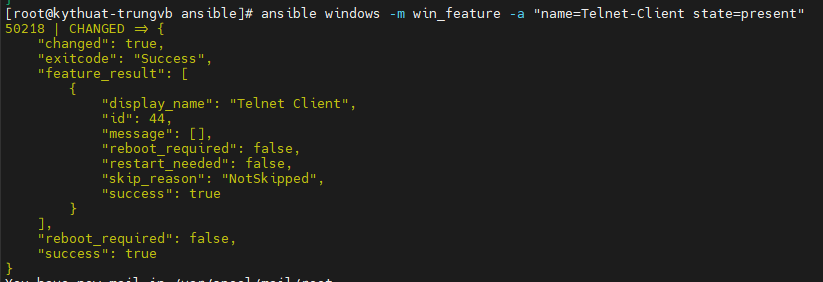
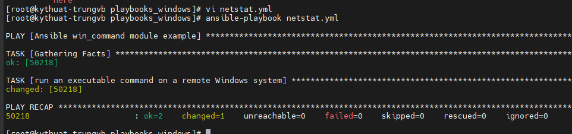
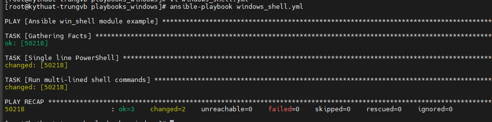
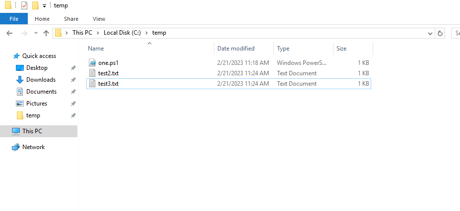
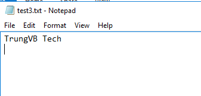
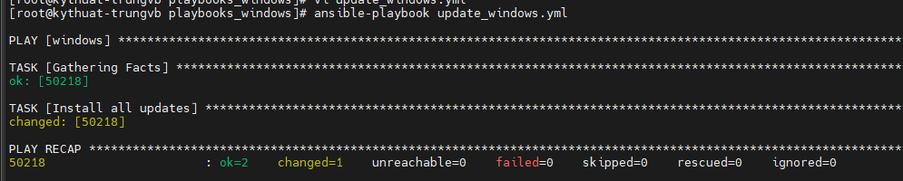

# Ad-hoc command và Playbook trên Ansible Windows

Trong bài viết trước, Nhân Hòa đã giới thiệu về cách thiết lập và cài đặt để Ansible hoạt động trên Windows Node. Vậy trong bài viết này, hãy cùng tìm hiểu về ad-hoc command và playbook trên Windows.

## Ad-hoc command trên Node Windows

Để sử dụng ad-hoc command, ta dùng module ```win_feature``` và tùy chọn ```-a``` với 2 tham số là ```name``` (tên feature) và ```state``` (trạng thái mong muốn)

```sh
ansible windows -m win_feature -a "name=Telnet-Client state=present"
```



Do telnet chưa được cài đặt nên sau khi chạy lệnh thì Ansible sẽ tiến hành thực hiện việc này.

## Tạo và thực thi Ansible Playbook cho Node Windows

Khi bạn đã hiểu được cách thức hoạt động của ad-hoc command, hãy chuyển qua viết Playbook cho Windows. 1 Ansible Playbook kết hợp nhiều command vào 1 chỗ để cho phép ta viết những logic phức tạp hơn và thực hiện các công việc tự động hóa phức tạp

### Chạy lệnh Windows từ xa với module win_command

Tạo 1 playbook với nội dung như sau:

```sh
---
- name: Ansible win_command module example  
  hosts: windows # host group to run the module on       
  tasks: 
  -  name: run an executable command on a remote Windows system
     win_command: netstat -e # win_command is a Windows module. 
     register: statistic
  -  name: debug
     debug: var=statistic
```

Sau đó chạy Playbook bằng lệnh

```sh
ansible-playbook ansible-windows.yml
```



### Chạy lệnh Powershell từ xa với module win_shell

Tạo 1 playbook với nội dung như sau:

```sh
- name: Ansible win_shell module example 
  hosts: windows
  tasks:
    - name: Single line PowerShell # Running single command using win_shell module
      win_shell: C:\temp\one.ps1
    - name: Run multi-lined shell commands 
      win_shell: |
        $text = 'TrungVB Tech'
        Set-Content -Path C:\temp\test3.txt -Value $text 
```

Playbook này sẽ thực hiện 2 task, đầu tiên là thực hiện powershell script lưu tại ```C:\temp\one.ps1```. Và 2 là thực hiện Powershell script tạo 1 file tên test3.txt với nội dung là TrungVB Tech.







### Update Windows với Ansible

Việc cập nhật các bản update của Windows thường xuyên là rất cần thiết vì nó khắc phục nhiều vấn đề về bảo mật và hiệu suất của máy chủ Windows.

Tuy nhiên nếu bạn có đến hàng trăm máy chủ thì việc truy cập từng máy 1 để thực hiện update bằng tay sẽ tốn rất nhiều công sức.

Ansible cung cấp 1 module gọi là ```win_update``` giúp ta thực hiện công việc nhàm chán này.

Chi tiết về ```win_update``` module xem tại: [Windows Update Module](https://docs.ansible.com/ansible/latest/collections/ansible/windows/win_updates_module.html)

Một vài ví dụ về sử dụng module ```win_update```:

```sh
- name: Run Updates and reboot then wait 10 mins
  hosts: windows
  tasks:
    win_updates:
      category_names:
        - Application
        - CriticalUpdates
        - SecurityUpdates
        - Updates
      accept_list:
        - KB5022838
      reboot: yes
      reboot_timeout: 600
```

Trong đó:
- ```category_names```: danh sách các danh mục để cập nhật. Để lấy danh sách, ta sử dụng ```state=searched```. 1 vài danh mục hợp lệ bao gồm: Application, Connectors, Critical Updates, Definition Updates, Developer Kits, Feature Packs, Guidance, Security Updates, Service Packs, Tools, Update Rollups, Updates, and Upgrades
- ```accept_list```: danh sách các bản update được sử dụng, trong ví dụ này ta dùng bản KB5022838
- ```reboot```: reboot sau khi update nếu cần thiết và tiếp tục update sau khi reboot
- ```reboot_timeout```: thời gian chờ để hệ thống reboot (được áp dụng khi reboot = yes và thời gian mặc định là 1200s)

```sh
- hosts: windows
  tasks:
    - name: Install all updates
      win_updates:
        category_names: '*'
        reboot: yes
```

