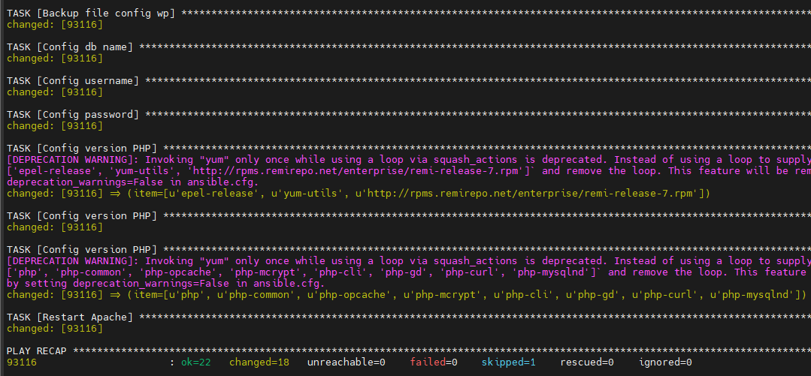
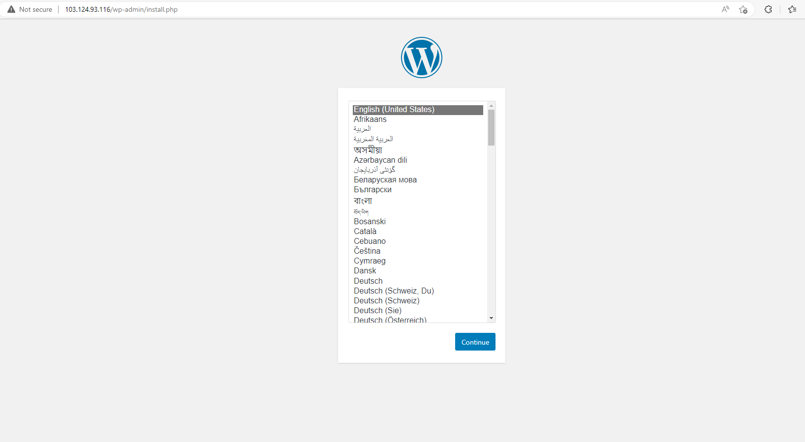

# Viết Playbook cài đặt Wordpress trên CentOS 7

Ở bài viết trước, Nhân Hòa đã giới thiệu về một số cú pháp cơ bản của Playbook. Vậy hôm nay hãy thực hành những gì đã học bằng cách viết 1 playbook để cài đặt Wordpress trên CentOS 7

## 1. Mô hình

Tiếp tục sử dụng mô hình từ các bài trước, nhưng giờ ta chỉ cần quan tâm đến Node Control và Node Manage thôi


## 2. Các công việc cần làm và các module liên quan

Để viết được 1 playbook, chúng ta trước hết phải biết rõ mình cần làm gì ở Node Manage và module nào giúp ta thực hiện việc đó.

### 2.1. Các công việc cần làm

Việc nắm được các bước mình cần phải làm là vô cùng cần thiết. Sẽ rất khó khăn nếu ta muốn tự động hóa một việc gì đó mà chính bản thân ta cũng chưa nắm được quy trình cần thực hiện.

Các bước cần làm để cài đặt Wordpress trên CentOS 7:
- Cài đặt LAMP
- Đảm bảo các service bật và các port được thông
- Cài đặt Wordpress
- Tạo cơ sở dữ liệu, người dùng cho Wordpress
- Update PHP nhằm tránh lỗi do version không được hỗ trợ bởi Wordpress bản mới

### 2.2. Các module liên quan

Như đã nói ở các bài viết trước đây, khi nói đến việc sử dụng Ansible thực chất là cách mà chúng ta sử dụng các module, do đây mới là thành phần chính thao tác trên Node Manage.

Các module được sử dụng trong bài viết này sẽ là:
- ```yum```: https://docs.ansible.com/ansible/latest/modules/yum_module.html
- ```service```: https://docs.ansible.com/ansible/latest/modules/service_module.html
- ```firewalld```: https://docs.ansible.com/ansible/latest/modules/firewalld_module.html
- ```get_url```: https://docs.ansible.com/ansible/latest/modules/get_url_module.html
- ```unarchive```: https://docs.ansible.com/ansible/latest/modules/unarchive_module.html
- ```shell```: https://docs.ansible.com/ansible/latest/modules/shell_module.html
- ```mysql_db```: https://docs.ansible.com/ansible/latest/modules/mysql_db_module.html
- ```mysql_user```: https://docs.ansible.com/ansible/latest/modules/mysql_user_module.html
- ```replace```: https://docs.ansible.com/ansible/latest/modules/replace_module.html

Cách tốt nhất để tìm kiếm module cần thiết để xử lý công việc đó là search Google.

## 3. Viết Playbook

Sau khi đã nắm được các thành phần sẽ xuất hiện trong Playbook thì chúng ta có thể bắt tay vào ghép nối chúng thành một kịch bản hoàn chỉnh

### 3.1. Khai báo

```sh
- hosts: centos7
  remote_user: root
```

### 3.2. Cài đặt LAMP

```sh
tasks:
  - name: Install LAMP
    yum: 
      name: '{{item}}'
      state: present
    with_items:
    - httpd
    - mariadb-server
    - mariadb
    - php
    - php-mysql
    - php-fpm
```

### 3.3. Đảm bảo các service cần thiết được bật và port được thông

```sh
- name: Ensure service enabled and started
  service:
    name: '{{item}}'
    state: started
    enabled: True
  with_items:
  - mariadb
  - httpd
- name: Ensure HTTP and HTTPS can pass the firewall
  firewalld:
    service: '{{item}}'
    state: enabled
    permanent: True
    immediate: True
  become: True
  with_items:
  - http
  - https
```

### 3.4. Tải, giải nén Wordpress

```sh
- name: Install php-gd,rsync
  yum:
    name: '{{item}}'
    state: present
  with_items:
  - php-gd
  - rsync
- name: Restart httpd
  service:
    name: httpd
    state: restarted
- name: Download wordpress
  get_url:
    url: https://wordpress.org/latest.zip
    dest: /root
- name: Extract wordpress
  unarchive:
    src: /root/wordpress-6.1.1.zip
    dest: /root
    remote_src: yes
- name: Rsync wordpress
  shell: rsync -avP /root/wordpress /var/www/html/
- name: Create folder uploads
  shell: mkdir /var/www/html/wp-content/uploads
- name: Set user:group
  shell: chown -R apache:apache /var/www/html/*
```

### 3.5. Tạo database và user cho Wordpress

```sh
- name: Install MySQL-python
  yum:
    name: MySQL-python
    state: present
- name: Create database wordpress
  mysql_db:
    name: wordpress
    state: present
- name: Create user wordpressuser
  mysql_user:
    name: wordpressuser
    host: localhost
    password: wordpresspassword
    priv: 'wordpress.*:ALL'
    state: present
- name: Backup file config wp
  shell: cp /var/www/html/wp-config-sample.php /var/www/html/wp-config.php
- name: Config db name
  replace:
    path: /var/www/html/wp-config.php
    regexp: 'database_name_here'
    replace: 'wordpress'
- name: Config username
  replace:
    path: /var/www/html/wp-config.php
    regexp: 'username_here'
    replace: 'wordpressuser'
- name: Config password database
  replace:
    path: /var/www/html/wp-config.php
    regexp: 'password_here'
    replace: 'wordpresspassword'
```

*Lưu ý:* MySQL-python là requirement của các module phía dưới, do đó, strongly recommend các bạn nên tham khảo document của module trước khi sử dụng nó

### 3.6. Update version PHP

```sh
- name: Config version PHP
  yum:
    name: '{{item}}'
    state: present
  with_items:
  - epel-release
  - yum-utils
  - http://rpms.remirepo.net/enterprise/remi-release-7.rpm
- name: Config version PHP
  shell: yum-config-manager --enable remi-php72
- name: Config version PHP
  yum:
    name: '{{item}}'
    state: present
  with_items:
  - php
  - php-common
  - php-opcache
  - php-mcrypt
  - php-cli
  - php-gd
  - php-curl
  - php-mysqlnd
- name: Restart Apache
  service:
    - name: httpd
    - state: restarted
```

## 4. Chạy Playbook

Sau khi đã hoàn tất, playbook sẽ nhìn như sau:

```sh
- hosts: centos7
  remote_user: root
  tasks:
  - name: Install LAMP
    yum:
      name: '{{item}}'
      state: present
    with_items:
    - httpd
    - mariadb-server
    - mariadb
    - php
    - php-mysql
    - php-fpm

  - name: Ensure service enabled and started
    service:
      name: '{{item}}'
      state: started
      enabled: True
    with_items:
    - mariadb
    - httpd
  - name: Collect facts about system services
    service_facts:
    register: service_status
  - name: Ensure HTTP and HTTPS can pass the firewall
    firewalld:
      service: '{{item}}'
      state: enabled
      permanent: True
      immediate: True
    become: True
    with_items:
    - http
    - https
    when: service_status.ansible_facts.services['firewalld.service'].state == "active"

  - name: Install php-gd,rsync
    yum:
      name: '{{item}}'
      state: present
    with_items:
    - php-gd
    - rsync
  - name: Restart httpd
    service:
      name: httpd
      state: restarted
  - name: Down wordpress
    get_url:
      url: http://wordpress.org/wordpress-5.3.2.tar.gz
      dest: /root
  - name: extract wordpress
    unarchive:
      src: /root/wordpress-5.3.2.tar.gz
      dest: /root
      remote_src: yes
  - name: rsync wordpress
    shell: rsync -avP /root/wordpress/ /var/www/html/
  - name: Create folder uploads
    shell: mkdir /var/www/html/wp-content/uploads
  - name: Set user:group
    shell: chown -R apache:apache /var/www/html/*

  - name: Install MySQL-python
    yum:
      name: MySQL-python
      state: present
  - name: Create database wordpress
    mysql_db:
      name: wordpress
      state: present
  - name: Create user wordpressuser
    mysql_user:
      name: wordpressuser
      host: localhost
      password: wordpresspassword
      priv: 'wordpress.*:ALL'
      state: present

  - name: Backup file config wp
    shell: cp /var/www/html/wp-config-sample.php /var/www/html/wp-config.php
  - name: Config db name
    replace:
      path: /var/www/html/wp-config.php
      regexp: 'database_name_here'
      replace: 'wordpress'
  - name: Config username
    replace:
      path: /var/www/html/wp-config.php
      regexp: 'username_here'
      replace: 'wordpressuser'
  - name: Config password
    replace:
      path: /var/www/html/wp-config.php
      regexp: 'password_here'
      replace: 'wordpresspassword'

  - name: Config version PHP
    yum:
      name: '{{item}}'
      state: present
    with_items:
    - epel-release
    - yum-utils
    - http://rpms.remirepo.net/enterprise/remi-release-7.rpm
  - name: Config version PHP
    shell: yum-config-manager --enable remi-php72
  - name: Config version PHP
    yum:
      name: '{{item}}'
      state: present
    with_items:
    - php
    - php-common
    - php-opcache
    - php-mcrypt
    - php-cli
    - php-gd
    - php-curl
    - php-mysqlnd
  - name: Restart Apache
    service:
      name: httpd
      state: restarted
```

Giờ chúng ta hãy chạy nó bằng ```ansible-playbook```

```sh
ansible-playbook -o /etc/ansible/hosts playbook-wordpress.yml
```



