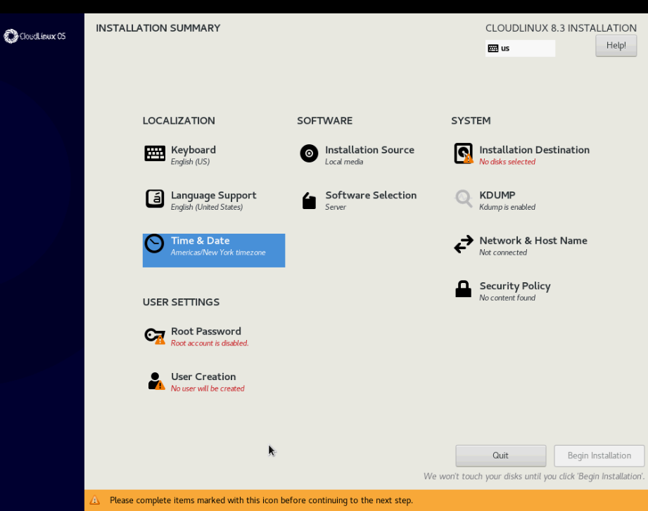
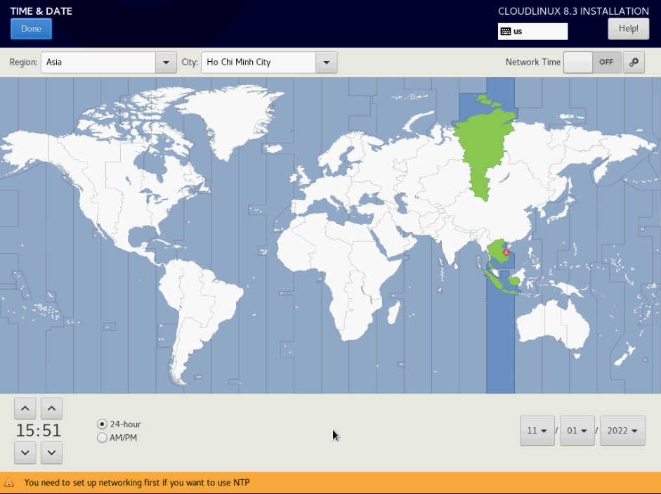
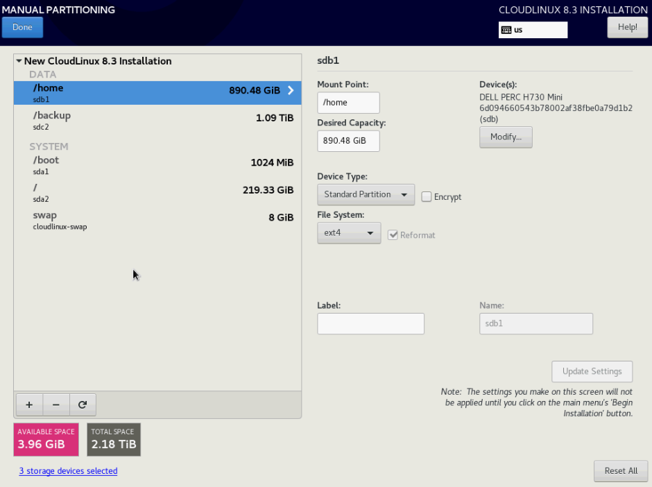
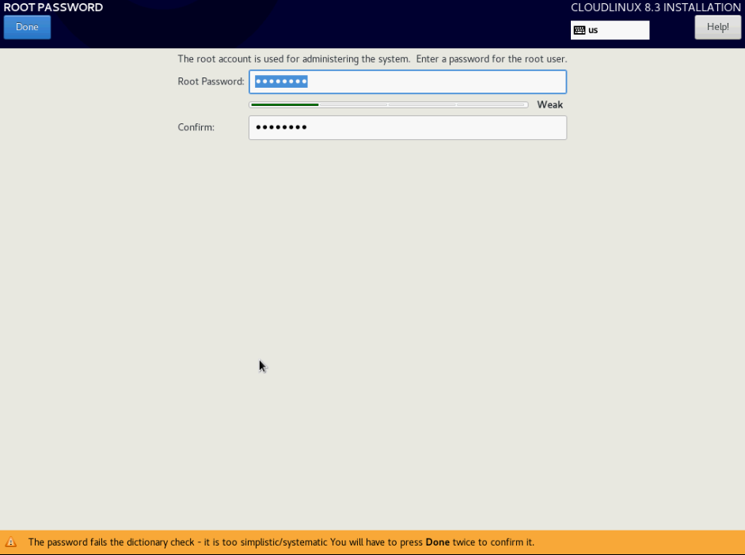
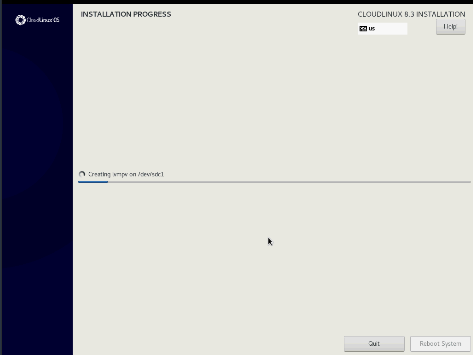
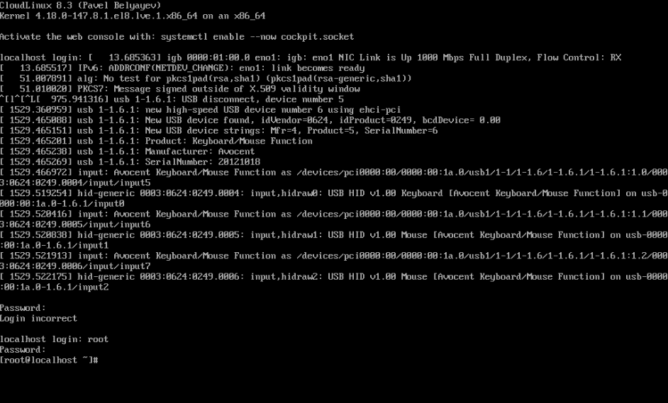

# CloudLinux trên CentOS 7

## Giới thiệu chung về CloudLinux

Hệ điều hành CloudLinux là nền tảng hàng đầu cho tính đa năng. Nó cải thiện độ ổn định, mật độ và bảo mật của máy chủ bằng cách cô lập từng đối tượng thuê hosting và cấp cho người dùng lượng tài nguyên máy chủ được phân bổ nhất định. Điều này tạo ra một môi trường giống như 1 máy chủ ảo hơn là 1 tài khoản lưu trữ được chia sẻ. Bằng cách đó, CloudLinux OS giảm chi phí vận hành và tăng mức độ người dùng trên một máy chủ, đồng thời tăng lợi nhuận

CloudLinux OS được thiết kế cho các nhà cung cấp dịch vụ lưu trữ chia sẻ. Nó cô lập mỗi khách hàng thành 1 Light Virtual Environment riêng biệt, phân vùng, phân bổ và giới hạn tài nguyên máy chủ, như RAM, CPU, I/O và số lượng kết nối cho từng người dùng

## Cài đặt CloudLinux

#### 1. Cấu hình RAID

- 2 ổ OS cài raid1 :240Gb Samsung
- 2 ổ home cũng cài raid 1 : 960Gb Samsung
- 1 ổ backup sau mount vào backup sau : 1.2Tb

#### 2. Cài đặt CloudLinux

- Boot vào đĩa chứa file cài đặt CloudLinux

- Cấu hình từng phần một



- Timezone



- Phân vùng



- Thiết lập password cho tài khoản root



- Chờ đợi quá trình cài đặt hoàn tất



- Xong



- Cấu hình card mạng IP tĩnh

```sh
vi /etc/sysconfig/network-scripts
#...
```

