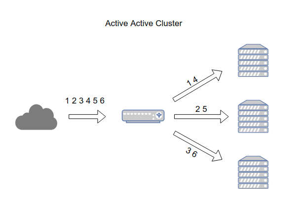
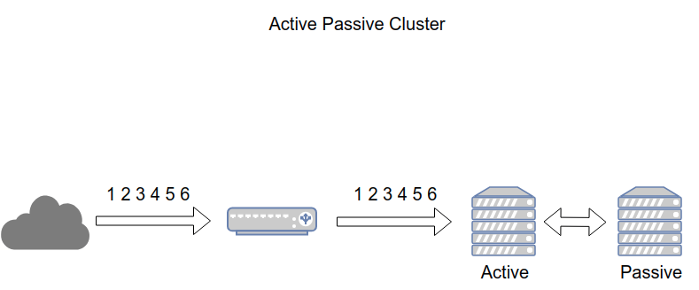

# Tổng quan về Cluster

Cluster là kiến trúc nâng cao khả năng sẵn sàng cho các hệ thống dịch vụ. Hệ thống cluster cho phép nhiều máy chủ chạy kết hợp, đồng bộ với nhau. Hệ thống Cluster nâng cao khả năng chịu lỗi của hệ thống. Trong trường hợp có lỗi xảy ra, các dịch vụ bên trong Cluster sẽ tự động loại trừ lỗi, cố gắng khôi phục, duy trì tính ổn định, tính sẵn sàng của dịch vụ.

Cluster thường được tìm thấy ở các hệ thống thanh toán trực tuyến, ngân hàng, các cơ sở dữ liệu, hệ thống lưu trữ,...

## 1. Tính chất

- Cân bằng tải các cụm (```load balancing```): các node bên trong cluster hoạt động song song, chia sẻ các tác vụ để nâng cao hiệu năng
- Tính sẵn sàng cao (```high availability```): các tài nguyên bên trong cluster luôn sẵn sàng xử lý yêu cầu, ngay cả khi có vấn đề xảy ra với các thành phần bên trong (hardware, software)
- Khả năng mở rộng (```scalability```): khi tài nguyên có thể sử dụng của hệ thống tới giới hạn, ta có thể dễ dàng bổ sung thêm tài nguyên của cluster bằng cách bổ sung thêm các node
- Độ tin cậy (```reliability```): hệ thống cluster giảm thiểu tần số lỗi có thể xảy ra, giảm thiểu các vấn đề dẫn tới ngừng hoạt động của hệ thống

## 2. Các thuật ngữ

- ```Cluster```: Nhóm các server dành riêng để giải quyết 1 vấn đề, có khả năng kết nối, san sẻ các tác vụ
- ```Node```: Server thuộc cluster
- ```Failover```: Khi 1 hoặc nhiều node trong Cluster xảy ra vấn đề, các tài nguyên (resource) tự động được chuyển tới các node sẵn sàng phục vụ
- ```Failback```: Khi node lỗi phục hồi, sẵn sàng phục vụ, cluster tự động trả lại tài nguyên cho node
- ```Fault-tolerant cluster```: Đề cập đến khả năng chịu lỗi của hệ thống trên các thành phần, cho phép dịch vụ hoạt động ngay cả khi một vài thành phần gặp sự cố
- ```Heartbeat```: Tín hiệu xuất phát từ các node trong cụm với mục đích xác minh chúng còn sống và đang hoạt động. Nếu hearbeat tại 1 node ngừng hoạt động, cluster sẽ đánh dấu thành phần đó gặp sự cố và chuyển tài nguyên tại node lỗi sang node đang sẵn sàng phục vụ
- ```Interconnect```: Kết nối giữa các node. Thường là các thông tin về trạng thái, heartbeat, dữ liệu chia sẻ
- ```Primary server, secondary server```: Trong cluster dạng ```Active/Passive```, node đang đáp ứng giải quyết yêu cầu gọi là Primary server. Node đang chờ hay dự phòng được gọi là ```Secondary server```
- ```Quorum```: Trong cluster chứa nhiều tài nguyên, nên dễ xảy ra sự phân mảnh (split-brain) tức là 1 cluster lớn phân thành nhiều cluster nhỏ, điều này làm ảnh hưởng đến sự đồng bộ tài nguyên, mất tự toàn vẹn của hệ thống. Do đó Quorum được thiết kế để ngăn chặn hiện tượng phân mảnh
- ```Resource```: Tài nguyên của cụm, cũng có thể hiểu là tài nguyên mà dịch vụ cung cấp
- ```STONITH / Fencing```: STONITH là viết tắt của cụm từ Shoot Other Node In The Head đây là một kỹ thuật dành cho fencing. Fencing là kỹ thuật cô lập tài nguyên lại từng node trong Cluster. STONITH "lập hàng rào" node bị hỏng bằng cách tắt hoặc khởi động lại node đó.

## 3. Chế độ hoạt động

### 3.1. Active - Active

Active - Active cluster được tạo ra từ ít nhất 2 node, cả 2 node chạy đồng thời xử lý cùng 1 loại dịch vụ. Mục đích chính của Active Active Cluster là tối ưu hóa cho hoạt động cân bằng tải (load balancing). 

Lòa Balancing sẽ phân phối các tác vụ hệ thống tới tất cả các node bên trong cluster, tránh tình trạng các node xử lý các tác vụ không cân bằng dẫn tới tình trạng quá tải. Bên cạnh đó, Active - Active Cluster nâng cao thông lượng (throughput) và thời gian phản hồi.

Khuyến cáo cho chế độ Active Active Cluster là các node trong cụm cần được cấu hình giống nhau tránh tình trạng phân mảnh cụm



### 3.2. Active - Passive

Giống cấu hình Active - Active, Active - Passive cluster cần ít nhất 2 node, tuy nhiên không phải tất cả các node đều sẵn sàng xử lý yêu cầu. VD: Nếu có 2 node thì sẽ có 1 node chạy ở chế độ passive hoặc standby.

Trong trường hợp Active Node xảy ra vấn đề, Passive Node sẽ chuyển trạng thái thành active, tiếp quản xử lý các yêu cầu

