# Triển khai HAProxy Pacemaker cho Cluster Galera 3 node trên CentOS 7

## Chuẩn bị

Server có cấu hình và IP như sau:

|Hostname|Hardware|Interface|
|:-|:-|:-|
|node1|2 vCPU - 2 GB RAM - 100 GB Disk|public: 172.16.6.153 - private: 192.168.60.153|
|node2|2 vCPU - 2 GB RAM - 100 GB Disk|public: 172.16.6.154 - private: 192.168.60.154|
|node3|2 vCPU - 2 GB RAM - 100 GB Disk|public: 172.16.6.155 - private: 192.168.60.155|

Mô hình

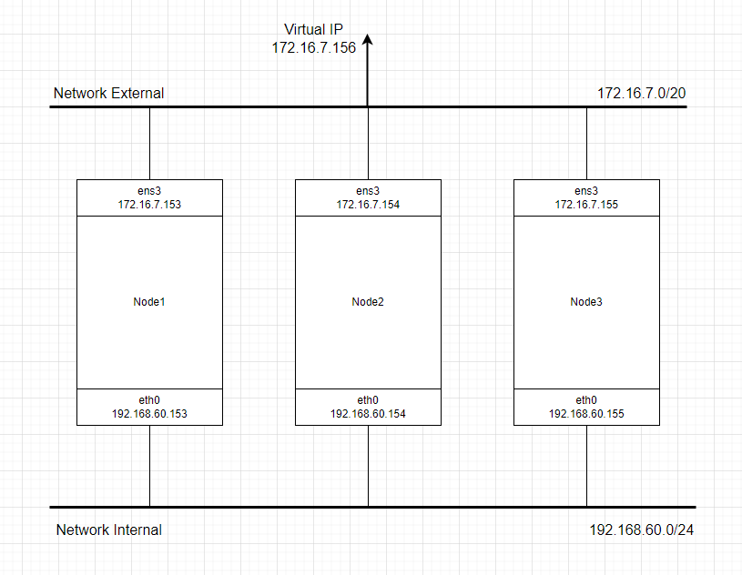

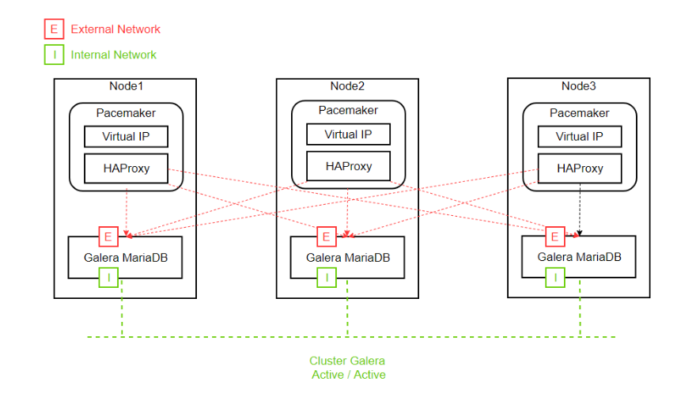

## Thiết lập Galera trên 3 node CentOS 7

**MariaDB Galera Cluster** là giải pháp sao chép đồng bộ nâng cao tính sẵn sàng cho MariaDB. Galera hỗ trợ chế độ Active-Active tức có thể truy cập, ghi dữ liệu đồng thời trên tất các node MariaDB thuộc Galera Cluster.

### Thiết lập ban đầu

Trên cả 3 node, cấu hình như sau:

Tắt firewall, SELinux, khởi động lại

```sh
sed -i 's/SELINUX=enforcing/SELINUX=disabled/g' /etc/sysconfig/selinux
sed -i 's/SELINUX=enforcing/SELINUX=disabled/g' /etc/selinux/config
systemctl stop firewalld
systemctl disable firewalld
init 6
```

Cấu hình host

```sh
echo "172.16.7.153 node7153" >> /etc/hosts
echo "172.16.7.154 node7154" >> /etc/hosts
echo "172.16.7.155 node7155" >> /etc/hosts
```

### Cài đặt MariaDB 10.10

Các bước sau cũng thực hiện trên tất cả các node

Khai báo repo

```sh
echo '[mariadb]
name = MariaDB
baseurl = http://mirror.mariadb.org/yum/10.10/centos7-amd64/
gpgkey=https://yum.mariadb.org/RPM-GPG-KEY-MariaDB
gpgcheck=1' >> /etc/yum.repos.d/MariaDB.repo
yum install -y epel-release
yum -y update
```

Cài đặt MariaDB

```sh
yum install -y mariadb mariadb-server
```

Cài đặt Galera và các gói hỗ trợ

```sh
yum install -y galera rsync
```

Tắt MariaDB (do liên quan tới cấu hình Galera MariaDB)

```sh
systemctl stop mariadb
```

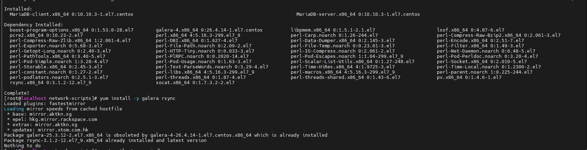

### Cấu hình Galera Cluster

Cấu hình như sau (lưu ý sửa đổi phù hợp với từng node)

```sh
cp /etc/my.cnf.d/server.cnf /etc/my.cnf.d/server.cnf.bak

echo '[server]
[mysqld]
bind-address=172.16.7.153

[galera]
wsrep_on=ON
wsrep_provider=/usr/lib64/galera/libgalera_smm.so
#add your node private ips here
wsrep_cluster_address="gcomm://192.168.60.153,192.168.60.154,192.168.60.155"
binlog_format=row
default_storage_engine=InnoDB
innodb_autoinc_lock_mode=2
#Cluster name
wsrep_cluster_name="portal_cluster"
# Allow server to accept connections on all interfaces.
bind-address=172.16.7.153
# this server private ip, change for each server
wsrep_node_address="192.168.60.153"
# this server name, change for each server
wsrep_node_name="node7153"
wsrep_sst_method=rsync
[embedded]
[mariadb]
[mariadb-10.2]
' > /etc/my.cnf.d/server.cnf
```

Trong đó:
- ```wsrep_cluster_address```: Danh sách các node thuộc Cluster, sử dụng địa chỉ IP Replicate (trong bài lab, dải IP Replicate sẽ là 192.168.60.0/24)
- ```wsrep_cluster_name```: Tên của Cluster
- ```wsrep_node_address```: Địa chỉ IP của node đang thực hiện
- ```wsrep_node_name```: Tên node (giống với hostname)
- **Lưu ý:** Không bật MariaDB !!!

### Khởi động dịch vụ

Tại ```node1``` khởi tạo cluster

```sh
galera_new_cluster
systemctl start mariadb
systemctl enable mariadb
```

**Lưu ý:** Từ bản Mariadb 10.4 trở lên thì phải tạo symlink như sau rồi mới khởi tạo cluster:

```sh
ln -s /usr/lib64/galera-4 /usr/lib64/galera
```

Tại 2 node còn lại chạy dịch vụ mariadb (nếu sử dụng Mariadb 10.4 trở lên thì cũng phải tạo symlink như trên)

```sh
systemctl enable mariadb --now
```

### Kiểm tra tại node1

```sh
mysql -u root -e "SHOW STATUS LIKE 'wsrep_cluster_size'"
```

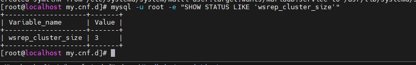

## Cài đặt HAProxy 1.8

Các bước sau thực hiện trên tất cả các node

```sh
sudo yum install wget socat -y
wget http://cbs.centos.org/kojifiles/packages/haproxy/1.8.1/5.el7/x86_64/haproxy18-1.8.1-5.el7.x86_64.rpm
yum install haproxy18-1.8.1-5.el7.x86_64.rpm -y
```

Tạo bản backup cho cấu hình mặc định và chỉnh sửa cấu hình HAProxy

```sh
cp /etc/haproxy/haproxy.cfg /etc/haproxy/haproxy.cfg.bak
```

Cấu hình HAProxy

```sh
echo 'global
    log         127.0.0.1 local2
    chroot      /var/lib/haproxy
    pidfile     /var/run/haproxy.pid
    maxconn     4000
    user        haproxy
    group       haproxy
    daemon
    stats socket /var/lib/haproxy/stats
defaults
    mode                    http
    log                     global
    option                  httplog
    option                  dontlognull
    option http-server-close
    option forwardfor       except 127.0.0.0/8
    option                  redispatch
    retries                 3
    timeout http-request    10s
    timeout queue           1m
    timeout connect         10s
    timeout client          1m
    timeout server          1m
    timeout http-keep-alive 10s
    timeout check           10s
    maxconn                 3000

listen stats
    bind :8080
    mode http
    stats enable
    stats uri /stats
    stats realm HAProxy\ Statistics

listen galera
    bind 172.16.7.160:3306
    balance source
    mode tcp
    option tcpka
    option tcplog
    option clitcpka
    option srvtcpka
    timeout client 28801s
    timeout server 28801s
    option mysql-check user haproxy
    server node1 172.16.7.153:3306 check inter 5s fastinter 2s rise 3 fall 3
    server node2 172.16.7.154:3306 check inter 5s fastinter 2s rise 3 fall 3 backup
    server node3 172.16.7.155:3306 check inter 5s fastinter 2s rise 3 fall 3 backup' > /etc/haproxy/haproxy.cfg
```

Cấu hình log cho HAProxy

```sh
sed -i "s/#\$ModLoad imudp/\$ModLoad imudp/g" /etc/rsyslog.conf
sed -i "s/#\$UDPServerRun 514/\$UDPServerRun 514/g" /etc/rsyslog.conf
echo '$UDPServerAddress 127.0.0.1' >> /etc/rsyslog.conf
echo 'local2.*  /var/log/haproxy.log' > /etc/rsyslog.d/haproxy.conf
systemctl restart rsyslog
```

Bổ sung cấu hình cho phép kernel có thể binding tới IP VIP

```sh
echo 'net.ipv4.ip_nonlocal_bind = 1' >> /etc/sysctl.conf
```

Tắt dịch vụ HAProxy

```sh
systemctl stop haproxy
systemctl disable haproxy
```

Tạo user ```haproxy``` phục vụ plugin health check của HAProxy (```option mysql-check user haproxy```)

```sh
CREATE USER 'haproxy'@'node1';
CREATE USER 'haproxy'@'node2';
CREATE USER 'haproxy'@'node3';
CREATE USER 'haproxy'@'%';
```

**Lưu ý:** Do đã cấu hình Galera nên việc create user chỉ cần thực hiện trên 1 node

## Triển khai Cluster Pacemaker

### Bước 1: Cài đặt pacemaker corosync

Các bước sau cũng thưc hiện trên tất cả các node

Cài đặt gói pacemaker pcs

```sh
yum -y install pacemaker pcs
systemctl start pcsd
systemctl enable pcsd
```

Thiết lập mật khẩu user ```hacluster```

```sh
passwd hacluster
```

**Lưu ý:** mật khẩu hacluster cần đồng bộ trên tất cả các node

### Bước 2: Tạo cluster

Chứng thực cluster (chỉ thực hiện trên cấu hình một node duy nhất, trong bài sẽ thực hiện trên ```node1```), nhập chính xác tài khoản uer hacluster:

```sh
pcs cluster auth node7153 node7154 node7155

Username: hacluster
Password: ***************
```

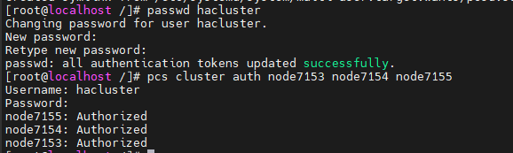

Khởi tạo cấu hình ban đầu

```sh
pcs cluster setup --name ha_cluster node7153 node7154 node7155
```

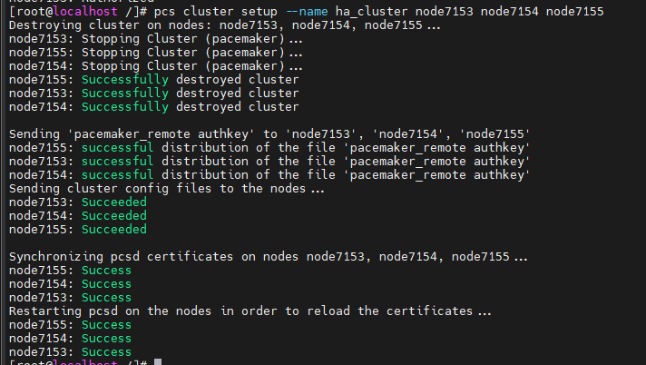

**Lưu ý:**
- ```ha_cluster```: Tên của cluster khởi tạo
- ```node7153```,...: hostname các node thuộc cluster, yêu cầu khai báo trong /etc/hosts

Khởi động Cluster

```sh
pcs cluster start --all
```

Cho phép cluster khởi động cùng OS

```sh
pcs cluster enable --all
```

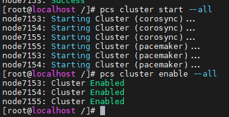

### Bước 3: Thiết lập Cluster

Bỏ qua cơ chế STONITH

```sh
pcs property set stonith-enabled=false
```

Cho phép Cluster chạy kể cả khi mất quorum

```sh
pcs property set no-quorum-policy=ignore
```

Hạn chế Resource trong cluster chuyển node sau khi Cluster khởi động lại

```sh
pcs property set default-resource-stickiness="INFINITY"
```

Kiểm tra thiết lập cluster

```sh
pcs property list
```

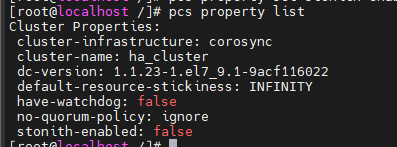

Tạo resource IP VIP Cluster

```sh
pcs resource create Virtual_IP ocf:heartbeat:IPaddr2 ip=172.16.7.160 cidr_netmask=24 op monitor interval=30s
```

Tạo resource quản trị dịch vụ HAProxy

```sh
pcs resource create Loadbalancer_HaProxy systemd:haproxy op monitor timeout="5s" interval="5s"
```

Ràng buộc thứ tự khởi động dịch vụ: khởi động dịch vụ Virtual_IP sau đó khởi động dịch vụ Loadbalancer_HaProxy

```sh
pcs constraint order start Virtual_IP then Loadbalancer_HaProxy kind=Optional
```

Ràng buộc resource Virtual_IP phải khởi động cùng node với resource Loadbalancer_HaProxy

```sh
pcs constraint colocation add Virtual_IP Loadbalancer_HaProxy INFINITY
```

Kiểm tra trạng thái Cluster

```sh
pcs status
```

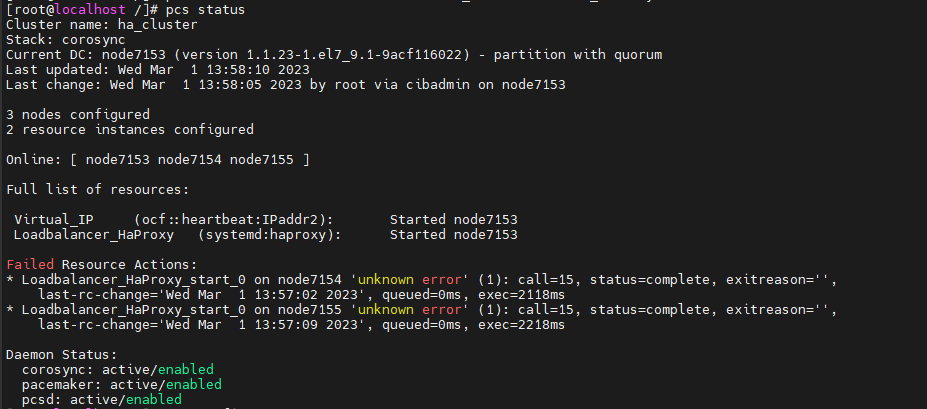

Nếu bị lỗi như trên thì ta chỉ cần cleanup đi là được

```sh
pcs resource cleanup
```

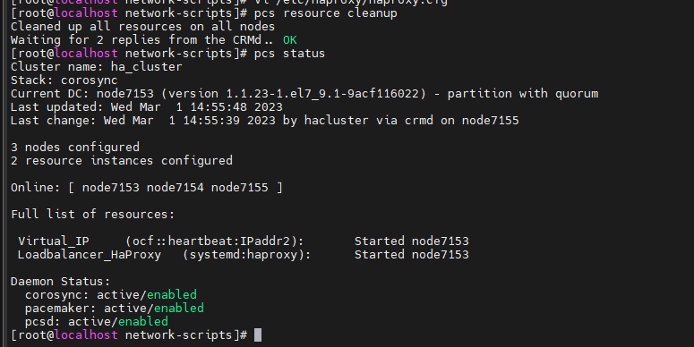

Kiểm tra cấu hình resource

```sh
pcs resource show --full
```

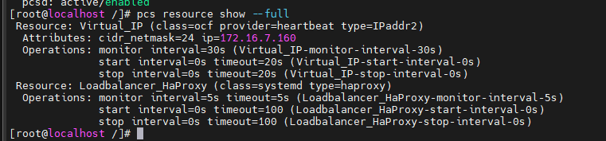

Kiểm tra ràng buộc trên resource

```sh
pcs constraint
```

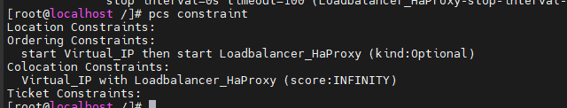

## Kiểm tra

Kiểm tra trạng thái dịch vụ: Truy cập <IP_VIP>:8080/stats

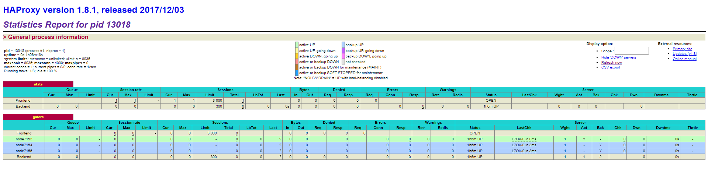

Kết nối tới database MariaDB thông qua IP VIP

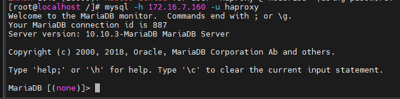

Thử tắt node1, kiểm tra lại pcs status trên các node còn lại

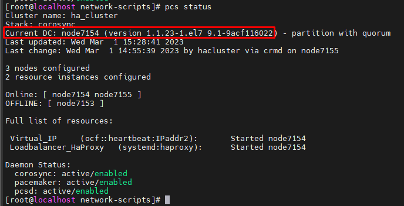

Như vậy resources đã được chuyển qua cho node2, node1 chuyển trạng thái qua OFFLINE. Đồng thời Cluster Galera sẽ vẫn hoạt động bình thường dù 1 node trong cluster xảy ra sự cố

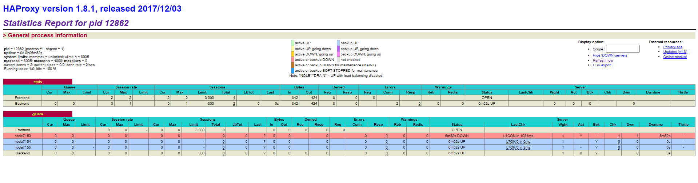

## Cài đặt Httpd 

Cài đặt httpd

```sh
yum install -y httpd
```

Tạo resource cho httpd

```sh
pcs resource create Httpd ocf:heartbeat:apache configfile=/etc/httpd/conf/httpd.conf op monitor interval=1min
```

Tạo ràng buộc Httpd và Virtual_IP

```sh
pcs constraint colocation add Httpd with Virtual_IP INFINITY
pcs constraint order Virtual_IP then Httpd
```

Tạo file index.html để test

```sh
vi /var/www/html index.html
```


Một vài lệnh sử dụng với resource/constraint:
- Move resource: ```pcs resource move <resource_id> <new_node>```
- Create resource prefer node: ```pcs constraint location <resource_id> prefers <node>```
- Relocate resource (đưa resource về node prefer): ```pcs resource relocate run```
- Show resource status: ```pcs status resources```
- Delete resource: ```pcs resource delete <resource_id>```
- Stop resource: ```pcs resource disable <resource_id>``` - dừng resource và ngăn cluster khởi động lại nó, tuy nhiên tùy vào constraint mà resource sẽ dừng hay không

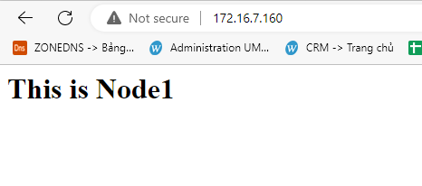