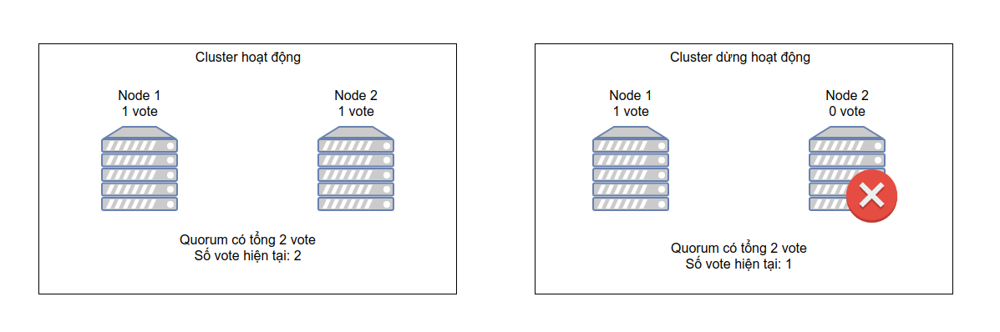
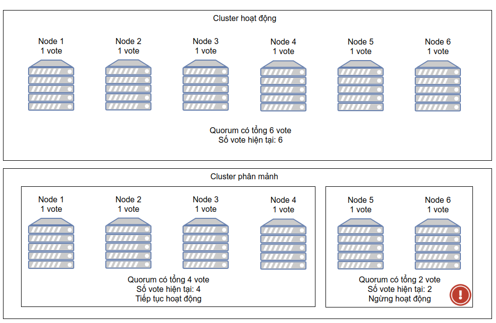
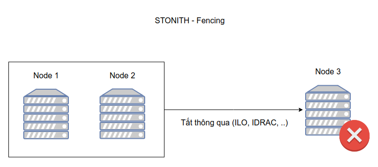

# Tổng quan về Quorum và STONITH/Fencing

## Quorum

### Định nghĩa

**Split-brain** là hiện tượng cluster lớn bị tách ra thành nhiều cluster nhỏ. Điều này dẫn đến sự mất đồng bộ giữa các tài nguyên, ảnh hưởng tới sự toàn vẹn của hệ thống

Quorum là giải pháp ngăn chặn hiện tượng **split-brain** trong cluster. Cluster có quorum chỉ khi số node đang hoạt động nhiều hơn một nửa số node thuộc cluster

Quorum được thiết lập bằng cơ chế **voting**. Khi node thuộc cluster xảy ra sự cố hoặc mất kết nối với phần còn lại của cluster, các node đang hoạt động sẽ **vote** cho việc node nào sẽ bị đóng băng cô lập, node nào sẽ tiếp tục hoạt động

Kỹ thuật Quorum được hỗ trợ mặc định trong pacemaker với 2 kỹ thuật:
- Hỗ trợ kỹ thuật ```Resource-driven cluster```: kỹ thuật phân cấp, nhóm tài nguyên để quản lý độc lập
- Hỗ trợ kỹ thuật ```Quorate clusters```: Kỹ thuật tính điểm của các node thuộc cluster, ý tưởng của kỹ thuật là khi cụm lớn bị phân mảnh thành 2 phần, cluster sẽ đánh giá so sánh số điểm của 2 cụm để quyết định cụm nào sẽ tiếp tục chạy, cụm nào sẽ bị đóng băng hoặc tắt hẳn
- Số node tối thiểu để cụm hoạt động bình thường phải lớn hơn 1 nửa tổng số node

### Ví dụ về quorum

Đối với Cluster gồm 2 node, tổng số vote là 2. Dựa trên cơ chế **voting** quorum sẽ chỉ hoạt động nếu số vote lớn hơn 1 nửa số node hoạt động. Vì vậy nếu 1 node xảy ra sự cố thì cả cluster sẽ ngừng hoạt động



Đối với Cluster gồm 3 node, tổng số vote là 3. Dựa trên cơ chế **voting** quorum sẽ chỉ hoạt động nếu số vote lớn hơn 1 nửa số node hoạt động. Vì vậy nếu có lớn hơn hoặc bằng 2 node xảy ra sự cố, cả cluster sẽ ngừng hoạt động

Trong trường hợp cluster gồm 6 node bị phân mảnh thì cần ít nhất 4 node cùng hoạt động để hình thành quorum. Trong trường hợp bị phân mảnh nhỏ hơn, pacemaker sẽ cô lập hoặc ngừng cung cấp dịch vụ



Các tùy chọn khi pacemaker mất Quorum (số node hiện có không thể tạo thành quorum)
- ignore: Tiếp tục quản trị duy trì hoạt động cluster kể cả khi mất quorum
- freeze: Tiếp tục quản trị duy trì hoạt động cluster nhưng đóng băng tài nguyên xảy ra sự cố, không cố gắng khôi phục
- stop: Ngừng cung cấp dịch vụ cluster khi mất quorum
- suicide: Cô lập các node đang xảy ra sự cố

## Tổng quan về STONITH/Fencing

### Định nghĩa

**STONITH** (Shoot The Other Node In The Head) là kỹ thuật bảo vệ dữ liệu khỏi các node xảy ra sự cố. Trong trường hợp node không phản hồi cluster nhưng không chắc chắn trạng thái của node, các dịch vụ trên node, cách tốt nhất để đảm bảo dữ liệu là tắt nóng, bảo đảm node thực sự offline. STONITH sẽ sử dụng các giao thức quản trị từ xa hỗ trợ bởi phần cứng, cho phép cluster thao tác trực tiếp với server vật lý.

Trong hệ thống cluster, các node chia sẻ tài nguyên sử dụng, nếu một node xảy ra sự cố tài nguyên chia sẻ giữa các node có thể bị ảnh hưởng dẫn đến trạng thái các node khác cũng trở nên bất thường. Để tránh hiện tượng này xảy ra, ta sẽ sử dụng kỹ thuật fencing để cô lập các tài nguyên của node đang xảy ra sự cố.

Fencing sẽ loại bỏ kết nối tới các tài nguyên chia sẻ giữa cluster (shared storage, database,...). Cluster thực hiện cô lập tài nguyên (fencing) thông qua kỹ thuật **STONITH**

Với pacemaker, khi nhận thấy node xảy ra sự cố, nó sẽ thông báo cho các node đang hoạt động về node lỗi và cô lập node thông qua **STONITH**

Cô lập node bằng **STONITH** có thể được thực hiện thông qua nhiều mức, dựa trên nhiều loại thiết bị hỗ trợ
- **Uninterruptible Power Supply (UPS)**: Cô lập tài nguyên cung cấp năng lượng bằng bộ lưu điện, sử dụng khi hệ thống cung cấp năng lượng xảy ra sự cố
- **Power Distribution Unit (PDU)**: Cô lập tài nguyên cung cấp năng lượng bằng thiết bị cấp phát nguồn, sử dụng khi hệ thống cung cấp năng lượng xảy ra sự cố
- **Blade power control device**: Hệ thống chuyên dụng trong các datacenter, sử dụng để cô lập các cluster node xảy ra sự cố
- **Lights-out device**: Thiết bị gắn mạng hỗ trợ giao thức quản trị từ xa cho phép cô lập tài nguyên dựa trên thao tác tắt bật. VD: HP Integrated Lights-Out (HP ILO), hay Integrated Dell Remote Access Controller (iDRAC)

Các giao thức hỗ trợ STONITH:
- IPMI: Intelligent Platform Management Interface (General Standard)
- IDRAC - Integrated Dell Remote Access (DELL)
- ILO - Integrated Lights-Out (HP)
- IMM - Integrated Management Module (IBM)

Ngoài ra, nếu dịch vụ chạy trên máy ảo, các máy chủ hỗ trợ phương pháp fencing:
- fence_vmware_soap (vSphere VMware)
- Fence virtd, fence-agents-virsh (Cho trình ảo hóa hỗ trợ libvirt)


