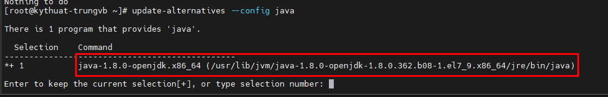
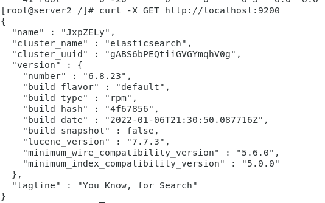
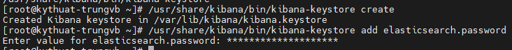
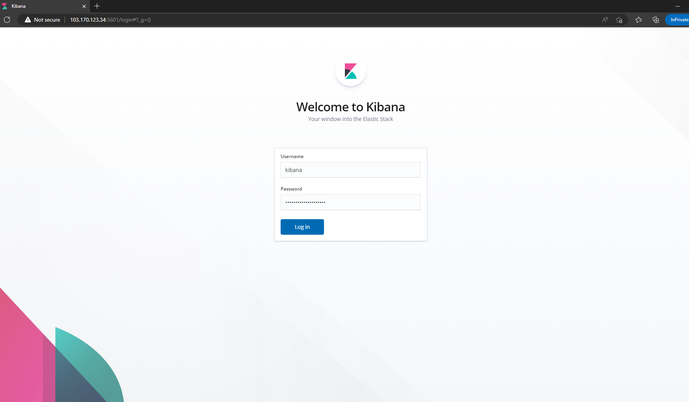

# Cài đặt ELK trên hđh CentOS 7

### 1. Yêu cầu hệ thống

- 1 máy CentOS 7 làm ELK server: RAM 6 GB, 100 GB HDD
- Các máy client có OS là windows, ubuntu hoặc CentOS

### 2. Phân hoạch địa chỉ IP

- ELK server: 10.10.10.190/24, gateway: 10.10.10.1, dns: 8.8.8.8
- Client Ubuntu: 10.10.10.91/24, gateway: 10.10.10.1, dns: 8.8.8.8
- Client CentOS: 10.10.10.92/24, gateway: 10.10.10.1, dns: 8.8.8.8

### 3. Cài đặt trên máy chủ ELK

**Cài đặt JDK**

Trước khi bắt đầu cài đặt ELK Stack, chúng ta cần cài đặt JDK trước.

- Cài đặt JDK 8

```sh
sudo yum install java-1.8.0-openjdk-devel
```

*Note: Nếu có nhiều version java khác nhau, bạn có thể thay đổi giữa chúng bằng lệnh ```sudo alternatives --config java```*

- Thiết lập biến môi trường JAVA_HOME: thiết lập JAVA_HOME giúp các ứng dụng khác được viết trên ngôn ngữ này có thể truy nhập đường dẫn cài đặt Java dễ dàng hơn

- Đầu tiên xác định vị trí cài đặt java: ```sudo update-alternatives --config java```



- Ta có thể thấy đường dẫn cài đặt Java như ở trên là ```/usr/lib/jvm/java-1.8.0-openjdk-1.8.0.362.b08-1.el7_9.x86_64/jre/bin/java```

- Sau đó mở file ```.bash_profile``` và thêm dòng sau vào

```sh
vi ~/.bash_profile
# Thêm dòng sau vào
JAVA_HOME="/usr/lib/jvm/java-1.8.0-openjdk-1.8.0.362.b08-1.el7_9.x86_64/jre/bin/java"
```

**Cài đặt Elasticsearch**

- Import key elastic

```sh
rpm --import http://packages.elastic.co/GPG-KEY-elasticsearch
```

- Thêm repo elastics

```sh
cat << EOF > /etc/yum.repos.d/elasticsearch.repo
[elasticsearch-6.x]
name=Elasticsearch repository for 6.x packages
baseurl=https://artifacts.elastic.co/packages/6.x/yum
gpgcheck=1
gpgkey=https://artifacts.elastic.co/GPG-KEY-elasticsearch
enabled=1
autorefresh=1
type=rpm-md
EOF
```

- Cài đặt Elastic

```sh
yum install elasticsearch -y
```

- Mở file ```/etc/elasticsearch/elasticsearch.yml```

```sh
vi /etc/elasticsearch/elasticsearch.yml
```

- Tìm đến dòng ```network.host``` và sửa lại thành cũng như thêm 1 vài dòng

```sh
network.host: 10.10.10.190
xpack.security.enabled: true
discovery.type: single-node
```

- Khởi động lại Elasticsearch và cho phép dịch vụ khởi động cùng hệ thống 

```sh
systemctl restart elasticsearch
systemctl enable elasticsearch
```

- Tiếp đến, ta sẽ thiết lập authentication token cho elasticsearch:

```sh
/usr/share/elasticsearch/bin/elasticsearch-setup-passwords auto
```

**Hãy lưu lại các thông tin về user và password sau đó**

- Kiểm tra dịch vụ Elasticsearch (chỉ hoạt động nếu không kích hoạt authentication)

```sh
curl -X GET http://localhost:9200
```



*Kết quả trả về như trên là ok*

**Cài đặt Logstash**

- Thêm repo Logstash

```sh
cat << EOF > /etc/yum.repos.d/logstash.repo
[logstash-6.x]
name=Elastic repository for 6.x packages
baseurl=https://artifacts.elastic.co/packages/6.x/yum
gpgcheck=1
gpgkey=https://artifacts.elastic.co/GPG-KEY-elasticsearch
enabled=1
autorefresh=1
type=rpm-md
EOF
```

- Cài đặt Logstash

```sh
yum install logstash -y
```

- Cấu hình xác thực

```sh
vi /etc/logstash/logstash.yml
# Thay đổi các nội dung sau theo thông tin đăng nhập khởi tạo trước đó
xpack.monitoring.enabled: true
xpack.monitoring.elasticsearch.username: "logstash_system"
xpack.monitoring.elasticsearch.password: "changeme"
```

- Khởi động và cho phép dịch vụ khởi động cùng hệ thống

```sh
systemctl daemon-reload
systemctl start logstash
systemctl enable logstash
```

**Cài đặt Kibana**

- Tạo repo cài đặt Kibana

```sh
cat << EOF > /etc/yum.repos.d/kibana.repo
[kibana-6.x]
name=Kibana repository for 6.x packages
baseurl=https://artifacts.elastic.co/packages/6.x/yum
gpgcheck=1
gpgkey=https://artifacts.elastic.co/GPG-KEY-elasticsearch
enabled=1
autorefresh=1
type=rpm-md
EOF
```

- Cài đặt Kibana

```sh
yum install kibana -y
sed -i 's/#server.host: "localhost"/server.host: "0.0.0.0"/g' /etc/kibana/kibana.yml
sed -i 's/#elasticsearch.hosts: ["http://localhost:9200"]/elasticsearch.hosts: ["http://10.10.10.190:9200"]/g' /etc/kibana/kibana.yml
```

- Mở file cấu hình kibana và thêm username và password khởi tạo trước đó vào đây

```sh
vi /etc/kibana/kibana.yml
elasticsearch.username: "<username>"
elasticsearch.password: "<password>"
```

- Tạo Kibana keystore

```sh
/usr/share/kibana/bin/kibana-keystore create
```

- Thêm password của user kibana vào Kibana keystore

```sh
/usr/share/kibana/bin/kibana-keystore add elasticsearch.password
```



- Khởi động và cho phép dịch vụ khởi động cùng hệ thống

```sh
systemctl daemon-reload
systemctl start kibana
systemctl enable kibana
```

- Truy cập vào Kibana kiểm tra bằng đường dẫn ```http://ip-elk_server:5601``` (mở port trên firewall nếu cần thiết)



### 4. Cài đặt filebeat trên client Ubuntu để đẩy log về ELK server

- Download phiên bản cài đặt của ```filebeat```

```sh
curl -L -O https://artifacts.elastic.co/downloads/beats/filebeat/filebeat-6.2.4-amd64.deb
```

- Cài đặt ```filebeat```

```sh
dpkg -i filebeat-6.2.4-amd64.deb
```

- Copy file cấu hình ```filebeat``` để backup khi có lỗi trong lúc cấu hình

```sh
cp /etc/filebeat/filebeat.yml /etc/filebeat/filebeat.orig
rm -rf /etc/filebeat/filebeat.yml
touch /etc/filebeat/filebeat.yml
```

- Đẩy các cấu hình sau vào cấu hình của ```filebeat``` (mở port 5044 trên sv nếu cần thiết)

```sh
cat > /etc/filebeat/filebeat.yml << EOF
filebeat:
prospectors:
  paths:
    /var/log/*.log
  encoding: utf-8
  input_type: log
  fields:
    level: debug
  document_type: type
registry_file: /var/lib/filebeat/registry
output:
  logstash:
    hosts: ["10.10.10.190:5044"]
    worker: 2
    bulk_max_size: 2048
  elasticsearch:
    hosts: ["10.10.10.190:9200"]
    username: "elastic"
    password: "<password_here>"
logging:
  to_syslog: false
  to_files: true
files:
  path: /var/log/filebeat
  name: filebeat
  rotateeverybytes: 1048576000 # = 1GB
  keepfiles: 7
selectors: ["*"]
level: info
EOF
```

- Khởi động ```filebeat```

```sh
service filebeat start
```

- Dùng ```tcpdump``` để kiểm tra xem log đã được đẩy về ELK server hay chưa

```sh
tcpdump -i eth0 dst 10.10.10.190
```

### 5. Cài đặt filebeat trên client CentOS để đẩy log về ELK server

- Thêm repo Elastic

```sh
cat > /etc/yum.repos.d/elastic.repo << EOF
[elasticsearch-6.x]
name=Elasticsearch repository for 6.x packages
baseurl=https://artifacts.elastic.co/packages/6.x/yum
gpgcheck=1
gpgkey=https://artifacts.elastic.co/GPG-KEY-elasticsearch
enabled=1
autorefresh=1
type=rpm-md
EOF
```

- Cài đặt ```filebeat```

```sh
yum install filebeat-6.2.4 -y
```

- Copy file cấu hình để backup

```sh
cp /etc/filebeat/filebeat.yml /etc/filebeat/filebeat.yml.orig
rm -rf /etc/filebeat/filebeat.yml
touch /etc/filebeat/filebeat.yml
```

- Thêm vào ```filebeat``` những cấu hình như sau (mở port 5044 trên sv nếu cần thiết)

```sh
cat > /etc/filebeat/filebeat.yml << EOF
filebeat:
prospectors:
  paths:
    /var/log/*.log
  encoding: utf-8
  input_type: log
  fields:
    level: debug
  document_type: type
registry_file: /var/lib/filebeat/registry
output:
  logstash:
    hosts: ["10.10.10.190:5044"]
    worker: 2
    bulk_max_size: 2048
  elasticsearch:
    hosts: ["10.10.10.190:9200"]
    username: "elastic"
    password: "<password_here>"
logging:
  to_syslog: false
  to_files: true
files:
  path: /var/log/filebeat
  name: filebeat
  rotateeverybytes: 1048576000 # = 1GB
  keepfiles: 7
selectors: ["*"]
level: info
EOF
```

- Khởi động ```filebeat```

```sh
systemctl start filebeat
systemctl enable filebeat
```

- Dùng ```tcpdump``` để kiểm tra

```sh
tcpdump -i eth0 dst 10.10.10.190
```