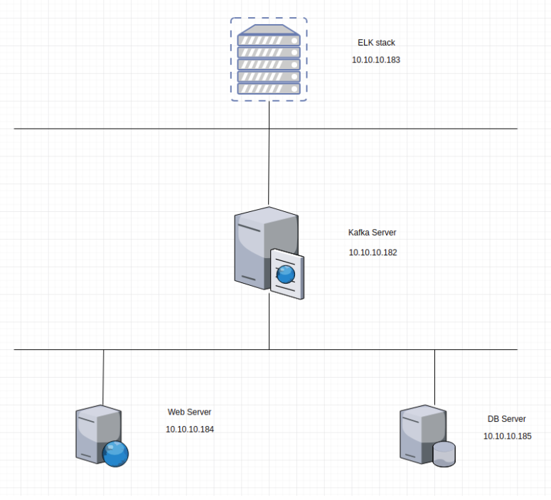
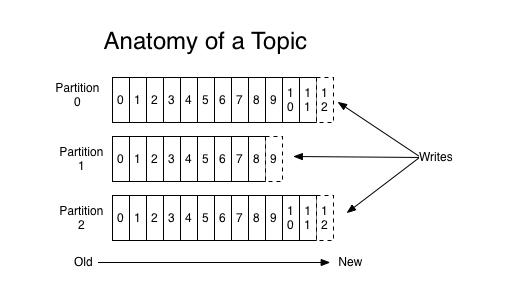

# Cài đặt ELK sử dụng kafka làm cache

Khi log từ client đẩy về ELK quá nhiều cùng 1 lúc thì khả năng node bị treo là rất cao, do đó, 1 giải pháp giảm tải cho hệ thống như cache nên được áp dụng

### 1. Yêu cầu hệ thống

- 1 máy CentOS 7 làm ELK server: RAM 6GB, HDD 100GB
- 1 máy CentOS 7 làm kafka: RAM 4GB, 100GB HDD
- Các máy client có OS là windows, ubuntu hoặc CentOS

### 2. Mô hình



### 3. Giới thiệu về Kafka

- Kafka là hệ thống message pub/sub phân tán mà có khả năng scale
- Message của kafka được lưu trên đĩa cứng, đồng thời được replicate trong cluster giúp phòng tránh mất dữ liệu
- Kafka có thể hiểu là một hệ thống logging, nhằm lưu lại các trạng thái của hệ thống, nhằm phòng tránh mất thông tin
- Các khái niệm cơ bản
    - Kafka lưu, phân loại message theo topics
    - Kafka sử dụng producers để publish message vào các topics ở trên
    - Kafka sử dụng consumers để subscribe vào topics, sau đó xử lý các message lấy được theo 1 logic nào đó
    - Kafka thường được chạy dưới dạng cluster, khi đó mỗi server trong đó sẽ được gọi là broker

#### Topics

- Topic có thể hiểu là 1 ngôn ngữ chung giữa producer (người nói) và consumer (người nghe, sử dụng). Với mỗi topic, kafka sẽ duy trì thông qua partitioned log như dưới đây



- Mỗi partition là 1 chuỗi log, có thứ tự và không thể thay đổi
- Mỗi message trong partition sẽ có id tăng dần, gọi là offset
- Kafka cluster sẽ lưu lại mọi message đã được published, cho dù message đó đã được hay chưa được sử dụng (consume). Thời gian lưu message có thể tùy chỉnh được thông qua retention 
- Consumer sẽ điều khiển những gì mình muốn đọc thông qua offset của message, hay thậm chí là thứ tự đọc. Consumer có thể reset lại vị trí của offset để re-process 1 vài message nào đó

#### Producer

- Như đã nói ở trên, producer nhằm mục đích chính là ném message vào topic. Cụ thể hơn là producer có nhiệm vụ là chọn message nào để ném vào partition nào trong topic. Nhiệm vụ này rất quan trọng, giúp kafka có khả năng "scale" tốt

#### Consumer

- Thông thường thì 1 hệ thống messaging sẽ có 2 loại
    - Queue: 1 message sẽ được xử lý bởi 1 consumer
    - Pub/Sub: 1 message sẽ được xử lý bởi 1 vài consumer thích hợp, tùy theo topic
- Ở kafka chúng ta có 1 khái niệm gọi là consumer group giúp chúng ta có thể làm được đồng thời cả 2 loại trên. Việc subscribe một topic sẽ được thực hiện bởi consumer group. Mỗi 1 message sẽ được gửi cho duy nhất 1 consumer instance trong 1 consumer group. Việc này dẫn đến:
    - Nếu nhiều instance consumer có cùng group: chúng ta sẽ có 1 hệ thống queue
    - Nếu mỗi instance là 1 group, chúng ta sẽ có 1 hệ thống pub/sub

#### Use cases

- Sử dụng như 1 hệ thống message queue thay thế cho ActiveMQ hay RabbitMQ
- Tracking hành động người dùng: các thông số như page view, search action của user sẽ được publish vào 1 topic và sẽ được xử lý sau
- Log Aggregration: log sẽ được gửi từ nhiều server về 1 nơi thống nhất, sau đó có thể được làm sạch và xử lý theo 1 logic nào đó
- Event-sourcing: lưu lại trạng thái của hệ thống để có thể tái hiện trong trường hợp system bị down

### 4. Cài đặt Kafka

**Cài đặt và cấu hình trên node kafka**

- Download kafka

```sh
yum install wget -y
wget http://mirror.downloadvn.com/apache/kafka/1.1.0/kafka_2.11-1.1.0.tgz
```

- Giải nén kafka

```sh
tar -zxvf kafka_2.11-1.1.0.tgz
```

- Cài đặt Java

```sh
yum install java-1.8.0-openjdk -y
```

- Cấu hình environment

```sh
echo "export JAVA_HOME=/usr/lib/jvm/jre-1.8.0-openjdk" >> /etc/environment
echo "export JRE_HOME=/usr/lib/jvm/jre" >> /etc/environment
```

- Mở port 9092 trên firewall

```sh
firewall-cmd --zone=public --permanent --add-port=9092/tcp
firewall-cmd --reload
```

- Truy cập vào file cấu hình kafka

```sh
cd kafka_2.11-1.1.0
vi config/server.properties
```

- Mở file cấu hình tìm từ khóa ```listeners``` và cấu hình lại

```sh
listeners=PLAINTEXT://ip-kafka:9092
```

- Chạy file run

```sh
yum install -y screen
screen -d -m bin/zookeeper-server-start.sh config/zookeeper.properties
screen -d -m bin/kafka-server-start.sh config/server.properties
```

- Tạo topic mới để nhận log

```sh
bin/kafka-topics.sh --create --zookeeper localhost:2181 --replication-factor 1 --partitions 1 --topic log-system
```

- Kiểm tra trạng thái cluster

```sh
ps aux | grep zookeeper.properties
ps aux | grep server.properties
```

- List các topic hiện có 

```sh
bin/kafka-topics.sh --list --zookeeper localhost:2181
```

- Theo dõi các message có trong topic

```sh
bin/kafka-console-consumer.sh --zookeeper localhost:2181 --from-beginning --topic log-system
```

**Cấu hình trên node ELK**

- Tạo file cấu hình logstash

```sh
vi /etc/logstash/conf.d/02-logstash.conf
```

- Thêm vào file cấu hình nội dung như sau

```sh
input {
    kafka {
            bootstrap_servers => 'ip-kafka:9092'
            topics => ["log-system"]
            codec => json {}
          }
}

output {
    elasticsearch {
      hosts => ["localhost:9200"]
      sniffing => true
      index => "%{[@metadata][beat]}-%{+YYYY.MM.dd}"
    }
}
```

- Khởi động lại logstash

```sh
systemctl restart logstash
```

**Cấu hình filebeat trên node client đẩy log về Kafka**

- Mở file cấu hình filebeat

```sh
vi /etc/filebeat/filebeat.yml
```

- Sửa lại cấu hình filebeat như sau

```sh
filebeat:
  prospectors:
    - paths:
        - /var/log/*.log
      encoding: utf-8
      input_type: log
      fields:
        level: debug
      document_type: type
  registry_file: /var/lib/filebeat/registry
output:
  kafka:
    hosts: ["ip-kafka:9092"]
    topic: log-syslog
logging:
  to_syslog: false
  to_files: true
  files:
    path: /var/log/filebeat
    name: filebeat
    rotateeverybytes: 1048576000 # = 1GB
    keepfiles: 7
  selectors: ["*"]
  level: info
```

- Khởi động lại filebeat

```
systemctl restart filebeat
```
