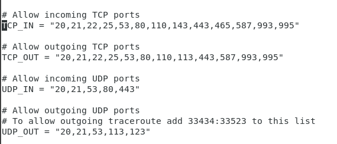

# Firewall trong Linux

## FirewallD

### 1. Các khái niệm cơ bản trong FirewallD

Trong FirewallD, zone là 1 nhóm các quy tắc nhằm chỉ ra những luồng dữ liệu được cho phép, dựa trên mức độ tin tưởng của nguồn luồng dữ liệu đó trong hệ thống mạng. Để sử dụng, có thể lựa chọn zone mặc định, thiết lập các quy tắc trong zone hay chỉ định giao diện mạng (network interface) để quy định hành vi được cho phép

Các zone được xác định theo mức độ tin cậy, theo thứ tự từ: ít tin cậy nhất đến đáng tin cậy nhất

```drop```: ít tin cậy nhất - toàn bộ các kết nối đến sẽ bị từ chối mà không phản hồi, chỉ cho phép duy nhất kết nối đi ra

```block```: tương tự nhưng các kết nối đến bị từ chối và phản hồi bằng tin nhắn từ icmp-host-prohibited (hoặc icmp6-adm-prohibited)

```public```: đại diện cho mạng công cộng, không đáng tin cậy. Các máy tính/ services khác không được tin tưởng trong hệ thống nhưng vẫn cho phép các kết nối đến cơ sở trong từng trường hợp cụ thể

```external```: hệ thống mạng bên ngoài trong trường hợp bạn sử dụng tường lửa làm gateway, được cấu hình giả lập NAT để giữ bảo mật mạng nội bộ mà vẫn có thể truy cập

```internal```: đối lập với external zone, sử dụng cho phần nội bộ của gateway. Các máy tính/services thuộc zone này thì khá đáng tin cậy

```dmz```: sử dụng cho các máy tính/ services trong khi vực DMZ - cách ly không cho phép truy cập vào phần còn lại của hệ thống mạng, chỉ cho phép 1 số kết nối nhất định

```work```: sử dụng trong công việc, tin tưởng hầu hết các máy tính và 1 vài services được cho phép hoạt động

```home```: môi trường gia đình - tin tưởng hầu hết các máy tính khác và thêm 1 vài services được cho phép hoạt động

```trusted```: đáng tin cậy nhất - tin tưởng toàn bộ thiết bị trong hệ thống

Trong FirewallD, các quy tắc được cấu hình thời gian hiệu lực

```Runtime```: có tác dụng ngay lập tức, mất hiệu lực khi reboot hệ thống

```Permanent```: không áp dụng cho hệ thống đang chạy, cần reload lại mới có hiệu lực, áp dụng cho đến khi bị xóa đi


### 2. Các lệnh thao tác với FirewallD trong CentOS 7

```systemctl enable firewalld```: thiết lập khởi động cùng hệ thống

```systemctl start firewalld```: khởi động firewalld

```systemctl status firewalld```: kiểm tra thông số hiện tại của firewall

```firewall-cmd --add-port=443/tcp --permanent```: mở port, lưu ý là chúng ta cần xác định rõ port TCP hay UDP ở đằng sau port number

```firewall-cmd --remove-port=53/udp --permanent```: block port

```firewalld-cmd --add-service=https --permanent```: mở service

```firewalld-cmd --remove-service=https --permanent```: đóng service

```firewall-cmd --permanent --add-source=192.168.1.100```: cho phép IP thông qua firewall (whitelist)

```firewall-cmd --permanent --remove-source=192.168.1.0/24```: xóa 1 subnet khỏi whitelist

```firewall-cmd --permanent --add-rich-rule="rule family='ipv4' source address='192.168.2.50' reject"```: block 1 IP

```firewall-cmd -reload```: reload lại dịch vụ firewalld, sau khi thay đổi thiết lập rule của firewall thì cần phải reload lại để có hiệu lực

```firewall-cmd --list-all```: xem lại tất cả rule của firewall

## CSF

### 1. Giới thiệu chung

CSF (hay Config Server & Firewall) là 1 gói ứng dụng hoạt động trên Linux như 1 Firewall được phát hành miễn phí để tăng tính bảo mật cho server (VPS và Dedicated)

CSF hoạt động dựa trên iptables và tiến trình ldf để quét các file log giúp phát hiện dấu hiệu tấn công bất thường

Tính năng của CSF:
- Chống DDoS các loại
- Chống scan port
- Đưa ra các lời khuyên về việc cấu hình server
- Chống Brute Force Attack vào ftp server, web server, mail server, directadmin, cPanel,...
- Chống Syn Flood
- Chống Ping Flood
- Cho phép ngăn chặn truy cập từ 1 quốc gia nào đó bằng cách chỉ định - Country Code chuẩn ISO
- Hỗ trợ cả IPv4 và IPv6
- Cho phép khóa IP tạm thời và vĩnh viễn ở tầng mạng (an toàn hơn tầng ứng dụng) giúp giảm tải cho web server
- Cho phép chuyển hướng yêu cầu từ các IP bị khóa sang 1 file html để thông báo cho người dùng biết IP của họ bị khóa
- Và rất nhiều tính năng khác

### 2. Cài đặt CSF trên CentOS 7

- Cài đặt module Perl cho CSF script

```yum install perl-libwww-perl```

- Tải CSF

```sh
wget https://download.configserver.com/csf.tgz
```

- Giải nén và cài đặt

```sh
tar -xzvf csf.tgz
cd csf
sh install.sh
```

- Cấu hình CSF: mặc định thì script trên sẽ cài đặt và chạy CSF ở chế độ "Testing", có nghĩa là server lúc này chưa được bảo vệ toàn diện. Để tắt chế độ "Testing" bạn cần cấu hình các lựa chọn TCP_IN, TCP_OUT, UDP_IN và UDP_OUT cho phù hợp

```sh
#Mở file cấu hình CSF
vi /etc/csf/csf.conf
```



Sau khi cấu hình xong, sửa trường ```TESTING = "1"``` thành ```TESTING = "0"``` để hoàn tất

Cuối cùng, khởi động csf bằng lệnh

```sh
systemctl start csf
systemctl enable csf
```

### 3. Những file cấu hình CSF đáng chú ý

Toàn bộ thông tin cấu hình của CSF được lưu trong /etc/csf. Trong đó có những file đáng chú ý sau:

- csf.conf: File cấu hình chính để quản lý CSF
- csf.allow: Danh sách địa chỉ IP cho phép qua firewall
- csf.deny: Danh sách địa chỉ IP từ chối qua firewall
- csf.ignore: Danh sách địa chỉ IP cho phép qua firewall và không bị block nếu có vấn đề
- csf.*ignore: Danh sách user, IP được ignore

### 4. Một số lệnh CSF thông dụng

```csf -d 192.168.1.100```: Block 1 IP

```csf -dr 192.168.1.100```: Bỏ block 1 IP

```csf -a 192.168.1.100```: Allow 1 IP

```csf -ar 192.168.1.100```: Bỏ allow 1 IP

```csf -g 192.168.1.100```: Xem IP có bị block không

```csf -r```: Khởi động lại CSF

```csf -x```: Tắt CSF

```csf -e```: Mở CSF