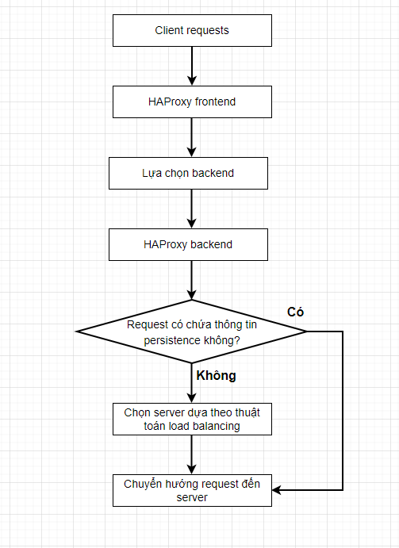

# Load Balancing, Affinity, Persistence, Sticky Sessions

## Đặt vấn đề

HTTP không phải là 1 giao thức kết nối, do đó mỗi phiên HTTP đều là các kết nối TCP độc lập

Sẽ tệ hơn nếu 1 phiên HTTP được chia thành nhiều kết nối TCP

Khi không có load balancer, điều này sẽ không phải vấn đề, do lúc đó chỉ có 1 server xử lý toàn bộ thông tin của toàn bộ người dùng. Và cho dù có bao nhiêu client kết nối đi chăng nữa, tất cả chúng đều chuyển hướng về 1 server độc nhất

Khi có 1 vài server cùng phục vụ 1 ứng dụng/website, đây mới là lúc ta nhận thấy vấn đề: điều gì sẽ xảy ra khi 1 người dùng gửi request đến 1 server không đảm nhiệm phiên làm việc của nó?

-> Người dùng sẽ bị quay trở lại login page do server không nhận thấy phiên làm việc của họ -> Người này bị coi là người dùng mới, mất phiên cũ, rất bất tiện

Để tránh điều này xảy ra, có 1 vài cách:
- Sử dụng 1 cụm máy chủ ứng dụng web, nơi mà phiên làm việc có thể truy cập được ở toàn bộ server
- Chia sẻ thông tin phiên làm việc của user trong 1 database hoặc 1 file system trên máy chủ
- Sử dụng IP để duy trì mối liên hệ giữa người dùng và server (tính **Affinity**)
- Sử dụng thông tin tầng ứng dụng để duy trì tính bền vững giữa người dùng và server (tính **Persistence**)

### Xây dựng 1 cụm ứng dụng web

Chỉ 1 vài sản phẩm trên thị trường cho phép người quản trị tạo 1 cụm (như Weblogic, Tomcat, Jboss,...)

Đây là một kỹ thuật tương đối phức tạp. Mặc dù vậy, đối với ứng dụng Web, *clustering* không đồng nghĩa với *scaling* (câu này khó dịch ghê). Hơn nữa, kể cả xây dựng 1 cụm website thì bạn vẫn phải cần 1 load balancer để đảm bảo tính ổn định cũng như scalable

### Chia sẻ phiên người dùng trong database hoặc file system

Kỹ thuật này áp dụng cho server không xây dựng theo cụm như bên trên.

Kỹ thuật này khá đơn giản, bạn có thể chọn cách mà session được chia sẻ, ví dụ như file system dạng NFS hay CIFS, hoặc 1 Database như MySQL hay SQL Server, hoặc kể cả memcached. Sau đó bạn cấu hình để server sử dụng thông tin session được share chung theo các cách trên nếu cần thiết.

### Nguồn IP liên hệ đến server

1 cách đơn giản để duy trì liên hệ giữa người dùng và server là sử dụng địa chỉ IP của người dùng, kỹ thuật này gọi là **Source IP affinity**

Có nhiều vấn đề xoay quanh việc thực hiện kỹ thuật này, nhưng giới hạn của bài viết này sẽ chỉ đề cập đến khái niệm của nó mà thôi

Một thứ quan trọng bạn cần phải biết đó là phương pháp **Source IP affinity** là phương pháp cuối cùng bạn nghĩ tới khi muốn thực hiện sticky session

### Duy trì tính bền vững ở tầng ứng dụng

Do máy chủ ứng dụng web phải xác định danh tính của từng người dùng một cách độc lập, vì vậy để tránh cung cấp nội dụng session của người này cho người khác, chúng ta nên sử dụng thông tin này, hoặc ít nhất cố thử cung cấp lại cùng hành vi ở load balancer để duy trì tính bền vững giữa người dùng và server

Thông tin mà chúng ta sử dụng sẽ là **Session Cookie**, ta có thể thiết lập bằng load balancer hoặc máy chủ ứng dụng đều được

## Sự khác nhau giữa Tính bền vững (Persistence) và Mối liên hệ (Affinity)

**Affinity**: đây là khi chúng ta sử dụng thông tin ở tầng dưới của tầng ứng dụng để duy trì truy vấn giữa 1 client và 1 server

**Persistence**: đây là khi chúng ta sử dụng thông tin tầng ứng dụng để gắn kết 1 client và 1 server

**Sticky session**: 1 sticky session là 1 session duy trì bởi **Persistence**

Ưu điểm chính của **Persistence** khi đem so với **Affinity** là nó thực sự chính xác hơn nhiều lần, nhưng đôi khi, Persistence không thể thực hiện được, khi đó ta mới nghĩ tới Affinity

## Tương tác với load balancing

Trong load balancer, bạn có thể chọn giữa 1 vài thuật toán để lấy 1 server lên từ 1 pool và điều hướng người dùng đến đó

Một vài thuật toán là xác định, điều này có nghĩa là chúng sẽ luôn sử dụng thông tin của phía client để chọn server và sẽ luôn gửi client đó đến cùng 1 server. Kỹ thuật này chính là **Affinity**, ví dụ như thuật toán **Balance source** (hay **IP Hash**)

Một vài thuật toán là không xác định, có nghĩa là chúng chọn server dựa trên thông tin nội bộ, bất kể client có gửi cái gì. Kỹ thuật này không phải **Affinity** hay **Persistence** gì cả, ví dụ như thuật toán **Balance Roundrobin** hoặc **Balance Leastconn**

Đối với **Persistence**, kỹ thuật này là 1 cách khác để lựa chọn server (cũng như cách mà thuật toán load balancing hoạt động). Tuy nhiên thực tế, **persistence** lại được xử lý trước thuật toán load balancing



Luồng hoạt động sẽ như sau:
- Request đầu tiên của người dùng đi tới và không có thông tin về persistence
- Request đi qua khối persistence information vì nó không có thông tin persistence
- Request đi qua thuật toán load balancing, nơi mà 1 máy chủ sẽ được chọn và chịu trách nhiệm với client
- Server được chọn giờ sẽ phản hồi, thiết lập thông tin phiên làm việc của nó
- Dựa vào thiết lập này, load balancer có thể cùng lúc sử dụng thông tin phiên này hoặc thiết lập thông tin của nó trước khi gửi phản hồi đến cho client
- Client sau đó gửi yêu cầu thứ 2, giờ sẽ bao gồm cả thông tin phiên có được từ request đầu tiên
- Load balancer lúc này sẽ chọn server dựa vào thông tin từ phía client
- Request sẽ **KHÔNG** qua khối load balancing algorithm
- Máy chủ được chọn phản hồi request

## Cấu hình Affinity trong HAProxy / HAProxy ALOHA load balancer

Cấu hình bên dưới cho thấy cách để cấu hình Affinity trong HAProxy, dựa trên IP client

```sh
frontend ft_web
    bind 0.0.0.0:80
    default_backend bk_web

backend bk_web
    balance source
    hash-type consistent # optional
    server node1 192.168.60.100:80 check
    server node2 192.168.60.200:80 check
```

## Web application persistence

Để cung cấp persistence ở lớp ứng dụng, chúng ta thường sử dụng **Cookies**

Như đã giải thích trước đó, có 2 cách để cung cấp persistence sử dụng cookies:
- Để load balancer thiết lập cookie cho session
- Sử dụng cookies của ứng dụng, như ASP.NET_SessionId, JSESSIONID, PHPSESSIONID hoặc bất kỳ cái tên nào được chọn

### Thiết lập session cookie bằng load balancer

Thiết lập dưới đây cho thấy cách thiết lập HAProxy / HAProxy ALOHA load balancer để đẩy cookie vào client browser

```sh
frontend ft_web
    bind 0.0.0.0:80
    default_backend bk_web
backend bk_web
    balance roundrobin
    cookie SERVERID insert indirect nocache
    server node1 192.168.60.100:80 check cookie node1
    server node2 192.168.60.200:80 check cookie node2
```

Có 2 điều cần chú ý:
- Dòng "cookie SERVERID insert indirect nocache": dòng này để HAProxy thiết lập cookie gọi là SERVERID chỉ nếu người dùng không có cookie trong browser. Nó cũng sẽ thêm "Cache-Control: nocache" vào nữa, do loại traffic này cần phải cá nhân hóa và ta sẽ không muốn chia sẻ nó trên Internet
- Đoạn "cookie XXX" ở dòng khai báo server cung cấp giá trị của cookie được thêm vào bởi HAProxy. Khi client quay trở lại, HAProxy sẽ biết được nên chọn server nào cho client này

**Cách thức hoạt động**

Ở phản hồi đầu tiên, HAProxy sẽ gửi client header như sau (nếu server chọn bởi load balaning algorithm là s1)

```sh
Set-Cookie: SERVERID=s1
```

Ở phản hồi thứ 2, client sẽ gửi header bao gồm cả cookie

```sh
Cookie: SERVERID=s1
```

### Sử dụng application session cookie cho persistence

Đoạn cấu hình dưới đây cho thấy cách thiết lập HA để sử dụng cookie tạo bởi server application

```sh
frontend ft_web
    bind 0.0.0.0:80
    default_backend bk_web
backend bk_web
    balance roundrobin
    cookie JSESSIONID prefix nocache
    server node1 192.168.60.100:80 check cookie node1
    server node2 192.168.60.200:80 check cookie node2
```

Hãy thay ```JSESSIONID``` bởi cookie ứng dụng mà bạn dùng. Nó có thể là bất kỳ thứ gì, như PHPSESSIONID hay ASP.NET_SessionId

**Cách thức hoạt động**

Ở phản hồi đầu tiên, server sẽ gửi client đoạn header sau đây [sourcecode language="text"]Set-Cookie: JSESSIONID=i12KJF23JKJ1EKJ21213KJ[/sourcecode]

Khi đi qua HAProxy, cookie sẽ thay đổi thành như sau

```sh
Set-Cookie: JSESSIONID=s1~i12KJF23JKJ1EKJ21213KJ
```

Ở request thứ 2, client sẽ gửi header như sau:

```sh
Cookie: JSESSIONID=s1~i12KJF23JKJ1EKJ21213KJ
```

HAProxy lúc này sẽ đưa header trở về giá trị ban đầu

```sh
Cookie: JSESSIONID=i12KJF23JKJ1EKJ21213KJ
```

## Điều gì xảy ra khi 1 server không khả dụng?

Khi persistence được sử dụng, nếu có 1 server down, HAProxy sẽ chuyển user đó cho máy chủ khác.

Vì user sẽ được kết nối với máy chủ mới, session lúc này sẽ mất và người dùng sẽ bị đưa trở lại login page