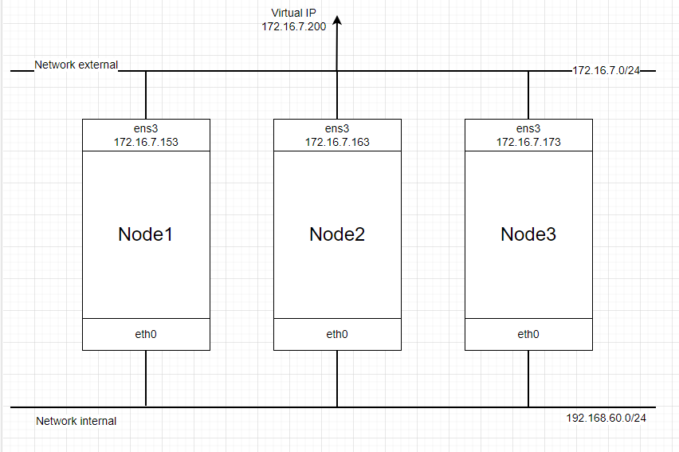
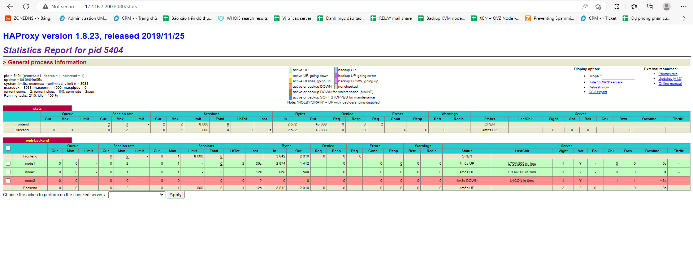

# Một vài điều về HA Keepalive

**HAProxy** hay High Availability Proxy là một công cụ mã nguồn mở nổi tiếng được sử dụng để cân bằng tải TCP/HTTP cũng như giải pháp máy chủ Proxy (Proxy Server).

HAProxy có thể chạy trên nhiều nền tảng như Linux, Solaris, FreeBSD với mục đích là cải thiện hiệu năng, tăng độ tin cậy của hệ thống máy chủ bằng cách phân phối khối lượng công việc trên nhiều máy chủ (như Web, App, cơ sở dữ liệu).

**KeepAlive** là một dịch vụ được sử dụng để tạo ra virtual IP address cho hệ thống. Tiến trình KeepAlive có thể tự động giám sát dịch vụ hoặc hệ thống và có khả năng chịu lỗi cho hệ thống khi dịch vụ hoặc hệ điều hành xảy ra vấn đề.

### Thành phần chính của KeepAlive

- ```Keepalive Interval```: Thời gian giữa các lần gửi gói tin Keepalive từ thiết bị. Giá trị này có thể thay đổi tùy chỉnh
- ```Keepalive Retries```: Số lần mà một thiết bị cố gắng gửi gói tin Keepalive kiểm tra trạng thái khi không nhận được phản hồi từ thiết bị khác. Nếu quá số lần này thì có thể xem là thiết bị đầu kia có trạng thái đường kết nối đứt hoặc không còn hoạt động

### Cách thức hoạt động

- Một gói tin ```Keepalive``` sẽ được gửi từ một thiết bị A đến thiết bị B, thời gian giữa mỗi gói tin là ```<Keepalive Interval>```
- Sau khi gói tin Keepalive đó gửi đi, A sẽ chờ gói tin phản hồi từ B để kiểm tra đường kết nối giữa 2 thiết bị đang hoạt động ổn định
- Nếu không nhận được gói tin phản hồi, thiết bị A sẽ tiếp tục gửi lại gói tin và lại chờ
- Sau số lần là ```<Keepalive Retries>``` vẫn không nhận được phản hồi thì lúc này, thiết bị A sẽ xem như thiết bị B đã down hoặc đường truyền giữa 2 thiết bị không còn khả dụng nữa
- Lúc này dịch vụ sẽ quyết định các hoạt động khác nếu thiết bị B down như chuyển hướng dữ liệu sang đường khác

# Triển khai HAProxy Keepalive cho Apache trên CentOS 7

## Phân hoạch

|Hostname|Hardware|Interface|
|:-|:-|:-|
|node1|2vCPU - 2GB RAM - 25GB Disk|ens3: 172.16.7.153 (Public) - eth0: 192.168.60.210|
|node2|2vCPU - 2GB RAM - 25GB Disk|ens3: 172.16.7.163 (Public) - eth0: 192.168.60.220|
|node3|2vCPU - 2GB RAM - 25GB Disk|ens3: 172.16.7.173 (Public) - eth0: 192.168.60.230|

## Mô hình



## Cấu hình Apache trên các node

Thực hiện tại **Node 1**:

```sh
yum install httpd -y
cat /etc/httpd/conf/httpd.conf | grep 'Listen 80'
sed -i "s/Listen 80/Listen 192.168.60.210:8081/g" /etc/httpd/conf/httpd.conf
echo '<h1>Đây là website từ Node 1</h1>' > /var/www/html/index.html
systemctl start httpd
systemctl enable httpd
```

Thực hiện tại **Node 2**:

```sh
yum install httpd -y
cat /etc/httpd/conf/httpd.conf | grep 'Listen 80'
sed -i "s/Listen 80/Listen 192.168.60.220:8081/g" /etc/httpd/conf/httpd.conf
echo '<h1>Đây là website từ Node 2</h1>' > /var/www/html/index.html
systemctl start httpd
systemctl enable httpd
```

```sh
yum install httpd -y
cat /etc/httpd/conf/httpd.conf | grep 'Listen 80'
sed -i "s/Listen 80/Listen 192.168.60.230:8081/g" /etc/httpd/conf/httpd.conf
echo '<h1>Đây là website từ Node 3</h1>' > /var/www/html/index.html
systemctl start httpd
systemctl enable httpd
```

## Cài đặt và triển khai Keepalive

Cài đặt gói Keepalive trên cả 3 node

```sh
yum install keepalived -y
```

File cấu hình chính của keepalive nằm ở ```/etc/keepalived/keepalived.conf```. Chúng ta thêm các cấu hình này vào file trên từng node như sau:

- Node 1

```sh
echo '
vrrp_script chk_haproxy {
    script "killall -0 haproxy"
    interval 2
    weight 2
}
vrrp_instance VI_1 {
    interface ens3
    state MASTER
    virtual_router_id 51
    priority 101
    virtual_ipaddress {
        172.16.7.200/24
    }
    track_script {
        chk_haproxy
    }
}' > /etc/keepalived/keepalived.conf
```

- Node 2

```sh
echo '
vrrp_script chk_haproxy {
    script "killall -0 haproxy"
    interval 2
    weight 2
}
vrrp_instance VI_1 {
    interface ens3
    state BACKUP
    virtual_router_id 51
    priority 100
    virtual_ipaddress {
        172.16.7.200/24
    }
    track_script {
        chk_haproxy
    }
}' > /etc/keepalived/keepalived.conf
```

- Node 3

```sh
echo '
vrrp_script chk_haproxy {
    script "killall -0 haproxy"
    interval 2
    weight 2
}
vrrp_instance VI_1 {
    interface ens3
    state BACKUP
    virtual_router_id 51
    priority 99
    virtual_ipaddress {
        172.16.7.200/24
    }
    track_script {
        chk_haproxy
    }
}' > /etc/keepalived/keepalived.conf
```

Trong đó đối với block ```vrrp_script```:
- **script "killall -0 haproxy**: kiểm tra tiến trình HAProxy
- **interval 2**: việc kiểm tra được thực hiện mỗi 2 giây
- **weight 2**: nếu kiểm tra thành công thì được +2 điểm

Với block ```vrrp_instance```:
- **interface ens3**: tên card mạng
- **state MASTER**: chỉ định node này là MASTER hay SLAVE
- **virtual_router_id 51**: mỗi cụm Keepalive chỉ cần 1 ID chia sẻ giữa các node, ở đây ta chọn 51
- **priority 101**: giá trị ưu tiên, node nào có priority cao nhất sẽ được chọn để hiển thị web
- **virtual_ipaddress**: khai báo 1 IP cùng dải với ens3, ví dụ 172.16.7.200
- **track_script**: giúp Keepalive xác định node nào sẽ nắm IP Virtual. Ví dụ Node 1 có priority là 101 thì Node 1 sẽ nắm IP Virtual. Nếu khi check HA service không thành công thì giá trị này sẽ giảm đi 2 và thấp hơn Node 2, lúc này Node 2 sẽ nắm IP Virtual.

Cuối cùng ta start dịch vụ ```keepalived```

```sh
systemctl start keepalived
```

## Cài đặt HAProxy

Thực hiện các bước sau trên cả 3 Node

```sh
yum install wget socat -y
wget https://cbs.centos.org/kojifiles/packages/haproxy/1.8.23/3.el7/x86_64/haproxy18-1.8.23-3.el7.x86_64.rpm --no-check-certificate
yum install haproxy18-1.8.23-3.el7.x86_64.rpm -y
```

Tạo bản backup cho cấu hình mặc định và chỉnh sửa cấu hình cho HAproxy

```sh
cp /etc/haproxy/haproxy.cfg /etc/haproxy/haproxy.cfg.bak
```

Cấu hình HAProxy

```sh
echo 'global
    log         127.0.0.1 local2
    chroot      /var/lib/haproxy
    pidfile     /var/run/haproxy.pid
    maxconn     4000
    user        haproxy
    group       haproxy
    daemon
    stats socket /var/lib/haproxy/stats

defaults
    mode                    http
    maxconn                 8000
    log                     global
    option                  httplog
    option                  dontlognull
    option http-server-close
    retries                 3
    timeout http-request    20s
    timeout queue           1m
    timeout connect         10s
    timeout client          1m
    timeout server          1m
    timeout http-keep-alive 10s
    timeout check           10s

listen stats
    bind *:8080 interface ens3
    mode http
    stats enable
    stats uri /stats
    stats realm HAProxy\ Statistics
    stats admin if TRUE

listen web-backend
    bind *:80
    balance  roundrobin
    cookie SERVERID insert indirect nocache
    mode  http
    option  httpchk
    option  httpclose
    option  httplog
    option  forwardfor
    server node1 192.168.60.210:8081 check cookie node1 inter 5s fastinter 2s rise 3 fall 3
    server node2 192.168.60.220:8081 check cookie node2 inter 5s fastinter 2s rise 3 fall 3
    server node3 192.168.60.230:8081 check cookie node3 inter 5s fastinter 2s rise 3 fall 3' > /etc/haproxy/haproxy.cfg
```

Cấu hình Log cho HAProxy

```sh
sed -i "s/#\$ModLoad imudp/\$ModLoad imudp/g" /etc/rsyslog.conf
sed -i "s/#\$UDPServerRun 514/\$UDPServerRun 514/g" /etc/rsyslog.conf
echo '$UDPServerAddress 127.0.0.1' >> /etc/rsyslog.conf
echo 'local2.*    /var/log/haproxy.log' > /etc/rsyslog.d/haproxy.conf
systemctl restart rsyslog
```

Bổ sung cấu hình cho phép kernel có thể binding tới IP Virtual

```sh
echo 'net.ipv4.ip_nonlocal_bind = 1' >> /etc/sysctl.conf
```

Kiểm tra

```sh
sysctl -p
```

Khởi tạo dịch vụ HAProxy

```sh
systemctl restart haproxy
systemctl enable haproxy
```

## Kết quả


