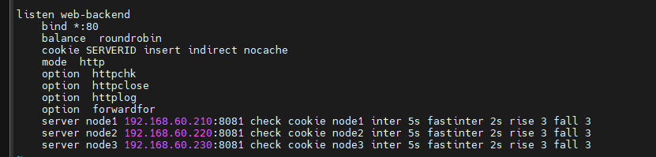

# Tổng hợp các thuật ngữ trong kỹ thuật HA Proxy

Trong bài viết này sẽ tổng hợp 1 số thuật ngữ phổ biến trong HAProxy

## Access Control List (ACL)

Access Control List (ACL) sử dụng để kiểm tra một số điều kiện và thực hiện hành động tiếp theo dựa trên kết quả kiểm tra (VD lựa chọn một server, chặn 1 request). 

Sử dụng ACL cho phép điều tiết lưu lượng mạng linh hoạt dựa trên các yếu tố khác nhau (VD: dựa theo đường dẫn, dựa theo số lượng kết nối tới backend)

## Backend 

Backend là tập các server nhận request đã được điều tiết (HAProxy điều tiết các request tới backend). Các request được định nghĩa trong mục ```backend``` khi cấu hình HAProxy



2 cấu hình thường được định nghĩa trong mục này là:
- Thuật toán cân bằng tải (Round Robin, Least Connection và IP Hash): Round Robin và Least Connection thì hoạt động y như tên gọi, IP Hash thì sẽ dùng thuật toán để lấy IP của client và server và gen 1 hash key độc nhất, key này sau đó được dùng để điều phối client vào server nhất định
- Danh sách các server, port (nhận, xử lý request)

Backend có thể chứa 1 hoặc nhiều server, việc thêm server vào backend sẽ cải thiện tải, hiệu năng, tăng độ tin cậy của dịch vụ. Khi 1 server trong backend không khả dụng, các server khác sẽ chịu tải thay cho server đó.

## Frontend

Frontend được định nghĩa cách các request được điều tiết tới backend. Các cấu hình Frontend được định nghĩa trong mục ```frontend``` khi cấu hình HAProxy

Các cấu hình frontend bao gồm các thành phần:
- Tập các IP và port (VD: 172.16.7.153:80, *:443)
- Các ACL
- Các backend nhận và xử lý request

## Các loại cân bằng tải

### Không cân bằng tải

Kiến trúc đơn giản nhất khi triển khai ứng dụng web, đơn giản là người dùng kết nối thẳng tới webserver, nếu webserver xảy ra vấn đề thì người dùng sẽ không thể kết nối được nữa. Nếu nhiều truy cập quá thì webserver có thể không đáp ứng được các request, dẫn đến trải nhiệm người dùng sẽ giảm xuống

### Layer 4 load balancing

Phương pháp này sẽ cân bằng tải ở tầng 4 TCP (tức tầng giao vận). Hiểu đơn giản là các request đến domain/IP của load balancer sẽ được điều hướng đến backend để xử lý

Lưu ý:
- Như trong bài lab, 2 webserver có thể đưa ra nội dung không thống nhất
- 2 web hoàn toàn có thể sử dụng chung 1 database, hoặc sử dụng 2 database tách biệt, hoặc nhiều hơn thế (như database replication chẳng hạn)

### Layer 7 load balancing

Cân bằng tải ở tầng 7 (tầng ứng dụng), loại load balancing này sẽ điều hướng request đến backend khác nhau dựa trên nội dung request đó. Ví dụ:


## Các thuật toán cân bằng tải

Thuật toán cân bằng tải được sử dụng nhằm định nghĩa các request được điều hướng tới các server nằm trong backend trong quá trình load balancing. HAProxy cung cấp một số thuật toán như:
- Roundrobin: như cái tên, các backend sẽ phục vụ lần lượt, xoay vòng
- Leastconn: request được điều phối đến server backend đang có ít kết nối nhất
- Source (IP hash): các request được chuyển đến server bằng các hash key dựa trên IP của client và server. Điều này giúp cho người dùng đó sẽ luôn được kết nối đến cùng 1 server 

## Sticky Sessions

Một số ứng dụng yêu cầu người dùng phải giữ kết nối tới cùng 1 server thuộc backend, để giữ kết nối giữa client với 1 backend server, bạn có thể sử dụng tùy chọn ```sticky sessions```

Thông tin chi tiết về sticky sessions được tổng hợp ở: [đây](https://github.com/shaidoka/thuctap-NhanHoa/blob/main/Linux_basic/HA_KeepAlive/HA_Sticky_Session.md)

## Health Check

HAProxy sử dụng ```health check``` để phát hiện các backend server sẵn sàng xử lý request. Kỹ thuật này sẽ tránh việc loại bỏ server khỏi backend thủ công khi backend server không sẵn sàng. ```health check``` sẽ cố gắng thiết lập kết nối TCP tới server để kiểm tra backend server có sẵn sàng xử lý request

Nếu ```health check``` không thể kết nối tới server, nó sẽ tự động loại bỏ server khỏi backend, các traffic tới sẽ không được forward đến server cho đến khi ```health check``` thành công. Nếu tất cả server thuộc backend đều xảy ra vấn đề, dịch vụ sẽ trở nên không khả dụng. 

