# Cài đặt Icinga

Ra mắt rất sớm từ những năm 2009, Icinga tính đến hiện tại vẫn rất được nhiều người lựa chọn sử dụng nhờ tính thuận tiện và dễ sử dụng của nó.

## I. Cài đặt dependency và Icinga2 package

### 1. Cài đặt dependency

Update packages

```sh
apt-get update -y && apt-get upgrade -y
```

Cài đặt dependency

```sh
apt install software-properties-common ca-certificates lsb-release apt-transport-https wget gnupg -y
```

Cài đặt php modules, apache2, mariadb. php8.1

```sh
apt install apache2 mariadb-server mariadb-client mariadb-common php php-gd php-mbstring php-mysqlnd php-curl php-xml php-cli php-soap php-intl php-xmlrpc php-zip  php-common php-opcache php-gmp php-imagick php-pgsql -y
```

Khởi động apache2, mariadb

```sh
systemctl enable {apache2,mariadb} --now
```

Setup mariadb

```sh
mysql_secure_installation
```

Chỉnh sửa 1 vài thông số trong file php.ini

```sh
vi /etc/php/8.1/apache2/php.ini

memory_limit = 256M 
post_max_size = 64M
upload_max_filesize = 100M	
max_execution_time = 300
default_charset = "UTF-8"
date.timezone = "Asia/Ho_Chi_Minh"
cgi.fix_pathinfo=0
```

Restart apache2

```sh
systemctl restart apache2
```

### 2. Cài đặt Icinga2

Thêm GPG-key

```sh
wget -O - https://packages.icinga.com/icinga.key | gpg --dearmor -o /usr/share/keyrings/icinga-archive-keyring.gpg
```

Thêm Icinga repo

```sh
. /etc/os-release; if [ ! -z ${UBUNTU_CODENAME+x} ]; then DIST="${UBUNTU_CODENAME}"; else DIST="$(lsb_release -c| awk '{print $2}')"; fi; \
 echo "deb [signed-by=/usr/share/keyrings/icinga-archive-keyring.gpg] https://packages.icinga.com/ubuntu icinga-${DIST} main" > \
 /etc/apt/sources.list.d/${DIST}-icinga.list
 echo "deb-src [signed-by=/usr/share/keyrings/icinga-archive-keyring.gpg] https://packages.icinga.com/ubuntu icinga-${DIST} main" >> \
 /etc/apt/sources.list.d/${DIST}-icinga.list
```

```sh
apt update -y
```

Cài đặt Icinga2

```sh
apt install icinga2 -y
```

Cài đặt monitor plugin

```sh
apt install monitoring-plugins -y
```

Khởi động icinga2

```sh
systemctl enable icinga2 --now
```

Cài đặt Icinga2 IDO Module

Icinga2 Data Output xuất tất cả thông tin về cấu hình và trạng thái vào 1 database. IDO database sau đó sử dụng bởi Icinga Web để làm backend

```sh
apt install icinga2-ido-mysql -y
```

Chọn ```Yes``` để bật tính năng ```ido-mysql``` của Icinga2

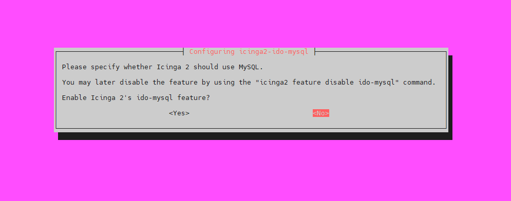


```icinga2-ido-mysql``` package yêu cầu 1 database được cài đặt và cấu hình. Điều này có thể được thực hiện tự động với ```dbconfig-common```, nhưng ta có thể tự tạo thủ công, nên ta chọn ```No``` ở đây

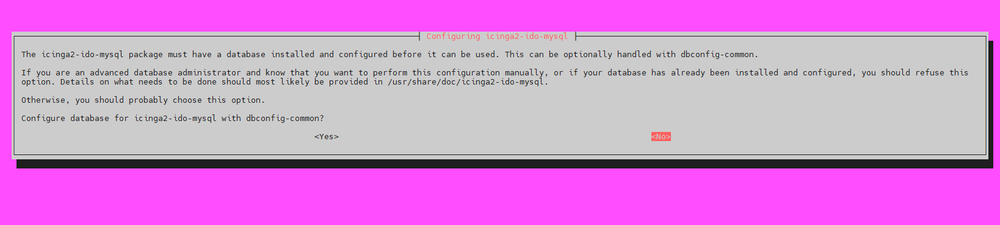

Tiếp đến, đăng nhập vào MariaDB database server

```sh
mysql -u root -p
```

Tạo database và database user

```sh
CREATE DATABASE icinga_ido_db;
GRANT ALL ON icinga_ido_db.* TO 'icinga_ido_user'@'localhost' IDENTIFIED BY 'ghjlarewsngjlan';
FLUSH PRIVILEGES;
EXIT;
```

Import **Icinga2 IDO schema**

```sh
mysql -u root -p icinga_ido_db < /usr/share/icinga2-ido-mysql/schema/mysql.sql
```

Kích hoạt Icinga2 IDO Module

Để kích hoạt ```icinga2-ido-mysql``` với Icinga Web 2, ta thực hiện thay đổi file cấu hình mặc định của feature

```sh
vi /etc/icinga2/features-available/ido-mysql.conf
```

Sửa các thông tin sau

```sh
object IdoMysqlConnection "ido-mysql" {
  user = "icinga_ido_user"
  password = "ghjlarewsngjlan"
  host = "localhost"
  database = "icinga_ido_db"
}
```

Kích hoạt feature

```sh
icinga2 feature enable ido-mysql
```

Restart service icinga2

```sh
systemctl restart icinga2
```

### 3. Cài đặt và thiết lập IcingaWeb2

Cài đặt **icingaweb2** và **Icinga CLI**

```sh
apt install icingaweb2 icingacli -y
```

Tạo database cho IcingaWeb2

```sh
mysql -u root -p
```

```sh
CREATE DATABASE icingaweb2;
GRANT ALL ON icingaweb2.* TO 'icingaweb2user'@'localhost' IDENTIFIED BY 'gbjraeswbgj';
FLUSH PRIVILEGES;
EXIT;
```

Tạo 1 token để sử dụng cho quá trình thiết lập **Icinga2 Web**

```sh
icingacli setup token create
```

Nếu quên token, ta có thể dùng lệnh sau để show

```sh
icingacli setup token show
```

## II. Cài đặt Icingaweb2

Truy cập vào địa chỉ ```<ip-address>/icingaweb2/setup``` trên trình duyệt để thực hiện setup Icinga Web

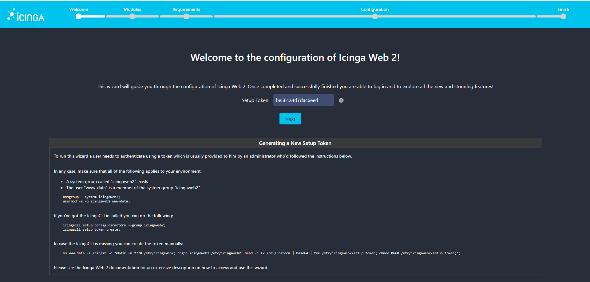

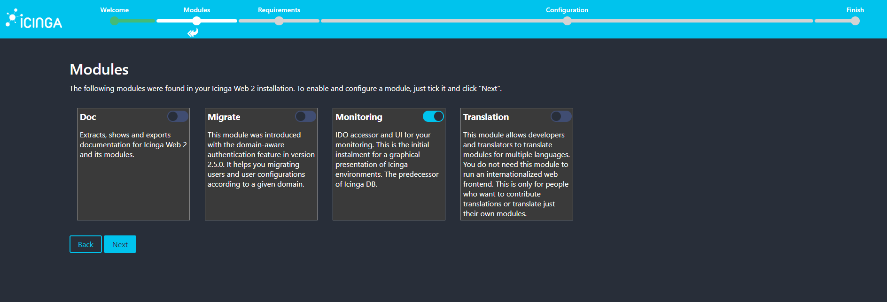

Ở phần tiếp, hãy chắc chắn rằng tất cả các thành phần đều được đáp ứng, nếu thiếu thành phần nào hãy cài đặt thêm

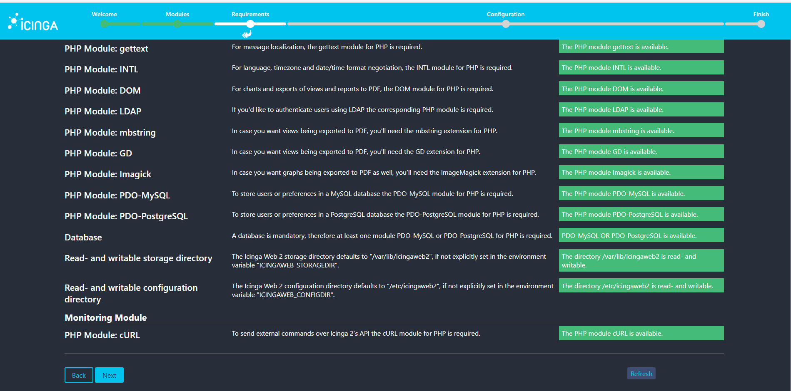

Chọn Database

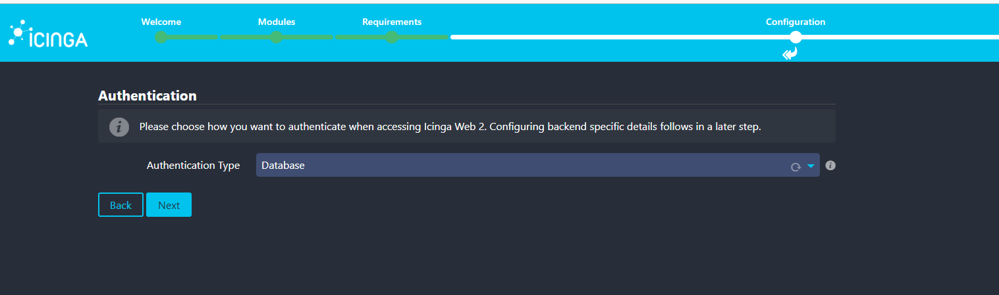

Nhập thông tin về database và chọn ```Validate Configuration``` để kiểm tra cấu hình

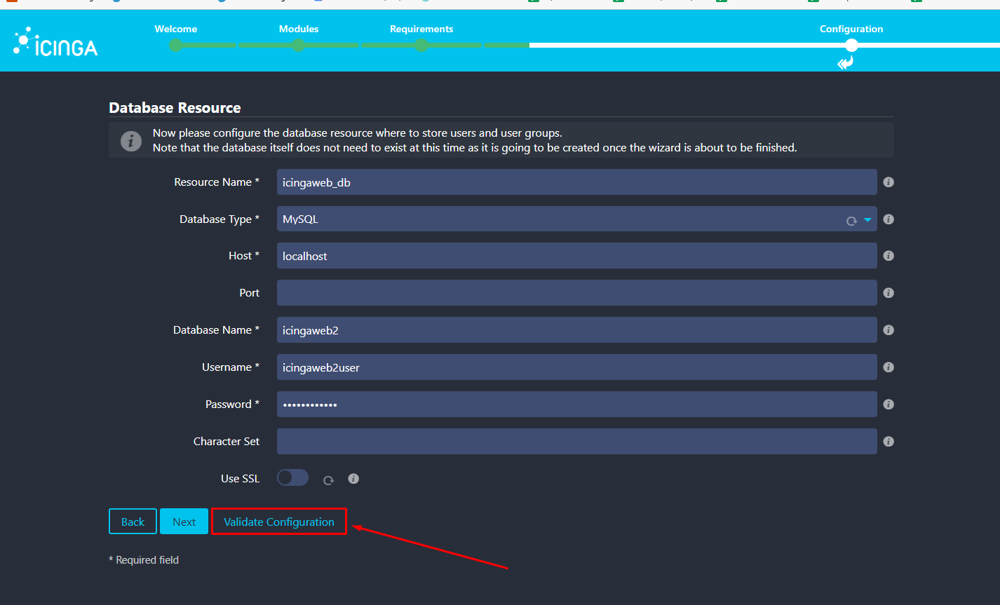

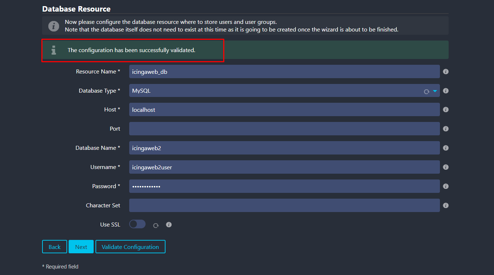

Như trên là được rồi, giờ ta tiếp tục

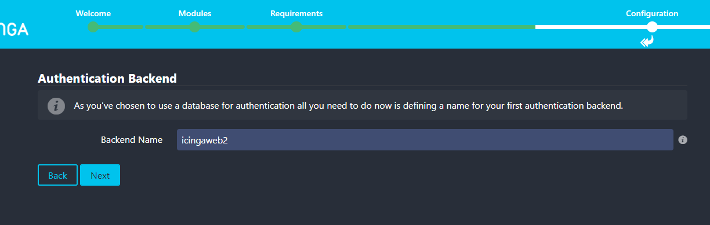

Tạo tài khoản admin

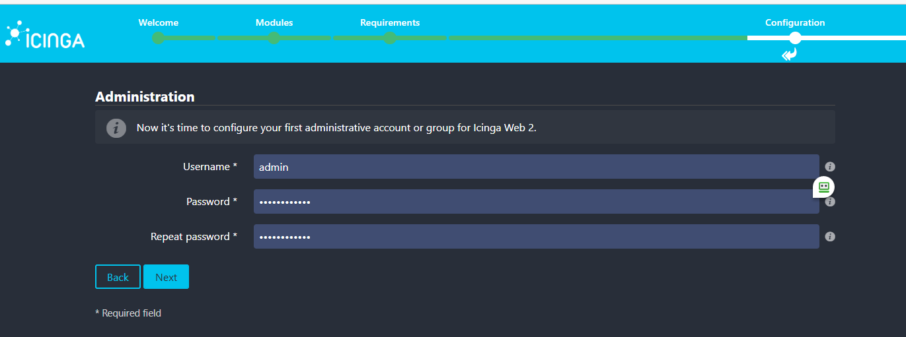


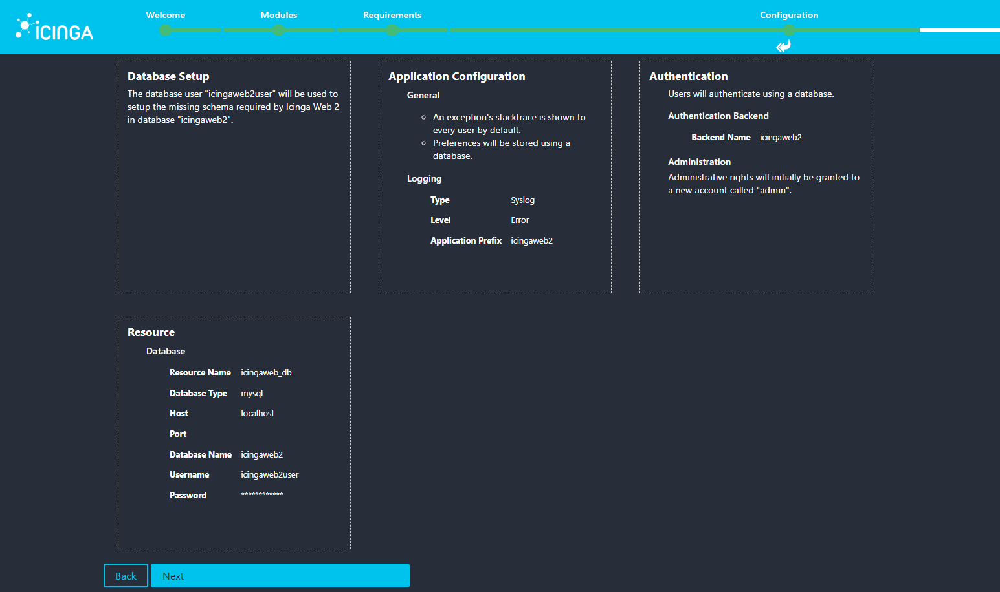

Nhập thông tin về IDO db và kiểm tra cấu hình

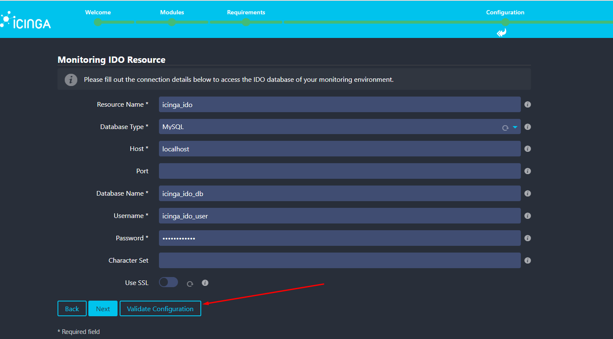

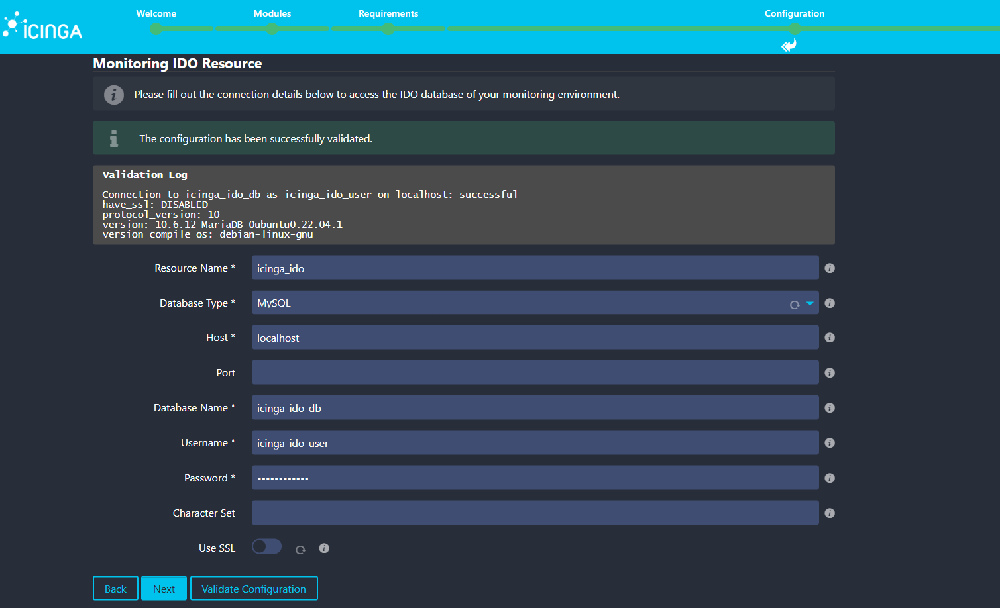

Chọn kiểu Transport là ```Local Command File```

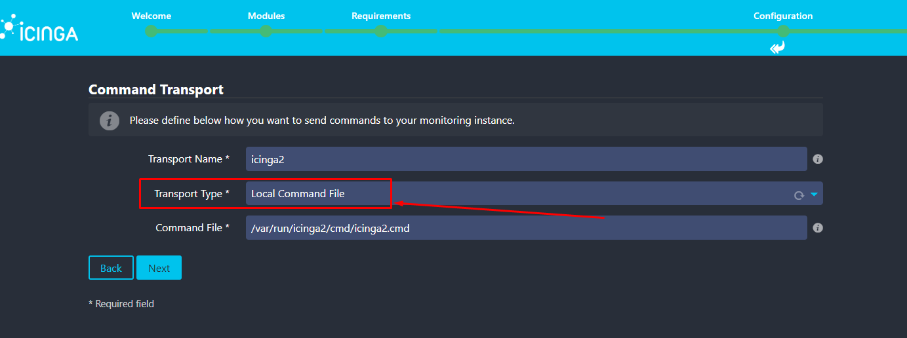

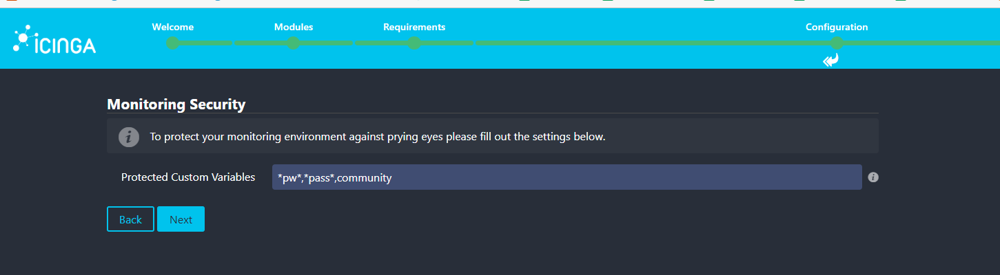

Confirm configuration

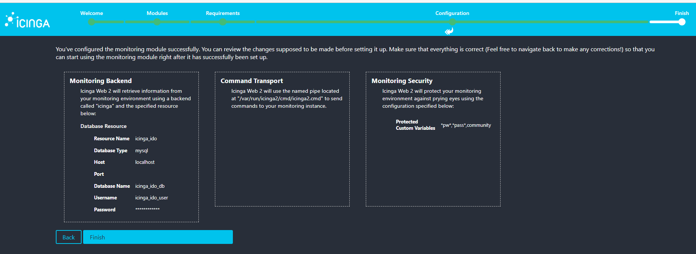

Done!


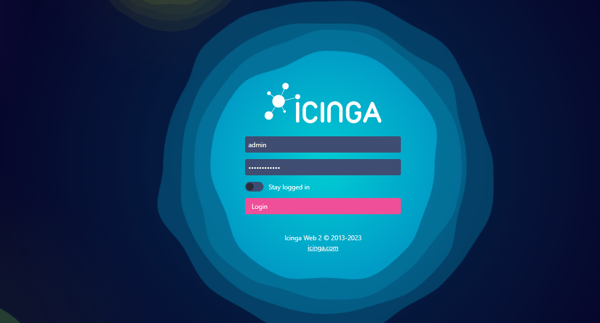

Và đây là giao diện cơ bản của Icinga2

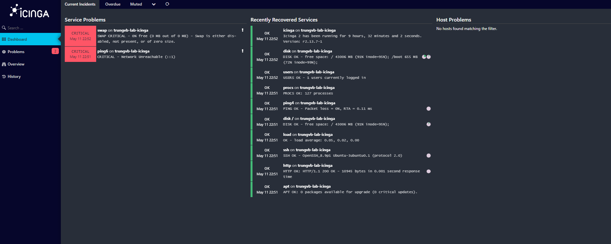