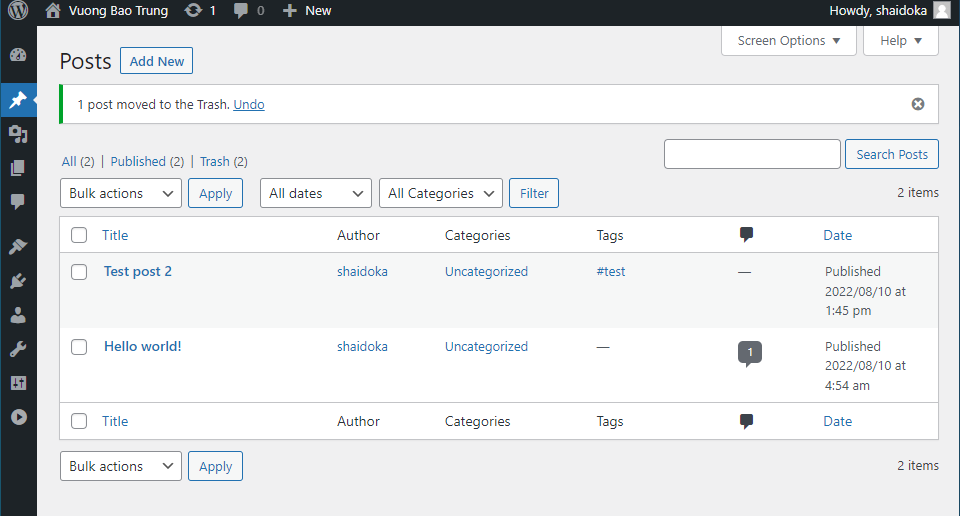
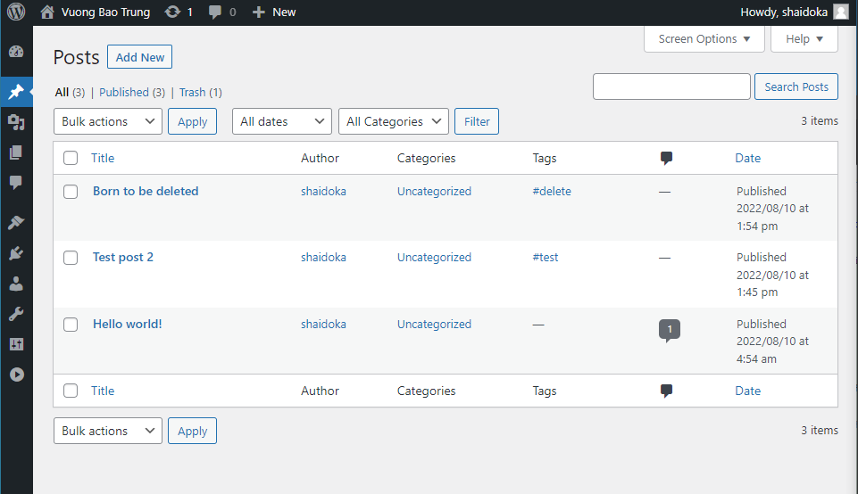
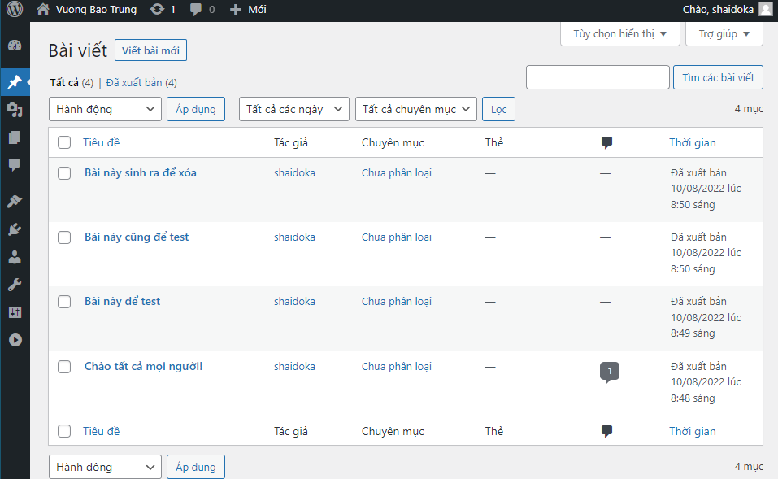
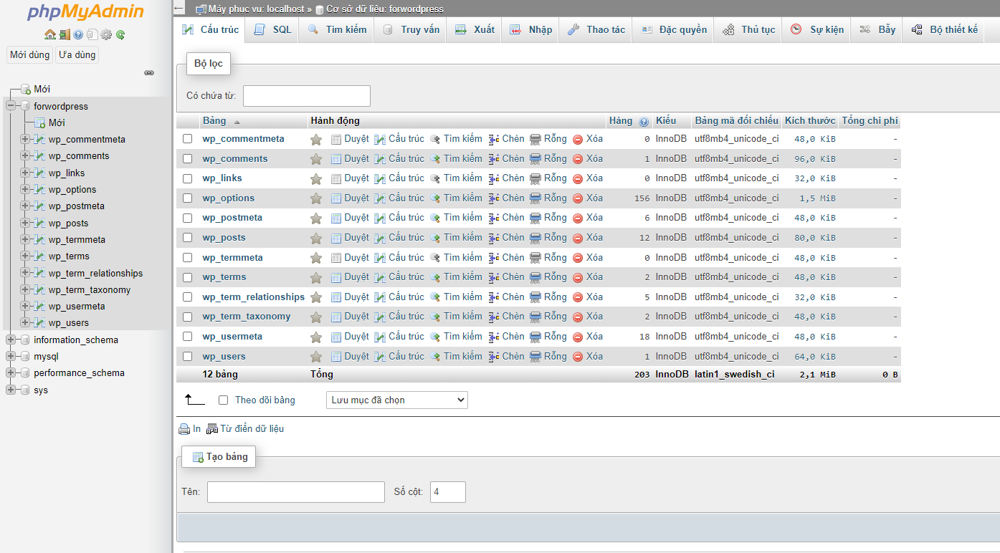
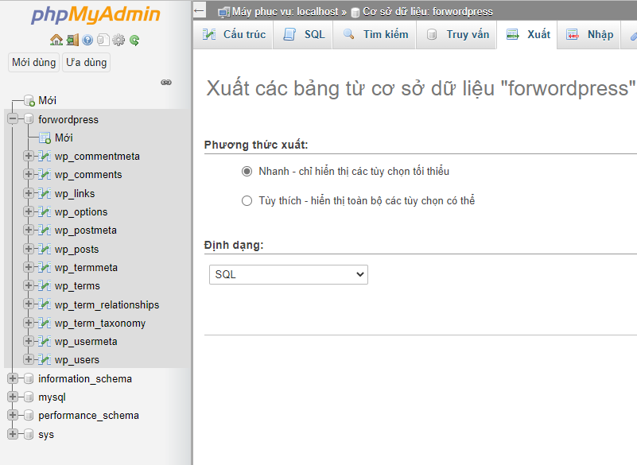
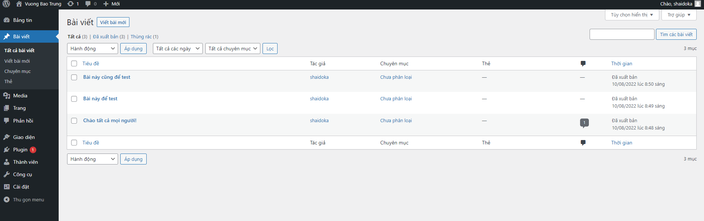
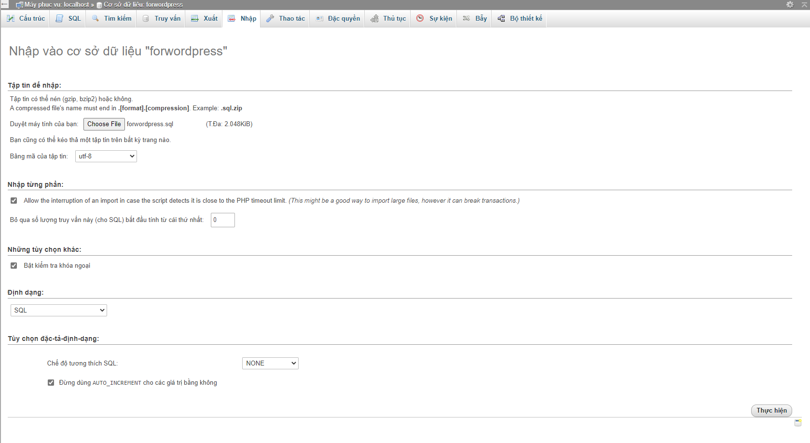
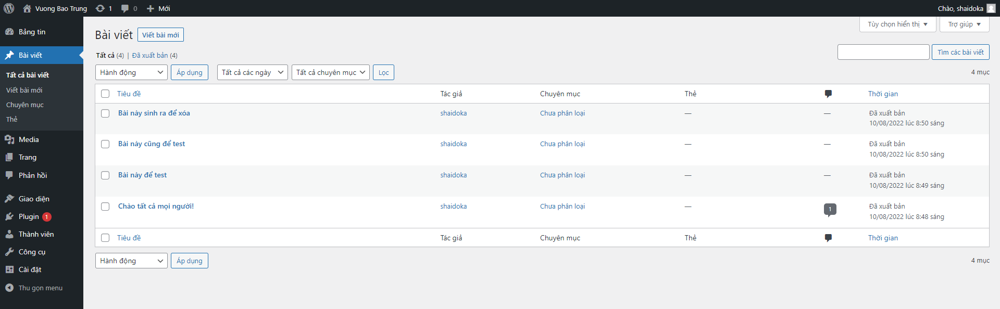

# Backup và Restore database

## Backup và Restore sử dụng câu lệnh

1. Tạo thư mục lưu trữ file backup

```sh
mkdir /mnt/backup
cd /mnt/backup
```

2. Sao lưu database vào file backup.sql, lưu tại /mnt/backup

```mysqldump -u root -p forwordpress > backup.sql```

3. Restore database

Bài viết "Born to be deleted" bị xóa trước khi restore



Sau khi restore bằng lệnh

```mysql -u root -p -D forwordpress < backup.sql```



## Backup và Restore sử dụng phpMyAdmin

1. Tạo 1 vài bài viết trước khi Backup dữ liệu



2. Đăng nhập vào phpmyadmin, chọn database mà ta muốn backup ở cửa sổ bên trái



3. Xuất dữ liệu của database về máy

Có 2 phương thức xuất dữ liệu là **Nhanh** và **Tùy chỉnh**:
- Nhanh: sao lưu toàn bộ database
- Tùy chỉnh: sao lưu các bảng tự chọn trong database

Chọn định dạng file xuất ra là **SQL**

Chọn **Thực hiện** để tải file .sql về



4. Trước khi thực hiện Restore, xóa thử 1 bài viết bất kỳ



5. Ở giao diện phpMyAdmin

Chọn database muốn thực hiện restore, tiến hành drop toàn bộ table (đánh dấu tất cả -> xóa)

Vào phần **Nhập** để tải lên database trước đó đã backup

Chọn **Choose File** và dẫn đến tập tin .sql 

Chọn **Thực hiện** để Restore lại database



6. Kiểm tra xem dữ liệu đã quay trở lại chưa bằng giao diện của wordpress

