# Tổng hợp các lệnh cơ bản trên Linux

## Những lệnh liên quan đến hệ thống

1. ```exit```: thoát khỏi cửa sổ dòng lệnh

2. ```reboot```: khởi động lại hệ thống

3. ```halt```: tắt máy
- Phải ở quyền root
- Không nên dùng, bị treo máy ảo

4. ```startx```: khởi động chế độ xwindows từ cửa sổ terminal

5. ```mount```: gắn hệ thống tập tin từ 1 thiết bị lưu trữ vào cây thư mục chính

6. ```umount```: unmount tập tin khỏi cây thư mục chính

7. ```ps```: kiểm tra hệ thống tiến trình đang chạy

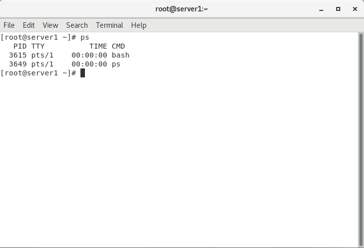

8. ```kill```: dừng lại tiến trình khi tiến trình bị treo. Chỉ có super-user mới có thể dừng tất cả các tiến trình còn người dùng bình thường chỉ có thể dừng tiến trình mà mình tạo ra

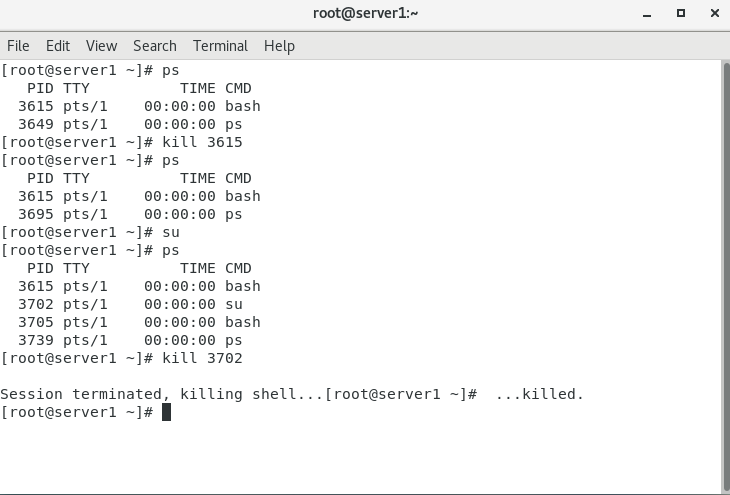

9. ```top```: hiển thị sự hoạt động của các tiến trình, đặc biệt là thông tin về tài nguyên hệ thống và việc sử dụng các tài nguyên đó của từng tiến trình

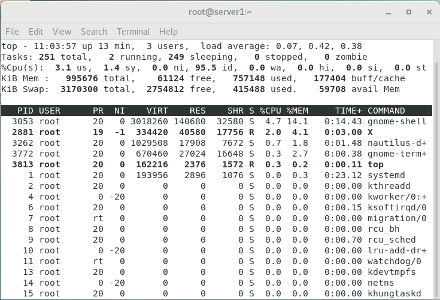

10. ```pstree```: hiển thị tất cả các tiến trình dưới dạng cây

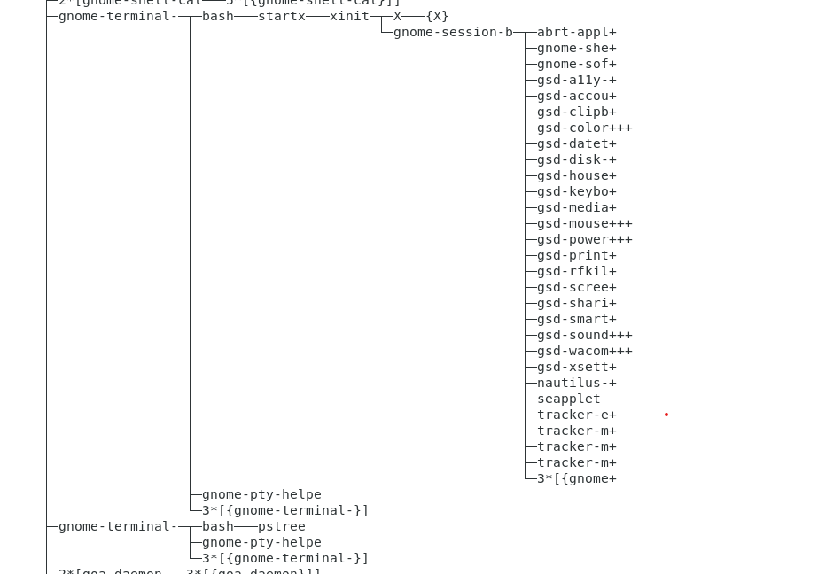

11. ```man```: xem hướng dẫn về dòng lệnh như cú pháp, tham số

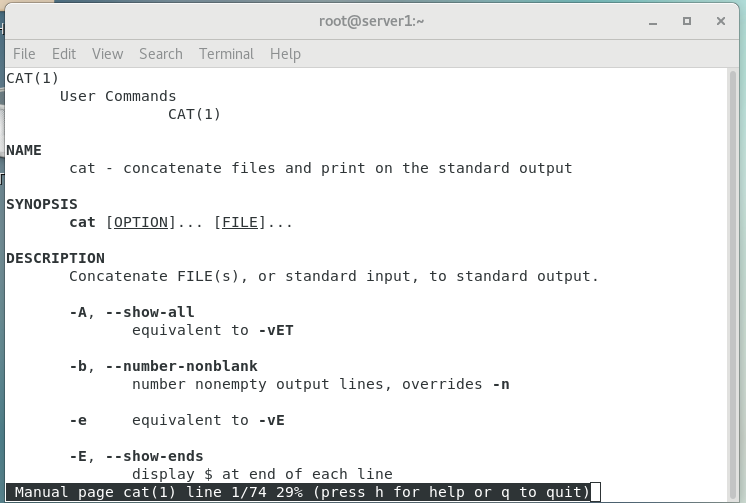

12. ```cat /etc/*release```: xem thông tin hệ điều hành

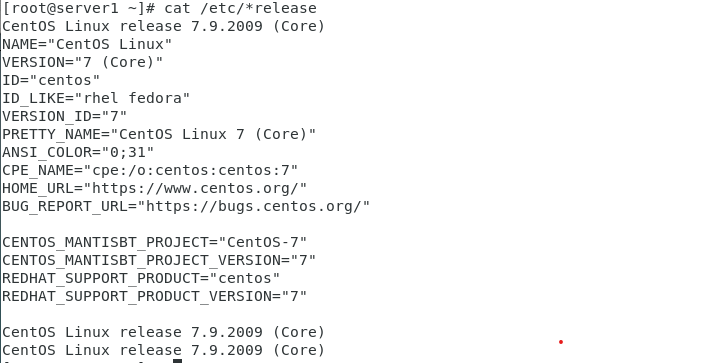

13. ```uname -r```: xem phiên bản Kernel

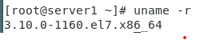

14. ```head /proc/meminfo```: xem thông tin bộ nhớ

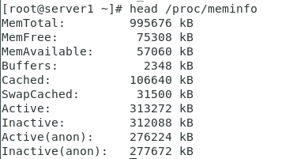

15. ```df -h```: file hệ thống

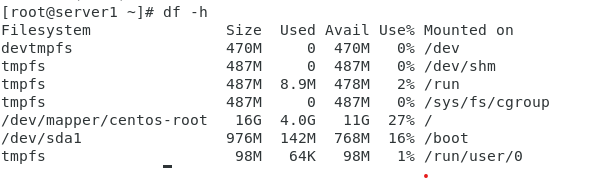

16. ```cat /proc/cpuinfo | grep model```: đếm số lượng cpu

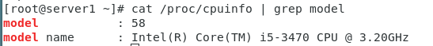

17. ```cat /etc/hostname```: tên máy chủ

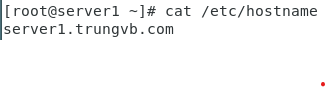

18. ```hostnamectl set-hostname <hostname>```: đổi tên máy chủ

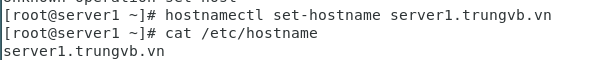

19. ```ifconfig```: xem địa chỉ IP của máy

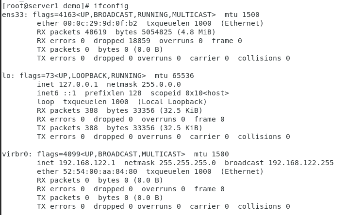

## Các lệnh liên quan đến tệp và thư mục

1. ```ls```: liệt kê các tệp và thư mục trong thư mục hiện hành

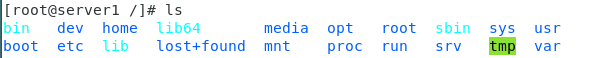

2. ```pwd```: xuất đường dẫn của thư mục đang làm việc


3. ```cd```: thay đổi thư mục làm việc đến 1 thư mục mới

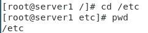

4. ```mkdir```: tạo thư mục mới

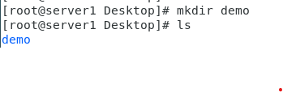

5. ```rmdir```: xóa thư mục rỗng

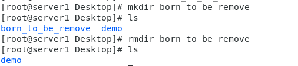

*Có thể xóa thư mục không rỗng bằng cách sử dụng lệnh ```rm -r```*

6. ```cp```: copy 1 hay nhiều tập tin đến thư mục mới

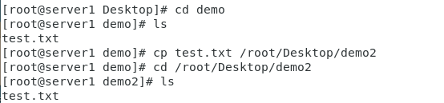

7. ```mv```: đổi tên hay di chuyển tập tin, thư mục

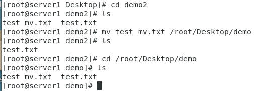

8. ```rm```: xóa tập tin hoặc thư mục

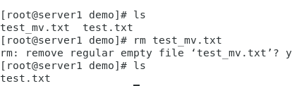

*Xóa thư mục với option -r*

9. ```touch```: tạo 1 tệp tin

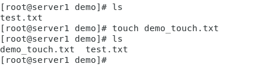

10. ```cat```: xem nội dung tệp tin


11. ```vi```: chỉnh sửa nội dung file text với trình soạn thảo văn bản vi

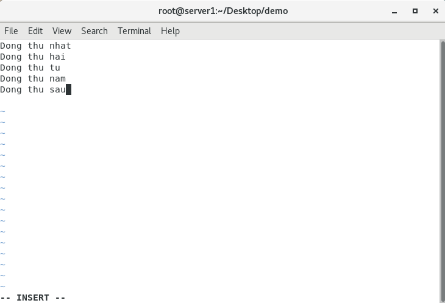

*Sau đó nhấn ESC và gõ ":wq" để lưu thay đổi và thoát trình soạn thảo văn bản*

12. ```chmod```: thay đổi quyền của tệp tin

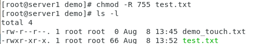

13. ```chroot```: thay đổi quyền của thư mục (tương tự chmod)

14. ```chown```: thay đổi quyền sở hữu của tệp tin

## Các lệnh liên quan đến cài đặt 

1. ```gunzip```: chuyển file .tar.gz về file .tar

2. ```tar -xvf```: giải nén file .tar

3. ```apt install```: cài đặt những ứng dụng có trong kho dựa trên Debian

4. ```yum install```: cài đặt những ứng dụng có trong kho dựa trên RPM


