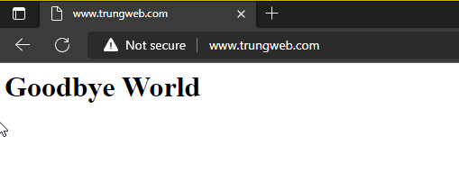
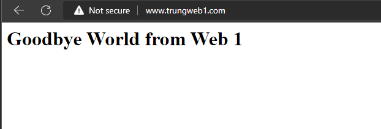
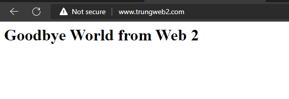

# Cài đặt Apache webserver trên hệ điều hành Centos 7

## Cài đặt Apache

1. Sử dụng lệnh yum package manager để cài đặt Apache

```sh
#update toàn bộ package
sudo yum update httpd
#cài đặt apache
sudo yum install httpd
```

Bằng cách này, yum package manager sẽ cài đặt Apache và toàn bộ các dependencies bắt buộc khác

2. Thiết lập firewall cho phép truy cập HTTP

```sh
sudo firewall-cmd --permanent --add-service=http
sudo firewall-cmd --permanent --add-service=https
sudo firewall-cmd --reload
```

3. Kiểm tra file cấu hình chính của Apache có tên httpd.conf tại đường dẫn /etc/http/conf

```sh
cd /etc/httpd/conf
vi httpd.conf
```

Những tùy chỉnh quan trọng cần chú ý trong file cấu hình của Apache:
- ServerRoot "/etc/httpd" - Vị trí cài đặt Apache
- Timeout 120 - Thời gian sống của 1 kết nối (giây)
- KeepAlive On - Client gửi nhiều yêu cầu đến server qua 1 kết nối
- MaxkeepAliveRequests 100 - Số request tối đa trên 1 kết nối
- KeepAlivetimeout 15 - Thời gian timeout của 1 request
- Listen 80 - Lắng nghe trên port 80
- User apache - User để chạy httpd
- Group apache - Group để chạy httpd
- ServerAdmine root@localhost - Email của người quản trị
- ServerName www.trungweb.com:80 - Khai báo địa chỉ URL
- DocumentRoot "/var/www/html" - Thư mục gốc của webserver
- DirectoryIndex index.html - Khai báo trang đầu tiên được khởi động

4. Viết 1 trang web đơn giản để test tại đường dẫn /var/www/html

```sh
cd /var/www/html
vi index.html
<h1>Hello World</h1>
```

5. Khởi động dịch vụ httpd

```sh
sudo systemctl start httpd.service
sudo systemctl enable httpd.service
```

## Cấu hình virtual host

1. Tạo folder để lưu trữ trang web và file log

```sh
sudo mkdir -p /var/www/www.trungweb1.com/html
sudo mkdir -p /var/www/www.trungweb2.com/log
sudo chmod -R 755 /var/www
```

2. Tạo trang index.html tương tự như khi cấu hình trang web chính

```sh
sudo vi /var/www/www.trungweb1.com/html/index.html
<h1>Hello World from Web 1</h1>
```

```sh
sudo vi /var/www/www.trungweb2.com/html/index.html
<h1>Hello World from Web 1</h1>
```

3. Tạo thư mục để lưu trữ virtual server và nơi chứa symlink cho chúng

```sh
sudo mkdir /etc/httpd/sites-available /etc/httpd/sites-enabled
sudo vi /etc/httd/conf/httpd.conf
```

Sau đó thêm dòng này vào cuối file cấu hình: ```IncludeOptional sites-enabled/*.conf```

4. Tạo file virtual host

```sh
sudo vi /etc/httpd/sites-available/www.trungweb1.com.conf
```

Cấu hình virtual host như sau:

```sh
<VirtualHost *:80>
    ServerName www.trungweb1.com
    ServerAlias trungweb1.com
    DocumentRoot /var/www/www.trungweb1.com/html
    ErrorLog /var/www/www.trungweb1.com/log/error.log
    CustomLog /var/www/www.trungweb1.com/log/requests.log combined
</VirtualHost>
```

Thực hiện tương tự với virtual host 2

5. Tạo liên kết cho virtual host trong directory sites-enabled

```sh
sudo ln -s /etc/httpd/sites-available/www.trungweb1.com.conf /etc/httpd/sites-enabled/www.trungweb1.com.conf
sudo ln -s /etc/httpd/sites-available/www.trungweb2.com.conf /etc/httpd/sites-enabled/www.trungweb2.com.conf
```

6. Chặn truy cập IP VPS tự động redirect về website trên VPS

Theo mặc định thì khi truy cập IP của VPS hoặc khi trỏ 1 tên miền về VPS mà tên miền này không được cấu hình vhost thì bạn sẽ được redirect tới một website bất kỳ trên VPS, điều này là không nên và để hạn chế thì có thể thêm rule vào file cấu hình của apache

Mở file httpd.conf và thêm vào cuối file:

```sh
vi /etc/httpd/conf/httpd.conf

<VirtualHost *:80>
	DocumentRoot /var/www/html
	ServerName www.trungweb.com
	<Directory "/var/www/html">
		AllowOverride All
                Options None
                Require method GET POST OPTIONS
	</Directory>
</VirtualHost>
```

7. Cuối cùng, restart lại dịch vụ httpd

```sh
systemctl reload httpd
systemctl restart httpd
```






