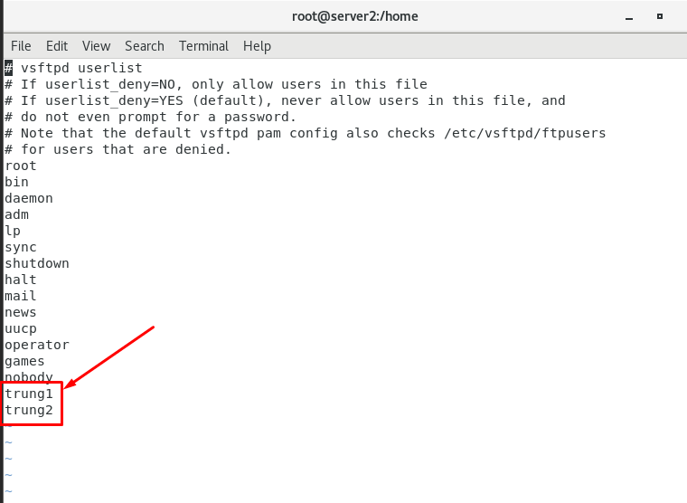
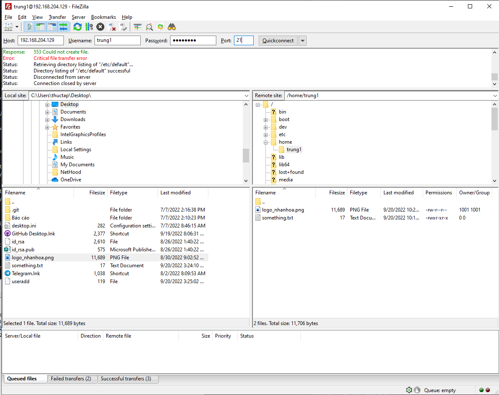

# Cài đặt FTP server trên CentOS 7

**Bước 1:** Cài đặt dịch vụ FTP với VSFTPD

- Cài đặt VSFTPD

```sh
yum install -y vsftpd
```

- Khởi động dịch vụ và cho phép nó khởi động cùng hệ thống

```sh
systemctl start vsftpd
systemctl enable vsftpd
```

- Cấu hình tường lửa cho dịch vụ FTP và port 21

```sh
firewall-cmd --permanent --add-port=21/tcp
firewall-cmd --permanent --add-service=ftp
firewall-cmd --reload
```

**Bước 2:** Cấu hình VSFTPD

- File cấu hình vsftpd nằm tại ```/etc/vsftpd/vsftpd.conf```

- Copy file cấu hình backup

```sh
cp /etc/vsftpd/vsftp.conf /etc/vsftpd/vsftpd.conf.backup
```

- Chỉnh sửa file cấu hình ```vsftpd.conf```

```sh
vi /etc/vsftpd/vsftpd.conf
```

- FTP Access: ta không cho kết nối nặc danh, mà chỉ cho kết nối cục bộ vào FTP server 

```sh
anonymous_enable=NO
local_enable=YES
```

- Cho phép người dùng nội bộ tải lên

```sh
write_enable=YES
```

- Giữ người dùng trong thư mục của họ. Tại đây ta sẽ chroot tất cả các user từ các user trong chroot_list

```sh
chroot_local_user=YES
allow_writeable_chroot=YES
chroot_list_enable=YES
chroot_list_file=/etc/vsftpd/chroot_list
```

- Banner khi người dùng login vào FTP server

```sh
ftpd_banner="Welcome FTP Server"
```

- Giới hạn khoảng các cổng cho FTP passive

```sh
pasv_min_port=30000
pasv_max_port=31000
```

- Giới hạn User được phép truy cập vào hệ thống: nếu muốn giới hạn các User local được đăng nhập vào hệ thống FTP server, chỉ cho những User có trong file ```/etc/vsftpd/user_list``` mới được truy cập vào hệ thống, ta thêm những dòng sau:

```sh
userlist_enable=YES
userlist_file=/etc/vsftpd/user_list
userlist_deny=NO
```

- Thời gian hệ thống: ta sử dụng thời gian local

```sh
use_localtime=YES
```

**Bước 3:** Khởi động lại dịch vụ và cho phép các cổng FTP passive đi qua tường lửa

```sh
systemctl restart vsftpd
firewall-cmd --permanent --zone=public --add-port=30000-31000/tcp
firewall-cmd --reload
```

#### Truy cập FTP server

- Tạo 2 user là ```trung1``` và ```trung2```

```sh
useradd trung1
passwd trung1
useradd trung2
passwd trung2
```

*Sau khi tạo user thì thư mục mặc định của tài khoản này sẽ nằm ở ```/home/trung1``` và ```/home/trung2```*

- Cấp quyền truy cập đến FTP server
    - Tạo file ```chroot_list``` trong ```/etc/vsftpd```
    - Thêm user ```trung1```, ```trung2``` vào file ```/etc/vsftpd/chroot_list``` để có thể truy cập vào server

- Chỉ định thư mục home khi người dùng đăng nhập vào hệ thống
    - Tạo thư mục ```user_conf```
    - Chỉ định thư mục home cho user ```trung1```, ```trung2``` và thêm các dòng lệnh tương ứng với mỗi file

```sh
mkdir /etc/vsftpd/user_conf
vi /etc/vsftpd/user_conf/trung1
local_root=/var/www/trung1
vi /etc/vsftpd/user_conf/trung2
local_root=/var/www/trung2
```

- Thêm 2 user ```trung1``` và ```trung2``` vào file ```/etc/vsftpd/user_list```



- Sau đó restart lại dịch vụ ```vsftpd```

```sh
systemctl restart vsftpd
```

- Mở FTP client bất kỳ, đăng nhập vào user ```trung1``` và ```trung2```, chọn giao thức FTP, port 21, với user và password đã tạo



