# Cài đặt Centos 7

## Tạo máy ảo trên Vmware WorkStation

**Tại giao diện khởi đầu của VMware, chọn "Create a New Virtual Machine**

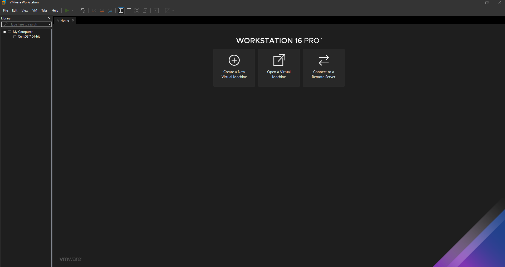

**Chọn "Custom (advanced)" sau đó nhấn Next để sang bước tiếp theo**

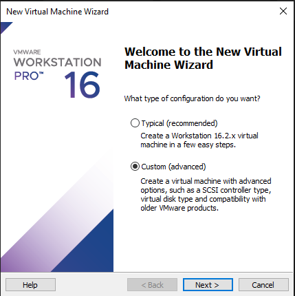

**Chọn phiên bản máy ảo của VMware Workstation**

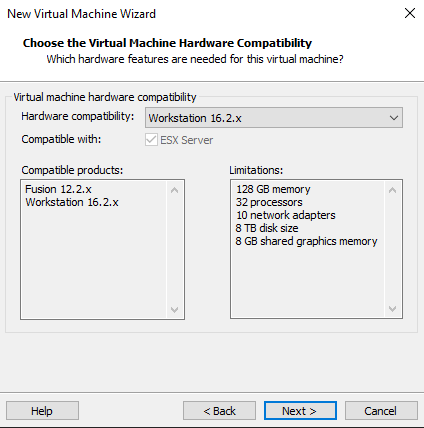

**Chọn file cài đặt hệ điều hành, thông thường chọn "I will install the operation system later" để tiến hành cài đặt hệ điều hành sau khi đã có máy ảo**

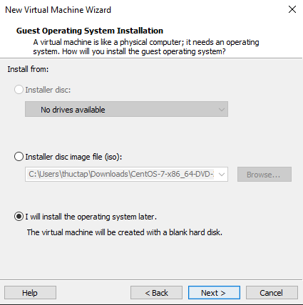

**Chọn hệ điều hành sẽ cài đặt, ở bài này ta chọ Linux - Centos 7 64bit**

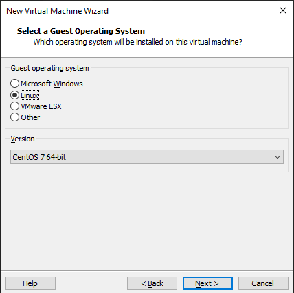

**Sửa tên của máy ảo và vị trí lưu trữ trên máy thật**

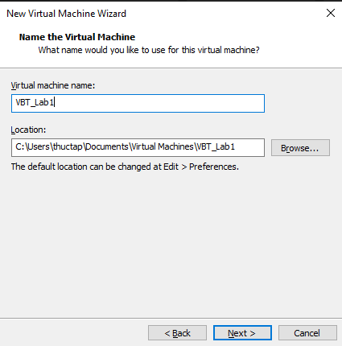

**Chọn số cpu của máy ảo và số nhân với mỗi chip**

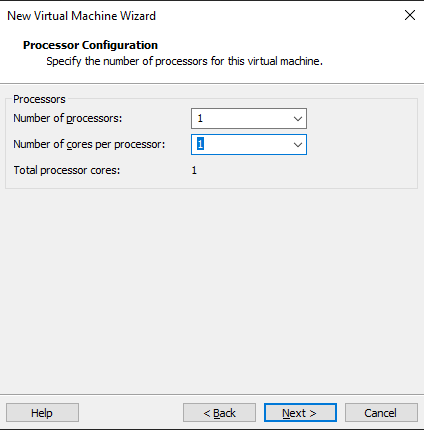

**Điều chỉnh lượng RAM của máy ảo**

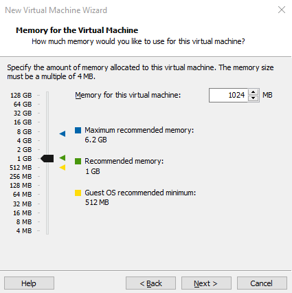

**Lựa chọn kiểu kết nối mạng mà máy ảo sẽ sử dụng**

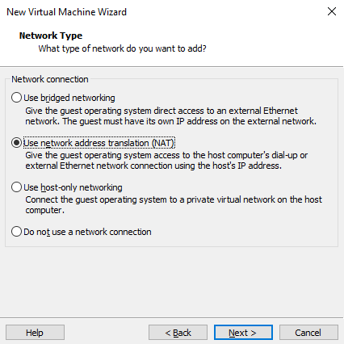

- Use bridged networking: card mạng ảo kết nối thẳng với mạng thật bên ngoài
- Use network address translation (NAT): card mạng ảo NAT tới card mạng thật của máy host
- Use host-only networking: sử dụng mạng riêng tách biệt mới máy host

**Chọn ổ đĩa, thông thường chọn tạo ra 1 ổ đĩa ảo, sau đó điều chỉnh dung lượng ổ**

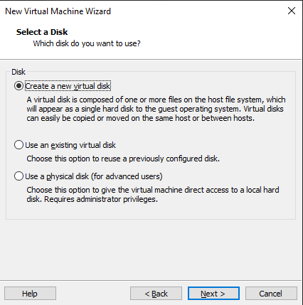

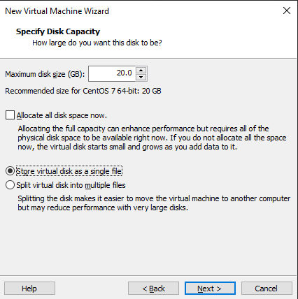

*Lưu ý rằng, ổ đĩa ảo sẽ không thực sự chiếm hết 20GB ở ổ đĩa thật mà chỉ chiếm đúng số lượng mà ta sử dụng đến ở máy ảo*

**Kiểm tra lại thông số cài đặt và nhấn finish để hoàn thành**

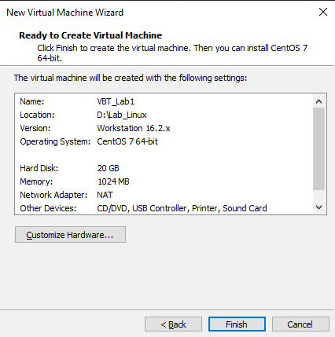

## Cài đặt hệ điều hành CentOS 7 trên máy ảo VMware Workstation

**Tải file ISO cài đặt hệ điều hành CentOS 7 tại trang chủ của CentOS:** [https://www.centos.org/download/](https://www.centos.org/download/)

**Tiến hành đưa đĩa cài vào ổ đĩa của máy ảo: Chọn CD/DVD (IDE) rồi chọn Use ISO image file và Browse tới file cài đặt Cent 7 vừa download**

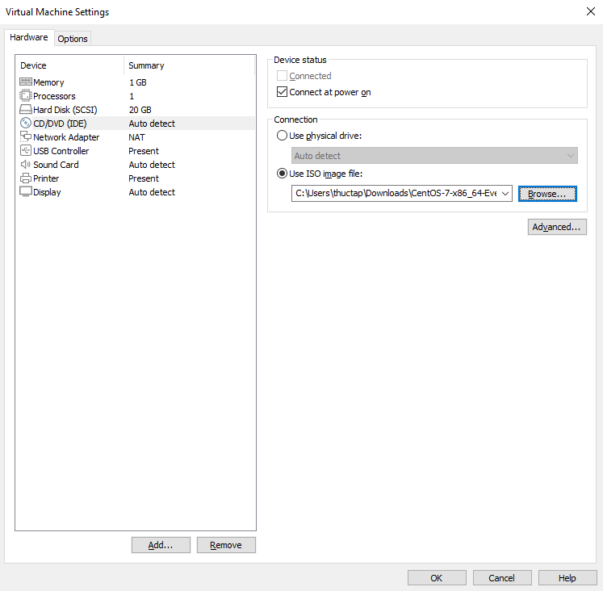

**Chọn "Instal CentOS 7"**

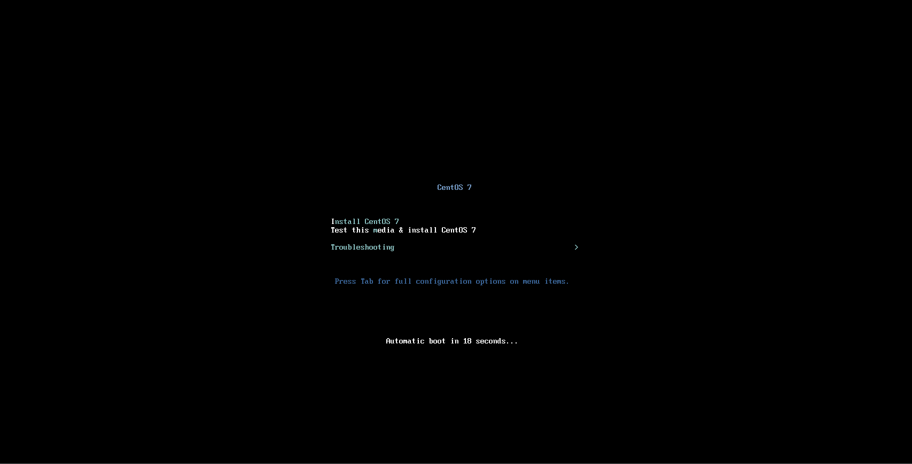

**Chọn ngôn ngữ cho hệ điều hành**

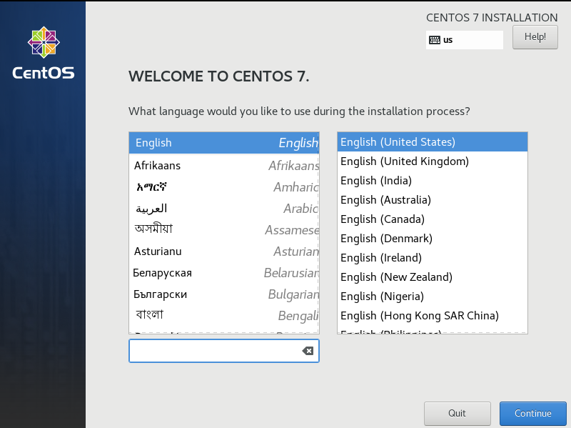

**Chọn "DATE & TIME" để điều chỉnh ngày giờ**

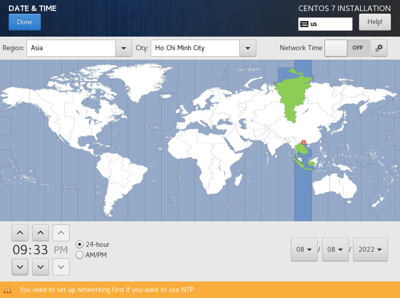

**Ở phần "SOFTWARE SELECTION", ta chọn GNOME Desktop để cài đặt giao diện đồ họa thuận tiện cho người sử dụng**

*Lưu ý là các phần mềm khác hoàn toàn có thể được cài đặt sau khi hoàn thiện hệ điều hành*

**Tiếp đến, tại "INSTALLATION DESKTINATION", chọn "I will configure partitioning" để tự điều chỉnh các phân vùng**

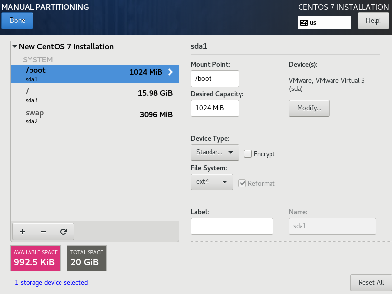

- /boot: 1Gb - Là phân vùng dành cho việc khởi động hệ điều hành
    - Device type: Standard Partition
    - File System: ext4
- /swap: 3Gb - Là phân vùng được sử dụng khi bộ nhớ RAM đầy, lúc này tài nguyên và dữ liệu tạm thời không hoạt động trên bộ nhớ RAM để lưu trữ vào không gian Swap để giải phóng bộ nhớ RAM và sử dụng cho việc khác
    - Device type: Standard Partition
    - File System: swap
- /: tổng dung lượng còn lại - Là phân vùng dùng cho việc lưu trữ file
    = Device type: LVM
    - File System: ext4

**Tại "NETWORK & HOSTNAME" tiến hành chỉnh sửa hostname**

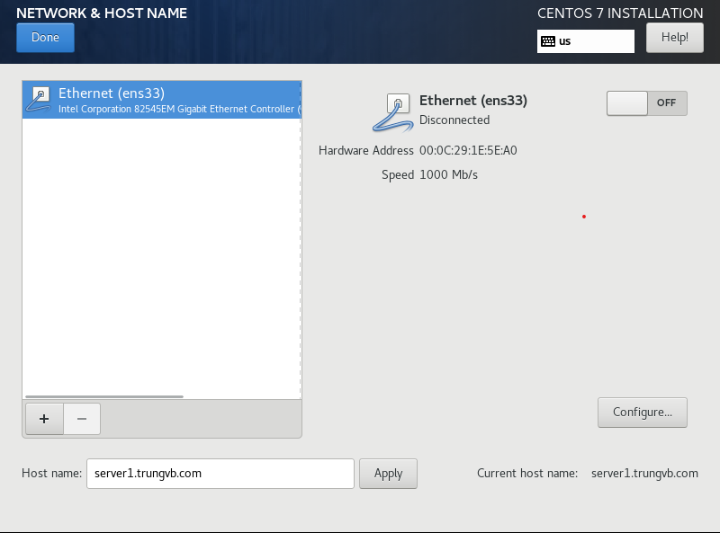

Ở network ta chọn OFF để máy có kết nối Internet, thay đổi này có thể điều chỉnh sau trong hệ điều hành

**Chọn "Begin Installation" để bắt đầu cài đặt, trong lúc chờ ta có thể thay đổi mật khẩu của root hay tạo thêm user**

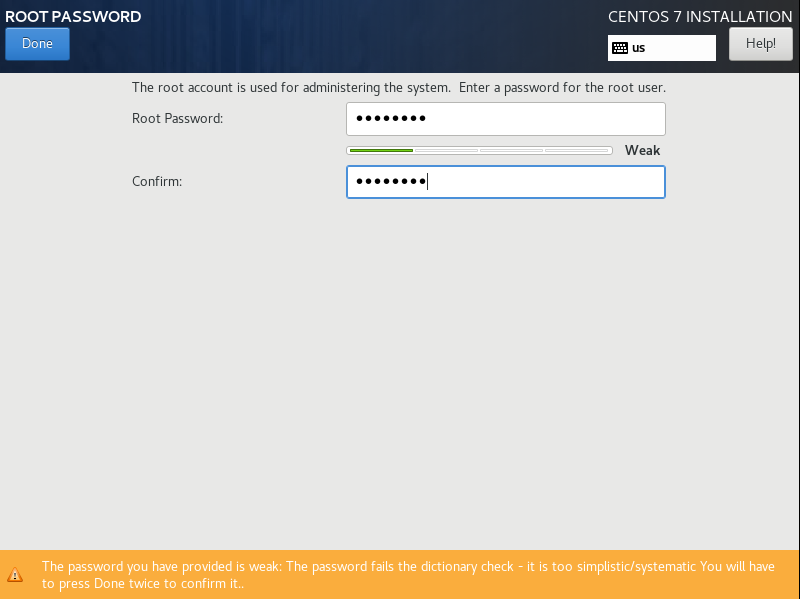)

**Sau khi hoàn thành, chọn Reboot để khởi động lại máy ảo**

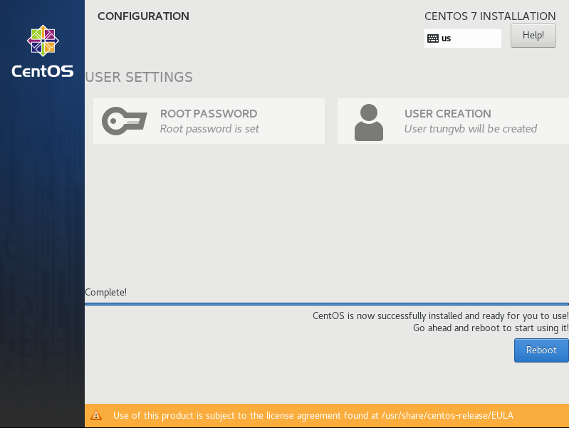

**Done.**

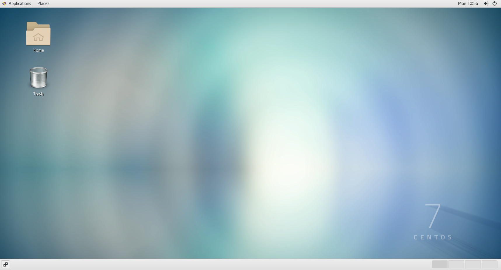
