# Cài đặt hệ điều hành Windows 10

## Tạo máy ảo bằng VMware Workstation

Sử dụng các bước gần như khi làm với hđh CentOS để tạo máy ảo cho Windows 10

## Cài đặt hđh Windows 10 trên máy ảo VMware Workstation

1. Sau khi cho đĩa vào và boot máy, chọn ngôn ngữ sẽ sử dụng cho Windows

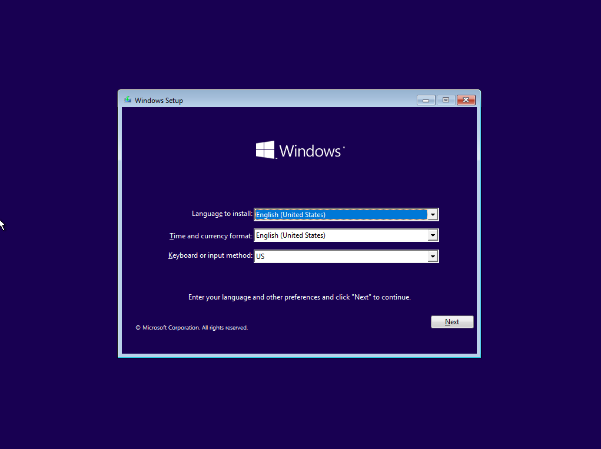

2. Nhập key kích cho Windows, ở đây ta không có key nên sẽ kích hoạt sau

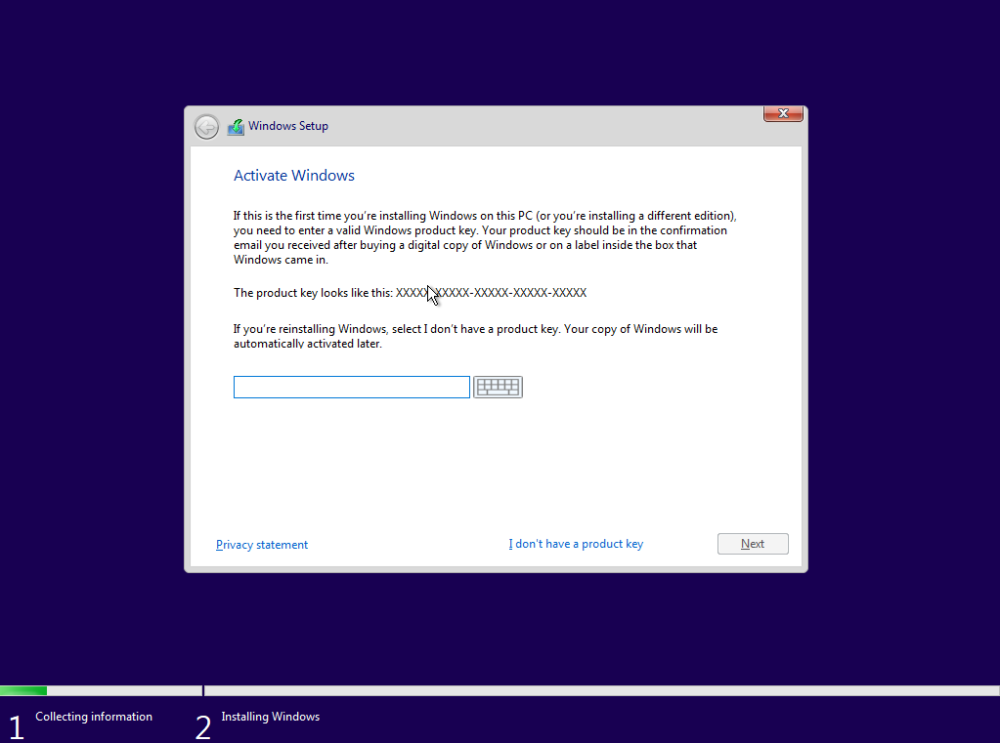

3. Chọn phiên bản Windows 10 muốn cài đặt

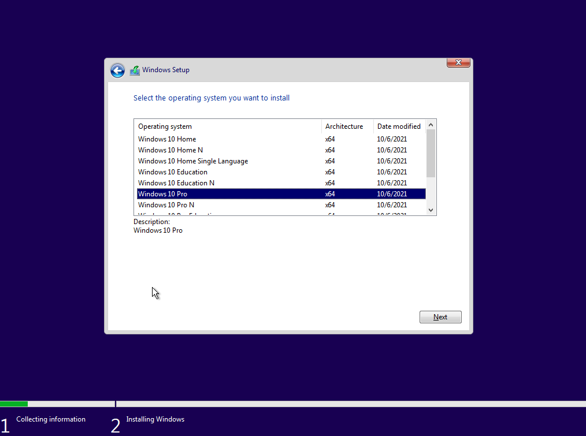

4. Chấp nhận điều khoản của Microsoft

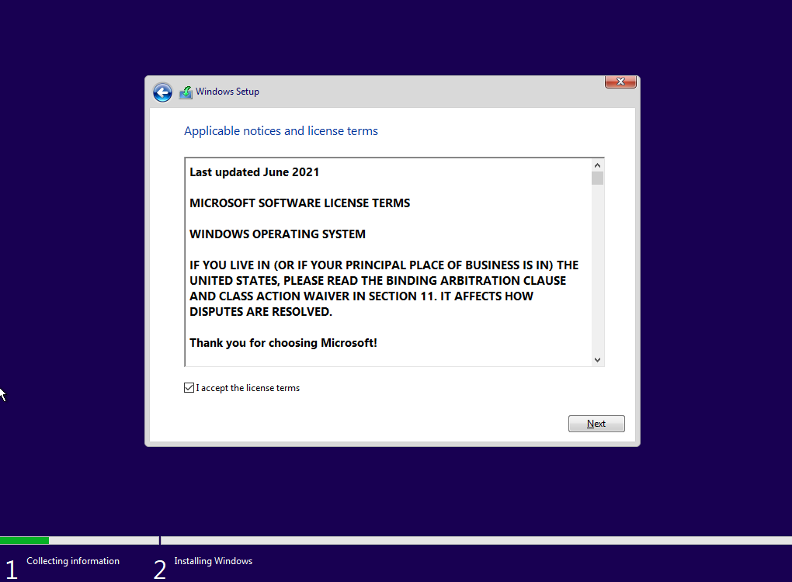

5. Chọn kiểu setup, ở đây ta chọn Custom

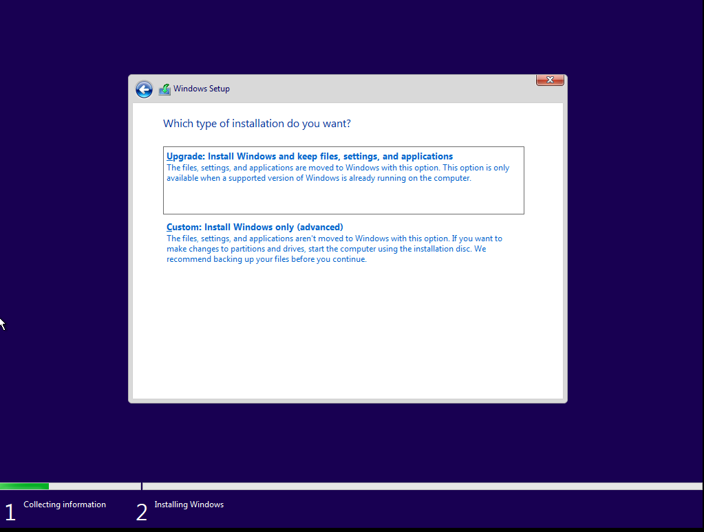

6. Chọn ổ đĩa

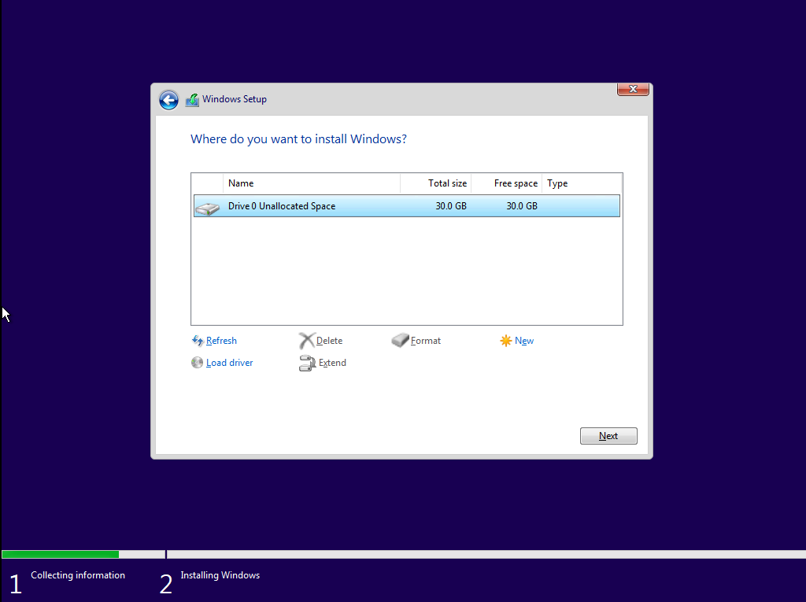

7. Chờ đợi

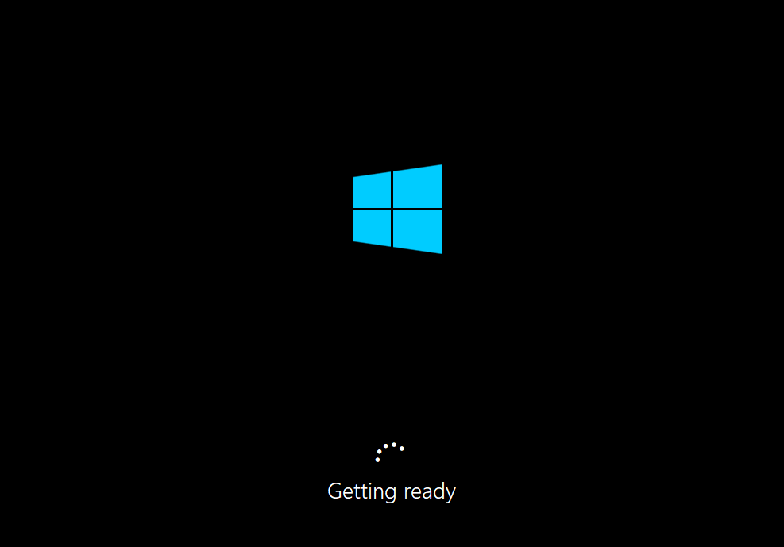

8. Chọn vùng

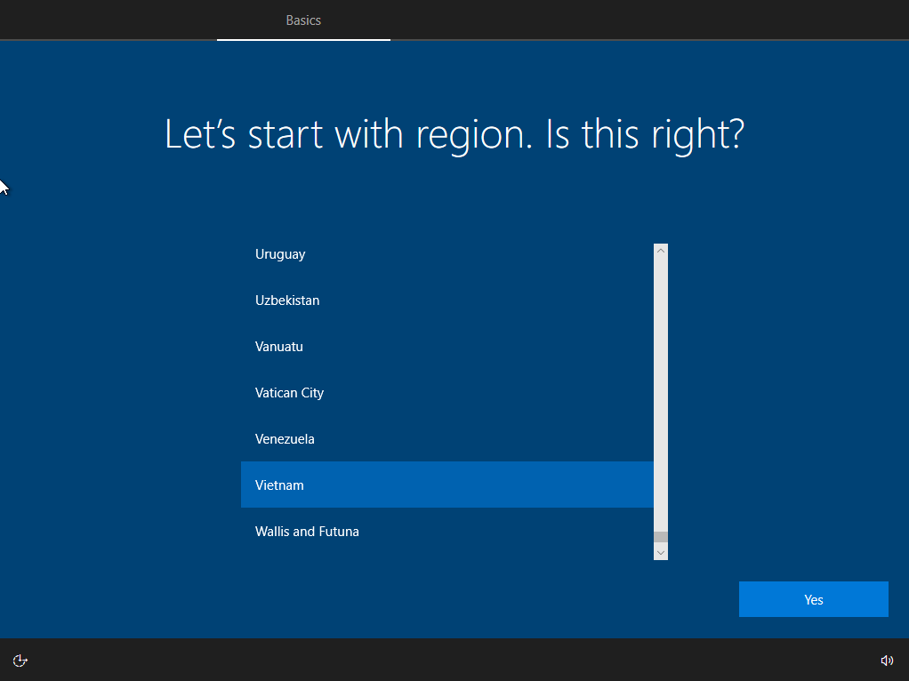

9. Chọn Windows dành cho cá nhân hay doanh nghiệp

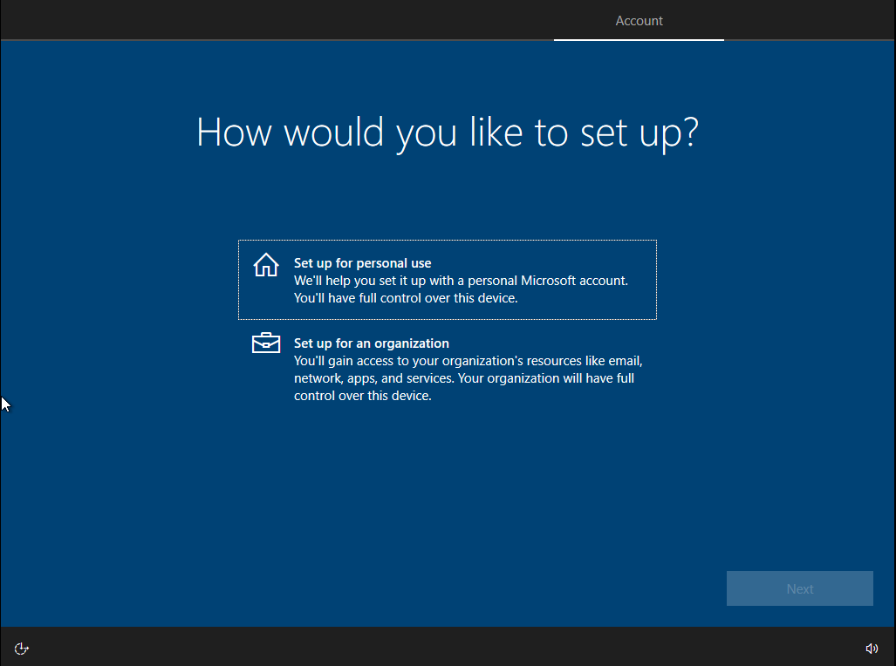

10. Nhập tên user

11. Mật khẩu và xác nhận mật khẩu

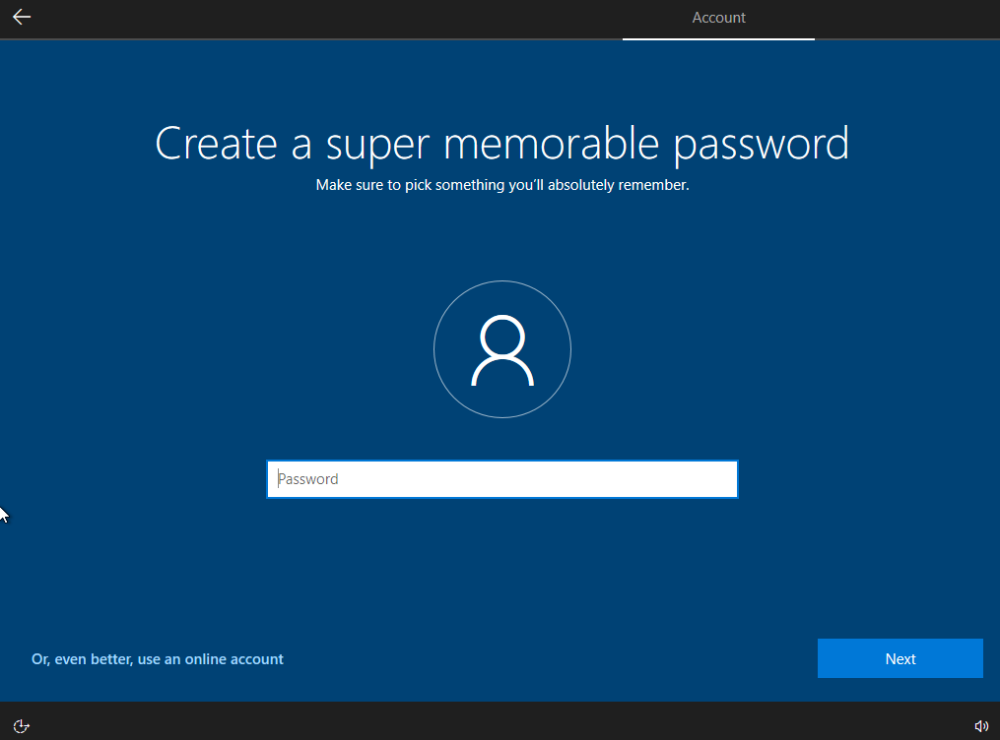

12. Chọn 3 câu hỏi và câu trả lời bảo mật

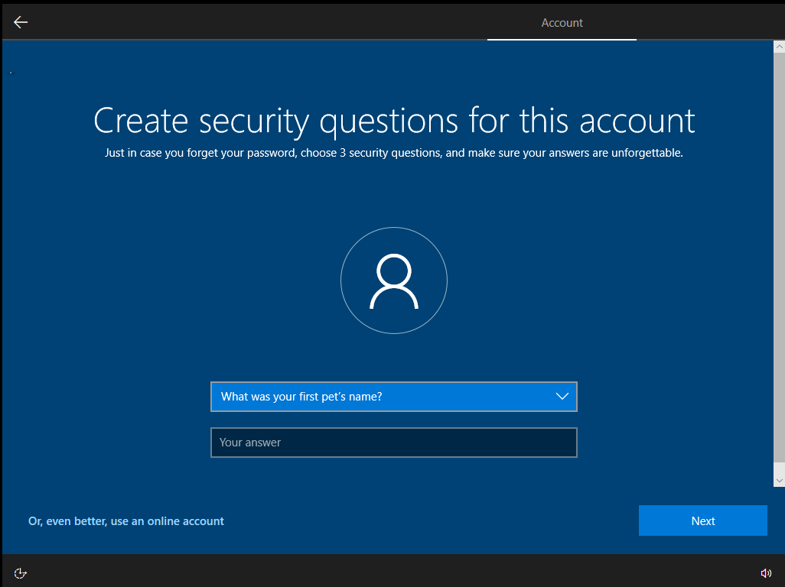

13. Chọn các tính năng bảo mật dành cho Windows

14. Tiếp tục chờ đợi Windows tự làm nốt phần việc còn lại

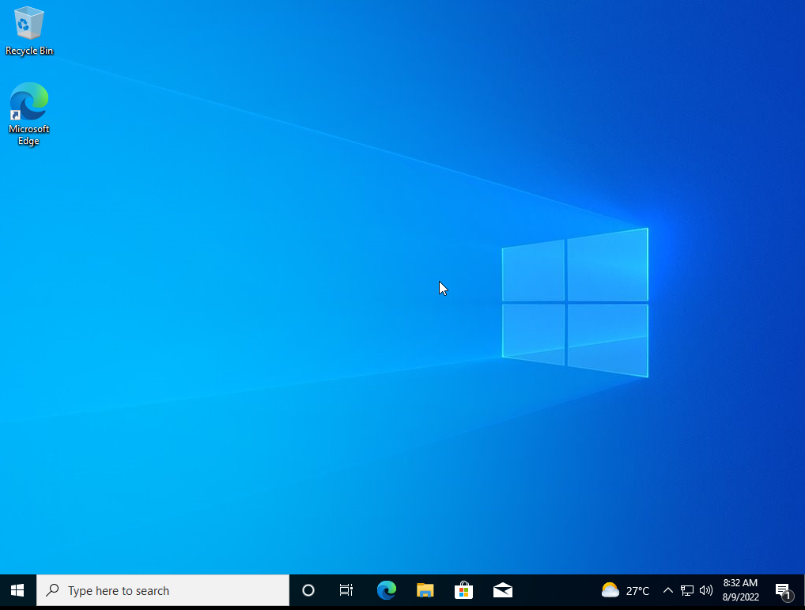