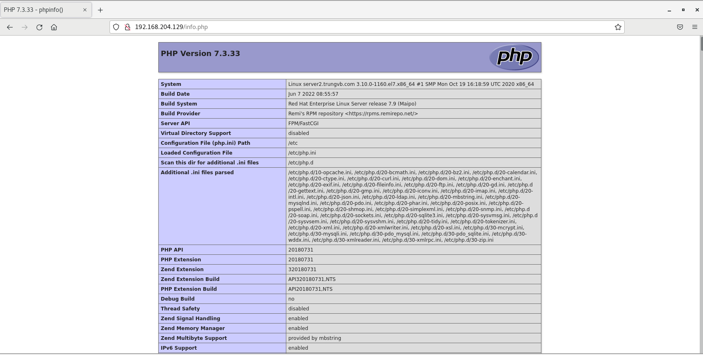
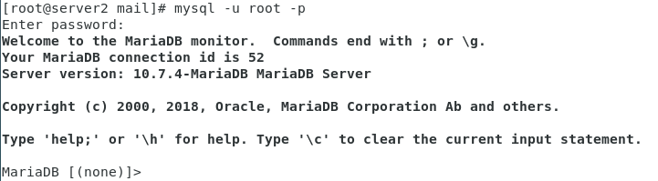
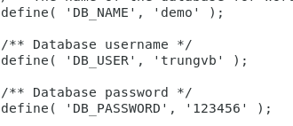
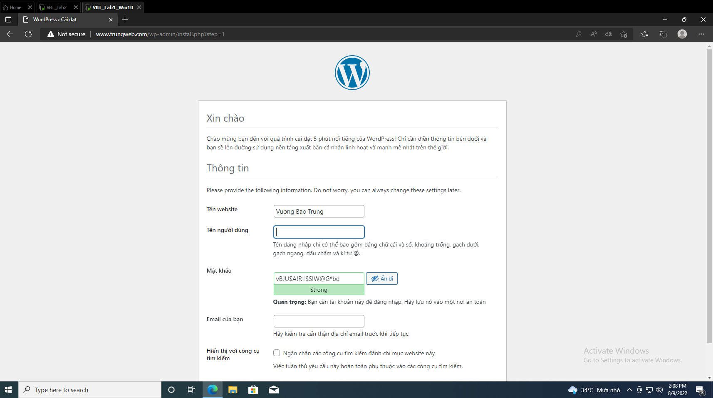
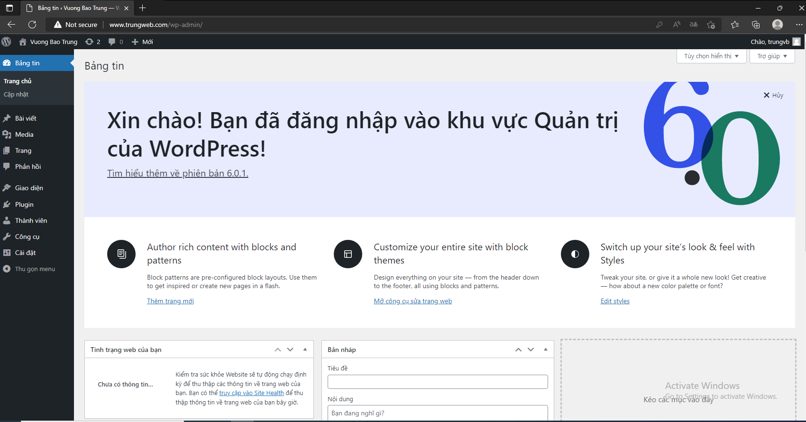

# Cài đặt LAMP trên CentOS 7

LAMP là viết tắt của Linux, Apache, MySQL và PHP. Nó là 1 chồng các ứng dụng hoạt động cùng nhau trên 1 máy chủ web để lưu trữ 1 trang web. Mỗi chương trình riêng lẻ phục vụ 1 mục đích khác nhau, được kết hợp lại để tạo thành 1 giải pháp máy chủ web linh hoạt
- Trong LAMP, Linux đóng vai trò là hệ điều hành của máy chủ xử lý tất cả các lệnh trên máy
- Apache là 1 phần mềm máy chủ web quản lý các yêu cầu HTTP để cung cấp nội dung cho trang web
- MySQL là 1 hệ quản trị cơ sở dữ liệu có chức năng duy trì dữ liệu người dùng trên máy chủ
- PHP là 1 ngôn ngữ lập tình kịch bản cho phép giao tiếp phía máy chủ

## Cài đặt Apache webserver

Cài đặt Apache trên CentOS 7 xem tại [đây](https://github.com/shaidoka/thuctap-NhanHoa/blob/main/Linux_basic/Install_Centos7/Cai%20dat%20Apache%20webserver%20tren%20Centos%207.md)

## Cài đặt MariaDB

MariaDB là 1 sản phẩm mã nguồn mở tách ra từ mã mở do cộng đồng phát triển của hệ quản trị cơ sở dữ liệu MySQL nhằm theo hướng không phải trả phí với GNU GPL

MariaDB được định hướng để duy trì khả năng tương thích cao với MySQL, để đảm bảo khả năng hỗ trợ về thư viện đồng thời kết hợp 1 cách tốt nhất với các API và câu lệnh của MySQL

1. Tạo repo cài đặt MariaDB 10

Theo mặc định repo của CentOS chỉ có sẵn Maria 5. Để cài đặt MariaDB 10 sẽ cần phải tạo repo riêng

Thêm Repo

```sh
curl -LsS -O https://downloads.mariadb.com/MariaDB/mariadb_repo_setup
sudo bash mariadb_repo_setup --mariadb-server-version=10.5
```

Cập nhật cache yum

```sh
yum makecache -y
```

2. Cài đặt MariaDB

Để cài đặt MariaDB cần chạy lệnh sau:

```yum -y install MariaDB-server MariaDB-client MariaDB-backup```

3. Đặt mật khẩu root của database

**Nếu update từ bản cũ lên thì chạy thêm lệnh**

```sh
mysql_upgrade --force
```

Sau khi cài đặt MariaDB, khởi động database và thiết lập secure:

```sh
systemctl enable mariadb
systemctl start mariadb
mariadb-secure-installation
```

```sh
Enter current password for root (enter for none): Nhấn phím Enter
Switch to unix_socket authentication [Y/n]: n
Change the root password? [Y/n]: Y
New password: Nhập password root
Re-enter new password: Nhập lại password root
Remove anonymous users? [Y/n] : Y
Disallow root login remotely? [Y/n]: Y
Remove test database and access to it? [Y/n] : Y
Reload privilege tables now? [Y/n]: Y
```

## Cài đặt PHP-FPM và các module cần thiết

PHP là lớp trên cùng của stack. Lớp script bao gồm PHP và/ hoặc các ngôn ngữ lập trình web tương tự khác. Các website và ứng dụng web chạy trong lớp này

PHP được phát triển như là 1 ngôn ngữ kịch bản trên máy chủ

1. Cài đặt PHP-FPM

```sh
yum -y install yum-utils epel-release
yum -y install http://rpms.remirepo.net/enterprise/remi-release-7.rpm
yum-config-manager --enable remi-php73
yum -y install php php-fpm php-ldap php-zip php-embedded php-cli php-mysql php-common php-gd php-xml php-mbstring php-mcrypt php-pdo php-soap php-json php-simplexml php-process php-curl php-bcmath php-snmp php-pspell php-gmp php-intl php-imap perl-LWP-Protocol-https php-pear-Net-SMTP php-enchant php-pear php-devel php-zlib php-xmlrpc php-tidy php-mysqlnd php-opcache php-cli php-pecl-zip unzip gcc
```

2. Cấu hình php cơ bản

Tất cả cấu hình php cần thiết đều nằm trong file /etc/php.ini. 1 vài thông số đáng chú ý là:

```sh
date.timezone = Asia/Ho_Chi_Minh
expose_php = Off
short_open_tag = On
max_input_vars = 3000
disable_function = exec,system,passthru,shell_exec,proc_close,proc_open,dl,popen,show_source,posix_kill,posix_mkfifo,posix_getpwuid,posix_setpgid,posix_setsid,posix_setuid,posix_setgid,posix_seteuid,posix_setegid,posix_uname
```

3. Cấu hình chạy PHP-FPM

Mở file /etc/httpd/conf.d/php.conf tìm dòng ```SetHandler applipcation/x-httpd-php``` sửa thành ```proxy:fcgi://127.0.0.1:9000```

4. Khởi động lại apache

```systemctl restart httpd```

5. Khởi động PHP-FPM

```sh
systemctl start php-fpm
systemctl enable php-fpm
```

6. Kiểm tra

Để kiểm tra PHP-FPM đã hoạt động hay chưa, tạo file /var/www/html/info.php:

```sh
vi /var/www/html/info.php

<?php
phpinfo();
?>
```

7. Kiểm tra kết quả với đường dẫn http://ip-address/info.php



## Cài đặt Wordpress

1. Đăng nhập vào MySQL

```mysql -u root -p```

Nhập password đã tạo cho MariaDB server đã tạo trước đó



2. Tạo database

```CREATE DATABASE demo;```

Tạo user cho database đó:

```CREATE USER trungvb@localhost IDENTIFIED BY '123456';```

Cấp quyền cho user vừa tạo được phép truy cập vào database:

```GRANT ALL PRIVILEGES ON demo.* TO trungvb@localhost IDENTIFIED BY '123456';```

Xóa các đặc quyền để MySQL biết về những thay đổi đặc quyền gần đây mà ta đã thực hiện:

```sh
FLUSH PRIVILEGES;
exit
```

3. Cài đặt WordPress

```sh
yum install wget
wget http://wordpress.org/latest.tar.gz
tar -xzvf latest.tar.gz
```

Sau khi giải nén file latest.tar.gz sẽ có 1 thư mục tên WordPress. Ta di chuyển nội dung trong thư mục đó vào nơi chứa website chính của mình:

```sh
rsync -avP ~/wordpress/ /var/www/html/
```

Cập nhật các quyền apache cho các tệp wordpress

```chown -R apache:apache /var/www/html/*```

4. Cấu hình WordPress

Tạo tệp wp-config.php bằng việc sao chép wp-config-sample.php có sẵn

```sh
cd /var/www/html
cp wp-config-sample.php wp-config.php
vi wp-config.php
```

Chỉnh sửa các trường DB_NAME, DB_USER, DB_PASSWORD thành các giá trị đúng



Khởi động lại apache

```systemctl restart httpd```

5. Kiểm tra kết quả

Truy cập vào trang quản trị WordPress bằng cách thêm hậu tố **wp-admin** vào sau tên miền của trang web đã tạo



Chọn ngôn ngữ, điền các thông tin về người sử dụng và đăng nhập với những thông tin đó để hoàn tất thiết lập WordPress

