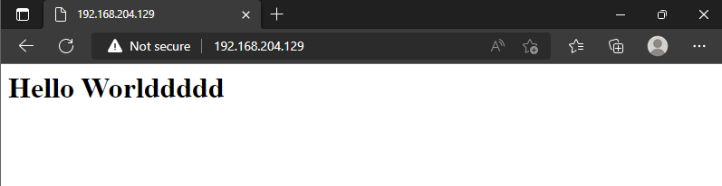
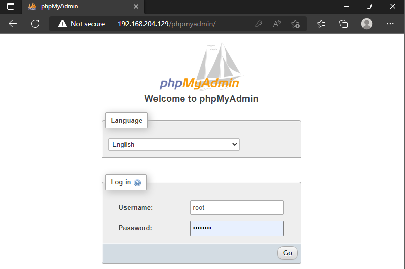
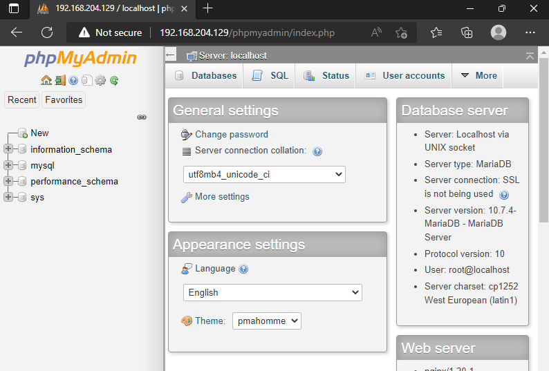

# Cài đặt LEMP trên CentOS 7

LEMP là 1 nhóm phần mềm nguồn mở được cài đặt cùng nhau (tương tự như LAM) để cho phép máy chủ lưu trữ các trang web động và ứng dụng web. 

LEMP bao gồm Linux, Nginx, MariaDB/MySQL và PHP

## Cài đặt Nginx

1. Cài đặt epel repository

```yum install epel release```

2. Cài đặt Nginx bằng lệnh yum

```yum install -y nginx```

3. Khởi động nginx

```sh
systemctl enable nginx
systemctl start nginx
```

4. Thiết lập firewall cho phép giao thức http và https

```sh
firewall-cmd --permanent --add-service=http
firewall-cmd --permanent --add-service=https
firewall-cmd --reload
```

## Cài đặt MariaDB

Tương tự như khi cài [LAMP](https://github.com/shaidoka/thuctap-NhanHoa/blob/main/Linux_basic/Install_Centos7/LAMP.md)

## Cài đặt PHP

1. Để cài đặt phiên bản mới nhất của php, ta sử dụng kho lưu trữ của Remi, đồng thời cài đặt thêm các gói cần thiết để tương thích với Nginx và MySQL

```sh
yum install -y yum-utils http://rpms.remirepo.net/enterprise/remi-release-7.rpm
config-manager --enable remi-php[74]
yum install -y php php-fpm php-gd php-json php-mbstring php-mysqlnd php-xml php-xmlrpc php-opcache php-mysql
```

2. Chỉnh sửa lại tệp cấu hình của php tên www.conf

```vi /etc/php-fpm.d/www.conf```

Tìm và chỉnh sửa các giá trị sau:

```sh
user = nginx
group = nginx
listen = /var/run/php_fpm.sock
listen.owner = nginx
listen.group = nginx
listen.mode = 0660
```

3. Khởi động php-fpm

```sh
systemctl enable php-fpm
systemctl start php-fpm
```

4. Cấu hình nginx xử lý các mã nguồn PHP

Chỉnh sửa file default.conf (nếu chưa có thì tạo mới)

```vi /etc/nginx/conf.d/default.conf```

Copy paste đoạn cấu hình sau vào file default.conf:

```sh
server {
    listen  80;
    server_name  server_domain_or_IP;

    root   /var/www/html/;
    index index.php index.html index.htm;

    location / {
        try_files $uri $uri/ =404;
    }
    error_page 404 /404.html;
    error_page 500 502 503 504 /50x.html;

    location = /50x.html {
        root /usr/share/nginx/html;
    }

    location ~ \.php$ {
        try_files $uri =404;
        fastcgi_pass unix:/var/run/php_fpm.sock;
        fastcgi_index index.php;
        fastcgi_param SCRIPT_FILENAME $document_root$fastcgi_script_name;
        include fastcgi_params;
    }
}
```

**Lưu ý sửa ```server_domain_or_IP thành IP VPS**

Restart lại nginx

```systemctl restart nginx```

5. Tạo 1 website để kiểm tra

```sh
vi /var/www/html/index.php

<h1>Hello Worlddddd</h1>
```



## Cài đặt phpmyadmin để quản lý database

1. Download phpmyadmin

```wwget https://files.phpmyadmin.net/phpMyAdmin/4.9.6/phpMyAdmin-4.9.6-english.tar.gz```

2. Giải nén file vừa tải về và di chuyển vào /usr/share/phpadmin

```sh
tar -xzvf phpMyAdmin-4.9.6-english.tar.gz
mv phpMyAdmin-4.9.6-english /usr/share/phpmyadmin
```

3. Mở file default.conf đã tạo từ trước để chỉnh sửa

```vi /etc/nginx/conf.d/default.conf```

File default.conf cuối cùng sẽ như sau:

```sh
server {
    listen  80;
    server_name  server_domain_or_IP;

    root   /var/www/html/;
    index index.php index.html index.htm;

    location / {
        try_files $uri $uri/ =404;
    }
    error_page 404 /404.html;
    error_page 500 502 503 504 /50x.html;

    location = /50x.html {
        root /usr/share/nginx/html;
    }

    location ~ \.php$ {
        try_files $uri =404;
        fastcgi_pass unix:/var/run/php_fpm.sock;
        fastcgi_index index.php;
        fastcgi_param SCRIPT_FILENAME $document_root$fastcgi_script_name;
        include fastcgi_params;
    }
    location  /phpmyadmin{
        root /usr/share/;
        index index.php index.html index.htm;
        location ~ ^/phpmyadmin/(.+\.php)$ {
                try_files $uri =404;
                root /usr/share/;
                fastcgi_pass unix:/var/run/php_fpm.sock;
                fastcgi_index index.php;
                fastcgi_param SCRIPT_FILENAME $document_root$fastcgi_script_name;
                include fastcgi_params;
        }

        location ~* ^/phpmyadmin/(.+\.(jpg|jpeg|gif|css|png|js|ico|html|xml|txt))$ {
                root /usr/share/;
        }
    }
    location /phpMyAdmin {
            rewrite ^/* /phpmyadmin last;
    }
}
```

4. Restart lại nginx và mở trình duyệt để kiểm tra hoạt động

Truy cập vào đường dẫn ```http://ip-address/phpmyadmin```



Đăng nhập với tài khoản root và mật khẩu đã tạo khi cài đặt MariaDB



**Lưu ý:** Nếu bị lỗi session thì chạy lệnh:

```sh
chown -R nginx:nginx /var/lib/php/session/
chmod 700 /var/lib/php/session
```

