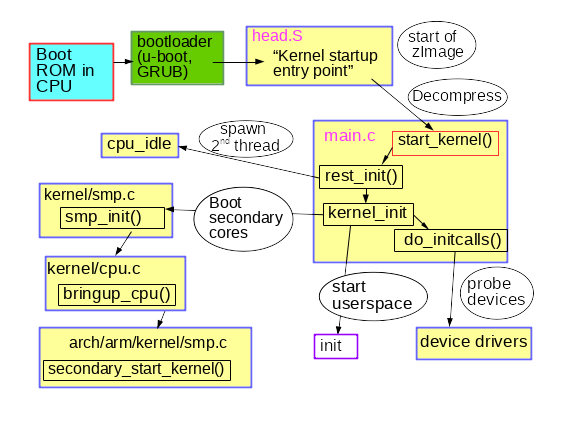

# Phân tích quá trình khởi động của Linux

Việc hiểu được hệ thống đang hoạt động tốt là sự chuẩn bị tuyệt vời cho việc đối mặt với các vấn đề không thể tránh khỏi của hệ thống

Đã từng có câu nói đùa lâu đời trong làng phần mềm nguồn mở là: "the code is self-documenting" (Việc code là tự ghi chép). Kinh nghiệm cho thấy rằng việc đọc source cũng giống nghe bản tin dự báo thời tiết: người khôn ngoan vẫn ra ngoài và kiểm tra bầu trời. Dưới đây là 1 số mẹo để kiểm tra và quan sát các hệ thống linux trong quá trình khởi động bằng cách tận dụng hiểu biết về các công cụ debugging quen thuộc. Phân tích quá trình khởi động của hệ thống có hoạt động tốt sẽ chuẩn bị cho người dùng và các nhà phát triển đối phó được với những vấn đề lỗi không thể tránh khỏi

Hiểu theo 1 số cách, thì quá trình khởi động khá là đơn giản. Kernel khởi động đơn luồng và đồng bộ một lõi đơn và có vẻ như dễ, nhưng làm thế nào để kernel có thể khởi động? Chức năng của ```initrd``` (initial ramdisk) và bootloader là gì? Và tại sao đèn LED trên port Ethernet luôn luôn sáng?

## Quá trình bắt đầu khởi động: trạng thái OFF

### Wake-on-LAN

Trạng thái OFF có phải là khi hệ thống không được cấp nguồn điện? Ví dụ, đèn LED port Ethernet được chiếu sáng bởi tính năng Wake-on-LAN (WOL) được kích hoạt trên hệ thống. Kiểm tra bằng cách gõ lệnh

```sh
ethtool <interface-name>
```

Bộ xử lý sẽ đáp ứng cho MagicPacket có thể là 1 phần của interface hoặc có thể là **Baseboard Management Controller**

### Intel Management Engine, Platform Controller Hub, and Minix (cơ chế điều khiển của Intel, nền tảng điều khiển Hub, và Minix)

BMC không chỉ là vi điều khiển (MCU) mà có thể lắng nghe khi hệ thống off trên danh nghĩa. Hệ thống x86_64 bao gồm bộ phần mềm Intel Management Engine (IME) cho việc quản lý từ xa hệ thống. Một loạt các thiết bị, từ các máy chủ tới laptop, bao gồm các công nghệ này, cho phép các chức năng như là điều khiển từ xa KVM và Intel Capability Licensing Service. IME vẫn còn các lỗ hỏng chưa được vá, theo như Intel's own detection tool. Tuy nhiên sẽ không dễ để vô hiệu hóa IME. Trammell Hudson đã tạo ra project me_cleaner để bỏ qua 1 số thành phần của IME, như máy chủ web nhúng, nhưng cũng có thể gây brick cho hệ thống mà nó đang chạy

Firmware IME và phần mềm quản lý chế độ hệ thống (SMM - System management mode) theo sau khi nó khởi động dựa trên hệ điều hành Minix và trên bộ xử lý Platform Controller Hub riêng rẽ, không phải CPU chính của hệ thống. SMM sau đó khởi chạy phần mềm Universal Extensible Firmware Interface (UEFI) trên main. Nhóm Coreboot tại Google đã bắt đầu một dự án phần mềm Non-Extensible Reduced Firmware (NERF) với mục đích thay thế không chỉ UEFI mà sẽ sớm là cả các thành phần userspace Linux như systemd. Trong lúc chờ đợi kết quả từ những nỗ lực mới này, người dùng Linux bây giờ có thể mua các laptop từ Purism, System 76, hoặc DELL đã vô hiệu IME, chúng ta có thể hy vọng cho các laptop với các bộ vi xử lý ARM 64bit

### Bootloader

Bên cạnh việc khởi động phần mềm gián điệp, chức năng nào mà boot firmware sẽ sớm thực hiện? Công việc của bootloader là tạo sẵn cho 1 bộ xử lý được hỗ trợ tài nguyên cần thiết để chạy 1 hđh chung như Linux. Khi bật nguồn, không chỉ không có bộ nhớ ảo, mà DRAM cũng chưa có cho tới khi controller của nó được bật lên. Bootloader sau đó bật nguồn cung cấp và quét các bus và các interface để định vị image trong kernel và hệ thống tệp tin root. Các bootloader phổ biến như U-boot và GRUB đã hỗ trợ các interface quen thuộc như USB, PCI, và NFS, cũng như là các thiết bị nhúng như NOR và NAND flash. Bootloader cũng tương tác với các thiết bị bảo mật phần cứng như Trusted Platform Modules (TPMs) để thiết lập một chain of trust từ khởi động sớm nhất

Bootloader nguồn mở được sử dụng rộng rãi như U-boot hỗ trợ trên nhiều hệ thống từ Rasberry Pi tới thiết bị Nintendo, hay các board tự động cho ChromeBooks. Không có syslog, và khi mọi thứ diễn ra, thậm chí không có đầu ra console. Để tạo điều kiện debug, U-boot team cung cấp 1 sandbox của U-boot tương đối đơn giản trên 1 hệ thống mà các công cụ phát triển phổ biến như Git và trình biên dịch GNU (GCC) được cài đặt

```sh
git clone git://git.denx.de/u-boot; cd u-boot
make ARCH=sandbox defconfig
make; ./u-boot
=> printenv
=> help
```

Bạn đang chạy U-boot trên nền tảng x86_64 và có thể kiểm tra các tính năng như phân vùng tại mock storage device, TPC-based secret-key manipulation, và hotplug của các thiết bị USB. U-boot sandbox nhanh hơn 10 lần so với testing bằng cách nạp lại bootloader vào board, và một "bricked" sandbox có thể phục hồi với Ctrl + C

### Starting up the kernel

**Provisioning a booting kernel**

Sau khi hoàn thành nhiệm vụ của nó, bootloader sẽ thực hiện nhảy tới mã kernel mà nó đã nạp vào bộ nhớ chính và bắt đầu xử lý, qua bất kỳ các tùy chọn dòng lệnh nào mà người dùng chỉ định. Loại chương trình nào là kernel? ```file/boot/vmlinuz``` chỉ ra rằng đó là 1 bzImage, nghĩa là 1 khối nén lớn (big compressed one). Linux source tree chứa công cụ extract-vmlinux tool có thể được sử dụng để giải nén tệp

```sh
scripts/extract-vmlinux /boot/vmlinuz-$(uname -r) > vmlinux
file vmlinux 

vmlinux: ELF 64-bit LSB executable, x86-64, version 1 (SYSV), statically 
linked, stripped
```

Kernel là 1 dạng nhị phân thực thi liên kết (Executable and Linking Format), như chương trình linux userspace. Nghĩa là chúng ta có thể yêu cầu từ gói ```binutils``` như ```readelf``` để kiểm tra nó. So sánh đầu ra, ví dụ như

```sh
readelf -S /bin/date
readelf -S vmlinux
```

Danh sách các section trong nhị phân phần lớn là giống nhau. Vì vậy, kernel phải bắt đầu một cái gì đó như các chương trình nhị phân Linux ELF khác, nhưng làm thế nào các chương trình userspace thực sự khởi động? Có phải trong hàm ```main()```? Thực ra là không.

Trước khi hàm ```main()``` có thể chạy, các chương trình cần bối cảnh thực thi bao gồm các bộ nhớ heap và stack thêm vào với các file mô tả cho ```stdin```, ```stdout```, và ```stderr```. Chương trình userspace lấy các tài nguyên này từ các thư viện chuẩn, thường là ```glibc``` trên hầu hết các hệ thống linux. Xem xét những điều sau:

```sh
file /bin/date

/bin/date: ELF 64-bit LSB shared object, x86-64, version 1 (SYSV), dynamically 
linked, interpreter /lib64/ld-linux-x86-64.so.2, for GNU/Linux 2.6.32, 
BuildID[sha1]=14e8563676febeb06d701dbee35d225c5a8e565a,
stripped
```

Các chương trình nhị phân ELF có 1 trình thông dịch, giống như các bash script hoặc python, nhưng các trình thông dịch không cần phải được chỉ định với ```#!``` như trong script, bởi ELF là định dạng tự nhiên của Linux. Trình thông dịch ELF cung cấp 1 binary với các tài nguyên cần thiết bằng cách gọi tới ```_start()```, một hàm có sẵn trong gói ```glibc``` mà có thể quan sát thông qua GDB. Kernel rõ ràng là không có trình thông dịch và phải cung cấp cho chính nó, nhưng làm thế nào?

Quan sát quá trình bật của kernel với GDB để có được câu trả lời. Đầu tiên cài đặt gói debug cho kernel chứa 1 phiên bản unstripped của ```vmlinux```, ví dụ ```apt-get install linux-image-amd64-dbg```, hoặc bnieen dịch và cài đặt kernel của riêng bạn. ```GDB vmlinux``` được theo sau bởi ```info files``` chỉ ra trong ELF section ```init.text```. Danh sách bắt đầu thực hiện chương trình thực thi trong ```init.text``` với ```l*(address)```, nơi mà ```address``` bắt đầu phần thập lục phân của ```init.text```. GDB sẽ chỉ ra rằng kernel x86_64 khởi động trong file kernel arch/x86/kernel/head_64.S, nơi mà tìm thấy các hàm ghép nối ```start_cpu0()``` và code tạo ra 1 stack và giải nén zImage trước khi gọi tới hàm x86_64 start_kernel(). ```start_kernel()``` không xác định kiến trúc, nên hàm này được đặt trong init/main.c. ```start_kernel()``` được coi là hàm ```main()``` thực sự của Linux.

## From start_kernel() to PID 1

### The kernel's hardware manifest: the device-tree and ACPI

Khi khởi động, kernel cần thông tin về phần cứng nhiều hơn là loại CPU mà nó đã được biên dịch. Các chỉ dẫn trong code được tăng cường bằng dữ liệu cấu hình được lưu trữ tách biệt. Có 2 phương thức chính lưu trữ dữ liệu này: device-tree và ACPI tables. Kernel học về phần cứng mà nó buộc phải chạy ở mỗi lần boot bằng cách đọc các file này

Với các thiết bị nhúng, device-tree là 1 manifest của phần cứng được cài đặt. Device-tree đơn giản là 1 file mà được biên dịch cùng lúc với kernel source và nó thường đặt tại ```/boot``` bên cạnh ```vmlinux```. Để xem thứ gì bên trong device-tree của 1 thiết bị ARM, hãy sử dụng lệnh ```strings``` từ gói ```binutils``` trên 1 file mà tên của nó khớp với ```/boot/*.dtb```, vì ```dtb``` tham chiếu đến 1 device-tree binary. Rõ ràng device-tree có thể được chỉnh sửa đơn giản bằng cách thay đổi file JSON-like để soạn nó và chạy lại trình biên dịch đặc biệt ```dtc``` được cung cấp cùng với kernel source. Trong khi device-tree là 1 tệp tĩnh, đường dẫn file thường được chuyển tới kernel bằng bootloader trên dòng lệnh, tính năng device-tree overlay được thêm vào trong những năm gần đây, nơi mà kernel có thể linh động tải thêm các phân mảnh trong lời phản hồi lại hotplug event sau khi boot

Các thiết bị x86-family và nhiều ARM64 enterprise-grade tận dụng cơ chế Advanced Configuration and Power Interface (ACPI). Đối lập với device-tree thì thông tin ACPI được lưu trữ ở filesystem ảo ```/sys/firmware/acpi/tables```mà được tạo ra bởi kernel vào thời điểm boot bằng cách truy cập vào ROM onboard. Cách đơn giản để đọc ACPI tables là sử dụng lệnh ```acpidump``` từ gói ```acpica-tools```. VD:

```sh
acpidump | grep -C 3 Windows
```

ACPI có cả phương thức và dữ liệu, không như device-tree, thứ mà chỉ có ngôn ngữ mô tả phần cứng. Phương thức của ACPI tiếp tục được kích hoạt ngay cả sau khi boot. Ví dụ, khởi đầu với lệnh ```acpi_listen``` (từ gói ```acpid```), sau đó đóng và mở laptop và bạn sẽ để ý rằng hàm chức năng của ACPI vẫn chạy xuyên suốt thời gian đó. Trong khi có thể ghi đè ACPI tables tạm thời và linh động, việc thay đổi nó permanently liên quan đến tương tác với BIOS menu vào thời điểm boot hoặc reflashing ROM. Nếu bạn muốn dấn thân vào những vấn đề như vậy, có lẽ bạn nên cài đặt ```coreboot```, nó là 1 phần mềm nguồn mở dùng để thay thế firmware.

### From start_kernel() to userspace

Code ở trong ```init/main.c``` rất bất ngờ là có thể đọc hiểu được, và rất thú vị là vẫn mang nguyên bản quyền của Linus Torvalds từ năm 1991-1992. Những dòng tìm được ở ```dmesg | head``` trên 1 hệ thống vừa boot bắt nguồn hầu hết từ file này. CPU đầu tiên được đăng ký với hệ thống, cấu trúc dữ liệu toàn cục được khởi tạo, và scheduler, interrupt handlers (IRQs), timers, và console được cho online từng thứ 1 theo đúng thứ tự. Cho đến khi hàm ```timekeeping_init()``` chạy, tất cả timestamps là 0. Phần này của quá trình khởi tạo kernel là synchronous, có nghĩa là quá trình xử lý xảy ra trong chính xác 1 luồng, và không hàm chức năng nào được thực hiện cho đến khi hàm trước đó hoàn thành và trả về giá trị. Kết quả là, đầu ra của ```dmesg``` sẽ được tái tạo lại hoàn toàn, ngay cả giữa 2 hệ thống, miễn là chúng có chugn device-tree hoặc ACPI tables. Linux hoạt động giống như 1 trong những hệ điều hành RTOS (real-time operating systems) mà chạy trên MCUs, ví dụ như là QNX hay VxWorks. Trạng thái này sẽ được giữ trong hàm ```rest_init()```, thứ mà được gọi bởi ```start_kernel()``` vào thời điểm nó termination.



```rest_init()``` sẽ sinh ra 1 luồng mới mà chạy ```kernel_init()```, thứ mà gọi đến ```do_initcalls()```. Users có thể quan sát ```initcalls``` bằng cách áp ```initcall_debug``` lên kernel commandline, kết quả là ```initcall``` sẽ ghi lên ```dmesg``` mỗi khi hàm này chạy. ```initcalls``` sẽ phải trải qua 7 tầng: early, core, postcore, arch, subsys, fs, device, và late. Phần mà người dùng có thể nhìn thấy được nhiều nhất trong ```initcalls``` là thăm dò và thiết lập tất cả các thiết bị ngoại vi của vi xử lý: các bus, network, storage, display, etc... kèm theo bằng cách load các module kernel của chúng. ```rest_init()``` cũng tạo ra 1 luồng thứ 2 trên bộ xử lý boot mà bắt đầu bằng cách chạy ```cpu_idle()``` trong khi nó chờ schduler gán việc cho nó

```kernel_init()``` cũng thiết lập quá trình đa xử lý đối xứng (Symmetric MultiProcessing - SMP). Với nhiều kernel gần đây, tìm điểm này trong đầu ra của ```output``` bàng cách tìm dòng *Bringing up secondary CPUs...*. SMP proceed bằng cách "hotplugging" CPUs, có nghĩa là nó quản lý vòng đời của chúng với state machine - đó là khái niệm tương tự như các hotplugged USB sticks. Hệ thống power-management của kernel thường lấy từng core offline riêng lẻ , sau đó đánh thức chúng nếu cần thiết, vì vậy cùng 1 code CPU hotplug được gọi đi gọi lại trên 1 hệ thống mà không quá bận rộn. Quan sát lời gọi hệ thống quản lý nguồn của CPU hotplug với công cụ BCC ```offcputime.py```

Lưu ý rằng code trong ```init/main.c``` thì gần như đã kết thúc xử lý khi ```smp_init()``` chạy: bộ xử lý boot đã hoàn thành hầu hết việc khởi tạo 1 lần mà các core khác không phải lặp lại. Tuy nhiên, các luồng của mỗi CPU phải được spawn cho mỗi core để quản lý interrupts (IRQs), workqueues, timers, và power events.

### Early userspace: who ordered the initrd?

Bên cạnh device-tree, một đường dẫn file khác cũng được cung cấp optionally đến kernel vào thời điểm boot là ```initrd```. ```initrd``` thường đặt tại ```/boot``` bên cạnh bzImage file vmlinuz trên x86, hoặc bên cạnh uImage tương tự và dvice-tree trên ARM. Kiểm tra nội dung của ```initrd``` với công cụ ```lsinitramfs``` ở trong gói ```initramfs-tools-core```. Distro ```initrd``` chứa các thư mục tối thiểu như ```/bin```, ```/sbin``` và ```/etc``` cùng các module của kernel, cộng với một số file trong ```/scripts```. Tất cả đều đã quá quen thuộc, vì ```initrd``` phần lớn chỉ đơn giản là 1 hệ thống tệp tin linux tối thiểu. Sự tương đồng này sẽ tạo ra chút nhầm lẫn, gần như tất cả các thư mục ```/bin```, ```/sbin``` trong ramdisk được liên kết với Busybox binary, kết quả là trong thư mục ```/bin``` và ```/sbin``` nhỏ hơn 10 lần so với ```glibc```

Tại sao phải tạo ra một ```initrd``` nếu tất cả những gì nó thực hiện là nạp một số module và sau đó bắt đầu ```init``` trên hệ thống tệp tin gốc bình thường? Trong trường hợp 1 root filesystem được mã hóa, việc giải mã sẽ phụ thuộc vào nạp 1 kernel module lưu trữ ở ```/lib/modules``` trên root filesystem, và cả trên ```initrd``` nữa. Module mã hóa có thể được biên dịch tĩnh vào kernel thay vì nạp vào 1 file, nhưng có nhiều lý do mà ta không muốn làm vậy. VD như, biên dịch tĩnh kernel với modules có thể khiến nó chiếm nhiều dung lượng ổ cứng hơn, và việc biên dịch tĩnh như vậy cũng vi phạm điều khoản dịch vụ của phần mềm. Không bất ngờ là storage, network, và Human Input Device (HID) drivers cũng được để trong ```initrd``` - về cơ bản bất kỳ code nào mà không phải là 1 phần của kernel đều cần phải được mount vào root filesystem. ```initrd``` cũng là 1 nơi mà người dùng có thể lưu trữ custom ACPI table code của họ.

```initrd``` cũng rất tiện lợi để test filesystem và các thiết bị lưu trữ dữ liệu. Lưu những công cụ test này vào ```initrd``` và chạy test sẽ giúp nó chạy trên memory thay vì trên phần cứng cần kiểm tra.

Cuối cùng, khi chạy ```init``` thì hệ thống đã khởi động hoàn tất. Vì vi xử lý thứ 2 giờ đa hoạt động, hẹ thống sẽ trở nên bất đồng bộ, bất tiên lượng, và nhờ đó đạt hiệu suất cao. Nếu kiểm tra với lệnh ```ps -o pid,psr,comm -p 1``` ta sẽ thấy tiến trình ```init``` của userspace không còn chạy trên bộ xử lý boot nữa

