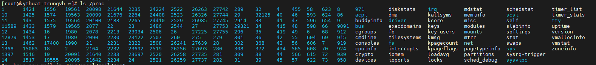
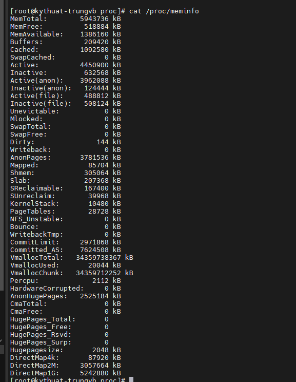

# How to use /proc filesystem to monitor linux system

Trong bài viết này, chúng ta sẽ đào sâu vào nội dung của thư mục ```/proc``` trong Linux để hiểu thêm về các chức năng của nó. Cần phải lưu ý rằng, đường dẫn ```/proc``` có những chức năng gần như tương đồng trên mọi bản phân phối Linux, bất kể là kiến trúc hay phân nhánh nào.

Một điều cần làm rõ là đường dẫn ```/proc``` không phải là 1 filesystem thông thường. Nó là 1 filesystem ảo mà chứa thông tin về các tiến trình và những dữ liệu liên quan đến hệ thống khác bên trong ```procfs```. Filesystem này được ánh xạ đến đường dẫn ```/proc``` và được mount trong quá trình boot của hệ thống.

## Đường dẫn /proc là gì?

```/proc``` filesystem hoạt động như 1 interface cho cấu trúc dữ liệu kernel và runtime information, thứ mà cung cấp 1 cách thức cho người dùng và ứng dụng có thể truy cập vào thông tin chi tiết về các tiến trình, cấu hình hệ thống, phần cứng, và nhiều thứ khác bằng cách thể hiện chúng qua 1 cấu trúc tệp ảo.

Để xem 1 danh sách hoàn chỉnh của các file và đường dẫn trong ```/proc``` filesystem, ta có thể đơn giản sử dụng lệnh ```ls```

```sh
ls /proc
```



Như các bạn có thể thấy thì trong đường dẫn này là một số file khá quen thuộc, và rất nhiều đường dẫn có dạng số nguyên, chúng đều thuộc về 1 tiến trình đang chạy trong hệ thống.

Những đường dẫn số nguyên đại diện cho 1 tiến trình, được biết đến là Process IDs (PIDs), và bên trong chúng là 1 command mà sử dụng tiến trình này. Còn các files trong ```/proc``` chứa thông tin hệ thống như memory (meminfo), CPU information (cpuinfo) và một vài filesystem khả dụng khác.

Dưới đây là 1 vài file và directory quan trọng mà bạn nên biết:

- ```/proc/cpuinfo```: Danh sách thông tin về CPU(s) trên hệ thống, bao gồm model, speed, số lượng cores,...
- ```/proc/meminfo```: Danh sách chi tiết về memory sử dụng và số liệu thống kê bao gồm tổng số lượng memory, memory trống, và memory sử dụng bởi từng tiến trình
- ```/proc/filesystems```: Chứa 1 danh sách tất cả các filesystem mà được hỗ trợ bởi kernel
- ```/proc/sys```: Danh sách các tham số cấu hình và runtime cho kernel
- ```/proc/loadavg```: Cho thấy trung bình tải của hệ thống trong khoảng thời gian khác nhau, ví dụ như 1, 5, và 15 phút
- ```/proc/self```: 1 symlink đến chủ sở hữu của tiến trình
- ```/proc/stat```: Chứa 1 vài số liệu thống kê về hệ thống, như số lượng tiến trình đang chạy, số lượng interrupts, và số lượng thời gian bỏ ra trong mỗi CPU state
- ```/proc/uptime```: Chứa con số thời gian mà hệ thống đã chạy
- ```/proc/PID```: Chứa thông tin về 1 tiến trình cụ thể, trong đó PID là process ID

## Trích xuất thông tin hệ thống

File ```/proc/meminfo``` được sử dụng để thể hiện thông tin về memory sử dụng và số liệu của hệ thống Linux, bao gồm 1 snapshot của nhiều metrics liên quan đến memory, thứ mà có thể có ích cho việc giám sát hệ thống và tận dụng tài nguyên

```sh
cat /proc/meminfo
```



Chạy lệnh ```cat``` có thể giúp ta kiểm tra nôi dung của các file trong ```/proc```. Thông tin về các file này có thể tìm thấy ở man page thông qua lệnh

```sh
man 5 /proc/<filename>
```

Các file đáng quan tâm bao gồm (một số đã được liệt kê ở trên):

- ```/proc/cmdline```: Thông tin về kernel command line
- ```/proc/console```: Thông tin về console hiện tại, bao gồm tty
- ```/proc/devices```: Device drivers hiện tại đã cấu hình để chạy kernel
- ```/proc/dma```: Thông tin về các kênh DMA hiện tại
- ```/proc/fb```: Các thiết bị framebuffer
- ```/proc/iomem```: Memory map hiện tại
- ```/proc/ioports```: các port đã được đăng ký cho việc giao tiếp với các thiết bị ngoại vi
- ```/proc/locks```: Các tệp bị khóa bởi kernel
- ```/proc/misc```: Các drivers khác đã đăng ký để cho các thiết bị major khác
- ```/proc/modules```: Các modules đã được tải vào kernel
- ```/proc/mounts```: Danh sách tất cả mount đang sử dụng hiện tại
- ```/proc/partitions```: Chi tiết thông tin về các phân vùng khả dụng của hệ thống hiện tại
- ```/proc/pci```: Thông tin về tất cả các thiết bị PCI
- ```/proc/stat```: Bản ghi hoặc các thống kê được giữ từ lần reboot trước
- ```/proc/swap```: Thông tin về swap
- ```/proc/version```: Kernel version, gcc version, và bản phân phối Linux đã cài đặt

## Trích xuất thông tin tiến trình

Bên trong các đường dẫn có số ở ```/proc```, ta sẽ tìm thấy 1 vài files và links. Nhớ rằng, những đường dẫn này liên quan đến PID của lệnh mà chạy được chạy bên trong chúng

Ví dụ, vào 1 đường dẫn ```/proc/<PID>```, ta sẽ tìm thấy những tệp cơ bản sau:

- ```/proc/<PID>/cmdline```: Các đối số commandline đã sử dụng để khởi chạy tiến trình
- ```/proc/<PID>/status```: Thông tin trạng thái chi tiết, bao gồm memory sử dụng và các số liệu thống kê của tiến trình
- ```/proc/<PID>/fd```: Symlink đến các files đã mở bởi tiến trình

Trong tất cả các đường dẫn, ta sẽ thấy 1 cấu trúc thư mục tương tự, và những file quan trọng nhất có thể liệt kê là:

- ```cmdline```: commandline của tiến trình
- ```environ```: các biến môi trường
- ```fd```: file descriptors
- ```limits```: chứa thông tin về các giới hạn của tiến trình
- ```mounts```: thông tin liên quan

Ta cũng sẽ thấy 1 vài liên kết trong những đường dẫn này:

- ```cwd```: 1 link đến current working directory của tiến trình
- ```exe```: link đến file có thể thực thi của tiến trình
- ```root```: link đến work directory của tiến trình

## Tổng kết

Những thông tin đưa ra bên trên có thể chưa đầy đủ, tuy nhiên sẽ giúp bạn làm quen với những gì trong đường dẫn ```/proc```. Bạn cũng nên tìm hiểu qua một vài lệnh để lấy thông tin từ ```/proc``` thay vì truy cập thẳng vào filesystem này, như ```uptime```, ```lsof```, ```mount```, ```ps``` chẳng hạn.