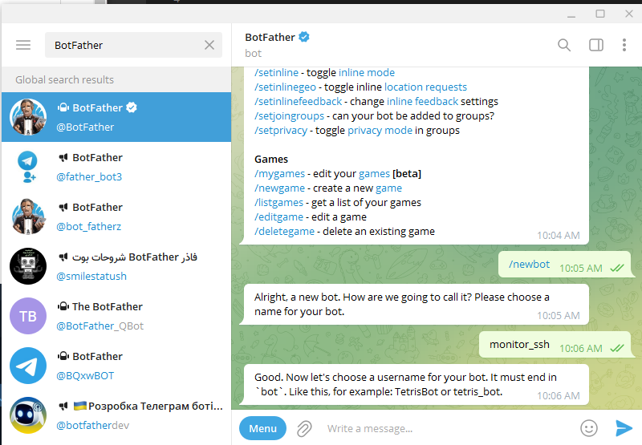
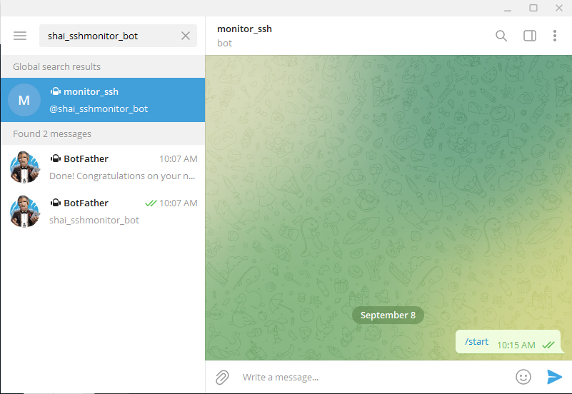
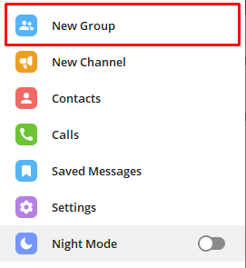
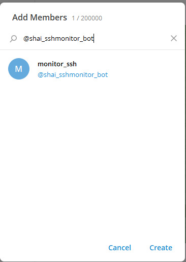
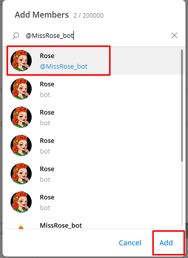
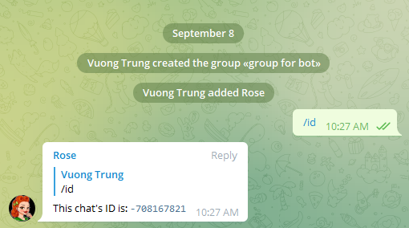
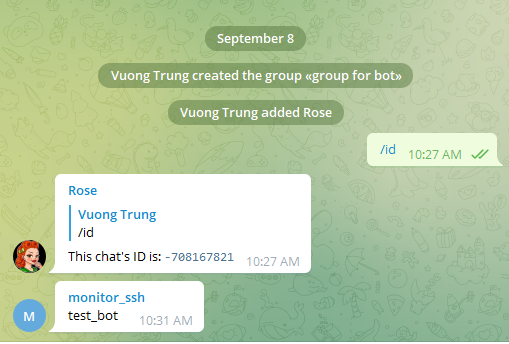
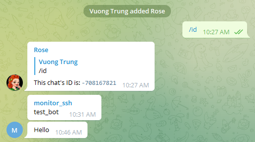
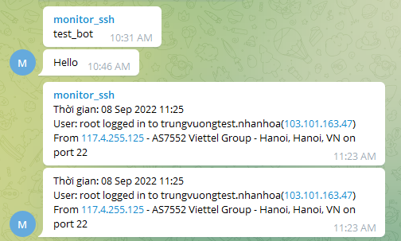

# Giám sát truy cập SSH vào hệ thống

Để quản lý việc đăng nhập vào hệ thống, ta cần có những cảnh báo khi có người đăng nhập thành công vào hệ thống

Giải pháp cho việc này là ta sử dụng bot của Telegram để gửi cảnh báo qua 1 kênh chat trên Telegram

1. Chuẩn bị

- Máy chủ với IP public (hoặc IP private có thể kết nối ra ngoài Internet)
- Đã có tài khoản Telegram
- Thao tác với user root

3. Tạo bot Telegram

Nếu chưa có bot Telegram, bạn có thể làm theo các bước sau:

**Bước 1:** Chat vs BotFather để tạo bot
- Tại ô Search của Telegram, chọn ```BotFather```
- Chat /newbot
- Chat 1 cái tên cho con bot mới này
- Đặt username cho bot **(bắt buộc phải có từ khóa bot ở cuối)**




- Sau khi hoàn thành bạn sẽ nhận được 1 token để truy cập HTTP API, hãy lưu trữ nó cẩn thận

**Bước 2:** Thêm bot vào group
- Khởi động bot bằng cách chat với nó



- Chọn group để thêm bot vào. Ở đây ta tạo 1 group mới



- Thêm bot vào group



**Bước 3:** Lấy chat id
- Tại group vừa tạo, chọn ```Add member``` -> Nhập ```@MissRose_bot``` và add con bot này vào group



- Chat ```/id``` để lấy chat id



**Bước 4:** Kiểm tra hoạt động của bot

**Cách 1:** Gửi cảnh báo tới Telegram qua HTTP API

- Sau khi tạo bot xong ta cần kiểm tra xem bot có hoạt động hay không. Ta nhập cú pháp như sau lên trình duyệt với method GET của HTTP

```sh
https://api.telegram.org/bot[TOKEN]/sendMessage?chat_id=[CHAT_ID]&text=[MY_MESSAGE_TEXT]
```

- Trong đó:
    - [TOKEN] là giá trị token nhận được từ BotFather khi tạo bot
    - [CHAT_ID] là chat id nhận được từ MissRose
    - [MY_MESSAGE_TEXT] là đoạn text tùy chọn

- VD: https://api.telegram.org/bot3651267:GSAFGfawdsgGAS/sendMessage?chat_id=-708167821&text=test_bot

- Nếu bot hoạt động tốt, nó sẽ gửi trả về tin nhắn là đoạn message ta vừa gửi



**Cách 2:** Gửi cảnh báo sử dụng curl
- Tại VPS Linux chạy lệnh sau

```sh
curl -X POST "https://api.telegram.org/bot[TOKEN]/sendMessage" -d "chat_id=[CHAT_ID]&text=[MY_MESSAGE_TEXT]"
```

- VD: curl -X POST "https://api.telegram.org/bot3651267:GSAFGfawdsgGAS/sendMessage" -d "chat_id=-708167821&text=Hello"

- Sau khi chạy lệnh trên, bot sẽ trả về message mà ta đã gửi



- Trên đây là 2 cách để test hoạt động của bot, còn nhiều cách khác như dùng postman, JMeter, bash shell, php,...

**Bước 5:** Tạo script file giám sát truy cập SSH vào hệ thống
- Cài ```jq``` (```jq``` là ứng dụng để đọc thông tin file JSON trên Linux)
- Trên Ubuntu:

```sh
apt get -y install jq
```

- Trên CentOS 7:

```sh
yum install epel-release -y
yum install jq -y
```

- Tạo file script cảnh báo. Ta sẽ tạo file script tại thư mục ```/etc/profile.d/``` để khi đăng nhập vào hệ thống thì script sẽ thực hiện ngay lập tức

- Tạo file script tên là ```monitor-ssh-telegram.sh```

```sh
vi /etc/profile.d/monitor-ssh-telegram.sh
```

- Nội dung script

```sh
# ID chat Telegram
USERID="<CHAT_ID>"

# API Token bot
TOKEN="<bot_private_TOKEN>"

TIMEOUT="10"

# URL gửi tin nhắn của bot
URL="https://api.telegram.org/bot$TOKEN/sendMessage"

# Thời gian hệ thống
DATE_EXEC="$(date "+%d %b %Y %H:%M")"

# File temp
TMPFILE='/tmp/ipinfo.txt'

if [ -n "$SSH_CLIENT" ]; then
IP=$(echo $SSH_CLIENT | awk '{print $1}')
PORT=$(echo $SSH_CLIENT | awk '{print $3}')
HOSTNAME=$(hostname -f)
IPADDR=$(echo $SSH_CONNECTION | awk '{print $3}')

# Lấy các thông tin từ IP người truy cập theo trang ipinfo.io
curl http://ipinfo.io/$IP -s -o $TMPFILE
CITY=$(cat $TMPFILE | jq '.city' | sed 's/"//g')
REGION=$(cat $TMPFILE | jq '.region' | sed 's/"//g')
COUNTRY=$(cat $TMPFILE | jq '.country' | sed 's/"//g')
ORG=$(cat $TMPFILE | jq '.org' | sed 's/"//g')

# Nội dung cảnh báo
TEXT=$(echo -e "Thời gian: $DATE_EXEC\nUser: ${USER} logged in to $HOSTNAME($IPADDR) \nFrom $IP - $ORG - $CITY, $REGION, $COUNTRY on port $PORT")

# Gửi cảnh báo
curl -s -X POST --max-time $TIMEOUT $URL -d "chat_id=$USERID" -d text="$TEXT" > /dev/null

# Xóa file temp khi script thực hiện xong
rm $TMPFILE
fi
```

- Cấp quyền thực thi cho file script vừa tạo

```sh
chmod +x /etc/profile.d/monitor-ssh-telegram.sh
```

**Bước 6:** Kiểm tra hoạt động
- Ta thử ssh vào VPS và xem thông báo trên Telegram

