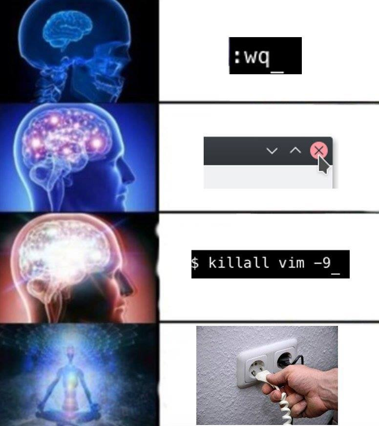

# Cách sử dụng Vi cơ bản

Mặc dù đã được ra mắt từ rất lâu, trình soạn thảo Vi vẫn là 1 trong số những công cụ yêu thích của nhiều Unix system admin.



Điểm lợi thế của chương trình soạn thảo command-line là sự gọn nhẹ. Chúng ta hoàn toàn có thể sử dụng nó để chỉnh sửa tệp cấu hình, viết 1 đoạn văn bản, lập trình 1 script, viết 1 bức thư về nhà để xin tiền, hoặc thậm chí thay đổi source code.

Vi thường là 1 sym-link hoặc alias đến Vim (viết tắt của Vi improved) là bản nâng cấp của Vi.

## I. Cách sử dụng Vi

Rất đơn giản để gọi đến Vi, hãy sử dụng cú pháp sau để tạo 1 file mới hoặc chỉnh sửa file có sẵn:

```sh
vi filename.txt
```

Trình soạn thảo Vi có 2 chế độ: ```Command``` và ```Insert```. Khi bạn mở tệp với Vi, bạn sẽ ở chế độ Command. Ở chế độ này, bạn có thể dùng bàn phím để điều hướng, xóa, copy, paste, và thực hiện nhiều công việc khác, ngoại trừ chỉnh sửa văn bản.

Để vào chế độ Insert, hãy nhấn ```i```. Ở chế độ này, bạn có thể chỉnh sửa văn bản, sử dụng **Enter** để xuống dòng, phím mũi tên để điều hướng con trỏ,.... Để trở về chế độ Command, nhấn phím **Esc**

Trong chế độ Command, hầu hết mọi phím trong bàn phím đều có chức năng.

Để lưu 1 file, bạn phải trong chế độ Command. Sau đó nhấn ```:wq``` để lưu và đóng file. Một cách nữa, nhanh hơn, đó là sử dụng short cut ```ZZ``` cũng có tác dụng tương tự như ```:wq```. Nếu bạn gặp phải lỗi nào đó trong quá trình chỉnh sửa và muốn thoát ra chứ không lưu file, hãy vào Command mode và nhập ```:q!```.

**Lưu ý:** Luôn luôn tạo 1 bản sao của những file quan trọng như file cấu hình, source code trước khi chỉnh sửa chúng.

## II. Phím tắt trong Vi

Cách tốt nhất để học cách sử dụng Vi là tạo 1 file mới và thử nhiều phím chức năng khác nhau. Bằng việc nhớ 1 vài phím tắt được nhắc đến dưới đây, bạn sẽ cảm thấy việc sử dụng Vi trở nên nhẹ nhàng hơn rất nhiều.

- ```i``` - Vào chế độ Insert
- ```Esc``` - Thoát Insert mode
- ```:w``` - Lưu và tiếp tục chỉnh sửa
- ```:wq``` hoặc ```ZZ``` - Lưu và thoát
- ```:q!``` - Thoát vi và không lưu các chỉnh sửa
- ```yy``` - Copy 1 dòng
- ```p``` - Paste dòng trong Clipboard xuống phía dưới dòng hiện tại
- ```o``` - Thêm 1 dòng mới phía dưới dòng hiện tại
- ```0``` - Thêm 1 dòng mới bên trên dòng hiện tại
- ```A``` - Thêm vào cuối dòng
- ```a``` - Thêm vào sau vị trí con trỏ hiện tại
- ```I``` - Thêm văn bản ở đầu dòng hiện tại
- ```b``` - Đến vị trí đầu của từ
- ```e``` - Đến vị trí cuối của từ
- ```x``` - Xóa 1 chữ cái
- ```dd``` - Cut 1 dòng
- ```Xdd``` - Cut X dòng
- ```Xyy``` - Copy X dòng
- ```G``` - Đến dòng cuối của file
- ```XG``` - Đến dòng X của file
- ```gg``` - Trở về đầu file
- ```:num``` - Hiển thị số thứ tự của dòng hiện tại
- ```h``` - Di chuyển trái
- ```j``` - Di chuyển xuống
- ```k``` - Di chuyển lên
- ```l``` - Di chuyển sang phải

## III. Tổng kết

Ngày nay, vi là trình soạn thảo văn bản mặc định của hầu hết các bản phân phối, nó gọn nhẹ và có thể sử dụng mà không phải cài đặt thêm bất kỳ gói phần mềm nào. Do đó, biết "cách thoát khỏi Vi" sẽ thực sự giúp ích cho bạn đó!

Mình là Vương Bảo Trung, hiện đang học việc tại Công ty TNHH Phần mềm Nhân Hòa. Các bạn hãy tiếp tục đọc các bài viết của mình tại [Wiki Nhân Hòa](wiki.nhanhoa.com)

Chúc các bạn luôn may mắn và thành công trong công việc!