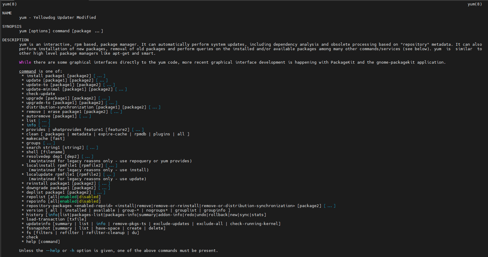
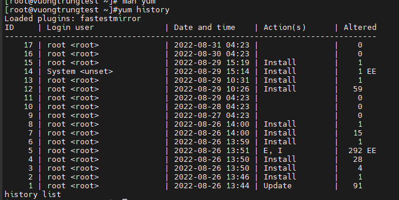
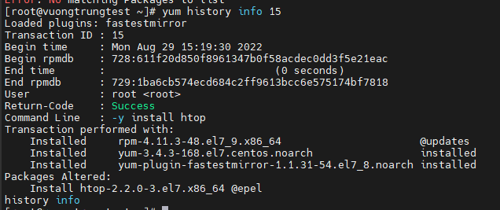
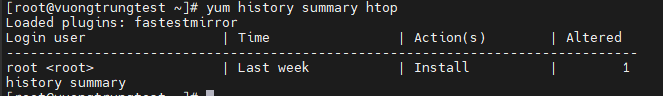
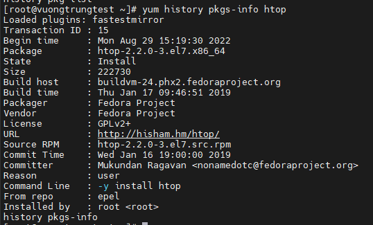
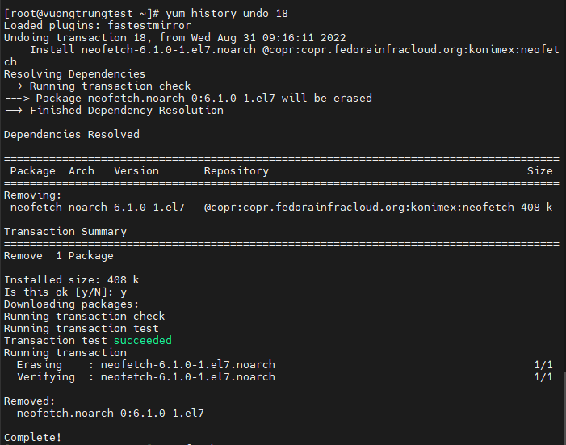
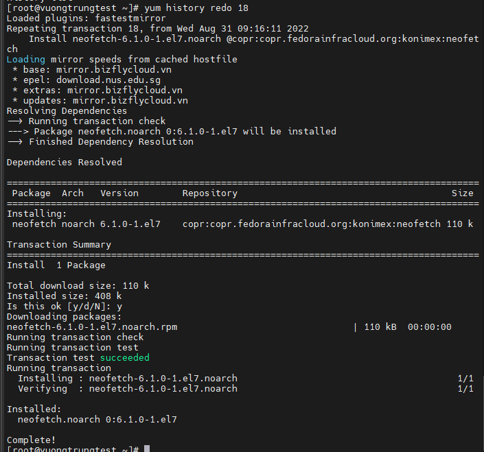
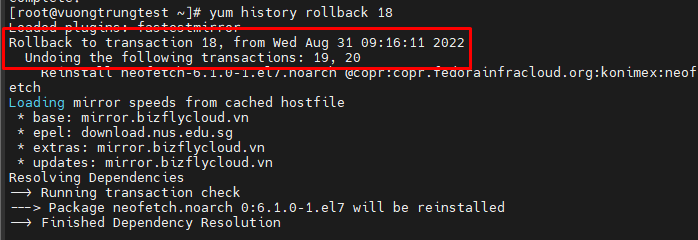

# Hướng dẫn sử dụng YUM

yum (Yellowdog Updater Modified) là 1 công cụ mạnh mẽ dùng để quản lý các software packages trên các Linux Distributions sử dụng RPM. Yum được phát triển bởi Redhat và là phần mềm hoàn toàn miễn phí và mặc định được cài đặt sẵn trên các hệ thống Redhat Linux hoặc các Distribution khác phát triển từ nhân RedHat như CentOS, Fedora, AlmaLinux.... Sử dụng yum, người dùng có thể thực hiện các tác vụ như cài đặt, gỡ bỏ, cập nhật các packages một cách đơn giản và thuận tiện

Trong bài viết này, chúng ta hãy cùng đi tìm cách sử dụng cơ bản của yum

Để xem thông tin cấu trúc và các thành phần yum chúng ta dùng lệnh sau

```sh
man yum
```



1. yum history



Với ```yum history```, chúng ta có thể xem các thông tin sau:

- **ID:** thông tin ID các lần thực hiện (hay còn gọi là transactions) yum. Thông tin này rất quan trọng, chúng ta sẽ sử dụng các ID number này để thực hiện cho quá trình redo, undo, reinsall... các lần chúng ta thực hiện
- **Command line:** thể hiện các options đi kèm khi thực hiện yum
- **Date and Time:** thể hiện ngày/giờ thực hiện lệnh yum
- **Actions:** thể hiện hành động của yum. Ví dụ như cài đặt (install), remove (Erase), cập nhật (update)
- **Altered:** thông tin bổ sung về các gói thay đổi

2. Một số lệnh con/tham số trong yum khi sử dụng như list/info/summary

- Sử dụng tham số ```list``` để xem cơ bản toàn bộ lịch sử dùng yum

```sh
yum history list all
```

- Dùng tham số ```info``` kết hợp với thông tin ```ID``` để xem chi tiết các lần thực hiện yum. Hoặc kết hợp với thông tin gói ứng dụng để xem chi tiết các lần thực hiện yum

```sh
yum history info 15
```



- Sử dụng tham số ```summary``` để xem các lần thực hiện yum cho một gói nào đó. Ví dụ muốn xem gói htop trên server được thực hiện bao nhiêu lần, thời gian nào, do user nào thực hiện

```sh
yum history summary htop
```



- Sử dụng ```pkg-list``` hoặc ```pkgs-info``` để xem thông tin chi tiết các gói ứng dụng mà chúng ta thực hiện cài đặt

```sh
yum history pkg-list htop
yum history pkgs-info htop
```



3. Sử dụng yum để thực hiện khôi phục/thực hiện lại các gói ứng dụng đã cài đặt. Chúng ta sử dụng các tham số như undo/rollback/redo

- ```undo```: sử dụng để hoàn tác gói ứng dụng nào đã thực hiện trước đó
- ```redo```: thực hiện lại 1 thực thi yum nào đã thực hiện trước đó
- ```rollback```: cho phép undo nhiều transactions đã thực hiện trước đó

```sh
yum history undo 18
```



```sh
yum history redo 18
```



*Lệnh redo thường được sử dụng khi bị fail khi sử dụng yum hoặc đơn giản là quên lệnh*

- Dùng để undo nhiều transactions cho tới thời điểm của gói ID được chỉ định

```sh
yum history rollback 18
```



Như vậy để rollback đến transaction 18, transaction 19 và 20 đã bị undo