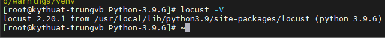
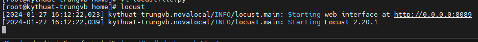
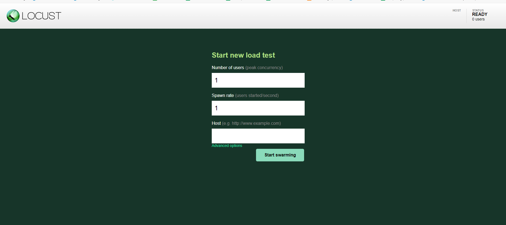
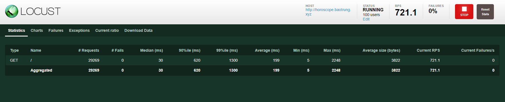
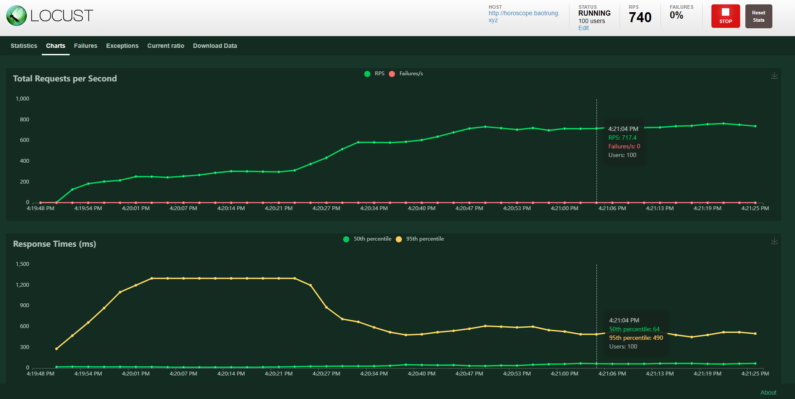

# Locust - Load testing tool

## Locust là gì?

Locust là 1 công cụ kiểm thử hiệu suất (load testing) mã nguồn mở sử dụng HTTP và một vài giao thức khác.

Locust test có thể sử dụng bởi cả công cụ dòng lệnh hoặc giao diện Web thân thiện, dễ tiếp cận. Các thông số như thông lượng (throughput), thời gian phản hồi (response times) và các lỗi (errors) có thể được xem trực tiếp theo thời gian thực, hoặc/và được export ra để phân tích sau.

Ta còn có thể import thêm các thư viện Python vào bài test, và với kiến trúc của Locust, nó có thể mở rộng với không một giới hạn nào cả. Nhờ đó bài các bài test của bạn sẽ không bị giới hạn bởi GUI hay ngôn ngữ cụ thể nào cả.

## Cài đặt Locust

Locust có thể được cài đặt bởi pip, chạy trong docker container, hay Kubernetes đều được. Trong bài này mình sẽ giới thiệu về cách cài đặt cơ bản nhất là sử dụng pip.

1. Cài đặt python và pip (phiên bản 3.8 hoặc mới hơn)

**Lưu ý:** Các bạn có thể cài đặt Python bằng bất cứ cách nào bạn muốn, không nhất thiết phải làm theo hướng dẫn trong bài

```sh
yum groupinstall -y "development tools"
yum install -y zlib-devel bzip2-devel openssl-devel ncurses-devel sqlite-devel readline-devel tk-devel gdbm-devel db4-devel libpcap-devel xz-devel expat-devel
wget https://www.python.org/ftp/python/3.9.6/Python-3.9.6.tgz
tar -xzf Python-3.9.6.tgz
cd Python-3.9.6
./configure --enable-optimazations
make altinstall
python3.9 --version
curl "https://bootstrap.pypa.io/get-pip.py" -o "get-pip.py"
python3.9 get-pip.py
```

2. Cài đặt ```locust``` với pip

```sh
pip3.9 install locust
```

**Nếu** gặp lỗi trong quá trình cài đặt, hãy cài đặt lại setuptools

```sh
python3.9 -m pip uninstall setuptools
pip3.9 install setuptools
```

**Nếu** thiếu thư viện ```_ctypes```, hãy cài đặt thêm ```libffi-devel```, sau đó **xóa python đi và cài lại**

```sh
yum install libffi-devel -y
```

3. Kiểm tra cài đặt

```sh
locust -V
```

**Nếu** gặp lỗi ```ImportError: urllib3 v2 only supports OpenSSL 1.1.1+```, hãy cài đặt phiên bản ```urllib3``` thấp hơn.

```sh
pip3.9 uninstall urllib3
pip3.9 install urllib3==1.26.6
```



## Load testing với Locust

1 Locust test đơn giản là 1 chương trình Python mà liên tục tạo ra truy vấn vào hệ thống mà bạn muốn test. Điều này khiến nó cực kỳ linh hoạt và rất mạnh mẽ trong những bài test cần sự phức tạp.

Tuy vậy, hãy bắt đầu bằng những điều đơn giản:

```sh
from locust import HttpUser, task

class HelloWorldUser(HttpUser):
  @task
  def hello_world(self):
    self.client.get("/hello")
    self.client.get("/world")
```

Đoạn mã trên sẽ tạo HTTP request đến ```/hello``` và ```/world``` liên tục. Nếu có hứng thú với **locustfile**, hãy tìm hiểu thêm ở [Writing a locustfile](https://docs.locust.io/en/stable/writing-a-locustfile.html#writing-a-locustfile)

Thay đổi ```/hello``` và ```/world``` thành các đường dẫn website thực nếu bạn muốn test, đặt code ở trong 1 file tên ```locustfile.py``` và chạy lệnh ```locust```:



Truy cập vào Web UI của Locust tại **localhost:8089**



Thực hiện test





