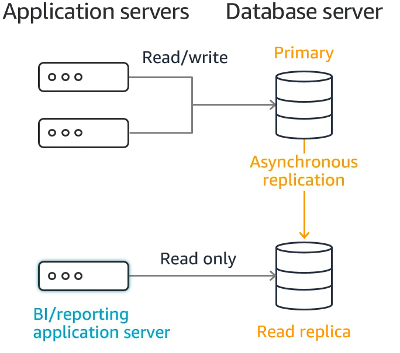
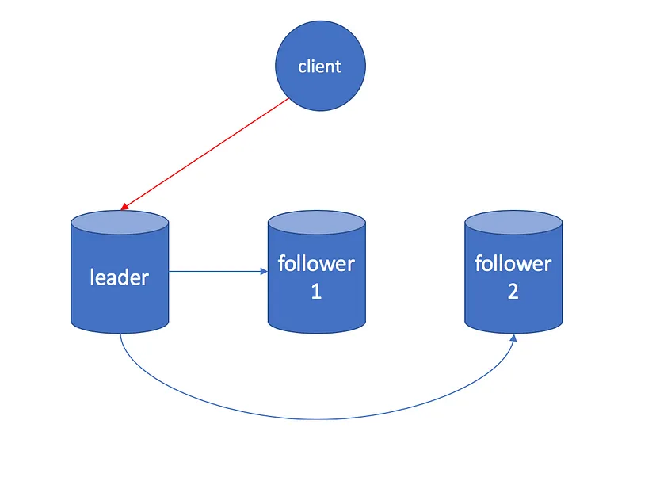

# Understanding Database Replication. Good and Ugly?

## Database Replication là gì?



Nhân bản dữ liệu là 1 quá trình lưu trữ dữ liệu tương đồng giữa nhiều nodes mà được kết nối thông qua network để tăng cường tính sẵn sàng và khả năng tiếp cận. Điều này cũng cải thiện khả năng phục hồi khi có vấn đề xảy ra, giúp hệ thống thêm phần tin cậy.

## Lợi ích của Database Replication

### Tăng tính tin cậy và sẵn sàng

Nếu 1 node trong cụm gặp sự cố do các nguyên nhân như phần cứng, mã độc, hay kể vấn đề gì khác, dữ liệu lúc này vẫn có thể được truy cập từ các node khác.

### Tăng cường hiệu suất network

Lưu trữ cùng 1 dữ liệu ở nhiều node khác nhau có thể giúp giảm độ trễ truy xuất dữ liệu do dữ liệu cần để thu thập nay gần hơn với nơi mà dữ liệu cần truyền tải đến. Nói dễ hiểu là lưu dữ liệu ở nơi gần hơn với người dùng.

### Tăng khả năng hỗ trợ phân tích dữ liệu

Nhân bản dữ liệu đến 1 kho lưu trữ có thể giúp cho team phân tích dữ liệu làm việc hiệu quả hơn trên 1 dự án chung.

## Các loại Replication

### Leader-follower replication



**Cách thức hoạt động:**

- 1 trong các node được thiết kế để làm ```leader``` (cũng có thể gọi là master hoặc primary) và các node khác được hiểu là các ```follower``` (hay replicas, slaves, secondaries)
- Khi clients muốn viết dữ liệu vào database, họ phải gửi yêu cầu đến leader, nó sẽ được lưu dữ liệu vào storage trước tiên
- Sau khi leader lưu dữ liệu mới xong, nó sẽ gửi những dữ liệu thay đổi này đến tất cả các followers
- Mỗi follower lấy dữ liệu này và ghi vào bộ nhớ của mình
- Khi 1 client muốn đọc dữ liệu từ database, nó có thể truy vấn chúng từ leader hay bất kỳ follower nào

Loại replication này là 1 tính năng built-in của nhiều CSDL quan hệ, chẳng hạn như PostgreSQL, MySQL, và SQL Server.

Ngay cả các CSDL no-SQL như MongoDB, RethinkDB, hay Espresso cũng có thể sử dụng kiểu replication này.

**Vấn đề có thể xảy ra:**

- **Leader gặp lỗi:** Xử lý 1 leader lỗi là quá trình đưa 1 follower trở thành leader mới, client cần phải cấu hình lại để sau đó gửi dữ liệu ghi đến leader mới này, và các follower khác cần bắt đầu tiếp nhận dữ liệu thay đổi từ đây
- **Follower gặp lỗi:** Ở bộ nhớ nội bộ, mỗi follower giữ 1 log về sự thay đổi dữ liệu mà nó nhận được từ leader. Nếu 1 follower gặp lỗi và khởi động lại, hoặc nếu network giữa leader và follower bị gián đoán tạm thời, follower có thể dễ dàng khôi phục nhờ tệp log này. Nó biết rằng giao dịch cuối cùng mà được xử lý trước khi lỗi xảy ra. Theo đó, follower có thể kết nối đến leader và yêu cầu tất cả dữ liệu thay đổi mà xảy ra trong thời gian follower bị mất kết nối. Khi nó áp dụng các thay đổi đó vào bộ nhớ, follower lúc này đã bắt kịp với leader và có thể tiếp tục nhận các luồng thay đổi dữ liệu như bình thường

