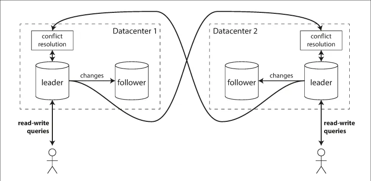
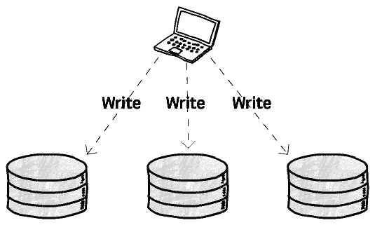

# Understanding Database Replication. Good and Ugly?

## Database Replication là gì?


Nhân bản dữ liệu là 1 quá trình lưu trữ dữ liệu tương đồng giữa nhiều nodes mà được kết nối thông qua network để tăng cường tính sẵn sàng và khả năng tiếp cận. Điều này cũng cải thiện khả năng phục hồi khi có vấn đề xảy ra, giúp hệ thống thêm phần tin cậy.

## Lợi ích của Database Replication

### Tăng tính tin cậy và sẵn sàng

Nếu 1 node trong cụm gặp sự cố do các nguyên nhân như phần cứng, mã độc, hay kể vấn đề gì khác, dữ liệu lúc này vẫn có thể được truy cập từ các node khác.

### Tăng cường hiệu suất network

Lưu trữ cùng 1 dữ liệu ở nhiều node khác nhau có thể giúp giảm độ trễ truy xuất dữ liệu do dữ liệu cần để thu thập nay gần hơn với nơi mà dữ liệu cần truyền tải đến. Nói dễ hiểu là lưu dữ liệu ở nơi gần hơn với người dùng.

### Tăng khả năng hỗ trợ phân tích dữ liệu

Nhân bản dữ liệu đến 1 kho lưu trữ có thể giúp cho team phân tích dữ liệu làm việc hiệu quả hơn trên 1 dự án chung.

## Các loại Replication

### Leader-follower replication


**Cách thức hoạt động:**

- 1 trong các node được thiết kế để làm ```leader``` (cũng có thể gọi là master hoặc primary) và các node khác được hiểu là các ```follower``` (hay replicas, slaves, secondaries)
- Khi clients muốn viết dữ liệu vào database, họ phải gửi yêu cầu đến leader, nó sẽ được lưu dữ liệu vào storage trước tiên
- Sau khi leader lưu dữ liệu mới xong, nó sẽ gửi những dữ liệu thay đổi này đến tất cả các followers
- Mỗi follower lấy dữ liệu này và ghi vào bộ nhớ của mình
- Khi 1 client muốn đọc dữ liệu từ database, nó có thể truy vấn chúng từ leader hay bất kỳ follower nào

Loại replication này là 1 tính năng built-in của nhiều CSDL quan hệ, chẳng hạn như PostgreSQL, MySQL, và SQL Server.

Ngay cả các CSDL no-SQL như MongoDB, RethinkDB, hay Espresso cũng có thể sử dụng kiểu replication này.

**Vấn đề có thể xảy ra:**

- **Leader gặp lỗi:** Xử lý 1 leader lỗi là quá trình đưa 1 follower trở thành leader mới, client cần phải cấu hình lại để sau đó gửi dữ liệu ghi đến leader mới này, và các follower khác cần bắt đầu tiếp nhận dữ liệu thay đổi từ đây
- **Follower gặp lỗi:** Ở bộ nhớ nội bộ, mỗi follower giữ 1 log về sự thay đổi dữ liệu mà nó nhận được từ leader. Nếu 1 follower gặp lỗi và khởi động lại, hoặc nếu network giữa leader và follower bị gián đoán tạm thời, follower có thể dễ dàng khôi phục nhờ tệp log này. Nó biết rằng giao dịch cuối cùng mà được xử lý trước khi lỗi xảy ra. Theo đó, follower có thể kết nối đến leader và yêu cầu tất cả dữ liệu thay đổi mà xảy ra trong thời gian follower bị mất kết nối. Khi nó áp dụng các thay đổi đó vào bộ nhớ, follower lúc này đã bắt kịp với leader và có thể tiếp tục nhận các luồng thay đổi dữ liệu như bình thường

### Multi leader replication



**Cách thức hoạt động:**

- 1 CSDL với các node nhân bản ở các trung tâm dữ liệu khác nhau (nhờ đó có thể loại bỏ mối lo về sự cố Data center, hoặc giúp cho nguồn dữ liệu gần hơn với user)
- Ở thiết lập 1 leader bên trên, 1 leader cần phải ở 1 trong các data center và tất cả trình ghi dữ liệu phải đi qua data center đó. Trong 1 cấu hình multi-leader thì ta có thể có 1 leader mỗi data center
- Khi client gửi dữ liệu yêu cầu ghi đến bất kỳ data center nào, leader sẽ gửi dữ liệu thay đổi đến tất cả follower của nó và đến tất cả các data center khác liên quan đến hệ thống này

**Một vài Use Cases của Multi-leader replication:**

- **Khách hàng hoạt động ngoại tuyến:** Nếu ta có 1 ứng dụng mà cần làm việc ngay cả khi nó không kết nối với internet. Ứng dụng Lịch là 1 ví dụ, nó cần phải lấy được dữ liệu về các cuộc họp (yêu cầu đọc) và tạo mới các cuộc họp (yêu cầu ghi) ở bất kỳ thời điểm nào, bất kể thiết bị client có đang kết nối internet hay không. Nếu ta tạo bất kỳ thay đổi nào khi client đang offline, chúng cần phải được đồng bộ với 1 server và các thiết bị khác khi mà client này online trở lại.
- **Phối hợp chỉnh sửa:** Ứng dụng cho phép phối hợp chỉnh sửa thời gian thực cho phép 1 vài người dùng thay đổi 1 tài liệu trong cùng 1 thời điểm. Ví dụ, Etherpad hay Google Docs cho phép nhiều người dùng cùng lúc chỉnh sửa 1 file text hoặc spreadsheet.

**Vấn đề có thể xảy ra với multi-leader replication:**

- **Mâu thuẫn ghi:** Vấn đề lớn nhất của kiểu thiết kế này là việc mâu thuẫn ghi dữ liệu có thể xảy ra, điều này có nghĩa là giải pháp cho mâu thuẫn dữ liệu cần được xét đến. Ví dụ, 1 trang wiki mà cho phép được chỉnh sửa bởi 2 người dùng, người-dùng-1 thay đổi tiêu đề của trang từ A thành B, người-dùng-2 thay đổi tiêu đề từ A thành C vào cùng thời điểm. Mỗi sự thay đổi đó đều được ghi lại tại local leader. Tuy nhiên, khi những thay đổi này được nhân bản không đồng bộ, sẽ có mâu thuẫn. Vấn đề này không xảy ra trong 1 single-leader database.

### Leaderless replication



**Cách thức hoạt động:**

- Ta có thể nhiều node nhân bản
- Client gửi trực tiếp yêu cầu ghi đến 1 vài replicas và các replicas khả dụng sẽ chấp nhận yêu cầu đó, trong khi các replicas không khả dụng thì sẽ không nhận được yêu cầu này
- Khi 1 client đọc từ CSDL, nó không chỉ gửi yêu cầu đến 1 replica mà sẽ đến 1 vài replicas cùng lúc. Client có thể nhận được các phản hồi khác nhau giữa những node khác nhau

**Vấn đề có thể xảy ra với Leaderless replication:**

- **Ghi vào CSDL khi 1 node không khả dụng:** Tưởng tượng ta có 1 CSDL với 3 replicas, và 1 trong những replicas đó không khả dụng nữa vì nhiều lý do khác nhau. Ở cấu hình leaderless replication thì failover handler (xử lý dự phòng) không hề có sẵn. Do đó, kể cả khi yêu cầu ghi gửi đến các server là không đồng nhất (nhưng vẫn cần ít nhất 1 server ghi thành công) thì client vẫn sẽ coi yêu cầu ghi đó là hoàn thành.

## Bất lợi của Database replication

Một trong những thách thức thường gặp nhất của database replication có thể xuất phát từ độ trễ dữ liệu hoặc gián đoạn dịch vụ trong khi dữ liệu đang được truyền hoặc sao lưu.

Thêm vào đó, khi khoảng cách giữa các hệ thống replicate database tăng lên, quá trình sao chép dữ liệu giữa chúng cũng trở nên khó khăn hơn nhiều.

- Giữ tất cả dữ liệu hiện tại có thể là 1 thách thức. Càng nhiều địa điểm lưu trữ dữ liệu, thì hệ thống lại càng phức tạp hơn trong việc theo dõi những gì đang diễn ra.
- Ta sẽ cần nhiều không gian lưu trữ hơn khi lượng dữ liệu tăng lên
- Khi ta sử dụng các công cụ nhân bản dữ liệu, việc giữ 1 số bản sao ở một vài, hoặc thậm chí là nhiều vài vị trí có thể khiến chi phí dành cho không gian lưu trữ và tài nguyên tính toán bị đội lên nhiều
- Ai đó sẽ cần phải quản lý tiến trình backup. Việc triển khai quá trình nhân bản dữ liệu vào 1 tiến trình backup của tổ chức có thể sẽ tốn thời gian để bộ phận chuyên trách hoàn thiện được.
- Giữ tất cả bản sao lưu của dữ liệu liên tục sẽ cần 1 quy trình riêng cùng việc tăng lưu lượng mạng sử dụng, hay làm chậm các công việc khác.

## Tổng kết

Database Replication có thể là 1 giải pháp tuyệt vời và có thể giải quyết nhiều bài toán khó trong thiết kế giải pháp. Tuy nhiên chính nó cũng lại đặt ra nhiều bài toán khác để người quản trị xử lý, do đó hãy thật sự cân nhắc trước khi đưa ra bất kỳ quyết định nào.

**Chúc các bạn luôn may mắn và thành công trong công việc!**